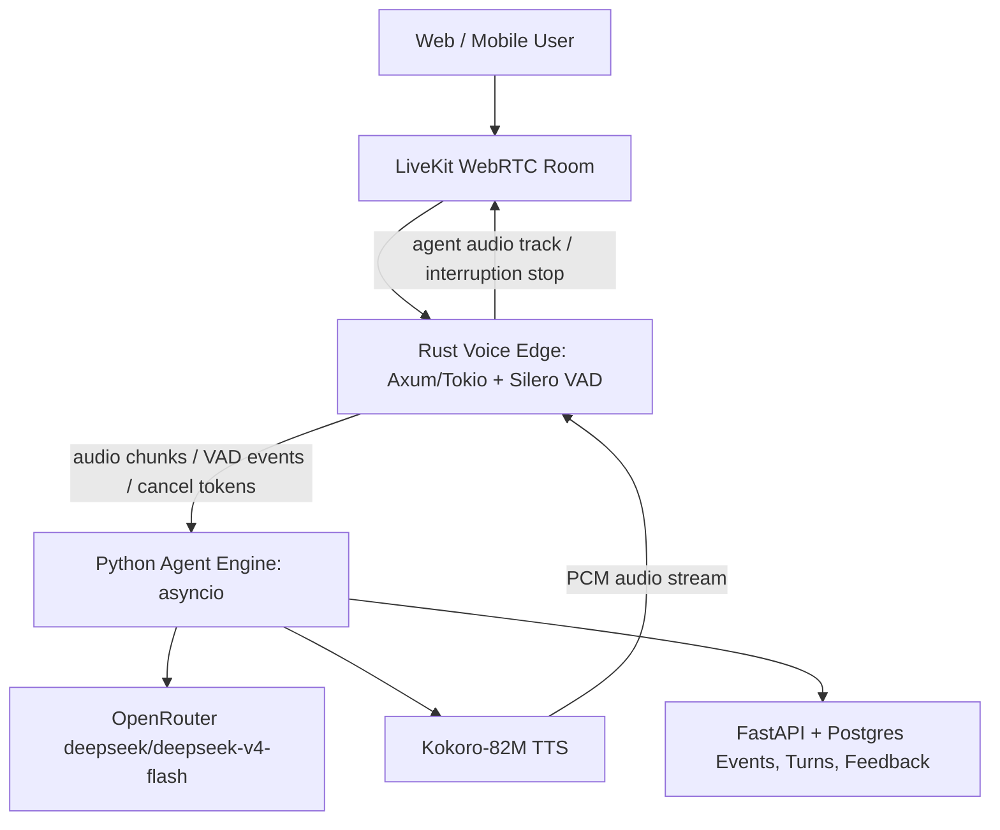

# Realtime Voice Architecture - Superseded Gemma/Kokoro/LiveKit Baseline

Current default as of 2026-05-23: OpenRouter `deepseek/deepseek-v4-flash` for live dialogue reasoning, LiveKit for transport, and Kokoro for spoken output. `OPENROUTER_LIVEKIT_URL=ws://127.0.0.1:7880` is configured for local dev. This note is retained as historical/native-audio architecture background; do not treat Hugging Face/Gemma/Gamma/MLX setup as the active realtime blocker.

## Decision Summary

Use a production transport framework, not raw browser WebSockets, for the real voice-to-voice path.

Superseded 2026-05-23 direction:

- Frontend joins a LiveKit room once the backend issues a session/room token.
- Transport is LiveKit first, optionally orchestrated through Pipecat when the pipeline composition benefits from Pipecat processors.
- Active model pipeline is OpenRouter/Kokoro:
  - Live dialogue reasoning: OpenRouter `deepseek/deepseek-v4-flash`.
  - Speech synthesis: `hexgrad/Kokoro-82M`.
  - Raw microphone PCM is not sent to OpenRouter; old Gemma native-audio notes below are legacy/future-native-audio background.
- Rust owns low-latency realtime edge concerns:
  - client/session control;
  - high-frequency audio frame/VAD loop;
  - Silero VAD through ONNX;
  - outbound audio buffer backpressure;
  - barge-in detection and cancellation dispatch.
- Python owns model and agent concerns:
  - async session state;
  - context pruning;
  - OpenRouter calls for the active route; Hugging Face/Gemma calls only for legacy/native-audio experiments;
  - Kokoro TTS streaming;
  - durable turn/event emission to FastAPI/Postgres.

Raw WebSocket PCM can exist only as a dev adapter for local experiments. It is not the production transport.

## Source Findings

### 2026-05-17 Official Recheck

Official LiveKit docs support the chosen media boundary: LiveKit transport provides WebRTC media/data handling, server-side SDKs, raw audio-track iteration, publishing audio tracks, agent server dispatch, and programmatic participants. That means the browser should join LiveKit directly, while backend code joins as an agent participant that reads `AudioStream` frames and publishes generated audio back into the room. Sources: https://docs.livekit.io/transport/, https://docs.livekit.io/transport/media/raw-tracks/, https://docs.livekit.io/agents/server/, https://docs.livekit.io/agents/server/job/.

LiveKit also has first-class turn handling and interruption options. The useful production features for this project are VAD/manual turn boundaries, adaptive interruption settings, minimum interruption duration/word controls, false-interruption recovery, and session usage/metrics events. These map directly onto the product requirement for natural back-and-forth dialogue rather than a text form with a microphone button. Sources: https://docs.livekit.io/reference/agents/turn-handling-options/, https://docs.livekit.io/reference/agents/events/.

Gemma 4 E4B is confirmed as an audio-input and text-output model. The official Hugging Face model page states that Gemma 4 handles text/image input with audio on small models and generates text output; E2B/E4B support text, image, and audio, while 31B/26B A4B do not support audio. Audio supports a maximum length of 30 seconds. The Google audio guide adds the practical encoding rule: 25 tokens per second of audio, mono channel, 16 kHz sample rate, 32 ms frames, float32 samples normalized to `[-1, 1]`. Sources: https://huggingface.co/google/gemma-4-E4B-it, https://huggingface.co/docs/transformers/model_doc/gemma4, https://ai.google.dev/gemma/docs/capabilities/audio.

The Gemma 4 E4B Hugging Face page currently says the model is not deployed by a standard Inference Provider. Production cloud use should therefore assume a dedicated Hugging Face Inference Endpoint or custom container for the multimodal Gemma runtime, not a generic serverless provider. Hugging Face's Inference Endpoints docs support dedicated endpoints and custom containers with `/health` readiness, model artifacts mounted at `/repository`, and explicit hardware/region configuration. Sources: https://huggingface.co/docs/huggingface_hub/en/guides/inference_endpoints, https://huggingface.co/docs/inference-endpoints/engines/custom_container.

Kokoro-82M is confirmed as the TTS leg: the model card identifies it as an open-weight 82M parameter TTS model, Apache-licensed, with `kokoro>=0.9.2` local usage and a generator API through `KPipeline`. Source: https://huggingface.co/hexgrad/Kokoro-82M.

Pipecat remains a good optional pipeline layer, not the selected public media transport. Its docs recommend WebRTC for client-facing realtime conversation because of low latency, network resilience, audio processing, timestamps, quality stats, and reconnection. It also has a LiveKit transport and modular `transport.input() -> processors -> transport.output()` pipeline. Source: https://docs.pipecat.ai/pipecat/learn/transports.

Silero VAD is viable in Python through LiveKit's plugin and in Rust through `silero-vad-rust`. LiveKit documents the Silero plugin as local CPU VAD for turn detection; the Rust crate bundles ONNX weights, supports streaming chunks with `forward_chunk`, and exposes configurable thresholds. Sources: https://docs.livekit.io/agents/logic/turns/vad/, https://docs.rs/crate/silero-vad-rust/latest.

### 2026-05-17 Voice Edge Implementation Recheck

LiveKit Agents should remain the public realtime media/session layer because its docs frame agent code as a stateful realtime bridge between models and users, with built-in support for streaming audio, turn detection, interruptions, multi-agent handoff, and server dispatch. The product should use LiveKit rooms and participants rather than exposing raw browser PCM sockets. Sources: https://docs.livekit.io/agents/, https://docs.livekit.io/agents/logic/turns/.

LiveKit interruption semantics align with the required barge-in behavior: when user speech is detected while the agent is talking, current speech can be stopped, and explicit interruption can also be triggered programmatically. This maps to the Rust edge contract: emit `voice_barge_in_detected`, acknowledge cancellation, then Python cancels the active Gemma/Kokoro response. Source: https://docs.livekit.io/agents/logic/turns/.

Gemma 4 E4B remains the audio-understanding lane, not the waveform-output lane. The model card says E2B/E4B support audio input for ASR and speech translation, while Gemma generates text output. Therefore the production runtime remains a Gemma-first half-cascade: Gemma receives audio/text and produces text; Kokoro produces PCM speech. Source: https://huggingface.co/google/gemma-4-E4B-it.

Kokoro-82M remains the default open TTS layer because the model card confirms an Apache-licensed 82M parameter TTS model, local `kokoro>=0.9.2` usage, and generator-style `KPipeline` output at 24 kHz. Source: https://huggingface.co/hexgrad/Kokoro-82M.

Pipecat remains optional, not the first dependency to add. Its transport docs support LiveKit transport and modular processors, but this project already has a nonstandard Gemma-audio-understanding plus Kokoro-speaking split. Add Pipecat later only if it reduces custom pipeline code without hiding cancellation, pruning, and provenance events. Source: https://docs.pipecat.ai/pipecat/learn/transports.

Implementation implication: use the compiled Rust `services/voice-edge --jsonl` binary as the Python LiveKit participant bridge now, because it exercises the same typed cancellation acknowledgement contract without paying per-frame process startup. The Rust crate now also exposes an Axum/Tokio HTTP sidecar for supervised local serving and contract testing; real Silero ONNX and bounded recurrent stream state are in the Rust process, while the remaining runtime work is benchmarked concurrency tuning and switching the Python/LiveKit bridge from JSONL/HTTP contracts to the LiveKit-side Rust media bridge.

### 2026-05-17 Runtime Proof Update

The official LiveKit voice-agent docs reinforce that realtime voice quality depends on transport latency, endpointing, interruption handling, and background-noise robustness, not just model selection. WebRTC remains the correct public media path; LiveKit turn docs support VAD-only, STT endpointing, realtime-model detection, and interruption modes, while pipeline-node docs support custom STT, LLM, TTS, and audio-output nodes. Sources: https://livekit.com/voice-agents, https://docs.livekit.io/agents/logic/turns/, https://docs.livekit.io/agents/logic/nodes/.

LiveKit self-hosting docs also make the operational shape concrete: agent servers connect to LiveKit over WebSocket for jobs, can run on self-hosted infrastructure, and a 4-core/8GB starting point is cited for many voice apps with 10-25 concurrent jobs depending on components. This supports keeping LiveKit as transport and measuring the Gemma/Kokoro/Rust agent runtime separately. Source: https://docs.livekit.io/deploy/custom/deployments/.

Hugging Face TGI streaming docs confirm the desired Gemma endpoint behavior for low perceived latency: token streaming over SSE should be used when the model endpoint supports it. The voice adapter now attempts an OpenAI-compatible/SSE streaming request when `GEMMA4_REALTIME_STREAM_GEMMA=true`, `HF_TOKEN`, and a Gemma endpoint URL are configured, then streams deltas into Kokoro. Provider smoke now includes a dedicated Gemma/Kokoro voice-streaming step that measures Gemma time-to-first-token, Kokoro first-audio latency, and end-to-end first-audio latency when live calls are enabled. Source: https://huggingface.co/docs/text-generation-inference/en/conceptual/streaming.

Kokoro remains the TTS leg because its model card identifies it as an Apache-2.0 open-weight 82M TTS model with local `KPipeline` generator usage at 24 kHz. The system must therefore resample/chunk Kokoro output correctly for LiveKit publishing and record buffer-clearing proof during barge-in. Source: https://huggingface.co/hexgrad/Kokoro-82M.

The next implementation priority is measured proof, not more UI. Runtime health now needs to include the local `voice-edge --jsonl` benchmark as durable operator evidence: binary availability, process mode, p50/p95/max latency, silence false positives, missed speech starts, and missed cancellation acknowledgements. The complementary proof is an end-to-end LiveKit timing ledger for real room audio: speech-start, end-of-turn, Gemma response start, first audio out, and barge-in-to-audio-stop.

### 2026-05-18 Timing Ledger Update

Official LiveKit docs reinforce the corrected proof target: turn detection must decide both when a user is done speaking and when a user interrupts while the agent is speaking; LiveKit data packets can carry topic-scoped JSON events through the room. Sources: https://docs.livekit.io/agents/logic/turns/, https://docs.livekit.io/transport/data/packets/.

The implementation now records a durable timing path instead of relying on UI state:

- LiveKit agent data-channel events use topic `agent.voice.event`.
- The browser persists those events through `POST /api/realtime-sessions/{realtime_session_id}/voice-events`.
- The backend sanitizes secrets/tokens before writing `run_events`.
- The LiveKit participant emits `voice_user_turn_committed` before scheduling the Gemma/Kokoro turn, so the ledger measures end-of-user-turn to agent-start latency rather than using speech-start as a proxy.
- The voice-event endpoint materializes durable `ConversationTurn` records from `voice_user_turn_committed` and `assistant_response_completed`. User audio turns are preserved with pending transcript status when no transcript exists; assistant turns use the completed Gemma/Kokoro `assistant_text`. Newly materialized assistant completions enqueue a Realtime Conversation Host `summarize_realtime_turn_context` task with the user voice turn id, assistant response turn id, response id, transcript excerpt, and a routing policy that explicitly avoids treating raw audio as verified text. The Next app refreshes the run dialogue when these materialized turn ids are returned.
- `POST /api/runs/{run_id}/realtime-voice-timing-ledger` and `all-about-llms-admin build-realtime-voice-timing-ledger` build the durable evidence packet.
- The ledger only reports `ready` when a correlated same-session/same-turn chain proves: LiveKit ready, speech started, turn committed, Gemma/Kokoro turn started, Gemma generation started, first text/audio output, and barge-in cancellation acknowledgement plus Gemma/Kokoro turn cancellation.

Regression rule: never mark voice readiness from unrelated first events across different turns or response ids. Barge-in proof must pair the same response id for `voice_edge_cancellation_acknowledged` and `gemma_kokoro_voice_turn_cancelled`.

### 2026-05-18 Rust HTTP Sidecar Update

The Rust voice edge now has an Axum/Tokio HTTP sidecar mode in addition to stdin and persistent JSONL:

- `voice-edge --http 127.0.0.1:7071` or `voice-edge serve`;
- `GET /healthz` for service, transport, VAD, and state-model metadata;
- `POST /v1/voice-edge` for the tagged `VoiceEdgeRequest` contract;
- `POST /v1/voice-edge/analyze` and `POST /v1/voice-edge/cancel` as convenience typed routes.

The implementation intentionally keeps HTTP as a request/response transport. It proves the supervised Rust service boundary and keeps the cancellation contract bloat-free. The Rust process now supports real Silero ONNX inference plus bounded per-stream recurrent `StreamState` caches across JSONL/HTTP requests, but it still does not claim direct LiveKit media handling. Python still uses the persistent JSONL bridge for frame-by-frame LiveKit calls until the LiveKit-side Rust media bridge is implemented.

### 2026-05-18 Python HTTP Sidecar Client Update

The Python LiveKit participant can now call the Rust HTTP sidecar when `RUST_VOICE_EDGE_HTTP_URL` is configured. This moves the runtime closer to the intended supervised Rust/Python split while keeping transport honest: HTTP is still request/response, but the long-running Rust process can preserve bounded Silero stream state across calls.

Current routing:

- default: `PersistentRustVoiceEdgeClient` keeps `voice-edge --jsonl` open for frame-by-frame VAD and barge-in checks;
- opt-in: `RustVoiceEdgeHttpClient` posts the same tagged contract to `POST /v1/voice-edge` and can call `GET /healthz`;
- resilient mode: when `RUST_VOICE_EDGE_HTTP_URL` is configured and `RUST_VOICE_EDGE_BINARY_PATH` is executable, startup checks HTTP `/healthz`; `FallbackVoiceEdgeClient` uses HTTP first when healthy and falls back to JSONL on startup or request failure;
- readiness proof: JSONL mode also preflights before LiveKit readiness by starting the persistent process and sending a harmless cancellation contract, so bad binaries fail at session startup instead of on the first audio frame;
- both paths share the same Python request builder, recent-frame windowing, cancellation acknowledgement parser, and Gemma/Kokoro cancellation behavior.

Reliability update: persistent JSONL now discards child-process stderr instead of letting unconsumed stderr back up in long-running sessions. Operator diagnostics for the HTTP sidecar should come from the external supervisor/log stream rather than Python stderr pipes.

State bound update: the shared Python client now bounds recent-frame windows so long-running sessions do not retain unbounded `(session_id, response_id)` keys.

Test update: the Python suite includes a real Rust HTTP sidecar smoke that starts the compiled `voice-edge --http` binary, polls `/healthz`, then sends typed analyze, typed cancel, generic analyze, and generic client cancellation contracts. It skips only when the local sandbox forbids loopback binding or the compiled binary is absent.

Next runtime step: benchmark/tune the Rust Silero session pool and recurrent stream-state cache under concurrent voice sessions, then switch frame-loop calls from JSONL/HTTP request contracts to the direct LiveKit-side Rust media bridge.

### 2026-05-17 Deep Research Update

Gemma 4 E4B is the right open Gemma lane for live audio understanding because it accepts audio input, but it is not a waveform-output model. The production path is therefore a half-cascade: Gemma 4 E4B performs audio understanding and reasoning, Kokoro-82M synthesizes speech, and LiveKit transports the media. Source capture: [[../raw/articles/2026-05-17-realtime-voice-and-retrieval-research-pass]].

LiveKit remains the correct public browser/mobile transport. Its agent docs already cover turn detection, endpointing, manual turn control, and interruption handling. This means the Rust layer should be an internal realtime edge or LiveKit participant for VAD, buffers, backpressure, and cancellation. It should not become a custom public browser transport unless a later benchmark proves LiveKit cannot satisfy latency or control needs.

Pipecat is valuable as an optional processor framework if it reduces the custom Python pipeline surface, especially for composing input frames, context processors, LLM processors, TTS processors, and transport output. It should not be the first production dependency for the public media path because the selected stack is not a standard STT -> LLM -> TTS cascade; Gemma 4 E4B consumes audio directly.

Hugging Face endpoint cold starts are a production risk for live voice. Live voice endpoints should use warm minimum replicas or prewarm policy. Scale-to-zero can remain acceptable for background content work, but not for interactive voice turns where first-audio latency matters.

LiveKit has first-class voice-agent turn handling. It supports VAD, STT endpointing, manual turn control, interruption events, and `session.interrupt()` for explicit cancellation. Its docs also state that interruption handling should stop current agent speech and truncate conversation history to the portion heard by the user. Source: https://docs.livekit.io/agents/logic/turns/

Pipecat supports transport abstraction and includes LiveKit transport. Its pipeline shape is directly aligned with this system: `transport.input()` receives user media, then STT/context/LLM/TTS processors run, then `transport.output()` sends bot media. Source: https://docs.pipecat.ai/pipecat/learn/transports

Silero VAD has a Rust crate with bundled ONNX weights, CPU-friendly ONNX Runtime use, configurable thresholds, and streaming state through `forward_chunk`. This fits the Rust edge role for frame-level speech detection. Source: https://docs.rs/crate/silero-vad-rust/latest

Gemma 4 E4B supports native audio input for ASR and speech-to-translated-text tasks, plus reasoning and long context. The HF model card notes E2B/E4B audio support and a 30-second maximum audio length, which makes audio context pruning mandatory. Source: https://huggingface.co/google/gemma-4-E4B-it

Kokoro-82M is a Hugging Face text-to-speech model with Apache-2.0 license and inference-provider support. It is the right default TTS layer for the open-weight voice stack. Source: https://huggingface.co/hexgrad/Kokoro-82M

## Architecture



### Production Boundary

Public media boundary:

- Browser/mobile clients connect to LiveKit rooms.
- Backend issues short-lived LiveKit join tokens.
- Durable storage records only room, participant, expiry, and token-presence evidence.

Internal realtime boundary:

- Rust subscribes/publishes as an internal realtime participant or edge process.
- Python is the async agent engine for OpenRouter/Kokoro, context pruning, and event writes.
- FastAPI remains the control plane and durable API, not the media server.

Model boundary:

- OpenRouter `deepseek/deepseek-v4-flash` handles active live dialogue reasoning.
- Kokoro handles speech waveform output.
- No component should claim the current route sends raw microphone PCM to OpenRouter. Gemma 4 E4B native-audio claims are legacy/future-native-audio only unless a new decision reactivates that path.

### Rust Voice Edge

Responsibilities:

- Own high-frequency audio frame loop.
- Run Silero VAD via ONNX Runtime or `silero-vad-rust`.
- Maintain bounded inbound and outbound audio buffers per session.
- Detect user speech while agent audio is playing.
- On barge-in:
  - immediately drop outbound audio packets for the active response;
  - publish `turn.cancel` to Python;
  - record an interruption event through FastAPI;
  - keep listening for the new user turn.
- Enforce backpressure:
  - if Python is slow, do not let audio buffers grow unbounded;
  - prefer dropping stale outbound audio after interruption over queueing.

Non-responsibilities:

- Does not own content generation.
- Does not own source retrieval.
- Does not own long-term memory.
- Does not decide final response text.

### Python Agent Engine

Responsibilities:

- Maintain `VoiceConversationState`.
- Build OpenRouter dialogue prompt/input packages for the active route.
- Keep only recent raw audio.
- Replace old raw audio with transcript and compact turn summary after pruning threshold.
- Call OpenRouter `deepseek/deepseek-v4-flash` for active live dialogue reasoning.
- Stream response text into Kokoro-82M.
- Support cancellation tokens for:
  - active OpenRouter request;
  - active token stream;
  - active Kokoro synthesis stream.
- Persist:
  - user transcript;
  - assistant transcript;
  - interruption event;
  - context-pruning event;
  - latency metrics.

## Three Golden Rules

### 1. Context Pruning

Hard rule:

- Keep raw audio only for the current turn and at most the last 3 voice turns.
- Gemma 4 E4B audio input supports a maximum audio length of 30 seconds, so every turn must be segmented and bounded.
- After turn 3, replace old audio tensors/URIs in `conversation_history` with:
  - exact transcript;
  - compact ELI5 semantic summary;
  - tool/source references;
  - interruption metadata;
  - whether the assistant response was fully heard.

Required event:

- `voice_context_pruned`

Required metadata:

- `raw_audio_turns_before`
- `raw_audio_turns_after`
- `replacement_strategy = transcript_plus_summary`
- `max_raw_audio_seconds_per_turn = 30`

### 2. Transport Framework

Hard rule:

- Production voice uses LiveKit as the public browser/mobile transport.
- Browser-side raw PCM WebSocket is not the production path.
- A raw WebSocket dev adapter may exist only for local debugging and must be marked `production_allowed = false`.

Why:

- LiveKit provides WebRTC transport, device handling, echo cancellation path, turn/interruption events, room lifecycle, and media integration that we should not hand-roll. Pipecat remains useful as an optional internal pipeline layer.
- Rust should enhance the realtime edge where needed, not replace proven WebRTC transport unless a benchmark proves it necessary.

### 3. Barge-In

Hard rule:

- If user speech starts while the assistant is speaking, Rust must stop outbound audio immediately and send cancellation to Python.
- Python must cancel Gemma work and clear Kokoro output buffers for the interrupted turn.
- The next user turn must not inherit stale assistant tokens or old audio buffers.

Required event sequence:

1. `voice_barge_in_detected`
2. `realtime_session_control_recorded` with `action = interrupt`
3. `gemma_inference_cancel_requested`
4. `kokoro_tts_buffer_cleared`
5. `realtime_turn_routed` with `interrupted = true`

## Recommended Implementation Slices

### Slice 1 - Contracts

- Backend config:
  - `REALTIME_DEFAULT_PROVIDER=openrouter_livekit`
  - `OPENROUTER_LIVE_DIALOGUE_MODEL=deepseek/deepseek-v4-flash`
  - `OPENROUTER_LIVEKIT_URL=ws://127.0.0.1:7880`
  - `OPENROUTER_API_KEY_FILE`
  - `LIVEKIT_API_KEY_FILE`
  - `LIVEKIT_API_SECRET_FILE`
  - `GEMMA4_REALTIME_AUDIO_OUTPUT_MODEL=hexgrad/Kokoro-82M` or the current Kokoro route config until code naming is normalized.
  - `GEMMA4_REALTIME_RUST_VAD_MODEL=silero-vad-rust` or the current Rust edge route config until code naming is normalized.
- Realtime session metadata must expose:
  - transport framework;
  - model ids;
  - context pruning policy;
  - barge-in policy;
  - Rust edge responsibilities;
  - Python engine responsibilities.

### Slice 2 - LiveKit Runtime

- Add LiveKit room-token endpoint.
- Add frontend LiveKit client connection.
- Add Python LiveKit agent process with custom Gemma and Kokoro adapters.
- Keep FastAPI as orchestration/control plane, not as the media server.
- Treat Pipecat as an optional pipeline composition layer after the LiveKit baseline is proven. Do not make Pipecat the public browser transport.

Immediate frontend contract:

- The product app should call session creation, receive a LiveKit `transport` grant, and join the room through the LiveKit client SDK when installed.
- If the SDK is missing in a local run, the UI should show a precise blocked state rather than pretending browser dictation is production voice.
- The join token must stay client-response only; it must not be stored in durable event metadata, local logs, or Obsidian notes.

### Slice 3 - Rust Voice Edge

- Done in code: add `services/voice-edge/` Rust crate.
- Done in code: define JSON-friendly contracts for audio frames, VAD frame analysis events, bounded buffer state, barge-in events, and cancellation acknowledgements.
- Done in code: implement a deterministic energy-gate VAD core so the boundary is testable without model downloads.
- Done in code: cancellation acknowledgements carry the required actions: drop outbound audio, cancel Gemma, clear Kokoro buffers, and stop LiveKit audio.
- Done in code: add Python Rust edge adapters that call the compiled Rust CLI, convert PCM16 frames into typed samples, parse VAD/cancellation acknowledgements, and let the LiveKit participant commit turns or cancel the active Gemma/Kokoro response.
- Done in code: add `voice-edge --jsonl` and `PersistentRustVoiceEdgeClient` so realtime frame checks reuse one long-running Rust process instead of spawning the binary for every audio frame.
- Done in code: the LiveKit participant now keeps reading subscribed audio while scheduled assistant turns run, so user speech can be checked against the active response id instead of blocking the input stream while Gemma/Kokoro speaks.
- Done in code: the LiveKit participant now calls the Rust edge even when no assistant response is active, uses `voice_user_speech_started` to open a turn with configurable pre-roll, and commits the turn after `RUST_VOICE_EDGE_MIN_SILENCE_FRAMES` rather than waiting for the max-duration window.
- Done in code: add `all-about-llms-admin benchmark-voice-edge` / `python -m all_about_llms.cli benchmark-voice-edge` for local synthetic latency and quality proof covering silence false positives, speech-start misses, and barge-in cancellation misses.
- Next: use Axum/Tokio for the control plane.
- Next: use LiveKit participant/subscriber or Pipecat-compatible bridge depending on final runtime choice.
- Next: replace deterministic energy VAD with `silero-vad-rust` for streaming VAD.
- Next: add gRPC or equivalent stream to Python:
  - `StartTurn`
  - `AudioChunk`
  - `EndTurn`
  - `CancelTurn`
  - `TtsChunk`
  - `TurnEvent`

### Slice 4 - Evaluation

Measure:

- user speech start -> interruption event latency;
- user speech end -> first assistant audio byte;
- OpenRouter reasoning latency;
- Kokoro first-audio latency;
- false interruption rate;
- missed interruption rate;
- context pruning correctness;
- raw audio memory retained per session;
- concurrent session count.

## Risks

- OpenRouter text-turn reasoning is not native audio-to-audio. The stack is cascaded: local/LiveKit turn capture, text reasoning, plus Kokoro TTS.
- HF/Gemma endpoint latency risk is legacy/native-audio background only for the current default; do not block OpenRouter live dialogue on HF endpoint setup.
- Kokoro is fast and open-weight, but production streaming quality depends on the runtime implementation, chunking strategy, and audio buffer policy.
- Adding Rust before the LiveKit baseline is measured can overcomplicate the system. Rust should own VAD/cancellation/buffers where latency demands it.

## Benchmark Gates

Voice production readiness requires measurable proof:

- speech-start to barge-in cancellation event latency;
- speech-end to first assistant text delta latency;
- first assistant text delta to first Kokoro audio chunk latency;
- first audio chunk to LiveKit playback latency;
- false-interruption rate;
- missed-interruption rate;
- raw audio retained per session after pruning;
- 30-minute soak with bounded queue and memory growth.

Current local proof command:

```bash
PYTHONPATH=src python3 -m all_about_llms.cli benchmark-voice-edge --runs-per-scenario 5
```

The benchmark now also includes a concurrent stream probe and can target an already-running HTTP sidecar with `--http-url`. Local evidence from 2026-05-18:

- deterministic JSONL bridge, 4 streams x 2 iterations: `status=passed`, concurrency `p95=1.045ms`, `serialized_by_client=true`, zero missed speech starts;
- deterministic HTTP sidecar, 4 streams x 2 iterations: `status=passed`, concurrency `p95=2.492ms`, `serialized_by_client=false`, zero missed speech starts;
- Silero HTTP sidecar with `--vad-probability-threshold 0.01 --speech-amplitude 12000`, 4 streams x 1 iteration: `status=passed`, concurrency `p95=32.964ms`, `serialized_by_client=false`, zero missed speech starts.

Default Silero threshold `0.5` did not classify the synthetic constant-amplitude stimulus as speech, so this benchmark is a threshold/latency probe rather than a replacement for a real speech corpus. The benchmark now accepts repeated `--speech-wav` flags or recursive, case-insensitive `--speech-wav-dir` loading for local 16-bit PCM WAV fixture corpora, plus `--vad-probability-threshold-sweep` for threshold comparisons over the same fixtures. Bad threshold lists, missing/empty fixture directories, missing explicit fixture paths, and synthetic-only threshold sweeps fail fast so benchmark passes are not accidentally synthetic. Runtime health can use one configured fixture through `RUST_VOICE_EDGE_BENCHMARK_SPEECH_WAV_PATH` with `RUST_VOICE_EDGE_BENCHMARK_MAX_SPEECH_FRAMES` limiting fixture length from 1 to 4096 frames. Provider-backed voice smoke for the active route requires OpenRouter + LiveKit + Kokoro.

## Parallel Architecture Review

Curie and Gibbs reviewed the voice architecture independently on 2026-05-17. They converged on this production boundary:

- LiveKit is the public browser/mobile media transport.
- Pipecat is useful as an optional pipeline layer, not as the primary transport decision.
- Rust should be an internal realtime edge/participant for VAD, frame buffers, backpressure, cancellation tokens, and barge-in handling.
- Python should own FastAPI orchestration, durable ledgers, context pruning, Gemma calls, Kokoro streaming, and feedback/state updates.
- `record_realtime_turn` should become a durable finalized-turn ingestion path from the voice agent, not the primary browser media path.
- `record_realtime_session_control` must eventually call a live cancellation path, not just record the interruption event.

Contract updates recommended by the review:

- Done in code: add LiveKit session fields: room name, participant identity, transport token presence, transport framework, context window turns, and summarize-after-turns.
- Done in code: replace raw websocket-oriented responses with an ephemeral transport object: framework, URL, room name, participant token, agent identity, and expiry. Token values are returned only to the client response path and are stripped from durable metadata/events.
- Done in code: make transcript optional for live voice turn ingestion; media-only commits can be recorded without routing, while routed user turns still require a finalized transcript from the voice agent.
- Done in code: add response/cancellation ids to spoken response plans: Gemma generation id, Kokoro buffer id, audio track id, chunk count, canceled timestamp, and cancellation reason.
- Done in code: strengthen interrupt controls with `cancel_gemma`, `clear_kokoro_buffers`, `stop_livekit_audio`, interrupted response id, and client audio timestamp.
- Done in code: mint LiveKit room-join JWTs locally when `LIVEKIT_API_KEY` and `LIVEKIT_API_SECRET` are configured. The immediate API response can carry the token for the browser, but durable events/metadata/streams keep only `has_token`, room, participant, and expiry evidence.

Implemented files:

- `src/all_about_llms/contracts.py`
- `src/all_about_llms/app.py`
- `src/all_about_llms/providers/interfaces.py`
- `src/all_about_llms/providers/realtime.py`
- `src/all_about_llms/storage/postgres.py`
- `src/all_about_llms/orchestration/realtime_dialogue.py`
- `src/all_about_llms/orchestration/provider_smoke.py`
- `frontend/next-app/lib/api/client.ts`
- `frontend/next-app/lib/voice/livekitRuntime.ts`
- `frontend/next-app/components/voice/RealtimeVoicePanel.tsx`

Frontend LiveKit join update:

- Done in code: added `livekit-client` to the Next.js app.
- Done in code: the voice panel now consumes the backend `transport` grant, joins the LiveKit room with the ephemeral token, enables microphone publishing, attaches remote audio tracks, and keeps the token out of durable state.
- Done in code: interrupt now clears locally attached remote audio immediately while also sending the backend cancellation contract for Gemma cancellation, Kokoro buffer clearing, and LiveKit audio stop.
- Done in code: missing LiveKit URL/token, persisted-token flags, or join failures render explicit blocked/error states rather than treating browser dictation as production voice.

Python agent-engine update:

- Done in code: added `src/all_about_llms/voice_agent/` as the internal Python Gemma/Kokoro voice-agent engine scaffold.
- Done in code: `GemmaKokoroLiveKitAgentEngine` owns per-turn cancellation tokens, context pruning, Gemma text streaming, Kokoro TTS chunking, LiveKit publisher handoff, and durable-safe event emission.
- Done in code: `RealtimeContextPruner` keeps only the configured recent raw-audio turns and replaces older raw audio with transcript plus compact summary before Gemma receives context.
- Done in code: `cancel_response` clears Kokoro output buffers and stops LiveKit response audio through the publisher interface.
- Done in code: provider metadata now points to `all_about_llms.voice_agent.GemmaKokoroLiveKitAgentEngine` as the Python engine entrypoint.
- Done in code: added `src/all_about_llms/voice_agent/livekit_app.py` as the runnable LiveKit agent participant scaffold. It joins rooms through LiveKit Agents, subscribes to audio-only tracks, turns data/transcript messages and bounded audio windows into `RealtimeVoiceTurnInput`, and publishes readiness events over the LiveKit data channel.
- Done in code: when LiveKit starts the Python participant without job metadata, the first trusted `agent.voice.control` message can bind `run_id`, `realtime_session_id`, creator participant identity, and voice. Binding is allowed only while unbound and requires exact room match, matching expected local agent identity, valid UUIDs, non-placeholder sender identity, and a backend-minted HMAC control-binding token. The token is returned only in the immediate browser transport grant and stripped from durable metadata/events. After binding, presence probes, transcript turns, voice turns, interrupts, and audio tracks use strict run/session/sender guards; audio tracks are dropped before binding or when the track participant does not match the bound creator.
- Done in code: provider-smoke Gemma/Kokoro LiveKit sessions now use the same binding-proof contract as the product realtime-session endpoint. The smoke workflow preallocates the durable `realtime_session_id`, passes it into realtime provider metadata for HMAC proof minting, verifies the raw returned token against the run/session/room/participant/agent tuple before durable recording, persists the same id on the session record, strips normalized binding-token and credential key variants recursively from durable payloads, redacts token-shaped strings inside nested lists, and rejects existing/manual `gemma4_realtime` sessions without `metadata.control_binding_token_issued=true` before selected realtime smoke or session-bound voice smoke can pass.
- Done in code: added `src/all_about_llms/voice_agent/adapters.py` with `HuggingFaceGemmaAudioReasoner`, `HuggingFaceKokoroTTSStreamer`, `LocalKokoroTTSStreamer`, `LiveKitAudioTrackPublisher`, and `LiveKitDataEventSink`.
- Done in code: added `all-about-llms-admin run-voice-agent` and the optional `[voice]` dependency group with `livekit-agents`, `kokoro`, and `soundfile`.
- Done in code: the Hugging Face request payload now places Gemma multimodal audio parts before the text instruction while keeping the custom endpoint `attachments` side channel.

Current caveats:

- The LiveKit participant has not been live-smoked against a configured LiveKit server and real HF/Kokoro endpoints in this workspace.
- The current audio-track turn commit is VAD-driven when `RUST_VOICE_EDGE_BINARY_PATH` points to the compiled Rust binary; otherwise it falls back to max-duration windowing. The effective VAD can now be deterministic energy-gate logic or real Rust Silero ONNX inference depending on `RUST_VOICE_EDGE_VAD_BACKEND`.
- The `services/voice-edge` crate uses a deterministic energy gate by default, but the typed config now accepts `vad_backend = deterministic_energy | silero_onnx`, `target_vad_model`, optional `vad_model_path`, `vad_probability_threshold`, `vad_session_pool_size`, `vad_stream_state_cache_size`, and `allow_vad_fallback`. A `silero_onnx` request runs the bundled Silero ONNX model through the Rust `silero` crate unless a custom `vad_model_path` is supplied; failed load/inference uses deterministic fallback only when fallback is allowed, otherwise the decision is conservative non-speech. Silero sessions are cached in a bounded process-wide pool keyed by model source and session id, and each pool slot keeps bounded recurrent stream state so model startup is not repeated for each VAD call and short realtime frames reuse Silero context.
- The HF Gemma adapter now supports configured SSE/OpenAI-compatible token streaming and falls back to the normal provider-complete path only when streaming is disabled or not configured.
- Direct raw PCM sent by the local runtime is `pcm_s16le`; the dedicated Gemma endpoint/container must decode it into Gemma's mono 16 kHz float32 waveform format before calling `AutoProcessor`.
- The local Kokoro path needs `espeak-ng` plus the optional voice dependencies; the cloud Kokoro path needs `KOKORO_TTS_ENDPOINT_URL`.

Remaining production work:

- Benchmark/tune the Silero session pool and recurrent stream-state cache for concurrent users, then add the LiveKit bridge.
- Capture and validate an accepted proof record for the current OpenRouter + LiveKit + Kokoro route using run `190ae2f9-a74b-4a23-b39c-aaf2d636bd8e`; the current blocker state is `provider_backed_live_voice_preflight_ready_record_capture_needed`.
- Benchmark false interruption / missed interruption rates for the current VAD-driven Python bridge, then replace the deterministic edge with Silero.

LiveKit/OpenRouter config now required for provider-backed voice smoke:

- `OPENROUTER_API_KEY_FILE`
- `OPENROUTER_LIVEKIT_URL=ws://127.0.0.1:7880`
- `LIVEKIT_API_KEY_FILE`
- `LIVEKIT_API_SECRET_FILE`

## Current Recommendation

Superseded label: the Gemma-first recommendations below are historical. The active next step is accepted proof-record capture/recheck for OpenRouter `deepseek/deepseek-v4-flash` + LiveKit + Kokoro, not Hugging Face/Gemma/Gamma/MLX setup.

Build in this order:

1. Contract and UI honesty now.
2. LiveKit voice baseline with Python custom Gemma/Kokoro adapters.
3. Rust voice-edge sidecar for VAD, barge-in, and buffer control.
4. Introduce Pipecat only where it simplifies pipeline composition without weakening LiveKit as the public media transport.
5. Benchmark before replacing any LiveKit capability with custom media handling.
