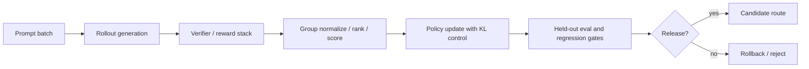
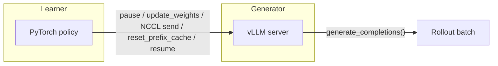

# CS336 Alignment RL Systems Runtime Cross-Check

## Scope
This note hardens the CS336 alignment canon around runtime topology, verifier governance, rollout cost, and release discipline while current 2026 Lecture 17 public materials remain unavailable. It does not claim current-2026 Lecture 17 ingestion.

## Why this cross-check exists
The direct-read Stanford Lecture 16 note already covers RLVR, GRPO caveats, verifier scope, and reward overoptimization. The remaining gap is more operational: what an RL post-training stack actually looks like in production once rewards, rollouts, reference policies, and regressions have to be managed as infrastructure.

## Runtime topology

## Core corroboration

### 1. Reasoning RL is usually multi-stage, not one clean online loop
DeepSeek-R1 is the best open evidence that reasoning RL becomes a staged system: cold-start data, rule-based reward, rejection-sampling refresh, another supervised pass, and a broader alignment follow-through stage.

**Implementation meaning:** treat RL runs as route-program changes with multiple artifacts, not as a single trainer invocation.

### 2. KL control is an operational brake, not theory garnish
InstructGPT remains the canonical systems reference for reward-model plus PPO training with a per-token KL penalty to the SFT reference policy.

**Implementation meaning:** KL drift belongs in release dashboards and rollback policy. A route that “wins reward” while breaking grounding, tone, or tool reliability is a failed alignment run.

### 3. Verifier scope is part of the alignment contract
Let's Verify Step by Step shows that outcome-only reward can miss brittle reasoning; process supervision can materially outperform answer-only reward.

**Implementation meaning:** the reward record must say whether the checker validates only the final answer, output format, intermediate steps, citations/tool traces, or some combination.

### 4. Rollout generation is a systems bottleneck
OpenRLHF's runtime design makes the systems point explicit: online RL is dominated by sample generation and therefore depends on a distributed serving/training topology, not just optimizer settings.

**Implementation meaning:** capacity planning for RL must track prompt count, samples per prompt, trace length, verifier latency, and GPU placement for generator, reference, reward, and optional critic roles.

### 5. GRPO removes one subsystem but not the governance burden
Open-source GRPO implementations simplify PPO by removing the value model, but the hard parts remain: grouped rollouts, reward normalization, KL/reference control, length effects, and regression measurement.

**Implementation meaning:** “no critic” is not “simple training.” Group size, normalization mode, and length policy still change what behavior gets reinforced.

### 6. Assignment 5 shows that rollout infrastructure is part of the public contract
The current public CS336 Assignment 5 surface makes the RL-systems story concrete before current 2026 Lecture 17 is visibly published. The handout and repo expose prompt-family choice (`question_only`, `r1_zero`, few-shot variants), answer-versus-format reward separation, GRPO-family variants, token-level versus sequence-level clipping, and vLLM-backed generation utilities with explicit weight-sync concerns.

**Implementation meaning:** version prompt family, reward decomposition, clipping granularity, rollout engine, and weight-sync topology as release artifacts. Those choices are not trainer plumbing; they decide what data the optimizer sees and how stable the online loop remains.

### 7. Reasoning RL should be recorded as a stage in a larger post-training pipeline
The official Lecture 16 material and the public Assignment 5 surface are stronger together than separately: verifier-backed reasoning RL is best treated as a capability-building stage, not as the whole deployed alignment recipe. Public examples such as R1-style stacks show a reasoning-focused RL stage followed by broader SFT/alignment follow-through that can widen the behavior surface while also changing or partially weakening some narrow reasoning gains.

**Implementation meaning:** record the stage order, not just the optimizer. A release report should preserve what happened before RL, what happened during RL, what broad-alignment step came afterward, and which reasoning gains survived that downstream broadening.

### 8. PPO/GRPO stacks often carry two different policy identities, not one
The current public Stanford Assignment 5 surface plus open PPO/GRPO references make a subtle runtime fact explicit: the **old rollout policy** used for clipped importance ratios is not the same object as the **frozen reference policy** used for KL drift control. In practice the old rollout policy is the snapshot that actually generated the sampled batch, while the reference policy is a separate anchor, often the SFT-starting policy, that may or may not be active depending on the run.

**Implementation meaning:** do not flatten `old_policy_snapshot` and `reference_policy_snapshot` into one generic "baseline model" field. They answer different questions and fail in different ways.

### 9. Off-policy correction only means something if provenance and masking stay aligned
The public Assignment 5 adapter/test surface ties `old_log_probs`, `response_mask`, clipping mode, and loss aggregation into the same train-step contract. That means off-policy ratios are only interpretable when the run can prove both **which rollout snapshot produced the old log-probabilities** and **which response-token boundary those ratios were averaged over**.

**Implementation meaning:** provenance and token boundary are one contract. A bad mask or stale `old_log_probs` can masquerade as a training win even when the optimizer is behaving exactly as configured.

### 10. The real training unit is a prompt-group under a three-policy contract
The latest public Stanford Assignment 5 surfaces and open GRPO references sharpen one more systems detail that is easy to blur away in prose. There are usually **three policy identities**, not just one "model plus baseline": the **current learner policy** being updated now, the **old rollout snapshot** that actually generated the sampled responses used for clipped ratios, and the **frozen reference policy** used as the KL drift anchor when that branch is enabled. At the same time, GRPO-style optimization is not naturally indexed by single responses; the atomic unit is the **prompt-group** that binds one prompt, `group_size` completions, one verifier recipe, and one rollout-sync epoch into the same accounting object.

**Implementation meaning:** keep `train_policy_snapshot`, `old_policy_snapshot`, `reference_policy_snapshot`, `group_size`, `sync_epoch`, and verifier/reward recipe fields in the same release record. If a report only stores per-sample rewards and a generic "baseline model," it loses the provenance needed to tell real policy improvement from stale-rollout or baseline-mislabeling artifacts.

### 11. Microbatch accumulation is part of the objective contract, not memory plumbing
The public Assignment 5 handout and train-step adapter/test surface make one more production-relevant detail explicit: on-policy reasoning RL wants a large rollout batch for utilization, but the learner often cannot fit that whole batch into memory for one backward pass. The update is therefore split across microbatches and accumulated before a single optimizer step.

**Implementation meaning:** gradient accumulation is only comparable across runs if the system preserves **full-batch equivalence**. Record `rollout_batch_size`, `gradient_accumulation_steps`, `microbatch_partition_rule`, `loss_normalization`, `normalization_constant`, `response_mask_scope`, `grad_clip_point`, and `max_grad_norm` together. Otherwise a hardware-driven microbatch change can silently become an objective-scale change.

## High-value deltas to carry into the canon note
- Distinguish **generation cost** from **update cost**; rollout throughput is often the dominant bottleneck.
- Version runtime placement choices such as separate generation and training services because these choices can alter trace consistency and stability.
- Record **two policy baselines when present**: `old_policy_snapshot` for importance-ratio/clipping correctness and `reference_policy_snapshot` for KL control.
- Record whether the KL/reference branch was actually enabled (`reference_policy_enabled`, `beta`, `mean_kl_to_ref`) instead of assuming every PPO/GRPO run used the same drift anchor.
- Record whether the run uses outcome-only reward, process reward, or mixed reward.
- Separate logged instrumentation from optimized reward. Format/schema checks, parser success, and auxiliary metrics can be tracked without automatically becoming the scalar objective.
- Track clipping granularity explicitly: token-level versus sequence-level ratio control changes stability and what a reward gain means.
- Treat token-level PPO/GRPO clipping as the direct lineage default and sequence-level clipping as an exposed alternative that should be named explicitly rather than flattened into generic "clipping used" language.
- Keep `old_log_probs` lineage joined to `response_mask` provenance; ratio control and loss accounting should reference the same response-token boundary.
- Record the actively updated learner separately from the old rollout snapshot and the frozen KL reference; PPO/GRPO stacks are usually a **three-policy** system, not a two-object one.
- Treat `(prompt_id, group_index, sample_index, sync_epoch)` as the minimal rollout accounting key when grouped normalization or clipped updates are active.
- Add a `microbatch_update_contract` with `gradient_accumulation_steps`, `microbatch_partition_rule`, `loss_normalization`, `normalization_constant`, `response_mask_scope`, `grad_clip_point`, and `max_grad_norm`; memory-fit choices must not silently change the effective update.
- Treat rejection sampling / best-of-n as a separate lever from online RL; both may improve results, but they have different cost and governance implications.
- Require held-out regressions for grounding, citation validity, latency, and verbosity after any RL route change.
- Keep length-compression or verbosity penalties explicit; they are reward-shaping policy, not harmless cleanup.
- Distinguish outcome-side verifier decomposition from true process supervision. Logging answer reward and format reward separately is valuable, but it is still weaker evidence than explicit intermediate-step verification.
- Treat stage-order retention as part of the runtime contract: later broad-alignment cleanup can tax math/coding gains, so post-RL broadening must be evaluated as a possible capability-regression event.

## Agent Studio design implications
- Add `rl_runtime_recipe` fields for rollout engine, reference-policy source, verifier class, reward components, group size, normalization policy, trace-length cap, and eval bundle.
- Add `old_policy_snapshot`, `old_logprob_snapshot_time`, `reference_policy_snapshot`, `reference_policy_enabled`, and `policy_age_at_rollout` so PPO/GRPO runs preserve both clipping lineage and KL lineage.
- Add a `microbatch_update_contract` or `train_step_equivalence_contract` with `rollout_batch_size`, `gradient_accumulation_steps`, `microbatch_partition_rule`, `loss_normalization`, `normalization_constant`, `response_mask_scope`, `grad_clip_point`, and `max_grad_norm`.
- Add `rl_release_report` fields for reward gain, groundedness delta, citation-validity delta, latency delta, token-cost delta, and rollback recommendation.
- Add `post_rl_retention_check` fields for stage order, downstream broad-alignment step, retained math/coding gain, groundedness delta, and whether later alignment changed the apparent RL win.
- Separate `selection_only_improvement` from `policy_update_improvement` so pass@k gains are not mislabeled as training gains.
- Keep verifier-backed optimization isolated to narrow, auditable behaviors such as schema validity, citation resolution, tool success, or benchmark answer equivalence.
- Add `rollout_runtime_contract` fields for prompt family, rollout engine, weight-sync topology, clipping mode, and verifier latency budget so training wins can be reproduced as systems behavior rather than only optimizer settings.
- Add `response_mask_policy`, `old_logprob_source`, and `masked_ratio_scope` so sequence-level and token-level off-policy corrections can be audited against the exact response boundary used in training.

### 12. The live Assignment 5 repo proves a concrete vLLM weight-sync topology
The public `assignment5-alignment` repo (confirmed live 2026-05-24 during the course site migration to `cs336.stanford.edu`) exposes a complete online-RL weight-sync topology through `vllm_utils.py`. This is not generic speculation — it is the actual implementation Stanford students build against:

The `VLLMServer` dataclass manages the full lifecycle:
- `start()`: launches vLLM with `--enable-prefix-caching`, `--weight-transfer-config '{"backend": "nccl"}'`, `--tensor-parallel-size 1`, `bfloat16`; waits for `/health` endpoint up to 600s
- `init_weight_sync(policy_device)`: creates an `NCCLWeightTransferEngine` via vLLM's distributed module, negotiating `master_address`, `master_port`, `rank_offset=1`, `world_size=(inference_world_size + 1)`. The trainer side calls `trainer_init()`, the generator side initializes via `POST /init_weight_transfer_engine`
- `generate_completions()`: batched `POST /v1/completions` with `temperature`, `max_tokens`, `n`, `seed`, `return_token_ids`, and optional `stop` + `include_stop_str_in_output`. Returns `VLLMCompletion` with `text`, `token_ids`, `finish_reason`
- `sync_policy_weights()`: `POST /pause` → `POST /update_weights` with NCCL `trainer_send_weights` (packed mode) → `POST /reset_prefix_cache` → `POST /resume`

**Implementation meaning:** the weight-sync topology is a provenance field, not an implementation detail. Every rollout epoch is bounded by a pause-sync-resume sequence. Generator freshness, cache-invalidation cost, and NCCL transfer bandwidth all affect how quickly the learner's update reaches the next batch of rollouts. Runs that batch multiple learner steps per sync (off-policy reuse) must preserve `old_logprob_source` and `sync_epoch` to distinguish fresh-rollout gains from stale-rollout correction artifacts.

### 13. The grader provenance is now confirmed as public open-source
The `drgrpo_grader.py` module in the live repo is attributed to `sail-sg/understand-r1-zero` (MIT license), confirming the grading cascade chain:
1. `grade_answer_mathd()` — Dan Hendrycks style normalized string match with 395+ unit text replacements, fraction/sqrt fixing, matrix normalization
2. `grade_answer_sympy()` — sympy structural equivalence with `signal.SIGALRM` 1s timeout, repetition-filter suffix-array guard (>20% = auto-fail), integer strictness, tuple/interval splitting, multiple-GT logical OR
3. `is_latex_equal()` — math_verify library (slow path, inactive during training)

The `question_only.prompt` template is confirmed as `{question} Please put your final answer within \boxed{{}}.` — the prompt-bound answer-extraction and stop contract is minimal.

### 14. The test surface confirms four algorithm variants under one train-step contract
The test suite (`tests/test_grpo.py`) parameterizes `grpo_train_step()` across:

| Variant | baseline | advantage_normalizer | loss_normalization | normalization_constant |
|---------|----------|---------------------|-------------------|----------------------|
| `grpo_constant` | mean | std | constant | 32 |
| `dr_grpo` | mean | none | constant | 32 |
| `rft` | none | none | constant | 32 |
| `maxrl` | mean | mean | constant | 32 |

All four share the same `gradient_accumulation_steps=2`, `max_grad_norm=1.0`, `group_size=2`, and reward function returning `{"reward", "format_reward", "answer_reward"}`.

**Implementation meaning:** the algorithm-family boundary is not a qualitative "GRPO vs RFT vs MaxRL" switch — it is a specific combination of baseline, advantage normalizer, and loss-normalization parameters. A release report that only states "we used GRPO" loses the parameter dimension that actually defines the training objective.

### 16. Prompt family → parser → reward contract: the concrete A5 topology

The live A5 repo exposes five distinct prompt templates, each defining a different output grammar and requiring a different parser/reward strategy. This is not a cosmetic detail — prompt change can silently change both parser hit rate and effective reward surface, because the output format determines which answers are extractable and thus which behavior gets optimized.

| Prompt template | Output grammar | Answer extraction | Reward function | Boundary contract |
|---|---|---|---|---|
| `question_only.prompt` | Free text + `\boxed{answer}` | `mathd_normalize_answer` scans for `\boxed{}`; `_strip_string` normalizes whitespace, frac/sqrt/repeating-decimal mathd transformations | `grade_answer_mathd()` — string equivalence after 395+ unit replacements | `{question} Please put your final answer within \boxed{}.` — the model must produce a parseable `\boxed{}` for any reward to register |
| `r1_zero.prompt` | `thinking ...` → `<answer> answer </answer>` | Parser looks for `<answer>` and `</answer>` tags; no `\boxed{}` fallback | Same `drgrpo_grader.py` cascade (mathd → sympy → latex_equal) but entry point is tag-based rather than box-based | Tag-separated reasoning/answer boundary. If the model omits `<answer>` tags or nests them incorrectly, reward is zero even with a correct answer |
| `r1_zero_three_shot_gsm8k.prompt` | Same `thinking/answer` format with 3 exemplars | Same tag-based parser | Same grader cascade | The 3 exemplars teach the exact tag structure, lowering format-failure risk but biasing toward GSM8K-style short-answer patterns |
| `alpaca_sft.prompt` | `### Response:\n{response}` | No answer extraction — SFT format | N/A (SFT loss, not RL reward) | Instruction-following format, not used for RL reward generation |
| `zero_shot_system_prompt.prompt` | `# Query: \`\`\`{instruction}\`\`\`\n# Answer: \`\`\`` | No answer extraction — safety/instruction context | N/A (used as system prompt context or safety evaluation) | Safety-aligned role format with code-fence boundaries |

**Output grammar → parser hit rate → effective reward surface.** The practical consequence is that a prompt-family swap (e.g. `question_only` → `r1_zero`) can change the parser's answer-recognition rate even when the model produces the same correct answer. If `question_only`'s `\boxed{}` format produces 90% parser coverage but `r1_zero`'s `<answer>` tag format only produces 70% coverage on the same response distribution, the apparent reward drops purely from extraction attrition. Future runs comparing these two prompt families need to separate parser-failure attrition from genuine answer-quality differences.

**provenance recommendation from the live code:** The A5 `adapters.py` `run_compute_rollout_rewards` is the function stub that would connect prompt-family choice to reward dispatch. In production, treat `(prompt_family_id, prompt_template_hash, parser_version, reward_fn_id)` as an immutable contract tuple — if any element changes, the reward surface is not comparable to previous runs. Record the concrete prompt file contents (not just "r1_zero" or "question_only") in the run manifest because whitespace, exemplar choice, and delimiter escape affect parser behavior.

**Implementation meaning:** Do not log "prompt: r1_zero" and call it done. Record:
- `prompt_template_hash`: SHA256 of the actual prompt file content
- `parser_entry`: which answer-extraction path was used (box-based vs tag-based vs regex)
- `parser_coverage`: ratio of responses where the parser successfully extracted an answer
- `reward_function_id`: which combination of mathd / sympy / latex_equal was applied
- `answer_extraction_failure_rate`: fraction of responses where parser returned None (these receive zero reward, lowering the apparent group average)
- `format_reward`: the format/shape compliance component (logged separately from answer correctness to distinguish extraction failures from wrong answers)

When comparing runs across prompt families, build a `parser_alignment_table` that cross-tabulates at minimum (prompt_family, parser_hit_rate, answer_reward_mean, format_reward_mean) so the attribution of reward differences is explicit.

### 15. Off-policy correction is a rollout-reuse budget with three proven modes
The test suite validates three off-policy importance reweighting methods at `cliprange=0.1`:
- `noclip`: importance-weighted without clipping (maximum reuse, highest variance)
- `grpo`: token-level PPO/GRPO clipping over `(batch, seq_len)` log-probability ratios
- `gspo`: sequence-level reweighting and clipping over response-masked tokens only

The `old_log_probs` for off-policy tests are constructed as `torch.linspace(-1.5, 0.5)` — non-trivial drift that makes clipping behavior testable. The `response_mask` is required for GSPO, confirming the sequence-level contract depends on correct response-boundary isolation.

## Mental model artifact
![[../../02-lectures/stanford/assets/cs336-lecture16-rollout-runtime-contract.svg]]

## Practical note
This cross-check uses official/open artifacts only and intentionally stops short of claiming current 2026 Lecture 17 source coverage. The live 2026-05-24 recheck still shows Lecture 16 as the visible official anchor (`lecture_16.pdf` still linked on the schedule, `cs336.stanford.edu` now live, old `cs336.stanford.edu` github.io redirects resolved) and keeps Lecture 17 blocked until the official course page exposes a public material link for the May 27 slot. The Assignment 5 repo (aligned to Spring 2026 as of the `2026 version` commit history) is confirmed live and publicly forkable.
