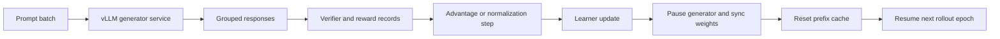

# CS336 Assignment 5 Learner/Generator Weight-Sync Cross-Check

## Scope
This note hardens the Stanford CS336 alignment lane around the public Assignment 5 runtime boundary between the learner and the rollout generator. It focuses on weight freshness, cache invalidation, grouped-rollout identity, and rollout provenance. It does not store handout text, solutions, or long excerpts.

## Why this note exists
The existing Lecture 16, runtime, and Assignment 5 notes already explain RLVR, reward decomposition, grouped sampling, and clipping choices. The remaining high-value gap is more operational: the public Stanford stack makes it explicit that online reasoning RL is an inference-service problem, not just an optimizer problem.

## Core runtime contract

## High-value corroboration

### 1. The public Stanford stack separates learner and generator explicitly
Assignment 5 exposes a dedicated generation service boundary instead of assuming rollouts are sampled in-process by the learner. The handout points directly to a helper that runs a vLLM server and syncs weights from the training side.

**Implementation meaning:** rollout provenance must include not just the learner checkpoint, but also the generator engine and the sync boundary used for each batch.

### 2. Weight sync is a protocol, not a vague reload
The public `vllm_utils.py` surface makes weight refresh a concrete lifecycle: pause generation, transfer weights, clear inference-side cache state, then resume sampling.

**Implementation meaning:** a rollout record should carry `generator_policy_snapshot`, `rollout_sync_epoch`, and `cache_reset_done`. Otherwise "same model version" can still hide stale generator state.

### 3. Cache invalidation belongs in RL provenance
The exposed cache-reset step is unusually valuable evidence because it shows that inference caches are part of policy freshness, not an orthogonal serving detail.

**Implementation meaning:** after any learner-to-generator sync, cache invalidation should be treated as part of the correctness contract before later rewards are compared with earlier ones.

### 4. Group identity is structural, not cosmetic
The public adapter surface repeats prompts and ground truths by `group_size`, making the natural accounting unit a prompt-group rollout rather than a flat sample list.

**Implementation meaning:** log `(prompt_id, group_index, sample_index, sync_epoch)` so later normalization, clipping, and best-of-n comparisons can be reconstructed without ambiguity.

### 5. PPO-style old-policy logic becomes a generator-freshness problem in service-based RL
PPO only makes sense when sampled trajectories are tied to the policy snapshot that generated them. Once generation is delegated to a separate service, "old policy" becomes an infrastructure question about when the generator actually picked up learner weights.

**Implementation meaning:** stale-sample risk should be tracked explicitly even when the algorithm name stays the same.

### 6. Async RL docs confirm the same failure mode at larger scale
Official async GRPO guidance from NeMo RL makes weight versioning, trajectory age, and freshness limits first-class controls when generation and learning are concurrent.

**Implementation meaning:** Stanford's public assignment surface is a compact teaching version of a real production issue: rollout validity depends on policy version tracking and freshness budgets, not just reward math.

## Deltas to carry into the canon
- Treat `learner_generator_boundary` as a first-class release artifact.
- Record `generator_policy_snapshot`, `reference_policy_snapshot`, `rollout_sync_epoch`, and `cache_reset_done` for every rollout batch.
- Preserve prompt-group identity across normalization, clipping, reranking, and replay analysis.
- Distinguish learner-side checkpoint creation from generator-side activation time.
- Treat stale-generator or stale-cache rollouts as provenance faults, not merely noisy samples.
- Keep reward-component logs joined to generator-freshness metadata so policy wins are reproducible.

## Agent Studio design implications
- Add `rollout_generator_contract` fields for engine, sampler config, sync method, cache-reset policy, and resume signal.
- Add `rollout_batch_provenance` fields for prompt group, generator snapshot, learner snapshot, verifier version, reward components, sync epoch, and freshness status.
- Add `stale_rollout_handling` policy for discard, age-threshold fallback, or explicit correction.
- Require release checks that compare reward gains against freshness, latency, and cache-consistency evidence rather than against optimizer metrics alone.

## Mental model artifact
![[../../02-lectures/stanford/assets/cs336-assignment5-learner-generator-weight-sync.svg]]

## Practical note
This note uses official/public Stanford artifacts and official/open corroboration only. The live 2026-05-21 recheck still shows Lecture 16 as the visible official CS336 anchor and keeps Lecture 17 blocked until the official course page exposes a visible public material link again.