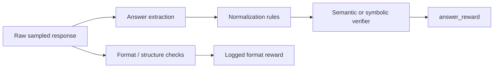

# CS336 Assignment 5 Verifier Normalization And Answer-Provenance Cross-Check

## Scope
This note hardens the Stanford CS336 alignment lane around a subtle but high-value RLVR contract in the public Assignment 5 surface: correctness reward is not plain exact match over raw model text. It is the result of answer extraction, normalization, and semantic verification choices that together define what the optimizer treats as success.

## Why this note exists
The existing Lecture 16 and Assignment 5 notes already cover prompt families, reward separation, grouped rollouts, clipping, response-mask lineage, and learner/generator sync. The remaining under-specified gap is verifier provenance itself. If the parser, answer normalizer, or symbolic-equivalence backend changes, the reward function changes even when the policy does not.

## Core verifier contract

## High-value corroboration

### 1. Stanford's correctness reward is a parsed-answer reward
The public Assignment 5 surface routes generated text through answer-extraction logic before grading. The runtime does not reward arbitrary free-form output directly.

**Implementation meaning:** the reward contract starts with extraction policy: which delimiter, tag, or boxed-answer convention is expected, and what counts as an extractable final answer.

### 2. Normalization rules are part of reward provenance
The public grader notes that final-answer normalization follows the Minerva lineage before semantic comparison. That means reward depends on more than surface-string equality.

**Implementation meaning:** version the normalizer alongside the policy run. A reward delta can come from a changed normalizer rather than improved reasoning.

### 3. Semantic verification is stronger than literal exact match but introduces backend dependence
The public grader uses symbolic or semantic checking paths rather than a pure string comparison. This is better aligned with math correctness, but it also means verifier library behavior is part of the training recipe.

**Implementation meaning:** pin verifier backend and mode. SymPy-style equivalence, parser behavior, and any fallback verifier path all affect which outputs score as correct.

### 4. Format reward and correctness reward must stay separate
The handout and grader surface distinguish output-format compliance from correctness reward rather than silently blending them.

**Implementation meaning:** log extraction success, format success, normalized-answer success, and final correctness as separate fields. Otherwise parser leniency can be mistaken for policy improvement.

### 5. Cross-run comparability depends on verifier lineage, not just model lineage
Two RL runs using the same model, prompt, and optimizer are not comparable if one changes delimiter expectations, normalization rules, or equivalence backend.

**Implementation meaning:** treat verifier provenance as a first-class release artifact next to prompt family, clipping mode, and normalization mode.

## Agent Studio design implications
- Add `verifier_recipe` fields for extraction rule, answer-normalization rule set, semantic-equivalence backend, timeout policy, and fallback mode.
- Keep `answer_reward`, `format_reward`, `parse_success`, and `semantic_verify_success` as separate logged dimensions.
- Version verifier-library commits or package versions so reward regressions can be traced to tool changes instead of being mislabeled as policy regressions.
- Treat normalization and parsing as part of source-backed release governance, especially when the target domain is math, code tests, citation validity, or tool-call success.

## High-value deltas to carry into the canon
- `answer_reward` is truth-after-extraction-and-normalization, not raw-label truth.
- Verifier changes can silently reshape the RL surface even when optimizer settings stay fixed.
- Parser/normalizer/backend provenance belongs in the same release record as reward components and rollout lineage.
- Reward dashboards should show parser success and semantic-equivalence success separately from final correctness.

## Mental model artifact
![[../../02-lectures/stanford/assets/cs336-assignment5-verifier-provenance.svg]]

## Practical note
This note uses official/public Stanford artifacts and open canonical corroboration only. It strengthens the current CS336 alignment lane without claiming a current-2026 Lecture 17 direct-read pass.