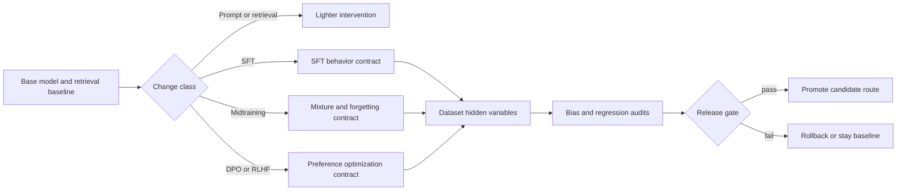

# CS336 Lecture 15 - Mid/Post-Training Cross-Check

## Scope
This note hardens the current Stanford CS336 Lecture 15 synthesis around post-training governance, release discipline, and hidden-variable control. It does not restate slide text or store raw lecture content.

## Why this cross-check exists
The direct-read lecture note already captures the main SFT/RLHF/DPO ideas. The remaining high-value gap is operational: how to keep post-training from becoming an opaque behavior mutation that quietly changes grounding, citation behavior, verbosity, tool use, and rollback surface.

## Release-contract map

## Core corroboration

### 1. SFT should shape behavior, not replace source memory
Lecture 15 and InstructGPT both support a practical boundary: supervised post-training is best treated as behavior shaping for instruction following, formatting, safety stance, and tool habits, not as the primary storage layer for freshness-sensitive or tail factual knowledge.

**Implementation meaning:** Agent Studio should keep books, official docs, citations, and changing facts in retrieval/source memory. Post-training proposals should justify why behavior adaptation is better than prompt, retrieval, or tooling changes.

### 2. Post-training datasets contain hidden variables that must be declared
The current lecture foregrounds variation in style, answer length, citation behavior, factual density, tool-use traces, safety content, and dataset scale. Tülu 3 reinforces the open-release lesson that recipe and artifact transparency matter as much as the final tuned behavior.

**Implementation meaning:** do not accept a generic `instruction_data` label. Route-change records should preserve dataset purpose, style profile, citation expectations, tool-use traces, safety slice, scale, and reuse limits.

### 3. Midtraining is a separate governance surface from SFT and preference optimization
Lecture 15 treats two-phase or midtraining mixtures as a real but under-documented route. This is not just a bigger SFT run; it changes broad model behavior and introduces forgetting, source-mixture, rights, and rollback risks.

**Implementation meaning:** require a distinct `midtraining_mixture_record` with source-family weights, caps, epoching or reuse policy, rights status, forgetting evals, and rollback target before broad source-derived behavior data is mixed into a pretraining-style phase.

### 4. DPO simplifies optimization mechanics, not release governance
DPO is operationally attractive because it removes the explicit reward-model plus on-policy PPO loop, but the DPO paper and the lecture agree on the underlying dependence on pair quality and a reference policy.

**Implementation meaning:** a DPO-style route update still needs chosen/rejected pair provenance, reference-policy identity, source context, length/style audits, grounding regressions, and rollback evidence. “Simpler trainer” is not a waiver for governance.

### 5. Preference data is a governed data product, not a single scalar signal
Lecture 15 highlights annotator expertise, demographics, compensation, AI assistance, verification effort, and style or length bias. RewardBench adds the reminder that judges and reward-like scorers need evaluation themselves.

**Implementation meaning:** preserve evaluator type, expertise class, AI-assistance status where known, rubric version, response length, style tags, citation behavior, and source-grounding slices before preference data can steer a production route.

### 6. Open post-training releases need a full artifact package
Tülu 3 is the strongest open corroboration that a post-training claim becomes operationally meaningful only when the base model, recipe, data, evals, artifacts, and negative-result surface are inspectable together.

**Implementation meaning:** Agent Studio should block promotion of post-training-driven route changes until the release bundle includes baseline route, candidate route, data/provenance summary, eval suite, decontamination or leakage review where relevant, behavior-regression evidence, and rollback path.

## High-value deltas to carry back into the canon
- Separate `midtraining_mixture_record` from SFT and preference data.
- Treat citation behavior, verbosity, and tool-use traces as first-class post-training variables.
- Require `reference_policy_record` for DPO-style or RLHF-style route changes.
- Add `preference_bias_audit` fields for length, style, evaluator mix, model-judge agreement, and source-grounding slices.
- Keep reward/judge evaluation evidence separate from downstream product success claims.
- Prefer lighter interventions first; post-training is a governed escalation, not cleanup.

## Agent Studio design implications
- Use retrieval for changing knowledge and source fidelity; use post-training only for stable behavior deltas.
- Keep SFT demonstrations, preference pairs, verifier-labeled examples, and broad midtraining mixtures in different records.
- Do not promote a preference win that is explained mainly by answer length or polished tone.
- Preserve chosen and rejected artifacts so later audits can inspect why a route improved or regressed.
- Bind every post-training proposal to explicit grounding, safety, latency, and cost regressions before release.

## Mental model artifact
![[../../02-lectures/stanford/assets/cs336-lecture15-post-training-release-contract.svg]]

## Practical note
The official CS336 Spring 2026 Lecture 17 source is now visibly public on the course schedule, but this note does not claim Lecture 17 ingestion. It only hardens the already direct-read Lecture 15 post-training contract.