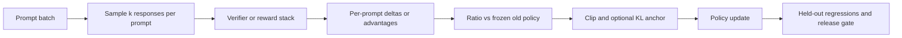

# CS336 Lecture 17 RL Systems And Mechanics Cross-Check

## Scope
This note hardens the Stanford CS336 alignment lane around policy-gradient mechanics, grouped-rollout accounting, reference-policy anchoring, and RL runtime topology. It uses official/open artifacts only and does not itself claim a current Spring 2026 Lecture 17 direct-read pass. As of the latest 2026-05-21 visible-page recheck, the official course page once again exposes `lecture_17.py`, so this maintenance note should now be treated as a bridge until the current-source direct-read pass is completed.

## Why this exists
The current canon already has:

- direct-read 2026 Lecture 15 coverage for mid/post-training and preference-data governance;
- direct-read 2026 Lecture 16 coverage for RLVR, verifier design, and GRPO caveats;
- assignment-level operationalization for reasoning RL; and
- a runtime-governance cross-check for rollout bottlenecks and release discipline.

The remaining useful increment is the mechanics layer between lecture theory and runtime operations: how policy-gradient updates for language models actually depend on grouped sampling, baseline choice, frozen old/reference policies, and audit-ready rollout records.

## Core mechanism

## High-value corroboration

### 1. Language-model RL is a grouped response-comparison system
The archived Stanford Lecture 17 source makes the language-model framing explicit: the state is prompt plus generated prefix, the action is the next token, and reward arrives over the completed response. In practice that means grouped sampling per prompt is not cosmetic. It gives the training run a within-task comparison frame for reward deltas and exposes whether gains come from true policy improvement or just lucky response selection.

**Implementation meaning:** preserve prompt-group identity, sample count, and per-sample reward vectors in every rollout record.

### 2. Baselines and advantages are governance-relevant, not mere math cleanup
The lecture derivation shows why naive reward-weighted updates are high variance and why baseline subtraction changes learning behavior materially. Assignment-level GRPO variants make the same point operationally: normalization mode, baseline definition, and clipping style are real algorithm choices.

**Implementation meaning:** version raw reward, centered reward, normalized reward, top-only reward, and clipping mode as explicit recipe fields.

### 3. Frozen old/reference policies are part of the contract
Both the Stanford mechanics source and modern GRPO tooling depend on comparing the candidate policy to a frozen old or reference policy. Without a stable comparison anchor, ratio-based clipping and KL control lose meaning.

**Implementation meaning:** store policy snapshot IDs for generator, old policy, and reference policy, plus the exact sync point used for rollouts.

### 4. RL runtime cost is dominated by rollout generation and verification
OpenRLHF and TRL make the systems point concrete: online RL is an inference-heavy topology where generation, reward evaluation, and policy sync can dominate wall-clock cost more than the optimizer step itself.

**Implementation meaning:** capacity planning should treat prompt count, samples per prompt, average response length, verifier latency, and checkpoint-sync cadence as first-class release variables.

### 5. Reward scope defines what behavior gets reinforced
InstructGPT and later verifier-backed RL work both imply the same warning: a scalar reward hides product choices. Final-answer correctness, format compliance, citation validity, tool success, process checks, and verbosity controls are different objectives even when they are summed into one number.

**Implementation meaning:** each reward component should be logged separately, with declared blind spots and failure modes.

### 6. Faster RL topologies create freshness and provenance obligations
Server-mode generation, async pipelines, and disaggregated rollout/update paths can improve throughput, but they also create stale-policy and trace-consistency risk.

**Implementation meaning:** every rollout batch should record policy freshness, generator engine, reward/verifier version, prompt source split, and whether the update was on-policy, near-policy, or corrected off-policy.

## Deltas to carry into the canon note
- Separate **selection-only improvement** from **policy-update improvement** so best-of-n or reranking wins are not mislabeled as RL wins.
- Treat **group size** as a product control because it changes variance, exploration, and normalization behavior.
- Keep **length policy** explicit; normalization and clipping choices can accidentally reward longer reasoning traces.
- Require **non-reward regressions** after RL: grounding, citation validity, tool success, safety, latency, token cost, and verbosity drift.
- Preserve **rollout provenance** across prompt template, dataset split, policy version, sampler settings, verifier version, and stop rule.
- Prefer **narrow verifier-backed optimization** for schema validity, source resolution, and tool success before attempting broader editorial-quality RL.

## Agent Studio design implications
- Add `rl_rollout_record` fields for prompt ID, group ID, sample count, policy snapshot, reference snapshot, verifier version, reward components, delta mode, clipping mode, and stop reason.
- Add `rl_runtime_topology` fields for colocated versus disaggregated generation, actor/update placement, sync cadence, and verifier deployment boundary.
- Add `rl_regression_bundle` fields for reward delta, grounding delta, citation-validity delta, tool-success delta, latency delta, token-cost delta, and rollback recommendation.
- Add `policy_improvement_type` with values such as `selection_only`, `offline_preference_update`, `online_verifier_rl`, and `mixed_pipeline`.

## Mental model artifact
![[../../02-lectures/stanford/assets/cs336-lecture17-policy-gradient-systems.svg]]

## Practical note
This cross-check intentionally stops short of claiming current 2026 Lecture 17 ingestion. The live official CS336 page was rechecked again on 2026-05-21 and now visibly exposes `lecture_17.py` for Lecture 17, so the next alignment increment should be a direct current-source read. Until that direct-read pass is completed, this note remains the compact evidence-hardening layer that keeps the alignment lane moving without overstating source coverage.
