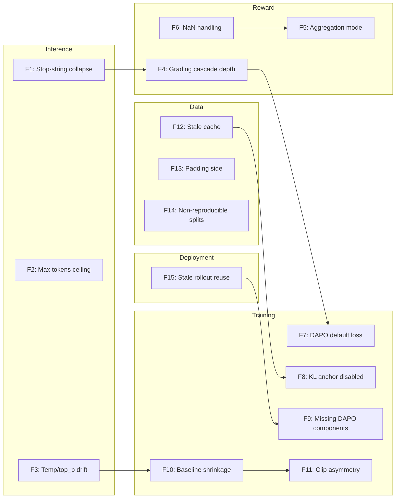

# Silent Failure Surface Inventory

Consolidates all known silent-failure modes discovered across phases 1–6 of the system-d design vault enrichment. Each failure mode is a place where a library default, config omission, or cross-layer mismatch produces a structurally different training signal than the operator expects, with **no runtime warning**.

## Why This Note Exists

The six preceding cross-check notes each cover one or two failure surfaces in depth. This note collects them into a single reference so that a release-gate checklist can be built from the unified catalog. No new source reading was performed — this is synthesis of the existing canon.

---

## Failure Surface Catalog

### Layer 1 — Inference / Generation (vLLM)

| # | Failure mode | Symptom | Root cause | Detection | Risk | Fix |
|---|---|---|---|---|---|---|
| F1 | **Stop-string reward collapse** | Flat zero reward for `r1_zero` prompts | `include_stop_str_in_output=False` (vLLM default) strips `</answer>` before reward function checks for it | Check `include_stop_str_in_output` in run config | **Critical** — signal is deterministically zero | Set `include_stop_str_in_output=True` |
| F2 | **Max tokens ceiling mismatch** | Rollout truncation at unexpected length | `max_tokens` is not recorded; two runs with different ceilings have different response-mask token counts | Compare max_tokens across runs | **High** — changes per-token loss distribution | Record explicit max_tokens per run |
| F3 | **Temperature / top_p silent drift** | Rollout diversity changes between experiments | `temperature` and `top_p` defaults may differ between inference framework versions (vLLM, HF, TRL) | Pin version and check defaults each upgrade | **Medium** — exploration surface changes silently | Record temperature, top_p, framework version as a block |

### Layer 2 — Reward / Verifier

| # | Failure mode | Symptom | Root cause | Detection | Risk | Fix |
|---|---|---|---|---|---|---|
| F4 | **Answer-extraction cascade divergence** | Two runs report different rewards for the same rollout | Grading cascade (mathd_strict → sympy_structural → is_latex_equal) has different depths enabled during training vs eval | Record cascade depth as a governance field | **High** — eval can disagree with training reward | Record `grading_cascade_depth` and which stages are disabled |
| F5 | **Multi-reward aggregation ambiguity** | Run comparison impossible when reward count differs | Two aggregation modes (`sum_then_normalize` vs `normalize_then_sum`) produce different combined rewards from identical per-function scores | Check `multi_objective_aggregation` in config | **High** — fundamentally different reward landscapes | Record aggregation mode with per-function weights |
| F6 | **NaN reward silently ignored** | Function returns NaN → zero-weighted by default in TRL (L58-60) | No warning when a reward function produces NaN, only sets weight to 0.0 | Add reward validation hook | **Medium** — hides broken reward functions | Validate each reward function output before combining |

### Layer 3 — Training Loop / Loss

| # | Failure mode | Symptom | Root cause | Detection | Risk | Fix |
|---|---|---|---|---|---|---|
| F7 | **DAPO as default loss** | System using TRL default runs a different loss than canonical GRPO | `loss_type="dapo"` (TRL default) uses global-token normalization, not sequence-level normalization | Check `loss_type` in GRPOConfig | **Critical** — changes effective gradient landscape | Set `loss_type="grpo"` explicitly |
| F8 | **KL drift anchor disabled** | Reference model never loaded, 2× memory saved at cost of no KL regularization | `beta=0.0` (TRL default) → `self.ref_model = None` silently | Check `beta > 0` in config | **Critical** — no KL signal, no warning | Set `beta > 0.0` with explicit ref model |
| F9 | **DAPO components missing from TRL** | Token-level normalization correct but Dynamic Sampling filter and Overlong Reward Shaping absent | TRL `loss_type="dapo"` only implements the normalization part of the DAPO paper (2503.14476) | Cross-check TRL source against paper Section 3 | **High** — partial paper compliance | Implement or verify missing components independently |
| F10 | **Finite-group baseline shrinkage** | Effective gradient scaled by (G-1)/G when self-including group-mean baseline | Self-including mean baseline implicitly shrinks advantage variance for small G | Record `baseline` mode explicitly | **Medium** — matters for G<8 runs | Use leave-self-out baseline for small groups |
| F11 | **Clip range asymmetry** | One-sided vs two-sided clipping not distinguishable from clip_fraction alone | clip_range clipped to `[1-ε, 1+ε]` but clip_fraction aggregates both sides | Record clipping mode and bound direction | **Medium** — clip_fraction alone is insufficient | Record clip_range, clip_mode, and bound direction as a triad |

### Layer 4 — Data Pipeline

| # | Failure mode | Symptom | Root cause | Detection | Risk | Fix |
|---|---|---|---|---|---|---|
| F12 | **Stale cache reuse** | Dataset changes don't propagate to training | `load_from_cache_file=None→True` (datasets default) + TRL no override = silent cache reuse | Check `load_from_cache_file` setting | **Critical** — training on stale data | Set `load_from_cache_file=False` during development |
| F13 | **Padding side mismatch** | Batch generation crashes or produces wrong tokens | `padding_side="right"` (HF default) incompatible with causal LM batched generation | Check `tokenizer.padding_side` | **High** — generation errors for batched inference | Set `padding_side="left"` |
| F14 | **Non-reproducible splits** | Train/eval splits differ between runs | `train_test_split(seed=None)` (datasets default) | Check seed in split call | **Medium** — impedes experiment comparison | Set explicit seed for all splits |

### Layer 5 — Deployment / Topology

| # | Failure mode | Symptom | Root cause | Detection | Risk | Fix |
|---|---|---|---|---|---|---|
| F15 | **Stale rollout reuse without tracking** | Off-policy correction unverifiable | Microbatch buffer reuses rollouts for multiple learner steps without explicit sync_epoch counter | Check `steps_per_generation` and `num_iterations` | **High** — release evaluators cannot verify staleness | Record sync_epoch per gradient step |

---

## Detection Difficulty Heatmap

```
Layer         | Easy (config check) | Medium (source check) | Hard (runtime trace)
--------------|---------------------|-----------------------|---------------------
Inference     | F1, F2, F3          | —                     | —
Reward        | F5                  | F4, F6                | —
Training      | F7, F8              | F10, F11              | F9
Data          | F12, F13, F14       | —                     | —
Deployment    | F15                 | —                     | —
```

**Rule**: A failure mode in the "Easy" column can be caught by reading the run config file. "Medium" requires reading source code or comparing cross-check notes. "Hard" requires instrumenting the runtime (logging every reward output, tracing the DAPO paper compliance path).

---

## Minimum Viable Governance Fields

A release-ready run manifest should record these blocks together:

```yaml
rollout_contract:
  stop_strings: ["</answer>"]
  include_stop_str_in_output: true  # REQUIRED — never implied
  max_tokens: 512
  temperature: 1.0
  top_p: 1.0

reward_contract:
  multi_objective_aggregation: "sum_then_normalize"  # or "normalize_then_sum"
  grading_cascade_depth: 2  # mathd_strict + sympy_structural
  per_function_weights: [1.0]

training_contract:
  loss_type: "grpo"  # explicit — not relying on TRL default "dapo"
  beta: 0.04  # explicit — not leaving at 0.0
  clip_range: 0.2
  baseline: "leave_self_out"  # small-group correction
  num_iterations: 1
  steps_per_generation: 4

data_contract:
  load_from_cache_file: false  # development mode
  padding_side: "left"
  train_test_split_seed: 42
  dataset_hash: "<sha256>"

topology_contract:
  sync_epoch: 42  # per-run monotonically increasing
  learner_device: "GPU 0"
  inference_device: "GPU 1"
  weight_sync_method: "NCCL (pause→update→reset_cache→resume)"
```

Without these five blocks, two runs with identically configured model IDs and optimizer settings can differ in effective training objective, reward signal, and data pipeline — with no runtime warning that they are not comparable.

---

## Mermaid: Failure Surface Flow



---

## Relationship to Existing Canon

This note does not replace the six existing cross-checks. It provides the unified reference layer. Each failure mode links conceptually to its detailed analysis in:

- **F1-F3**: [[cs336-alignment-rl-systems-runtime-cross-check]] § Stop-string coupling, [[cs336-assignment5-reasoning-rl-variants-cross-check]] §13 Config contract
- **F4-F6**: [[trl-grpo-reward-composition-cross-check]] §1-2
- **F7-F11**: [[trl-grpo-code-anatomy-cross-check]] §2-7, [[trl-grpo-silent-default-gaps-cross-check]]
- **F12-F14**: [[datasets-trl-silent-defaults-cross-check]], [[hf-training-args-silent-defaults-pipeline-cross-check]]
- **F15**: [[cs336-assignment5-reasoning-rl-variants-cross-check]] §12 Adapter contract