# Chapter 14 - Managed AI Services, OCR, And Moderation Route Contracts

## Reading Scope

This is a direct-read synthesis of the highest-value production slice inside Chapter 14 of the local *Applied Machine Learning and AI for Engineers* PDF: what changes when a route stops being a self-hosted model artifact and becomes a managed AI dependency.

The chapter uses Azure Cognitive Services as the concrete example, but the design lessons generalize to any provider-hosted vision, OCR, language, speech, and moderation lane. This note keeps the parts that matter for Agent Studio release design:

- service-boundary and versioning decisions;
- endpoint, credential, SDK, and error-surface implications;
- OCR route choice and asynchronous operation handling;
- moderation and harmful-content review surfaces;
- privacy, on-prem, and disconnected-runtime tradeoffs.

The note stores original synthesis only. It does not store copied chapter text, code listings, screenshots, or long excerpts.

## Why This Slice Matters

The parent applied-ML note already established that managed AI services are governed provider dependencies rather than convenience helpers. What it did not yet make explicit enough is the **operating contract when the provider surface itself evolves**.

Chapter 14 sharpens five design truths that matter directly for Agent Studio:

1. **Managed AI is a route dependency, not just a model call.** Credentials, endpoint shape, SDK behavior, API versions, and provider-side model upgrades all affect production behavior.
2. **OCR is not one lane.** General image OCR, document OCR, and handwriting-aware extraction have different latency, result-shape, and polling behavior.
3. **Moderation is policy-bearing infrastructure.** Harmful-content detection belongs in release evidence, not only transient request logs.
4. **Provider hosting changes privacy and rollback posture.** Containers, on-prem deployment, and disconnected exceptions matter when data boundary or service drift is sensitive.
5. **The service catalog changes over time.** The book's Azure Cognitive Services framing is still useful, but current official docs show that OCR and moderation surfaces have already been reorganized into newer product/runtime boundaries.

That makes this chapter a high-leverage deepening pass for any bounded ML, OCR, moderation, or provider-assisted media route.

## Current-Source Cross-Check Delta

The book's vendor examples are still directionally correct, but current Microsoft docs make three architecture-relevant changes explicit:

- **Legacy OCR should not be the default.** Current Microsoft Learn guidance warns against relying on the legacy Azure Vision OCR APIs and instead splits OCR into a synchronous general-image OCR path and a Document Intelligence read-model path for text-heavy scanned or digital documents.
- **Document OCR is now a versioned document-processing runtime.** Current Document Intelligence docs emphasize GA versioning, retiring prior versions, migration guidance, and document-model selection rather than a single generic OCR call.
- **Moderation has broadened into AI safety.** Current Azure AI Content Safety includes text/image harmful-content detection and newer AI-safety surfaces such as prompt-shielding and groundedness checks, so moderation is now closer to a full model-safety lane than a narrow profanity filter.

For Agent Studio, the important conclusion is not "use Azure." It is: **managed AI route design must survive provider product churn without corrupting source, moderation, or review evidence.**

## Managed-AI Route Map

```mermaid
flowchart TD
    A[Managed AI route] --> B[Provider contract]
    A --> C[Task-specific runtime]
    A --> D[Governance boundary]
    A --> E[Fallback + rollback]

    B --> B1[endpoint + api version]
    B --> B2[credential scope]
    B --> B3[SDK behavior + errors]
    B --> B4[provider-side model drift]

    C --> C1[general image OCR]
    C --> C2[document OCR]
    C --> C3[captioning / tagging / detection]
    C --> C4[content moderation]
    C --> C5[speech or translation]

    D --> D1[data boundary]
    D --> D2[confidence semantics]
    D --> D3[human review]
    D --> D4[restricted capability approval]

    E --> E1[containerized local lane]
    E --> E2[provider outage fallback]
    E --> E3[version pinning]
    E --> E4[route rollback target]
```

## Service Boundary Is Part Of The Architecture

The chapter's core contribution is practical: a provider service family can collapse years of model-building effort into a few API calls, but it also inserts a versioned external dependency into the middle of the route.

That changes the evidence Agent Studio must keep:

- the provider and product family;
- endpoint or resource identity;
- API or SDK version;
- authentication mode and credential boundary;
- request and response schema expectations;
- confidence semantics and score interpretation;
- retry, timeout, and failure policy;
- fallback behavior if the provider changes, degrades, or becomes unavailable.

The route is not reproducible if it stores only "used OCR" or "used moderation".

## SDKs Simplify Calls But Hide Important Contracts

One practical lesson from the chapter is that SDKs are valuable because they hide URL suffixes, request serialization, and some error handling. That is good for implementation speed, but it creates a design trap: teams can forget the underlying service contract entirely.

Agent Studio should treat SDK use as an adapter layer, not as proof that the route is simple. The release record still needs to preserve:

- the underlying endpoint family;
- the auth scope and secret owner;
- exception classes or failure modes that matter;
- raw response metadata that changes review meaning;
- whether the SDK call is synchronous, long-running, or polling-based.

This is especially important when notebooks or prototypes later become ingestion or moderation infrastructure.

## OCR Must Be Split By Workload Class

The chapter is strongest where it shows that OCR behavior depends on what kind of artifact is being processed.

### What the book makes concrete

The chapter's examples distinguish:

- plain printed-text extraction;
- more aggressive read flows that also handle handwriting;
- image-analysis surfaces that return regions and confidence-bearing structure;
- request flows where the API returns before the operation is complete and the caller must poll for results.

That is already enough to justify separate route classes.

### What the current docs add

Current Microsoft Learn guidance makes the split even sharper:

- **general image OCR** should use the newer synchronous image-focused OCR lane for labels, signs, and posters;
- **document OCR** should use Document Intelligence's read model for text-heavy scanned and born-digital documents;
- **legacy OCR APIs are no longer the forward path**;
- **document processing is versioned and migration-sensitive**, so extraction evidence needs processor/model currency.

### Agent Studio implication

Do not let one generic `ocr_route` hide all of this. At minimum, the route should record whether it is:

- synchronous OCR embedded in an interactive UX;
- asynchronous document extraction for PDFs/forms/reports;
- handwriting-sensitive extraction;
- layout-aware document parsing with downstream chunking implications.

The chapter's `read_in_stream` example is the key production hint: OCR may create an **operation lifecycle** rather than a one-shot response, and the route must persist polling status, completion state, and final extracted regions.

## Moderation Is Release Evidence, Not Just Screening

The chapter's older Content Moderator example is still architecturally useful because it frames moderation as a dedicated service surface rather than an afterthought.

Current Azure AI Content Safety docs make the modernization explicit:

- harmful-content detection spans text and images;
- the platform includes an interactive studio for evaluation and exploration;
- moderation is now adjacent to prompt-protection and groundedness tooling, not isolated from LLM safety;
- the service is positioned as a compliance and environment-maintenance control.

For Agent Studio, that means moderation records should carry:

- modality;
- category scores and thresholds;
- route decision derived from those thresholds;
- reviewer or escalation outcome;
- policy version;
- whether the moderation surface was classic content filtering, prompt-attack screening, or groundedness review.

A harmful-content result should become durable release evidence for publish/block/escalate decisions, not just a discarded API response.

## Restricted Capabilities Need A Separate Approval Path

The book groups face-related and identity-sensitive features together with ordinary vision analysis. That is mechanically convenient, but operationally risky.

The right Agent Studio rule is stricter: capabilities that can verify identity, infer sensitive traits, or materially affect access or trust should not ride inside the same approval path as captioning, tagging, OCR, or object boxes.

Even when the provider exposes these capabilities inside one family of services, the route should still require:

- separate approval policy;
- blocked-use statement;
- audit owner;
- stricter review and rollback conditions.

This chapter therefore strengthens the existing vault rule that identity-sensitive media features need their own responsible-AI access records.

## Containers, Data Boundary, And Drift Control

The chapter's container discussion is more useful than it first appears. It turns managed AI from an all-or-nothing cloud dependency into a deployment choice with tradeoffs:

- hosted APIs reduce implementation burden but move data across a provider boundary;
- containerized variants can pin model/API behavior more tightly and support on-prem placement;
- ordinary containers still meter usage and may retain connectivity requirements;
- disconnected modes are special-case operating regimes, not default assumptions.

This matters because route governance is different when the provider can silently improve or change the backend. A version-pinned container lane can be a drift-control mechanism, not just a deployment preference.

The practical rule is:

- prefer hosted lanes when managed quality, elasticity, or provider updates are beneficial;
- prefer containerized/local lanes when privacy, version stability, or network boundary dominate;
- record that choice as a governed release decision.

## Datastore Objects Strengthened By This Chapter

This chapter makes the existing applied-ML objects more concrete and strengthens several cross-note objects:

| Object | Why this chapter strengthens it |
|---|---|
| `managed_ai_service_record` | Needs provider family, endpoint/resource identity, API or SDK version, auth mode, data boundary, latency class, and drift-review cadence. |
| `vision_api_result_record` | Should keep OCR regions, caption/tag/object results, moderation category scores, thresholds, and reviewer status as durable evidence. |
| `document_extraction_job` | OCR/document lanes may be long-running operations, not one-shot request-response calls. |
| `document_page_coverage` | Document OCR should prove which pages were processed and whether extraction was partial. |
| `responsible_ai_access_record` | Restricted or identity-sensitive features require separate approval and blocked-use policy. |
| `provider_operation_record` | Needed when OCR or document-analysis APIs return operation IDs and polling status before results are ready. |
| `applied_ml_route_release_gate` | Should explicitly bind provider dependency, OCR mode, moderation semantics, operation lifecycle, approval boundary, fallback, and rollback. |

## Release-Gate Delta

This chapter makes `applied_ml_route_release_gate` more concrete in seven ways:

1. **provider dependency must be explicit** rather than hidden behind SDK convenience;
2. **OCR lane must match the artifact class** instead of using one default extractor for images, forms, reports, and handwriting;
3. **long-running OCR/document jobs must persist operation state and completion evidence**;
4. **moderation outcomes must preserve category-score and threshold semantics** before they affect publish/block/escalate behavior;
5. **identity-sensitive or restricted capabilities must use a separate approval path**;
6. **containerized or hosted deployment choice must be tied to privacy, drift, and connectivity posture**;
7. **fallback and rollback must exist when a provider product line deprecates, renames, or reorganizes its APIs**.

## Operational Takeaways

1. Treat managed AI as a governed provider runtime, not as a shortcut around architecture.
2. Split OCR by workload: interactive image OCR, document OCR, handwriting-sensitive OCR, and layout-aware extraction are different release surfaces.
3. Persist operation IDs, polling state, and completion evidence for asynchronous extraction lanes.
4. Turn moderation into durable decision evidence with thresholds, categories, and reviewer outcomes.
5. Keep identity-sensitive media capabilities behind separate approval and audit controls.
6. Use containerized or local lanes when privacy and version stability matter more than provider-managed drift.
7. Recheck provider docs regularly; product renames and deprecations can silently invalidate old architecture assumptions.
