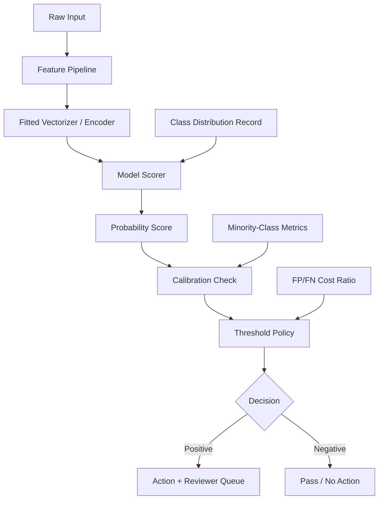

# Classic ML Workflows: Trees, Metrics, Calibration, and Imbalance

## Mechanisms

### Decision Tree Construction and Overfitting Risk

Decision trees split training data recursively. At each node the algorithm selects a column and split value that most reduces impurity (Gini for classifiers, sum-of-squared-error for regressors). The CART algorithm builds binary trees; Scikit's `DecisionTreeRegressor` and `DecisionTreeClassifier` implement it with tunable constraints (`max_depth`, `min_samples_split`, `min_samples_leaf`).

The core production risk is **uncontrolled memorization**. A tree allowed to grow without depth limits will fit training artifacts—each leaf potentially representing a single training point. The jagged prediction surface is a visual warning. Without explicit depth or leaf constraints, a tree model should not ship as a production scorer.

### Random Forests as Variance Reduction

Random forests reduce overfitting by averaging many independently trained trees over randomly sampled rows and columns. Key properties:

- Each tree trains on a different subset, preventing any single tree from fitting too tightly.
- Predictions average across all trees, stabilizing the output surface.
- Training is naturally parallelizable.
- Parameters include `n_estimators` (tree count, default 100), `max_depth`, and `max_samples` (fraction of rows per tree).

The tradeoff: more trees improve stability but increase inference cost and model size. For a tabular scoring route, the datastore should record tree count, depth policy, row/column subsampling fraction, and cross-validated accuracy alongside the model artifact.

### Gradient-Boosted Decision Trees as Additive Residual Modeling

GBDTs build dependent weak learners sequentially. Each tree fits the residuals (prediction error) from the accumulated ensemble so far. Key mechanics:

- Trees are typically **stumps** (depth 1) — deliberately weak learners.
- Each tree's output is scaled by a **learning rate** (typically 0.1), preventing any single tree from dominating.
- The ensemble is **additive**: final prediction = baseline + Σ(learning_rate × tree_prediction).
- `subsample` parameter (analogous to `max_samples` in forests) mitigates overfitting by restricting each tree's view.

GBDTs can be more accurate than random forests on tabular data but are **more susceptible to overfitting** and require more tuning discipline. A production GBDT route needs: learning rate, tree count, depth, subsample ratio, cross-validated scores, and evidence that a simpler model (e.g., random forest or linear baseline) was not sufficient.

### Cross-Validation as Variance-Bound Accuracy Estimation

A single train/test split produces an accuracy estimate sensitive to random seed choice—especially with small datasets. **K-fold cross-validation** (typically 5-fold) trains K copies of the model, each holding out a different fold for testing, then averages the scores. The cross-validated score is more reliable and uses all data for both training (across folds) and evaluation. Rule of thumb: reserve cross-validation for small datasets; use simple splits for large ones.

### Classification Metrics Beyond Accuracy

Accuracy alone hides class-specific failures. The key metrics and their production implications:

| Metric | Formula Intuition | When It Matters |
|---|---|---|
| **Precision** | TP / (TP + FP) | False positives are costly (spam filter, publish gate) |
| **Recall / Sensitivity** | TP / (TP + FN) | False negatives are costly (fraud, safety, medical) |
| **Specificity** | TN / (TN + FP) | Negative-class accuracy matters (virus test clearance) |
| **F1** | Harmonic mean of precision and recall | Balanced view of both error types |
| **ROC AUC** | Area under TPR-vs-FPR curve | Threshold-independent ranking quality |
| **Confusion matrix** | Full error breakdown by class | Always inspect before shipping a classifier |

The right metric is a **business decision**, not a library default. A route that blocks user content should optimize precision to avoid over-blocking; a fraud detector should optimize recall to avoid missing fraud.

### Probability Scores Are Not Business Decisions

Logistic regression and other classifiers emit class probabilities via `predict_proba`. These are **score surfaces** that need:

1. **Calibration** — a 0.8 probability should mean 80% of such predictions are correct. Without calibration evidence, a probability score is not a calibrated confidence. (The ISLP chapter-4 note covers calibration in more depth.)
2. **Threshold policy** — the default 0.5 threshold may be wrong for the business cost structure. The product must decide the threshold based on FP/FN cost asymmetry, not the library default.

### Imbalanced Data and the Fraud Workflow

The credit-card-fraud example (284,807 transactions, only 492 fraudulent) demonstrates the core pattern: **high aggregate accuracy can be meaningless when the rare class is what matters**. A model that always predicts "legitimate" would be 99.8% accurate but completely useless for fraud detection.

Production responses to imbalance:

- **Stratified splits** ensure both train and test preserve class ratios.
- **Class-weight parameters** penalize errors on the minority class more heavily.
- **Threshold tuning** moves the decision boundary toward or away from the minority class based on the business cost ratio.
- **Confusion matrix inspection** before any promotion — always check the minority-class row/column.
- **Precision-recall curves** (not just ROC) because ROC can be misleadingly optimistic with extreme imbalance.

For Agent Studio, any fraud-style or abuse-detection route must include: class distribution record, stratification policy, class-weight or resampling evidence, threshold rationale tied to reviewer-capacity assumptions, and minority-class metrics as first-class release evidence.

## Tradeoffs

| Choice | Benefit | Risk |
|---|---|---|
| Decision tree (unconstrained) | Interpretable splits, no normalization needed | Memorizes training data |
| Random forest | Stable, parallelizable, strong default | Larger inference cost, less interpretable |
| GBDT | Often highest tabular accuracy | Overfits without tuning; sequential training |
| High precision threshold | Few false positives | More false negatives (missed events) |
| High recall threshold | Few false negatives | More false positives (reviewer burden) |
| Class weighting | Forces model to attend to minority | May overfit minority if not validated |
| Cross-validation | Reliable accuracy estimate | K-times training cost |

## Failure Modes

1. **Accuracy mirage**: A model reports 99% accuracy on an imbalanced dataset because it learned the majority class.
2. **Uncalibrated probability treated as confidence**: A 0.9 score from an uncalibrated logistic regression does not mean 90% confidence.
3. **Threshold copying**: A 0.5 threshold tuned for spam detection is applied to a fraud detector with different cost structure.
4. **Stratification skipped**: Train/test splits have different class ratios, producing unreliable accuracy estimates.
5. **GBDT overfitting**: A boosted ensemble with too many trees, too high a learning rate, or too few regularization constraints fits training artifacts.
6. **Feature pipeline drift**: A vectorizer or encoder is refit silently, invalidating prior evals without a route-change record.

## Release-Gate Implications

For a classic-ML scoring route to pass the `applied_ml_route_release_gate`:

- Model algorithm family, depth/leaf/subsample constraints, and overfit controls are documented.
- Feature pipeline (vectorizer, normalizer, encoder, schema) is versioned with the model artifact.
- Confusion matrix, class-specific metrics, and calibration evidence are tied to the business decision.
- Threshold policy documents the FP/FN cost ratio and reviewer-capacity assumption.
- For imbalanced routes: class distribution, stratification policy, class-weight or resampling method, and minority-class metrics are first-class release evidence.
- Cross-validated or held-out accuracy supports the single-split score.
- A simpler baseline (linear model or threshold rule) was tested and the reason it was insufficient is recorded.

## Mermaid: Classic ML Scoring Route Flow

## Agent Studio Design Rules (Chapter-Level Additions)

1. Store tree-model depth/leaf constraints and feature subsampling policy alongside the model artifact.
2. For GBDT routes, record learning rate, tree count, subsample ratio, and evidence that a simpler baseline was insufficient.
3. Never accept aggregate accuracy as the sole promotion metric for a classification route — require confusion-matrix and class-specific evidence.
4. Separate probability scores from business decision policy explicitly in the datastore.
5. Require calibration evidence before using model probabilities as confidence in automated actions.
6. For imbalanced routes (fraud, abuse, safety), make minority-class recall/precision a mandatory release gate.
