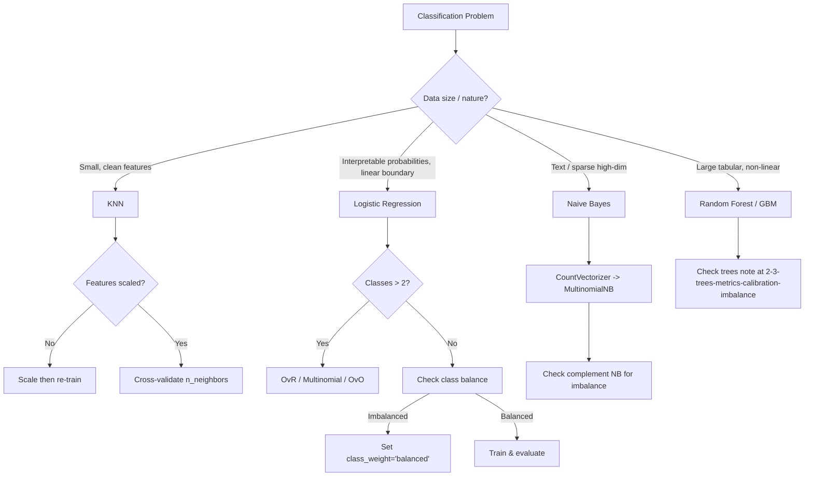

# Ch3: Classification Models — KNN, Logistic Regression, Naive Bayes

## K-Nearest Neighbors (KNN)

KNN is a **non-parametric, instance-based** learner. It memorizes the training set and classifies new points by majority vote among their `k` closest neighbors.

### Mechanics

- No explicit training phase — predictions happen at query time (lazy learner).
- Distance metric defines "closeness": Minkowski distance (parameter `p` where p=2 is Euclidean, p=1 is Manhattan).
- Decision boundary is piecewise-linear, defined by the Voronoi tessellation of the training points.

### Key Hyperparameters

- `n_neighbors` (k): Small → low bias, high variance. Large → high bias, smooth boundary. Default=5. Cross-validate; odd k avoids tie votes.
- `weights`: `'uniform'` (equal vote) vs `'distance'` (weighted by proximity). Distance weighting helps dense regions, hurts sparse ones.
- `p`: Minkowski exponent. p=2 (Euclidean, default), p=1 (Manhattan). Manhattan better for high-dim sparse data; Euclidean for continuous dense features.
- `metric`: Override distance function (cosine, etc.). Cosine useful for text embeddings.

### When KNN Works / Fails

- Works: small-to-medium datasets with clean feature scales, low feature count, well-separated classes.
- Fails: high dimensions (curse of dimensionality — distances become meaningless), large inference sets (O(n) per query), categorical/unscaled features.
- **Always scale features** (StandardScaler) before KNN. Unscaled features with large ranges dominate the distance calculation.

### Scikit API

```python
from sklearn.neighbors import KNeighborsClassifier
model = KNeighborsClassifier(n_neighbors=5, weights='distance', p=2)
model.fit(X_train, y_train)
model.predict(X_test)
```

## Logistic Regression

Despite the name, logistic regression is a **classification** algorithm. It fits a logistic (sigmoid) function to data to estimate class probabilities.

### Sigmoid Function

The sigmoid maps any real-valued input to a probability in [0, 1]:

```
P(class=1 | x) = 1 / (1 + e^-(mx + b))
```

Where `m` and `b` are parameters learned during training. The exponent `mx + b` is a linear regression equation — hence the "regression" in the name. Scikit uses **L-BFGS** (Limited-memory Broyden-Fletcher-Goldfarb-Shanno) as the default optimizer.

### Decision Boundary

- The **default boundary** is P = 0.5: predict class 1 if probability >= 0.5, else class 0.
- This boundary is **linear** in feature space. Logistic regression cannot learn non-linear separations without feature engineering (polynomial features, interactions).
- The boundary is tunable — lowering it increases recall (more positives caught) at the cost of precision; raising it does the opposite.

### Key Scikit API

```python
from sklearn.linear_model import LogisticRegression

model = LogisticRegression(max_iter=5000, random_state=0)
model.fit(X_train, y_train)

model.predict(X_test)        # Hard class predictions
model.predict_proba(X_test)  # Probabilities for each class
```

- `max_iter`: Iterations allowed for optimizer convergence. Default=100 is often too low for real data (e.g., credit card fraud needed 5000).
- `LogisticRegressionCV(cv=5)`: Built-in cross-validation variant.

### Multiclass Strategies (OvR / OvO / Multinomial)

Logistic regression is natively binary. Scikit extends it transparently via `multi_class` parameter (default=`'auto'`):

| Strategy | How It Works | When Used |
|----------|-------------|-----------|
| **One-vs-Rest (OvR)** | Train N binary classifiers, each separating one class from all others. Pick the class with highest probability. | Default for logistic regression with >2 classes. N models, each sees all data. |
| **One-vs-One (OvO)** | Train N*(N-1)/2 classifiers, each for one pair of classes. Majority vote decides. | Used by SVC internally. More models, but each trains on only 2 classes worth of data. |
| **Multinomial (Softmax)** | Replaces sigmoid with a softmax function outputting probabilities over all classes simultaneously. Single model. | More principled for mutually exclusive classes. Equivalent to multinomial logistic regression. |

**Production note**: For N classes, OvR trains N models which can be expensive. Random Forest and GBM classifiers handle multiclass natively — no decomposition needed. When building a multiclass route, check the decomposition strategy and log memory/inference cost.

## Naive Bayes for Text

Naive Bayes is not covered in the book chapter text, but it is the natural next step after logistic regression for text classification (bridge to Ch4). The key insight:

- **Multinomial Naive Bayes** with bag-of-words features is the simplest effective classifier for text: fast, low memory, reasonable accuracy on many document-categorization tasks.
- Assumes independence between features (naive) — violated in practice but still effective.
- `ComplementNB` variant handles imbalanced text data better.

```python
from sklearn.naive_bayes import MultinomialNB
from sklearn.feature_extraction.text import CountVectorizer
from sklearn.pipeline import make_pipeline

pipe = make_pipeline(CountVectorizer(max_features=10000), MultinomialNB())
pipe.fit(texts, labels)
```

## Classification Metrics (Expanded for Ch3)

Cross-referenced with [[./2-3-trees-metrics-calibration-imbalance]] covering precision/recall/F1/ROC-AUC. Ch3 adds:

- **Sensitivity** = Recall = TP/(TP+FN). No separate Scikit function; use `recall_score`.
- **Specificity** = TN/(TN+FP) — recall for the negative class. Use `recall_score(y_test, y_pred, pos_label=0)`.
- **Confusion matrix**: Always inspect before shipping. Scikit 1.0+: `ConfusionMatrixDisplay` (deprecated `plot_confusion_matrix` slated for removal).
- **Accuracy trap**: (TP+TN)/(TP+TN+FP+FN) is useless when classes are imbalanced (fraud dataset: 99.8% accuracy by guessing "legitimate" always).

### Business Metric Selection

| Cost Type | Optimize | Example |
|-----------|----------|---------|
| FP expensive | Precision | Spam filter, publish gate, content moderation |
| FN expensive | Recall | Fraud detection, medical diagnosis, safety |
| Negative-class accuracy matters | Specificity | COVID test clearance, legitimate txn acceptance |
| Balanced view | F1 | Single-number cross-model comparison |

## Handling Imbalanced Data

- **Stratified splits**: `train_test_split(..., stratify=y)` ensures train/test class ratios match the full dataset.
- **Class weight**: `LogisticRegression(class_weight='balanced')` auto-adjusts weights inversely proportional to class frequencies. Penalizes errors on minority class more heavily.
- **Resampling options** (not in chapter but standard practice): oversample minority (SMOTE), undersample majority, or both.
- **Evaluation**: always inspect the confusion matrix. Do not rely on accuracy alone.

## Mermaid: Model Selection Flow



## Agent Studio Implications

1. **Route type mapping**: Even in an agent-driven system, classification routes for bounded decisions (spam, fraud, content flagging, routing of intents) are better served by a classic ML classifier than an LLM call — faster, cheaper, more predictable, and with explicit threshold control.

2. **Probability surfaces, not hard gates**: Always expose `predict_proba` output, not just the hard prediction. Agent Studio routes should record calibrated probabilities so downstream policy logic can apply business-specific thresholds.

3. **Class imbalance as a first-class concern**: Any route dealing with rare events (fraud, safety violations, edge cases) must report: class distribution, stratification method, class-weight policy, threshold rationale, and minority-class metrics (precision/recall/F1 for the minority class specifically).

4. **Model selection heuristic**: Start with Logistic Regression for any binary classification route with interpretable, roughly-linear separable features. Only escalate to ensemble models (RF/GBM) if LR underperforms after feature engineering. For text classification, start with MultinomialNB or LR with bag-of-words.

5. **Categorical encoding impacts route design**: One-hot encoding (preferred for accuracy) expands feature dimension; label encoding (preferred for memory) risks implying ordinal relationships. The choice should be logged as part of the route's preprocessing contract.

6. **Multiclass decomposition cost**: OvR and OvO multiply inference cost by the number of classes. For routes with many classes (e.g., intent classification with 20+ intents), prefer natively multiclass algorithms (RF, GBM) or a simple LR with softmax (multinomial).

7. **Lazy vs eager learners**: KNN (lazy) stores all training data and has O(n) inference cost — unsuitable for high-throughput routes. Logistic Regression (eager) has O(1) inference after training — ideal for production scoring APIs.