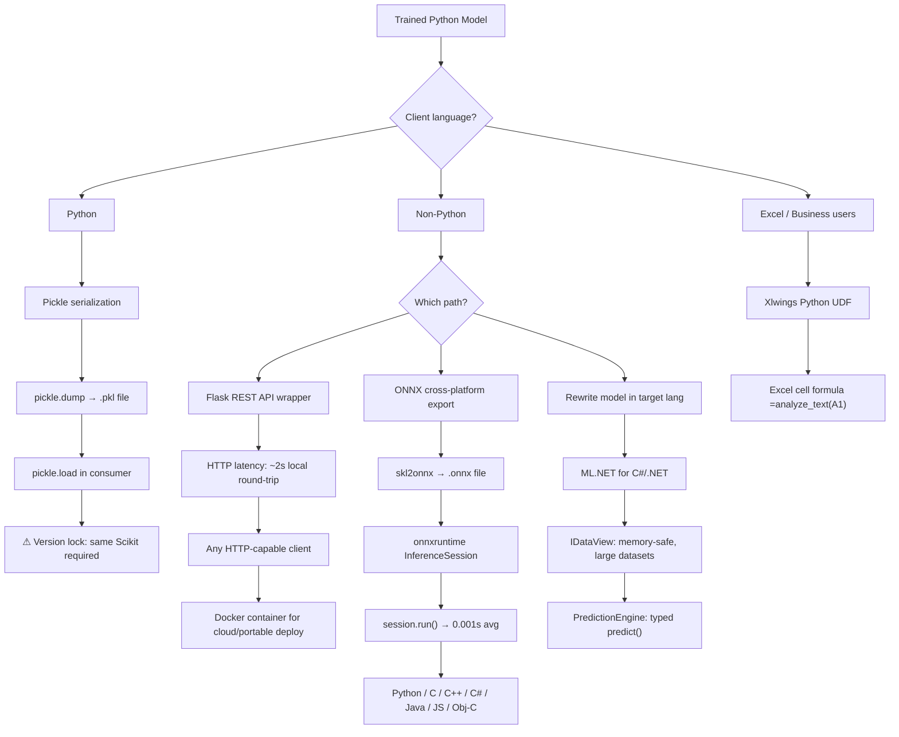
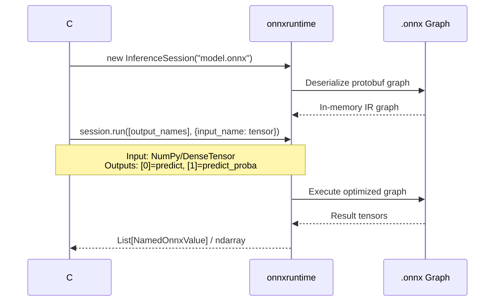

# Chapter 7: Operationalizing Machine Learning Models

## Core Problem and Scope

Python-trained ML models cannot be invoked directly from non-Python runtimes (C#, Java, C++). The Python runtime, dependency graph, and object serialization model are all incompatible. Chapter 7 surveys six operationalization strategies ranging from simplest (in-process pickle) to most portable (ONNX cross-language bridge) to most exotic (Xlwings Excel UDF). Each trades off latency, portability, client-side dependencies, and deployment complexity.

## Deployment Strategy Decision Tree

## Strategy 1: Pickle Serialization (Python → Python)

- **Mechanism**: `pickle.dump(model, open('titanic.pkl', 'wb'))` serializes the trained estimator including all learned parameters. Consumer calls `pickle.load(...)` to rehydrate. Works seamlessly with Scikit pipelines (`make_pipeline` bundles transformers like `CountVectorizer` with estimators like `LogisticRegression` into one picklable unit — Example 7-1 in source).
- **Vocabulary bloat trap**: `CountVectorizer` stores the complete token vocabulary inside the `.pkl` file. A sentiment model with `min_df=20` produces a 50 MB file; removing `min_df` swells it to ~90 MB. Solution: replace with `HashingVectorizer`, which uses word-hash indexing instead of a stored vocabulary — reduces to ~8 MB (no `min_df` support, so apples-to-oranges comparison but the magnitude difference is decisive).
- **Version lock trap**: Pickled models cannot cross Scikit major/minor versions. Unpickling with a mismatched version produces warnings or outright failure. This demands disciplined MLOps: a centralized model registry that pins Scikit version per artifact, re-serializes when upgrading the framework, and gates deployment on version match. The author explicitly defers comprehensive MLOps coverage to *Practical MLOps* (Gift & Deza, O'Reilly).
- **Standalone client pattern**: A minimal `sentiment.py` script loads the `.pkl`, reads `sys.argv[1]` or `input()`, calls `predict_proba`, and prints the score — usable from any shell or CI/CD pipeline.

## Strategy 2: Flask REST API (Python → Any Language)

- **Architecture**: Wrap the deserialized model behind Flask route `@app.route('/analyze', methods=['GET'])`. The route handler reads `request.args.get('text')`, calls `pipe.predict_proba([text])[0][1]`, returns `str(score)`. Startup deserializes the model once; the session object persists for the lifetime of the Flask process.
- **Client flexibility**: Any language with an HTTP library can consume it. The book demonstrates a complete C# console app using `HttpClient.GetAsync()` — no Python knowledge needed on the consumer side. Complex I/O uses JSON POST bodies (referenced tutorial: "Python Post JSON Using Requests Library").
- **Latency cost — the critical number**: Local round-trip ~2 seconds. The same model invoked via ONNX runtime averages 0.001 seconds — a 2,000x+ differential. The overhead comes from HTTP framing, not model inference. Remote hosting adds further network latency; cloud-deployed instances add DNS resolution, TLS handshake, and WAN transit time.

## Strategy 3: Docker Containerization

- **Why containers matter**: Eliminates the requirement that the hosting machine have Python + all packages installed. A `Dockerfile` (`FROM python:3.8`, `RUN pip install flask numpy scipy scikit-learn`, `COPY app.py sentiment.pkl`, `WORKDIR /app`, `EXPOSE 5000`, `ENTRYPOINT ["python"]`, `CMD ["app.py"]`) bakes everything into an immutable image.
- **Build and deploy**: `docker build -t sentiment-server .` produces the image. Push to a container registry (Azure Container Registry, AWS ECR). Launch container instances in the cloud — consumers hit URLs like `http://wintellect.northcentralus.azurecontainer.io:5000/analyze?text=...`. No host-side Python installation needed. The book notes Docker is being supplanted by Kubernetes for orchestration at scale.
- **Local benefit too**: Even on the same machine, containers isolate dependencies. No conflict with other Python projects; no need to manage virtualenvs. Just the Docker runtime and the image.

## Strategy 4: ONNX Cross-Platform Export

- **Export pipeline**: Install `skl2onnx` (Python package). Call `convert_sklearn(pipe, initial_types=initial_type)` where `initial_type` declares the input schema — `StringTensorType([None, 1])` for text, `FloatTensorType([None, 3])` for a 3-column numeric vector. Serialize with `onnx.SerializeToString()`. Output is a `.onnx` file containing the full computation graph.
- **Runtime contract — the core API surface**:

- **`session.run` contract details**: Takes two arguments — (1) list of output names to retrieve, (2) dict mapping input names (e.g. `"string_input"`) to tensors. Returns a list; index 0 = raw prediction (class label), index 1 = probability scores. In Python: `session.run([label_name], {input_name: np.array(text).reshape(1, -1)})[0][0][1]`. In C#: `session.Run(new List<NamedOnnxValue>{...}).ToList().Last().AsEnumerable<NamedOnnxValue>().First().AsDictionary<long, float>()[1]`.
- **Cross-platform reach**: ONNX runtimes exist for Python, C, C++, C#, Java, JavaScript, and Objective-C, on Windows, Linux, macOS, Android, and iOS. The same `.onnx` file works everywhere — no re-export per target.
- **Performance**: 0.001 seconds per inference vs. Flask's ~2 seconds. This is the book's headline number: ONNX eliminates the web-service middleman and runs the model in-process in the target runtime.

## Strategy 5: ML.NET (C#-Native Models)

- **Philosophy**: Rather than bridging from Python, write ML models directly in C#. ML.NET is Microsoft's open-source, cross-platform framework for .NET — equivalent to Scikit-Learn in scope, with additional industrial-strength capabilities.
- **IDataView — the memory breakthrough**: Not a DataFrame (which must fit in RAM). IDataView uses a SQL-like cursor internally, wrapping datasets of virtually unlimited size. This allowed ML.NET to train a sentiment model on the full 9 GB Amazon review dataset to 95% accuracy — Scikit and H2O both failed due to memory constraints. When all three were restricted to 10% of the data, ML.NET trained 6x faster than Scikit and ~10x faster than H2O.
- **Pipeline API**: `context.Transforms.Text.FeaturizeText(outputColumnName: "Features", inputColumnName: "Text").Append(context.BinaryClassification.Trainers.SdcaLogisticRegression())` — deliberately mirrors Scikit's `make_pipeline`. `Fit()` trains, `Transform()` evaluates, `Evaluate()` computes metrics (AUC, accuracy).
- **PredictionEngine**: Separate object for predictions — `context.Model.CreatePredictionEngine<Input, Output>(model)`. Strongly typed: `Input` and `Output` are plain C# classes with `[LoadColumn(n)]` and `[ColumnName("PredictedLabel")]` attributes mapping CSV columns to fields. Returns an `Output` with typed `Prediction` (bool) and `Probability` (float) properties. Multiple PredictionEngines can be created for concurrent high-throughput scenarios.
- **Persistence**: `context.Model.Save(model, data.Schema, "model.zip")` / `context.Model.Load("model.zip", out DataViewSchema schema)`. Zip-based, not pickle-based — no Scikit version lock.
- **Additional capabilities**: Transfer learning for repurposing existing neural networks (Chapter 10). Built-in ONNX support for loading deep-learning models. Python bindings via NimbusML.

## Strategy 6: Xlwings Excel UDF

- **Mechanism**: Install `xlwings` (`pip install xlwings`, then `xlwings addin install`). Run `xlwings quickstart sentiment` to scaffold a project with a `.xlsm` workbook and a `sentiment.py` file. Write a function decorated with `@xw.func` — e.g., `analyze_text(text)` that loads the `.pkl` model and returns `predict_proba(...)[0][1]`. Import the function via the xlwings ribbon tab in Excel.
- **Usage in Excel**: `=analyze_text(A1)` in a cell. Returns a float between 0.0 and 1.0. Works with any Python ML model — the `.pkl` is loaded once at module import time, not per cell evaluation.
- **Requirements**: Windows Excel, VBA trust setting enabled (File → Options → Trust Center → "Trust access to the VBA project object model"), Python + Xlwings installed, the `.xlsm` file co-located with `sentiment.py` and `sentiment.pkl`.
- **Relevance**: Democratizes ML for business analysts who work entirely in Excel. No code, no CLI, no Docker — just a cell formula.

## Comparison Table

| Strategy | Latency | Portability | Client Requirements | Best For |
|---|---|---|---|---|
| Pickle | Negligible (in-process) | Python-only | Python runtime + same Scikit version | Python-internal pipelines, scripting |
| Flask REST API | ~2s local round-trip | Universal (HTTP) | HTTP client library only | Polyglot teams, quick prototypes |
| Docker + Flask | ~2s + network latency | Universal + cloud-deployable | HTTP client only | Production cloud deployments |
| ONNX (skl2onnx + onnxruntime) | ~0.001s (in-process) | 8+ languages, all major OSes | Language-specific ORT package | High-performance cross-platform |
| ML.NET (C# native) | Native .NET speed | .NET ecosystem | .NET runtime + NuGet packages | .NET shops, large datasets |
| Xlwings Excel UDF | ~1-2s (IPC overhead) | Excel for Windows | Excel + Python + Xlwings add-in | Business analysts, spreadsheet workflows |

## Agent Studio Implications

- **Release-gate relevance**: Flask and Docker define the "model-serving route" — release gates should enforce: (1) latency budgets under 500ms p99 for production endpoints, (2) dependency freezing via `requirements.txt` at the patch level, (3) image tag immutability (no `:latest`). Pickle version lock is a silent release-breaker if training and inference environments diverge on Scikit version — gate should verify `sklearn.__version__` match between training artifact metadata and inference runtime.

- **ONNX as cross-language bridge for multi-agent systems**: In architectures where micro-agents run in different runtimes (Python orchestrator, C# backend, Java stream processor), ONNX provides a single serialization format consumable by all agents without a shared HTTP hop. The `session.run` contract acts as the ABI equivalent of a well-typed gRPC call: declare input tensors, get output tensors, zero HTTP overhead. This is critical for agent loops requiring sub-100ms inference turns.

- **Latency budget considerations**: Flask-style wrapping adds ~2s per call — unacceptable for real-time agent loops. ONNX or direct ML.NET calls are the only viable paths for latency-sensitive serving (<100ms). Docker adds container start latency but negligible per-request overhead once the container is running. Xlwings should be restricted to offline/batch spreadsheet analysis — never in a latency-critical agent loop.

- **Excel as agent endpoint**: The Xlwings pattern demonstrates that ML serving can target non-traditional clients. In Agent Studio, an "Excel Agent" that reads/writes spreadsheets and calls ML UDFs could operationalize model inference for business users without any infrastructure changes — just a cell formula.