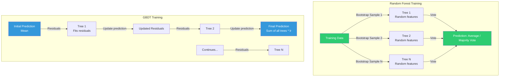

# Chapter 2: Ensemble Methods

## CART Algorithm

Classification and Regression Trees (CART) use **recursive binary splitting**:

1. At each node, find the feature + threshold that best splits the data
2. For **classification**: minimize Gini impurity = 1 - sum(p_k^2)
3. For **regression**: minimize MSE = sum(y_i - y_hat)^2
4. Recurse on the child nodes until a stopping criterion is met (depth limit, min samples per leaf, etc.)

CART produces binary trees — each internal node has exactly two children. This makes them efficient and interpretable.

## Random Forests

Random Forests combine **bagging** with random feature selection:

- **Bagging (Bootstrap Aggregating):** Each tree trains on a bootstrap sample of the data (sampled with replacement)
- **Random feature subsets:** At each split, only a random subset of features is considered (typically sqrt(p) for classification, p/3 for regression)
- **n_estimators=100** is the default in scikit-learn — in practice, more trees never hurt (diminishing returns)

Each tree is grown independently. Predictions are averaged (regression) or majority-voted (classification).

### Key properties of RF:
- Naturally resistant to overfitting (bagging reduces variance)
- No cross-validation needed for hyperparameters (OOB error is unbiased estimate)
- Feature importance directly extractable (mean decrease in impurity)
- **Nonparametric** — no data normalization needed

## GBDT: Gradient Boosted Decision Trees

GBDT uses **sequential additive training**:

1. Start with a constant prediction (mean for regression)
2. At each iteration, compute the **residual errors** (negative gradient of the loss function)
3. Fit a shallow tree (typically depth-1 **stumps**) to predict the residuals
4. Add the tree's output to the ensemble, scaled by the **learning rate**
5. Repeat for N estimators

### Key hyperparameters:
- **Learning rate (default 0.1):** Scales each tree's contribution — lower values need more trees but generalize better
- **subsample (< 1.0):** Stochastic GBDT — trains each tree on a random subset of rows, reduces overfitting
- **max_depth:** Typically depth-1 to depth-3; deeper trees risk overfitting

### GBDT is prone to overfitting (boosting):
- Each tree compensates for the mistakes of the previous one
- Without regularization (depth limits, subsample, early stopping), GBDT will eventually overfit

## RF vs GBDT: Key Tradeoffs

| Property | Random Forest | GBDT |
|----------|--------------|------|
| Training | Parallel (independent trees) | Sequential (additive) |
| Overfitting | Naturally resistant (bagging) | Prone (boosting) |
| Tree depth | Full trees (often deep) | Shallow stumps (depth 1-3) |
| Speed | Fast to train (parallel) | Slower (sequential) |
| Performance | Good "out of box" | Best with tuning |
| Data size | Handles large datasets well | Better on smaller data |

## GBMs + SVMs: "Cutting Edge of Statistical ML"

The book positions GBMs (Gradient Boosted Machines) and SVMs as the two "cutting edge" methods of classical statistical ML:

- **SVMs:** Best for small-to-medium datasets with clear margin structure, especially with RBF kernels
- **GBMs:** Best for structured/tabular data, feature-rich problems with complex interactions

Both remain competitive with deep learning on non-perceptual tasks.

## Nonparametric vs Parametric

- **Tree-based methods (RF, GBDT) are nonparametric:** No assumptions about data distribution — no normalization needed. Great for mixed datatypes (numeric + categorical).
- **SVMs are parametric:** Distance-based — normalization is critical. StandardScaler required.

This is a fundamental distinction: trees are scale-invariant, SVMs are not.

