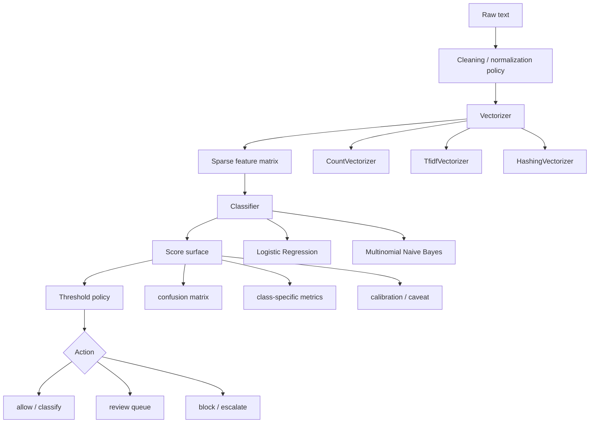

# Chapter 4 - Classical Text Classification Route Contracts

## Reading Scope

This is a direct-read synthesis of the highest-value production slice inside Chapter 4 of the local *Applied Machine Learning and AI for Engineers* PDF: how a bounded text-classification route turns raw strings into a scored product decision.

The chapter uses sentiment analysis and spam filtering as the concrete examples. The lasting value for the vault is not the classroom datasets themselves, but the route contract they expose:

- text preprocessing is part of the model, not an informal pre-step;
- vocabulary construction changes memory, latency, interpretability, and drift behavior;
- probabilities are score surfaces that still need thresholds and calibration discipline;
- the fitted vectorizer must travel with the classifier artifact;
- simple sparse-text baselines are often the right first production move before reaching for a larger neural or LLM stack.

This note stores original synthesis only. It does not store copied book text, notebook dumps, or long excerpts.

## Why This Slice Matters

Agent Studio already has strong canon for transformer NLP, retrieval, and agent routes. What this chapter adds is the **bounded classical text lane** that often sits in front of those heavier systems:

- spam or abuse prefilters;
- source-quality or source-type classifiers;
- moderation assist queues;
- sentiment or complaint triage;
- intent/routing surfaces for simple support flows;
- lexical fallback models when data is limited, privacy is tight, or latency budgets are strict.

The architecture lesson is that many text decisions do not need a generative model. A sparse lexical pipeline plus a linear or Naive Bayes classifier can be cheaper, easier to audit, and easier to threshold.

## Current-Source Cross-Check Delta

The local chapter's mechanics align cleanly with current official scikit-learn guidance:

- the official feature-extraction docs still treat bag-of-words and TF-IDF as first-class sparse text representations;
- official `CountVectorizer` and `TfidfVectorizer` APIs confirm that `min_df`, `max_df`, `max_features`, and `ngram_range` are core route-shaping parameters, not minor tuning knobs;
- the official `Pipeline` docs reinforce that vectorization and classification should be fit and evaluated as one reproducible estimator graph;
- the official model-persistence docs make the operational risk explicit: persisted sklearn artifacts are environment-sensitive, so route evidence must include package/runtime versioning alongside the fitted pipeline.

The important vault implication is that **text feature extraction is a governed artifact surface**. A classifier without its fitted vectorizer, preprocessing contract, and environment record is not reproducible release evidence.

## Classical Text Route Map

## Mechanisms

### Text Must Become a Stable Numeric Representation

The chapter's core mechanism is straightforward: machine-learning estimators need numbers, so text must be converted into a vector space before classification. In classical NLP this usually means a sparse document-term matrix whose columns correspond to tokens or token sequences.

That transformation is not a neutral utility step. It defines what the model can see:

- lowercasing changes vocabulary identity;
- punctuation handling changes token boundaries;
- stop-word policy changes whether function words survive;
- `min_df` and `max_df` decide which terms are even eligible as features;
- `ngram_range` decides whether local phrase order exists at all.

A route review should therefore treat preprocessing and vectorization as part of the learned system, not as disposable glue code.

### Sparse Linear Text Models Work Because High-Dimensional Lexical Signals Are Often Enough

For bounded tasks such as spam, sentiment, or topical routing, exact token presence and short phrases often carry enough signal that a sparse linear separator works well. The route does not need deep semantic understanding if the classification boundary is driven by lexical evidence, phrase co-occurrence, or domain-specific trigger terms.

This is why Chapter 4 remains useful even in an LLM-heavy vault: it reminds us that some text routes are better framed as **controlled scoring problems** than as open-ended language reasoning.

## Vectorizer Families And Their Route Consequences

### CountVectorizer

`CountVectorizer` produces raw token-count features. It is the clearest default when interpretability matters, because the learned coefficients can still be tied back to explicit vocabulary terms.

Production strengths:

- easiest feature semantics to inspect;
- natural fit for Logistic Regression and Multinomial Naive Bayes;
- compatible with unigram or n-gram expansions.

Production costs:

- fitted vocabulary can become large;
- artifact size grows with corpus breadth;
- unseen future terms are silently ignored rather than represented.

### TfidfVectorizer

TF-IDF changes the same lexical pipeline by downweighting globally common terms and emphasizing terms that are locally important within a document. This is useful when raw counts overvalue repeated common words.

Production implication: TF-IDF is not just "better counts." It changes score geometry, coefficient meaning, and sometimes threshold behavior. If a route moves from counts to TF-IDF, that is a real release change.

### HashingVectorizer

The chapter introduces hashing as a practical scaling tradeoff: instead of storing a learned vocabulary, the route hashes tokens into a fixed feature space.

Production benefit:

- smaller serialized artifacts;
- fixed-dimensional output even as vocabulary grows;
- attractive when deploy footprint matters.

Production cost:

- collisions reduce interpretability and can entangle terms;
- reverse-mapping from features to vocabulary is no longer straightforward;
- audits become harder because the feature space is less human-readable.

## N-Grams, Frequency Cutoffs, And Stop-Word Policy

### N-Grams Preserve a Small Amount of Local Word Order

Unigrams lose phrase structure. Bigrams and trigrams partially recover it and are often the difference between a route that misses negation and one that does not. "good" and "not good" should not behave as the same evidence.

The tradeoff is resource shape:

- richer phrase features improve fidelity for short-text tasks;
- vocabulary size grows quickly;
- memory, fit time, and serialized artifact size all increase.

### `min_df` and `max_df` Are Both Statistical and Operational Knobs

`min_df` removes extremely rare tokens that are likely to be typos, IDs, or non-generalizable artifacts. `max_df` removes terms so common that they add little discrimination. These settings affect both generalization quality and deployability.

A low `min_df` can quietly turn noise into brittle rules. A high `min_df` can delete rare but important minority-class evidence. That means frequency cutoffs belong in the route contract and in error analysis, especially for safety, abuse, or niche-domain classifiers.

### Stop Words Should Be a Tested Policy, Not a Ritual

The local chapter is practical on this point, and current official sklearn guidance reinforces the caution: built-in stop-word lists have known limitations. Stop-word removal can help, hurt, or do almost nothing depending on the task.

Operational rule:

- use stop-word removal only when evaluation shows it helps;
- do not assume that common words are always noise;
- be especially careful for tasks where negation, style, authorship, or short prompts matter.

## Classifier Families In This Chapter

### Logistic Regression As the Default Sparse-Text Baseline

The sentiment-analysis path in the chapter uses the standard classical pattern:

**raw text -> vectorizer -> logistic regression -> probability score**

Why this remains strong:

- Logistic Regression handles sparse input well;
- it is fast to train and score;
- coefficients stay inspectable enough for debugging;
- `predict_proba` gives a score surface that downstream policy can threshold.

But a probability output is not automatically trustworthy confidence. If downstream automation depends on the score, the route still needs calibration evidence or an explicit statement that the score is only an ordering signal.

### Multinomial Naive Bayes As a Cheap, Strong Lexical Baseline

The spam-filtering portion adds the chapter's second major lesson: bag-of-words text often works surprisingly well with Multinomial Naive Bayes.

The mechanism is simple:

- estimate token likelihoods per class from counts;
- combine them under a conditional-independence assumption;
- use smoothing so unseen class-token pairs do not collapse the score to zero.

The independence assumption is obviously unrealistic, but the route can still work well because many text decisions depend more on token evidence coverage than on perfect linguistic structure.

Why it matters for Agent Studio:

- it is a cheap baseline that should often be tested before a heavier model;
- it is useful for low-latency, low-footprint classifiers;
- it gives a practical comparison point when a more complex route claims to add value.

## Evaluation Semantics

### Confusion Matrix Before Comfort Metrics

The chapter's classroom examples can look impressively accurate, but the lasting lesson is diagnostic: always inspect the confusion matrix before trusting aggregate metrics.

For text routes, the mistake type matters more than the average:

- false positives can over-block legitimate content or over-route reviewer work;
- false negatives can miss abuse, spam, or urgent complaints;
- balanced aggregate accuracy can still hide the costlier error class.

### ROC/AUC Helps With Ranking, Not Final Policy

The chapter uses ROC/AUC in a helpful way: as evidence that a classifier can rank positive cases above negative cases across thresholds. That is useful, but it does not pick the operating threshold for production.

A release decision still needs:

- the intended action mapping;
- the tolerated false-positive and false-negative costs;
- reviewer-capacity assumptions if a review queue exists;
- threshold selection tied to those business costs.

### `predict_proba` Is a Score Surface

The book's sentiment example naturally invites people to treat `predict_proba` as confidence. The vault should be stricter: it is a score surface until calibration or route-specific evidence proves otherwise.

If a route uses that score to decide allow/block/escalate behavior, the release record should say whether the score is:

- calibrated confidence;
- comparative ranking only;
- a thresholded heuristic with known caveats.

## Tradeoffs

| Choice | Benefit | Risk |
|---|---|---|
| Count vectors | Interpretable lexical features | Large fitted vocabulary, OOV blindness |
| TF-IDF | Better term weighting for many corpora | Changes score semantics and threshold behavior |
| Hashing | Smaller deploy artifact, fixed dimension | Collisions and weaker interpretability |
| Unigrams only | Lower memory and simpler audit | Misses phrase/negation evidence |
| Add n-grams | Better short-context fidelity | Larger artifact, slower fit/inference |
| Logistic Regression | Fast sparse-text baseline with score outputs | Can be overtrusted as calibrated confidence |
| Multinomial NB | Very cheap and effective lexical baseline | Strong independence assumption |
| Aggressive stop-word removal | Smaller feature space | May delete useful signal |

## Failure Modes

1. **Vocabulary drift**: new domain terms appear after training and are ignored or underweighted by the fitted vocabulary.
2. **Tokenization mismatch**: training and inference use different preprocessing, silently invalidating old evals.
3. **Negation loss**: unigram-only features miss phrase-level polarity such as "not safe" or "not good." 
4. **Stop-word over-pruning**: function words that carry style, stance, or negation signal are removed because a generic list was applied by habit.
5. **ID / number leakage**: ticket IDs, timestamps, or other accidental artifacts become predictive shortcuts.
6. **Artifact bloat**: vocabulary-heavy pipelines produce model bundles that are too large or too slow for the intended route surface.
7. **Probability overtrust**: product logic treats a model score as calibrated confidence without calibration evidence.
8. **Pipeline persistence fragility**: a pickled sklearn pipeline is reloaded under a different environment and stops being trustworthy or reproducible.

## Datastore Objects Strengthened By This Chapter

| Object | Why this chapter strengthens it |
|---|---|
| `feature_pipeline_record` | Must preserve preprocessing, vectorizer family, `ngram_range`, frequency cutoffs, vocabulary/hash policy, and fitted artifact identity. |
| `sklearn_pipeline_record` | Useful when a route is literally a chained sklearn estimator such as vectorizer -> transformer -> classifier. |
| `classic_ml_model_record` | Needs algorithm family, sparse-input assumptions, coefficient/probability semantics, and evaluation refs. |
| `classification_metric_profile` | Confusion-matrix and class-specific behavior are mandatory for text-routing decisions. |
| `threshold_policy_record` | Text classifiers frequently drive allow/review/block behavior and therefore need explicit decision thresholds. |
| `calibration_record` | Needed whenever route logic interprets model scores as confidence rather than raw ranking signals. |
| `applied_ml_route_release_gate` | Should explicitly bind the fitted text pipeline, persistence environment, threshold policy, and drift/rollback posture. |

## Release-Gate Delta

This chapter makes `applied_ml_route_release_gate` more concrete in seven ways:

1. **the fitted vectorizer must be versioned with the classifier artifact** rather than recreated from code comments or defaults;
2. **preprocessing policy must be explicit**: lowercasing, punctuation handling, stop-word policy, token-boundary assumptions, and n-gram range all belong in the release record;
3. **frequency cutoffs must be justified** because `min_df`, `max_df`, and vocabulary caps change both generalization behavior and artifact shape;
4. **classifier scores must be tied to decision policy** through confusion-matrix evidence, class-specific metrics, and threshold rationale;
5. **probability semantics must be declared** as calibrated confidence, relative score, or heuristic threshold surface;
6. **pipeline persistence must include environment provenance** so the route can be reloaded and audited safely;
7. **fallback and rollback must exist for vocabulary drift or pipeline regressions**, not only for classifier-weight changes.

## Operational Takeaways

1. Start bounded text routes with a reproducible sparse baseline before escalating to a neural or generative stack.
2. Treat vectorizer choice as a route architecture decision, not a cosmetic preprocessing tweak.
3. Keep the fitted vectorizer, classifier, and environment record together as one governed artifact.
4. Use n-grams when phrase-level evidence matters, but record the memory and latency cost.
5. Test stop-word removal empirically; do not assume it is always helpful.
6. Separate ranking quality from production threshold policy.
7. Recheck lexical routes for vocabulary drift whenever source domains, user populations, or moderation surfaces change.
