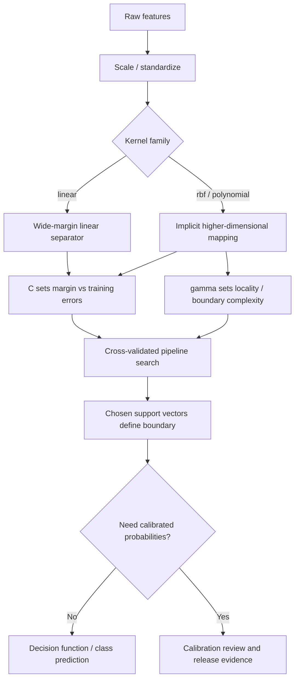

# Chapter 5 - Support Vector Machines

## Reading Scope
This note replaces the older thin summary with a direct-read synthesis of the local Chapter 5 extract.
The chapter's highest-value production slice is not the textbook dual optimization derivation by itself, but the **operating contract for margin-based classifiers**:
- support vectors determine the boundary;
- kernel choice determines whether the boundary stays linear or becomes implicitly nonlinear;
- `C`, `gamma`, and scaling policy jointly determine generalization behavior;
- pipeline packaging matters because an SVM without its exact preprocessing transform is not reproducible;
- probabilities are optional and need separate skepticism from hard-margin decisions.
It stores original synthesis only, not copied prose or long excerpts.

## Why This Chapter Matters
Earlier applied-ML chapters already cover trees, boosted ensembles, text vectorization, neural workflows, and operationalizing model artifacts.
Chapter 5 fills the remaining classic-ML gap where a route needs **high-dimensional margin-based classification** rather than tree splits or dense neural training.
The durable lesson is that an SVM is not merely “another classifier.”
It is a geometry-first route family whose behavior is dominated by:
- which points become support vectors,
- how far the margin is allowed to bend,
- whether feature scale distorts the geometry,
- and whether the route really needs probabilities or only a robust separating surface.
For Agent Studio, this matters for bounded decision routes such as sparse text scoring, anomaly-adjacent separators, face-embedding identity checks, and smaller high-dimensional datasets where tree ensembles or deep nets are not automatically the best fit.

## Maximum Margin Is The Main Abstraction
The chapter frames SVMs around a simple but production-relevant principle: among many valid separators, prefer the one with the **widest margin**.
That choice matters because the nearest training points define how fragile or stable the classifier is.
Those nearest points are the **support vectors**.
Everything else matters less to the final boundary.
The operational implication is that SVM behavior is governed more by boundary-critical examples than by a global average picture of the dataset.
A route with mislabeled or unrepresentative near-boundary samples can therefore shift sharply even when most of the dataset looks clean.

## Kernels Turn Linear Separation Into A Route Choice
The chapter's central escalation mechanism is the kernel trick.
Instead of manually engineering a nonlinear feature expansion, the model can behave as if the data were mapped into a richer feature space and then separated linearly there.
The practical route families here are:
- **linear** when the dataset is already separable enough or high-dimensional sparse features do most of the work;
- **RBF** when local nonlinear neighborhoods matter and the boundary must curve;
- **polynomial** when feature interactions are useful but a purely local radial boundary is not the right shape.
The chapter treats **RBF as the default nonlinear workhorse**, which matches current sklearn practice where `SVC` defaults to an RBF kernel.
That does not mean RBF is automatically better.
The face-recognition example reinforces that a tuned **linear** kernel can still win in high-dimensional embedding spaces.

## `C` Is The Main Slack / Regularization Dial
The chapter's most durable tuning concept is `C`.
It is the soft-margin control that decides how much classification error the model tolerates while pursuing a wider margin.
- **Lower `C`** -> tolerate more training mistakes, prefer a wider margin, usually smoother generalization.
- **Higher `C`** -> punish training mistakes more heavily, fit the training set more tightly, increase overfit risk.
For production routes, `C` is not just a numeric hyperparameter.
It encodes whether the route values robustness to small perturbations more than exact agreement with every training point.
A publish/block or approve/reject route with noisy labels should rarely jump straight to a high-`C` posture without evidence that the data boundary is truly trustworthy.

## `gamma` Controls Boundary Locality
For RBF and related kernels, `gamma` governs how far the influence of each training example reaches.
- **Lower `gamma`** means broader influence and smoother boundaries.
- **Higher `gamma`** means tighter local influence and more intricate contours around small clusters.
The combined lesson from the chapter and current sklearn behavior is that `C` and `gamma` are a coupled surface, not two independent knobs.
A high-`C`, high-`gamma` setting can memorize local quirks quickly.
A low-`C`, low-`gamma` setting can become too blunt for real structure.
For Agent Studio, this means route promotion should preserve the search space and selected combination, not only the final accuracy number.

## Scaling Is Part Of The Model Contract
The chapter is explicit that SVMs nearly always perform better on normalized data.
Current sklearn docs sharpen that point: objectives involving margins and especially RBF kernels assume features are on comparable scales.
If one feature has a much larger numeric range, it can dominate the geometry of the separating surface.
The strongest practical pattern is therefore not `SVC(...)` alone, but a pipeline such as:
- `StandardScaler()` -> `SVC(...)` for dense features;
- `StandardScaler(with_mean=False)` -> linear-margin routes on sparse matrices where centering would break sparsity.
The production lesson is critical: an SVM artifact without its preprocessing transform is incomplete and unsafe to deploy.

## Pipelines Prevent Train/Serve Drift
The chapter's pipeline guidance is one of its highest-value operational contributions.
If scaling is learned during training, the same transform must be applied identically at inference time.
Otherwise the margin geometry changes and predictions become meaningless.
In sklearn terms, a pipeline turns preprocessing plus classifier into one versioned artifact.
Grid search over the pipeline also preserves honest tuning semantics through parameters like `svc__C`, `svc__gamma`, and `svc__kernel`.
For Agent Studio, this means a route registry should treat the scaler, search space, best parameters, and trained classifier as one release object rather than scattered notebook decisions.

## `SVC` And `LinearSVC` Solve Different Operational Problems
The chapter usefully distinguishes general kernel SVMs from the faster linear path.
- **`SVC`** covers linear and nonlinear kernels, supports the richer kernelized family, and is the correct route when nonlinear separation is the actual value.
- **`LinearSVC`** implements only the linear case with a different optimizer that scales better when a linear separator is sufficient.
Current official docs make the split even clearer:
- `SVC` uses **LIBSVM** and scales at least quadratically with sample count;
- `LinearSVC` uses **LIBLINEAR** and is the more operationally sensible path for larger linear-margin problems;
- `SVC` uses **one-vs-one** multiclass handling, while `LinearSVC` defaults to **one-vs-rest**.
This is not trivia.
It affects model count, training time, interpretability, and route cost as label vocabularies grow.

## Probability Outputs Are Optional And Need Caution
The chapter warns that `SVC` does not produce probability estimates by default.
Official sklearn docs add two operational caveats:
- `probability=True` must be enabled before fitting;
- enabling it slows training because it internally runs cross-validation;
- `predict_proba` can be inconsistent with `predict`.
That means probability-bearing SVM routes should not be treated as a free upgrade from hard-label prediction.
If downstream policy thresholds on probability, calibration deserves explicit evaluation evidence.
`CalibratedClassifierCV` is the cleaner post-hoc corroborating path when a route truly needs calibrated confidence rather than only a ranking score or margin sign.

## Hyperparameter Search Is Part Of The Cost Surface
The chapter normalizes `GridSearchCV` as the standard way to tune SVMs.
That is correct but expensive.
Searching over kernel family, `C`, `gamma`, and possibly polynomial degree can multiply training time quickly.
This cost is acceptable when the route is high value and the dataset size is moderate.
It is a warning sign when the route retrains frequently, the sample count is huge, or the performance lift over a simpler baseline is marginal.
For Agent Studio, a strong SVM release packet should therefore record:
- the candidate search grid,
- the folds or evaluation regime,
- the best score,
- and the simpler baseline that lost.

## The Face Example Teaches A Broader Rule
The chapter's facial-recognition example is useful beyond biometrics.
Its real lesson is not “SVMs do face recognition,” but:
- start from a representation space with real signal,
- scale features consistently,
- cross-validate aggressively,
- and do not assume the fanciest nonlinear kernel will win.
That same rule carries into sparse text vectors, retrieval features, and embedding-based triage routes.
When a linear separator already wins, it often gives the better operational profile.

## Failure Modes
- An SVM is shipped without the fitted scaler or pipeline wrapper, so inference runs in a different feature geometry than training.
- `C` and `gamma` are tuned casually from one good run instead of via explicit search and validation.
- A probability threshold is treated as trustworthy even though `probability=True` behavior was never calibrated or audited.
- Sparse matrices are centered accidentally, destroying sparsity and changing cost characteristics.
- A multiclass `SVC` route grows pairwise model count and memory cost without anyone noticing.
- A nonlinear kernel is chosen because it sounds more powerful even though a linear margin already wins cross-validation.
- Near-boundary mislabeled points become support vectors and quietly distort the decision surface.

## Agent Studio Design Rules
1. Treat preprocessing plus SVM as one versioned artifact; never deploy the classifier without the fitted scaler/pipeline.
2. Require the selected `kernel`, `C`, `gamma`, and search procedure to be recorded with the route release.
3. Prefer linear-margin routes when they match validation quality, especially for large or frequently retrained problems.
4. Treat probability-bearing SVM routes as a separate evidence class that needs calibration review rather than default trust.
5. Audit support-vector-sensitive datasets for boundary noise and mislabeled examples before promoting the route.
6. Make multiclass expansion explicit: OvO cost for `SVC`, OvR posture for `LinearSVC`.
7. Reject aggregate-accuracy-only approval when the route is tied to costly false positives or false negatives.

## Datastore Implications
Add or strengthen these datastore objects:
- `svm_model_record`: kernel family, optimizer/runtime family, support-vector count, class strategy, artifact hash, and release status.
- `svm_hyperparameter_search_record`: search grid, folds, selected `C`, selected `gamma`, `degree` where relevant, best score, and baseline comparison.
- `feature_scaling_record`: scaler type, sparse/dense policy, fitted parameters, train/serve parity proof, and caveats.
- `probability_calibration_record`: calibration method, CV policy, classwise calibration behavior, threshold consumers, and audit notes.
- `margin_route_release_gate`: gate binding feature scaling, kernel choice, hyperparameter search evidence, multiclass strategy, probability posture, fallback, and rollback before an SVM-backed route affects production.

## Margin Route Release Gate
Promote an SVM-backed route only when the gate proves:
- the exact preprocessing transform is packaged with the classifier and replayable at inference time;
- kernel family, `C`, `gamma`, and any polynomial degree were selected through explicit evaluation rather than casual defaults;
- the simpler linear/baseline route was checked and rejected for evidence-based reasons;
- multiclass strategy, model-count implications, and runtime costs are visible;
- any probability-bearing behavior is calibrated or explicitly treated as uncalibrated score output;
- high-cost false-positive and false-negative slices were reviewed using route-relevant metrics;
- fallback and rollback exist if support-vector instability, calibration drift, or preprocessing mismatch appears after deployment.
