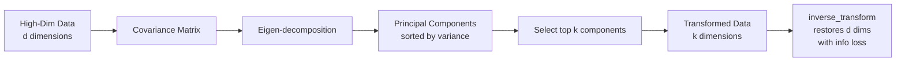
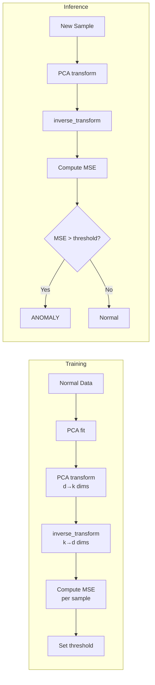

# Chapter 6: Principal Component Analysis

## Overview

PCA is a dimensionality reduction technique that collapses high-dimensional datasets into fewer dimensions while retaining most of the informational content (variance) in the data. It is described as "the best-kept secret in machine learning" due to its broad applicability across feature engineering, visualization, anonymization, noise filtering, and anomaly detection.

## Mechanism

PCA works by computing the covariance matrix of the dataset, then finding the eigenvectors and eigenvalues of that matrix. The eigenvectors define the **principal components**—new orthogonal axes that capture maximal variance. The eigenvalues quantify how much variance each component explains. Scikit-learn's `PCA` class abstracts all the linear algebra:

```python
pca = PCA(n_components=5)
x_reduced = pca.fit_transform(x)
x_restored = pca.inverse_transform(x_reduced)
```

The `explained_variance_ratio_` attribute reveals how much information each component contributes. Components are sorted by importance—the first component captures the most variance, the second the second-most, etc.



## Key Applications

### 1. Dimensionality Reduction
Reduce a dataset from 2,914 dimensions (LFW faces) to 150 while retaining ~95% of variance. The rule of thumb: aim for 5x as many rows as columns; if you cannot add rows, use PCA to reduce columns.

### 2. Noise Filtering
PCA-transform → invert the transform. Random noise carries little systematic variance, so PCA discards it. The book demonstrates this by adding Gaussian noise to LFW face images, reducing to 80% retained variance (2,914 → 179 dims), then restoring—faces become recognizable again with noise largely removed.

### 3. Data Anonymization
Reduce data to the same number of dimensions (n_components = original dimension count) and normalize to unit variance. The original meaning of columns is lost but the data remains ML-usable. Demonstrated with Scikit's breast cancer dataset (30 dims → 30 components, sum of explained variance = 1.0).

### 4. Visualization
Reduce to 2 or 3 dimensions and plot. The book shows this with the handwritten digits dataset (64 dims → 2/3 dims), where class clustering is clearly visible.

**Contrast with t-SNE**: PCA uses a linear transform (focuses on keeping dissimilar points far apart). t-SNE uses a nonlinear transform (keeps similar points close together). t-SNE produces tighter clusters for visualization but is compute-intensive and should be run on PCA-reduced data for speed.

### 5. Anomaly Detection

**Core idea**: An anomalous sample exhibits **higher reconstruction error** (difference between original and PCA-ed then inverse-PCA-ed) than a normal sample. The pipeline:

```python
pca = PCA(n_components=k).fit(legitimate_data)
legit_reconstructed = pca.inverse_transform(pca.transform(legit))
fraud_reconstructed = pca.inverse_transform(pca.transform(fraud))
loss = np.sum((original - reconstructed) ** 2, axis=1)
```

**Credit card fraud example**: 29 → 26 dims, threshold at loss=200 caught ~50% of fraudulent transactions with only 76 false positives out of 284,315 legitimate transactions (0.03% error rate).

**Bearing failure prediction**: NASA bearing dataset (4 dims → 1 dim). Anomaly scores rise ~2-3 days before catastrophic failure. The threshold parameter (0.002 vs 0.0002) trades earliness of detection vs. false-alarm rate.



### 6. Multivariate Anomaly Detection
PCA models combined signals from multiple sensors (e.g., 4 bearings) holistically. Limitation: PCA uses linear transforms, so it struggles with nonlinear relationships. State-of-the-art multivariate anomaly detection uses deep learning (e.g., Microsoft's Graph Attention Network for up to 300 data sources).

## Assumptions & Caveats

- **Linear assumption**: PCA captures only linear relationships. For nonlinear structure, use kernel PCA, t-SNE, UMAP, or autoencoders.
- **Feature scaling is required**: PCA is sensitive to the scale of features. Apply `StandardScaler` before PCA.
- **Explained variance ≠ predictive utility**: Components with the highest variance are not necessarily the most predictive for a downstream classification task.
- **Invertibility is lossy**: `inverse_transform` restores the original dimensionality but not the original data.
- **Interpretability lost**: Transformed dimensions are linear combinations of original features and have no semantic meaning.

## Tradeoffs

| Aspect | PCA | t-SNE |
|--------|-----|-------|
| Linearity | Linear | Nonlinear |
| Speed | Fast | Slow (compute-intensive) |
| Output | Deterministic | Non-deterministic |
| Use case | General dim reduction, anonymization, noise filtering | Visualization only |
| Focus | Keep dissimilar points apart | Keep similar points close |

## Operational Implications

1. **Always scale first**: PCA without scaling is meaningless if features have different units.
2. **Use scree plots** (`plt.plot(pca.explained_variance_ratio_)`) or **cumulative explained variance** (`np.cumsum`) to choose n_components.
3. **Pass a float to n_components** (e.g., `PCA(0.8)`) to auto-select the minimum number of components that retain 80% variance.
4. **Anomaly detection threshold tuning**: The threshold is a business decision—lower thresholds catch more anomalies but increase false positives.
5. **Data leakage warning**: When doing anomaly detection, fit PCA only on legitimate/normal data. Transform (don't re-fit) on test data.
