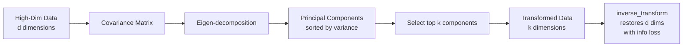
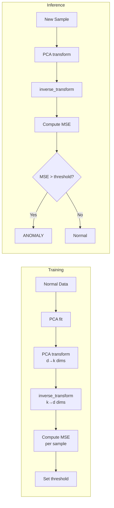

# Chapter 6: Principal Component Analysis — Dimensionality Reduction

## The Core Idea

Principal component analysis (PCA) collapses high-dimensional datasets into fewer dimensions while retaining most of the statistical variance. The book opens with an arresting claim: take 1,000 columns, reduce to 100, and keep 90%+ of the information. The mechanism is a coordinate-system rotation — original axes are replaced with principal components: new orthogonal vectors ordered so that PC1 captures the maximum possible variance, PC2 captures the next most (under the orthogonality constraint), and so on.

Under the hood: build the covariance matrix of the features → eigen-decomposition → eigenvectors are the principal component directions, eigenvalues are the variance explained by each direction. Scikit's `PCA` class wraps all of this:

```python
pca = PCA(n_components=5)
X_reduced = pca.fit_transform(X)
X_restored = pca.inverse_transform(X_reduced)  # lossy
```



## The Explained Variance Ratio

After fitting, `pca.explained_variance_ratio_` gives the fraction of total dataset variance captured by each component, sorted descending by definition.

**LFW faces demo** (2,914 pixels → 150 components): sum of explained variance ratios ≈ 0.948 — ~95% of information survived a ~95% dimensional reduction. PC1 alone captured 18%; PC2 captured 15%. By PC150, each contributed <0.05%. The discarded 2,764 components collectively contained so little signal that faces remained recognizable after inverse transform.

**Selecting n_components:**
- Scree plot (`plt.plot(pca.explained_variance_ratio_)`) — elbow suggests natural cutoff
- Cumulative variance curve (`np.cumsum`)
- Pass a float to `PCA(0.8)` to auto-select the minimum components retaining 80% variance

## Standardization Requirement

PCA is scale-sensitive. Features with larger numerical ranges dominate the covariance matrix and are over-represented in principal components. Always apply `StandardScaler` (zero mean, unit variance) before PCA unless all features are on the same physical scale.

## Key Applications

### 1. Dimensionality Reduction
Reduce from 2,914 dims (LFW faces) to 150 while retaining ~95% variance. Rule of thumb: aim for 5× as many rows as columns; if you cannot add rows, use PCA to reduce columns.

### 2. Noise Filtering
PCA-transform → invert the transform. Random noise carries little systematic variance, so PCA discards it. The book demonstrates: add Gaussian noise to LFW faces, reduce to 80% retained variance (2,914 → 179 dims), restore — faces become recognizable again with noise largely removed.

### 3. Data Anonymization
Reduce to the same number of dimensions (n_components = original dimension count) and normalize to unit variance. Original column meanings are lost but the data remains ML-usable. Scikit breast cancer dataset: 30 dims → 30 components, sum of explained variance = 1.0.

### 4. Visualization
Reduce to 2 or 3 dimensions and plot. The handwritten digits dataset (64 dims → 2/3 dims) shows class clustering: 0s and 1s separate cleanly, 4s and 6s overlap.

**Contrast with t-SNE:** PCA uses a linear transform (focuses on keeping dissimilar points far apart). t-SNE uses a nonlinear transform (keeps similar points close together). t-SNE produces tighter clusters but is compute-intensive. Common strategy: PCA-reduce first, then run t-SNE on the PCA output.

### 5. Anomaly Detection

**Core idea:** An anomalous sample exhibits higher reconstruction error than a normal sample.

```python
pca = PCA(n_components=k).fit(legitimate_data)
legit_reconstructed = pca.inverse_transform(pca.transform(legit))
fraud_reconstructed = pca.inverse_transform(pca.transform(fraud))
loss = np.sum((original - reconstructed) ** 2, axis=1)
```

**Credit card fraud example:** 29 → 26 dims, threshold at loss=200 caught ~50% of fraudulent transactions with only 76 false positives out of 284,315 legitimate transactions (0.03% error rate).

**Bearing failure prediction:** NASA bearing dataset (4 dims → 1 dim). Anomaly scores rise ~2-3 days before catastrophic failure. Threshold (0.002 vs 0.0002) trades earliness vs. false-alarm rate.



### 6. Multivariate Anomaly Detection
PCA models combined signals from multiple sensors holistically. Limitation: linear transforms struggle with nonlinear relationships. State-of-the-art uses deep learning (e.g., Microsoft Graph Attention Network for up to 300 data sources).

## PCA vs. Feature Selection

| Aspect | Feature Selection | PCA |
|--------|-----------------|-----|
| What happens | Columns dropped entirely | Columns replaced by linear combinations |
| Interpretability | Original column names survive | Components have no semantic meaning |
| Data type | Works with any features | Requires numeric, continuous features |
| Supervised? | Can use target variable | Unsupervised — ignores the target |

PCA is **not** feature selection. It is feature extraction. You cannot look at PC1 and say "this represents temperature." Use feature selection (or L1 regularization) when interpretability matters; use PCA when you need maximum compression with minimal variance loss.

## Dimensionality Reduction Decision Tree

```mermaid
flowchart TD
    A[High-dim data<br>d features, n samples] --> B{Goal?}
    B --> C[Reduce dimensions<br>for model training]
    B --> D[Visualize in 2D/3D]
    B --> E[Anonymize sensitive data]
    B --> F[Filter noise from sensors]

    C --> G{n << d?}
    G -->|Yes| H[Try PCA first<br>fast, linear, deterministic]
    G -->|No| I[Feature selection<br>or L1 regularization]

    D --> J{n_components = 2 or 3}
    J --> K[PCA — fast preview<br>keeps dissimilar points apart]
    J --> L[t-SNE — sharper clusters<br>nonlinear, compute-heavy]

    E --> M[PCA(n_components=d)<br>+ StandardScaler<br>zero information loss]

    F --> N[PCA fit on normal data<br>transform + invert<br>threshold on MSE]

    H --> O{Linear enough?}
    O -->|Yes| P[Use PCA]
    O -->|No| Q[Kernel PCA<br>or Autoencoder]
```

## Assumptions & Caveats

**Assumptions that matter in practice:**
- **Linearity.** PCA finds linear combinations only. Nonlinear structure (e.g., curved manifold) will overestimate required components.
- **Normality (weak).** PCA assumes a multivariate Gaussian _if_ you want MLE-interpretation of covariance structure. Works on non-Gaussian data but explained variance ratios lose clean statistical interpretation.
- **Large variance ≈ important signal.** This is the fundamental wager. A component with tiny variance could be the one that separates classes (e.g., rare but diagnostic biomarker).

**Limitations:**
- **Interpretability loss.** Each component is a dense linear combination of every original feature.
- **No target variable.** PCA is unsupervised — may discard components critical for classification but useless for reconstruction.
- **Sensitive to outliers.** A few extreme samples can rotate principal components dramatically (robust PCA variants exist but are not covered here).

## Tradeoffs: PCA vs t-SNE/UMAP

| Aspect | PCA | t-SNE |
|--------|-----|-------|
| Linearity | Linear | Nonlinear |
| Speed | Fast | Slow (compute-intensive) |
| Output | Deterministic | Non-deterministic |
| Use case | General dim reduction, anonymization, noise filtering | Visualization only |
| Focus | Keep dissimilar points apart | Keep similar points close |
| Invertible | Yes (`inverse_transform`) | No |

## Agent Studio / ML Pipeline Implications

1. **Gate PCA behind a cardinality check.** If feature count > 2× sample count, PCA is a strong candidate. Below that, feature selection is safer.

2. **Pipe standardization before PCA.** Build a `StandardScaler → PCA` pipeline in Scikit to avoid data leakage across train/test splits.

3. **Persist the PCA object.** The `components_` matrix and `mean_` vector must be saved alongside the model. Treat PCA as part of the model artifact, not a pre-processing script.

4. **Monitor explained variance drift.** If cumulative variance of top-k components drops significantly on production data, retrain the PCA transform — input distribution has likely shifted.

5. **Anomaly-detection threshold is a business parameter.** In the fraud example, loss=200 caught 50% of fraud with 0.03% false-positive rate. Build a configurable threshold tuned via precision-recall tradeoff on holdout data.

6. **Prefer PCA over t-SNE/UMAP inside the training pipeline.** PCA is fast, deterministic, and invertible; t-SNE is non-deterministic and expensive. Reserve t-SNE for one-off exploratory visualization.

7. **Data leakage warning:** When doing anomaly detection, fit PCA only on legitimate/normal data. Transform (don't re-fit) on test data.

## Summary of Practical Recipes

| Use Case | Recipe | Key Param |
|----------|--------|-----------|
| General dim reduction | `PCA(n_components=k).fit_transform(X)` | Scree plot elbow |
| Variance-targeted reduction | `PCA(0.95)` | Float in [0,1] |
| Noise filtering | PCA → inverse on noisy data | n_components capturing ~80% variance |
| Anonymization | `PCA(n_components=d)` + `StandardScaler` | n_components = original dim count |
| Visualization | `PCA(n_components=2 or 3)` | 2 or 3 |
| Anomaly detection | Fit PCA on normal data, measure reconstruction MSE | Threshold tuned on business cost |