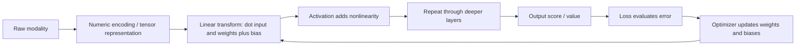

# Chapter 8 - Deep Learning Foundations

## Reading Scope
This note replaces the earlier thin summary with a direct-read synthesis of the local Chapter 8 extract.
The chapter is a **conceptual foundation note**, not yet a Keras training cookbook.
Its durable value is clarifying why deep learning overtook classic ML for some tasks, what an MLP actually is, why activations and parameters matter mechanically, and why training cost and optimization become route-review issues.
It stores original synthesis only, not copied prose or long excerpts.

## Why This Chapter Matters
The surrounding book already covers classic ML, sparse text models, SVMs, CNNs, face pipelines, managed AI services, and Chapter 9's practical Keras workflow.
What was missing was the bridge between those pieces: **what a neural route is doing before framework APIs appear**.
For Agent Studio, that matters because a neural route is still just a numeric representation, parameterized transforms, a loss surface, an optimizer, and a compute budget.
That framing keeps neural systems reviewable instead of mystical.

## Deep Learning Is An Escalation, Not A Replacement
The chapter contrasts deep learning with traditional ML without claiming that older models are obsolete.
The real point is narrower:
- classic ML remains strong for bounded tabular or sparse-feature routes;
- deep learning becomes valuable when the task needs learned nonlinear representations;
- choosing deep learning is therefore a capability and cost decision, not a default badge of sophistication.

## Compute Availability Is Part Of The Architecture Story
The chapter explicitly links deep learning's rise to GPUs, TPUs, and cloud compute.
That is not just history.
It means a trainable neural route always carries a resource contract:
- training cost depends on hardware access;
- experimentation speed depends on accelerator availability;
- retraining feasibility can be a blocker even when inference is cheap enough.
A route review should therefore separate training feasibility from serving feasibility.

## The Base Abstraction: Multilayer Perceptron
The chapter starts from the multilayer perceptron (MLP): neurons arranged in layers, with **depth** meaning number of layers and **width** meaning neurons per layer.
This is not the final architecture for every modality, but it is the cleanest entry point for understanding neural computation.
An MLP in this framing:
- accepts floating-point inputs;
- propagates them through fully connected layers;
- uses learned weights and biases;
- injects nonlinearity through activations;
- emits floating-point outputs that later chapters turn into logits, probabilities, or numeric predictions.

The critical contract is numeric.
Text, images, and audio cannot enter directly; they must first become vectors or tensors.
Representation is part of the route, not a pre-step outside the route.

## Weights, Biases, And Fully Connected Structure
Each connection carries a weight and each non-input neuron carries a bias.
That matters because neural behavior is not a symbolic rule set; it is a large bank of numeric parameters.
Operationally:
- weights determine how strongly upstream signals influence downstream units;
- biases shift activation thresholds or offsets;
- fully connected layers maximize interaction freedom but also increase parameter count and training cost.
The architecture alone is never enough evidence; the learned parameters and the way they were obtained matter just as much.

## Linear Maps Plus Nonlinearity
The chapter's most important mechanical claim is that neurons perform simple linear transforms and activations inject nonlinearity.
At the single-neuron level, the computation looks like linear regression.
What makes a network powerful is stacking many such transforms **with nonlinearity in between**.
Without that nonlinearity, many layers collapse into something equivalent to one large linear transform.
That would be too weak for the nonlinear decision surfaces that dominate vision, speech, and language tasks.

This is the useful reading of the universal-approximation idea:
- it motivates why neural networks can express rich functions;
- it does **not** imply easy training, data efficiency, or guaranteed generalization.

## ReLU Is The Right Default Mental Model
The chapter centers the rectified linear unit (ReLU): pass positive values through, map negative values to zero.
That is enough to explain why hidden units can selectively activate and why a network can build piecewise nonlinear behavior.
The official Keras activation docs sharpen the implementation meaning: activations can be explicit layers or passed through `activation=` on a forward layer.
So Chapter 8 is right to make activation a first-class idea before Chapter 9 turns it into concrete workflow choices.

## Forward Propagation Is Cheap; Useful Parameters Are Expensive
The chapter presents forward propagation as repeated multiplication, addition, biasing, and activation.
Once a model is trained, inference is operationally straightforward.
The expensive part is discovering parameter values that make outputs useful.
That gives a critical route boundary:
- online latency depends on architecture and hardware;
- offline training cost depends on optimizer behavior, learning rate, initialization, data volume, and update count;
- a route can be inference-cheap yet retraining-expensive.

## Training Is Search Over A Loss Landscape
The chapter frames training as starting from small random weights and iteratively reducing error.
That reduction is measured by a loss function and achieved by backpropagation plus an optimizer.
The systems lesson is that training is a search problem over a high-dimensional landscape:
- the objective has many coupled degrees of freedom;
- runs can stall, overshoot, or converge differently;
- two successful runs may land on different but still useful solutions.
That is why training configuration is part of route behavior rather than notebook decoration.

## Learning Rate And Optimizer Choice Are First-Class Controls
The chapter treats learning rate as the main speed-versus-stability dial.
Too small and learning drags; too large and optimization can miss good minima or diverge.
It also introduces the idea that adaptive optimizers change update magnitude during training.
For Agent Studio, the release implication is simple: record optimizer and learning-rate choices as part of the training contract.
They are not background metadata.

## Mini-Batch Gradient Descent Is The Practical Compromise
The chapter highlights mini-batch gradient descent as the middle ground between per-example and full-dataset updates.
That has direct operational consequences:
- throughput depends on batch policy;
- gradient noise and efficiency both change with batch size;
- memory limits and device utilization constrain what is practical.
A neural route is therefore partly a batching system even before distributed training enters the picture.

## Frameworks Hide Math, Not Responsibility
The chapter motivates dedicated deep-learning libraries instead of hand-built perceptron code or shallow sklearn helpers.
That is a governance point as much as an implementation point.
Keras and TensorFlow reduce boilerplate, but they do not remove the need to choose representation, architecture family, activation pattern, loss, optimizer, learning-rate policy, and stopping criteria.
Framework convenience is not release evidence.

## Failure Modes
- A neural route is promoted without preserving the numeric representation contract that feeds the model.
- Stacked linear layers are mistaken for meaningful deep learning because nonlinearity was not reviewed.
- Training feasibility is assumed from serving feasibility, and retraining later becomes operationally impossible.
- Loss and optimizer choices are omitted from release evidence as if architecture alone explained behavior.
- Learning rate is copied from a tutorial and never checked against stability or convergence.
- Universal approximation is overread as a product-readiness claim instead of a bounded theoretical backdrop.

## Agent Studio Design Rules
1. Treat neural routes as numeric-representation contracts, not magic functions.
2. Separate training feasibility, inference feasibility, and release readiness.
3. Require explicit activation, loss, optimizer, and learning-rate choices in every trainable-route record.
4. Review whether a classic-ML baseline was sufficient before escalating to deep learning.
5. Record batching and hardware assumptions because they shape both cost and convergence.
6. Treat framework convenience as implementation help, not as evidence that the route is well understood.
7. Use later workflow-specific notes before approving thresholded binary or multiclass decision routes.

## Datastore Implications
Add or strengthen these datastore objects:
- `neural_representation_record`: raw modality, numeric encoding path, tensor shape assumptions, normalization/preprocessing policy, and version refs.
- `neural_architecture_record`: layer family, depth, width, activation strategy, parameter count estimate, and intended route role.
- `neural_training_contract_record`: loss, optimizer, learning-rate policy, batch policy, initialization posture, stop criteria, hardware assumptions, and reproducibility caveats.
- `accelerator_feasibility_record`: training device class, memory envelope, estimated runtime, deployment runtime, and fallback posture.
- `deep_learning_foundation_release_gate`: gate binding representation validity, activation presence, loss/optimizer declaration, batching policy, compute feasibility, fallback, and rollback.

## Deep Learning Foundation Release Gate
Promote a trainable neural route only when the gate proves:
- the raw modality has a defined numeric encoding and tensor contract;
- the architecture uses meaningful nonlinearity rather than an accidental stack of linear transforms;
- the chosen loss, optimizer, learning rate, batch policy, and initialization posture are recorded;
- training feasibility on available hardware is understood separately from serving feasibility;
- framework abstractions do not hide missing evidence about convergence, cost, or reproducibility;
- simpler classic-ML alternatives were considered when the task is still bounded enough for them;
- fallback and rollback exist if training instability, representation drift, or compute assumptions fail.

## Bottom Line
Chapter 8's durable lesson is that deep learning begins with a simple but powerful contract: numbers in, repeated linear transforms plus nonlinearity, error measured by loss, parameters updated by optimization.
That is enough to explain both why neural models dominate many modern tasks and why they create governance surfaces around compute, stability, representation design, and release evidence.
For Agent Studio, the chapter does not yet tell us how to build the best Keras model.
It tells us how to think about neural routes clearly enough that later implementation choices remain auditable.
