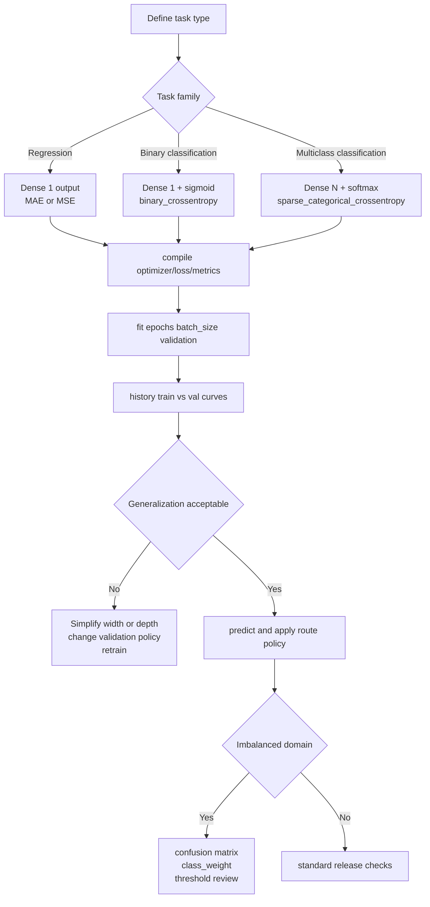

# Chapter 9 - Neural Networks

## Reading Scope
This note replaces the older thin summary with a direct-read synthesis of the local Chapter 9 extract.
The chapter's highest-value production slice is not backpropagation theory by itself, but the **operating contract for Keras/TensorFlow training loops**:
- task type -> output head -> loss function alignment;
- `compile` / `fit` / `predict` separation;
- validation discipline and randomness awareness;
- width/depth sizing tradeoffs;
- imbalanced-class workflows where confusion matrices matter more than headline accuracy.
It stores original synthesis only, not copied prose or long code dumps.

## Why This Chapter Matters
Earlier applied-ML chapters cover classical classifiers, vectorizers, PCA, and deployment basics.
Chapter 9 is the bridge from "use a library estimator" to "run a trainable neural route with explicit optimization, validation, and output semantics."
The durable lesson is that a neural network is not one thing:
- a regression route,
- a binary decision route,
- and a multiclass route
all use different output contracts even when the hidden layers look similar.
For Agent Studio, this matters because route failures often come from the wrong head, loss, threshold, or validation policy rather than from a lack of raw model capacity.

## TensorFlow And Keras Are Different Layers Of The Stack
The chapter sharpens a distinction that matters operationally:
- **TensorFlow** is the low-level tensor/math execution substrate and graph runtime;
- **Keras** is the higher-level neural-network interface used to define layers, compile training behavior, and drive fit/evaluate/predict loops.
The production implication is simple: design at the Keras level, but remember that tensor shapes, graph compilation, and hardware execution still belong to TensorFlow.
That means model behavior depends on both architecture choices and runtime packaging.

## Sequential API Means A Linear Topology Contract
The chapter's default builder is Keras `Sequential`, where layers are stacked in order and each layer feeds the next.
That is a meaningful architecture constraint, not just a convenience API:
- it fits one-input / one-output feed-forward networks;
- it makes hidden-layer width and activation choices explicit;
- it is the right default until the route needs branching, shared layers, or multiple outputs.
The first hidden layer often implicitly defines the input layer through `input_dim` or `input_shape`.
That makes the note's deeper lesson easy to miss: input dimensionality is part of the route schema.
A model trained on 29 fraud features is not compatible with a route that later emits 31 features unless the entire feature contract is versioned.

## `compile` Freezes The Training Contract
The chapter's most practical point is that `compile` defines the learning contract before any data flows:
- optimizer = how parameters are updated;
- loss = what the model is punished for;
- metrics = what training history records.
The examples use Adam as a strong default because it adapts the learning rate automatically.
That is useful, but the larger operational rule is that optimizer choice is a policy surface.
If two training runs use different optimizers or learning-rate rules, they are not the same route release.
For Agent Studio, optimizer, loss, and metrics should be stored with the model artifact rather than left as notebook trivia.

## `fit` Is Where Validation Discipline Actually Lives
`fit` is where the network sees data, but the higher-value lesson is how validation is wired.
The chapter uses both:
- `validation_split` for simple cases;
- explicit `validation_data=(x_test, y_test)` when split control matters.
This distinction matters more than the educational examples make obvious.
`validation_split` is convenient, but it is not stratification-aware and is unsafe on ordered data unless shuffling is handled deliberately.
For imbalanced or temporally ordered routes, explicit train/validation/test splits are the safer default.
A route should not be promoted just because training loss falls if the validation setup itself leaked or distorted the real decision surface.

## History Curves Are Generalization Evidence
The history object returned by `fit` is not cosmetic logging.
It is the chapter's main evidence source for deciding:
- whether training ran long enough;
- whether the route is underfitting;
- whether the route is overfitting.
The note's durable pattern is to compare training and validation curves, not just the final number.
A small train/validation gap is usually more reassuring than an excellent training metric with a widening validation gap.
For Agent Studio, a route registry should preserve per-epoch summaries or at least the generalization conclusion derived from them.

## Randomness Is A First-Class Training Property
One of the chapter's best practical warnings is that the same network trained twice on the same data can still produce different results.
The causes include:
- random initialization;
- stochastic optimization order;
- other training-time randomness.
This makes single-run comparisons fragile.
A tiny apparent win from a larger architecture may just be a lucky initialization.
That is why repeated runs or averaged comparisons are often better evidence than a single benchmark screenshot.
For production routes, non-determinism should be treated as part of evaluation design, especially when validation deltas are small.

## Width, Depth, And Capacity Need A Budgeted Rationale
The chapter prefers wider shallow multilayer perceptrons over deeper stacks for ordinary tabular tasks.
Its reason is practical:
- extra width increases capacity without paying the same depth-related training penalties;
- shallow networks reduce vanishing-gradient pressure;
- fewer layers can still yield a large trainable-parameter budget.
The broader architecture rule is not "always use 512 neurons," but:
- start simple;
- increase width/depth only when validation evidence earns it;
- remember that training time and overfit risk are part of the cost surface.
This maps directly to route-release decisions: more parameters should justify themselves with stable validation gains, not only with better training fit.

## Regression Uses A Different Output Contract
The taxi-fare example is valuable because it keeps the regression head simple:
- one numeric output;
- no sigmoid or softmax on the output;
- MAE or MSE loss;
- evaluation tied to error, not class accuracy.
That sounds basic, but it encodes a major route-design rule: the output layer must match the decision surface.
Classification-style heads on regression tasks break the meaning of the output.
The chapter also shows that even a modest tabular neural network can carry a large parameter count, which makes feature quality and validation discipline more important than raw architecture novelty.

## Binary Classification Is A Different Head, Not Just A Different Dataset
The chapter's binary-classification section tightens the task contract:
- output layer becomes one neuron with `sigmoid`;
- loss becomes `binary_crossentropy`;
- outputs become positive-class probabilities.
This matters because the route now emits a score that still needs a policy decision.
A probability is not the same thing as an action.
For Agent Studio, this means publish/block/escalate/review routes should record:
- threshold policy;
- class priors;
- the cost of false positives and false negatives;
- any human-review capacity constraint that shaped the threshold.

## Multiclass Classification Adds Vocabulary To The Output Surface
For multiclass classification, the chapter changes the head again:
- one output neuron per class;
- `softmax` activation;
- categorical-style cross-entropy loss.
The enduring lesson is that label vocabulary is part of model schema.
If the route later adds or removes classes, the model head, metrics, and downstream interpretation all change.
That makes class inventory a versioned contract, not an annotation detail.

## Imbalanced Domains Break Accuracy As A Release Metric
The credit-card-fraud example is the chapter's strongest production section.
It shows why a neural network can report extremely high accuracy while still being untrustworthy:
- the majority class dominates the dataset;
- always predicting the majority class would already look good numerically;
- the real decision risk sits in the minority failures.
The confusion matrix is therefore more useful than a single accuracy number.
It exposes the tradeoff among:
- true negatives,
- false positives,
- true positives,
- false negatives.
This is exactly the evaluation surface that bounded risk routes need.

## `class_weight` Encodes Business Policy Into Training
The chapter's `class_weight` discussion is easy to underestimate.
It is not just an optimization trick.
It changes what the model is incentivized to get right.
In the fraud example, weighting the majority class more heavily reduces false alarms on legitimate transactions but lets more fraud through.
That means `class_weight` is a product-policy control encoded into the loss surface.
For Agent Studio, class weights, thresholds, and reviewer-capacity assumptions belong in the same release packet because they jointly define route behavior.

## Validation/Test Separation Still Matters
The chapter explicitly notes that ideal practice uses three datasets:
- train,
- validation,
- test.
Its examples sometimes collapse validation and testing for simplicity, but the production lesson is the opposite: confidence increases when final evaluation uses data that shaped neither weights nor early model-selection decisions.
For routes with safety, trust, or escalation impact, the absence of a final untouched test slice should be treated as a release weakness.

## Callbacks Are Training-Time Guardrails
The existing thin summary already pointed toward `EarlyStopping` and `ReduceLROnPlateau`, and the official corroboration hardens why they matter.
They operationalize two valuable controls:
- stop training when validation performance no longer improves;
- reduce learning rate when progress plateaus.
These are the training analogue of route guardrails.
They do not replace evaluation, but they reduce wasted training and help preserve the best checkpoint behavior.

## Agent Studio Design Rules
1. Treat task family (`regression`, `binary_classification`, `multiclass_classification`) as a versioned route field tied to output head and loss.
2. Do not approve imbalanced classifiers on accuracy alone; require confusion-matrix review and class-distribution evidence.
3. Ban casual use of `validation_split` for ordered or skewed data; require explicit split policy.
4. Record randomness-sensitive comparisons across repeated runs when architecture deltas are small.
5. Treat class weights and thresholds as product-policy controls, not minor hyperparameters.
6. Require a parameter-count and training-cost rationale before widening or deepening a route materially.
7. Preserve optimizer/loss/metric configuration with the artifact so training behavior is reproducible.

## Datastore Implications
Add or strengthen these datastore objects:
- `neural_route_training_contract`: task family, head shape, activation, optimizer, loss, metrics, callbacks, and learning-rate policy.
- `validation_split_policy_record`: split method, stratification status, shuffle policy, leakage caveats, and test-set separation.
- `training_history_summary`: epoch count, best validation epoch, train/validation gap summary, stop reason, and repeated-run variance note.
- `class_weight_policy_record`: class priors, loss weights, business rationale, and downstream threshold linkage.
- `classification_error_surface_record`: confusion matrix counts, threshold, false-positive cost, false-negative cost, and reviewer-capacity assumption.
- `neural_route_release_gate`: gate binding training contract, split policy, history evidence, imbalance handling, threshold policy, fallback, and rollback before a neural route affects production.

## Failure Modes
- Using the wrong output head or loss for the actual task family.
- Treating validation convenience as equivalent to a valid split design.
- Shipping on accuracy alone when the minority class carries the business risk.
- Overfitting with larger widths/depths and mistaking training improvement for route improvement.
- Comparing architectures based on one stochastic run.
- Hiding class weights and thresholds even though they materially change route behavior.
- Forgetting that feature dimensionality is part of the neural route contract.
