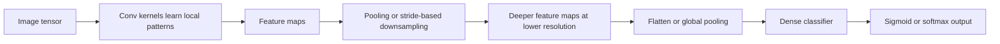
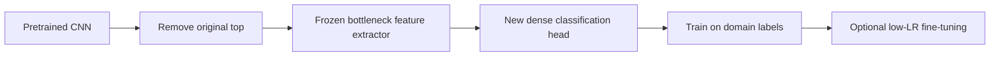

# Chapter 10 - Image Classification with CNNs
## Reading Scope
This is a fresh direct-read synthesis of the local Chapter 10 extract.
The note keeps the chapter's highest-value production slice compact:
- how CNN bottlenecks actually transform images;
- where scratch-built CNNs work and where they stop;
- why pretrained backbones change the economics;
- how transfer learning, augmentation, and global pooling alter route behavior;
- why spectrogram classification is still a vision pipeline in disguise.
It stores original synthesis only, not copied prose or long code dumps.
## Why This Chapter Matters
The chapter is nominally about image classification, but the durable lesson is broader: a usable vision route is mostly a **representation pipeline**.
CNNs win because they do not treat an image as a flat vector. They repeatedly convert pixels into feature maps, shrink those maps into more compact tensors, and hand a denser representation to a simpler classifier.
For Agent Studio, that means the route contract must center the backbone, label vocabulary, preprocessing path, and release criteria.
## Core CNN Mechanism
A CNN has two functional regions:
1. **bottleneck layers**: convolution + pooling, responsible for feature extraction and most of the compute;
2. **classification layers**: dense layers that map extracted features to labels.
Convolution layers slide many learnable kernels across the image. Each kernel produces a feature map that emphasizes some visual pattern such as an edge, contour, texture, or shape fragment.
Pooling layers downsample those maps so the network keeps salient evidence while becoming less sensitive to small shifts in position.
The end result is not "better pixels" but a tensor whose floating-point activations separate classes more clearly than raw pixel values do.

## Important Mechanical Details
- A convolution layer usually uses many kernels, not one. Kernel count is capacity, analogous to neuron count in dense layers.
- Kernel values are learned during training; they are not fixed image-processing filters even if Sobel-like examples help explain the idea.
- A default 3×3 convolution without padding shrinks height and width by 2 because border pixels are not fully covered.
- `padding='same'` preserves spatial dimensions and is an explicit architectural choice, not a cosmetic option.
- Pooling is the common downsampling path, but stride-2 convolutions can also reduce resolution.
- Binary classification ends in sigmoid; multiclass ends in softmax with one output per class.
- CNN output tensors are dense representations. The chapter frames this as the same family of move seen later in NLP embeddings: transform raw input into a more task-separable vector space.
## The Scratch-Built CNN Baseline
The baseline Keras CNN is intentionally simple: `Conv2D(32, 3x3)` -> pool -> `Conv2D(64, 3x3)` -> pool -> flatten -> dense -> softmax.
On MNIST, that is enough to reach about 99% accuracy after roughly 10 epochs because:
- there are many examples per class;
- classes are visually distinct;
- images are tightly cropped and normalized into a uniform frame.
The deeper lesson is not that small CNNs are universally strong. It is that **problem geometry and dataset cleanliness dominate architecture heroics** when classes are already well separated.
## Shape Accounting Matters
The chapter's model-summary walkthrough is operationally important.
A 28×28×1 image becomes:
- 26×26×32 after the first 3×3 conv;
- 13×13×32 after max pooling;
- 11×11×64 after the second conv;
- 5×5×64 after the second pool;
- 1600 values after flatten.
This matters because route cost, overfitting risk, and dense-layer width all depend on that tensor geometry.
A classifier built on top of 1600 features behaves very differently from one built on top of 64 pooled features.
## Why Scratch CNNs Stall On Real Photos
The Arctic wildlife example is the chapter's first realism check.
A scratch-built 5-block CNN trained on only 300 total images across arctic fox / polar bear / walrus reaches only about 60-70% validation accuracy.
Why the drop from MNIST:
- real photos vary in pose, scale, framing, background, and lighting;
- classes are more perceptually entangled;
- 100 images per class is too little diversity for deep feature learning from scratch;
- 224×224 color images massively raise compute relative to 28×28 grayscale digits.
This is the chapter's first practical release gate: do not confuse success on tidy benchmark geometry with readiness for unconstrained visual scenes.
## Pretrained CNNs Change The Cost Structure
Pretrained CNNs matter for two reasons at once:
- they were trained on huge corpora such as ImageNet;
- they incorporate architectural advances that a toy CNN lacks.
The chapter highlights four families of improvements: deeper networks, batch normalization, residual connections, and cheaper-but-effective convolution variants such as 1×1 and depthwise-separable convolutions.
Operationally, a pretrained backbone is not just "more accurate weights." It is a packaged visual prior plus an architecture whose compute/accuracy tradeoff has already been optimized.
## Preprocessing Is Part Of The Model Contract
The chapter is careful about a point many teams miss: the model is not only the network weights.
Each pretrained CNN expects a specific input contract:
- image size, commonly 224×224;
- channel order or scaling convention;
- model-specific `preprocess_input` behavior.
The extract also notes a subtle implementation trap: some cases still require dividing by 255 after calling `preprocess_input`; the ResNet50V2 example is written that way.
Production implication: preprocessing must be versioned and tested with the backbone. A route that swaps backbone or Keras helper without revalidating preprocessing has changed models even if the top-level API looks identical.
## Vocabulary Limits Of Off-The-Shelf Classifiers
ResNet50V2 cleanly recognizes an Arctic fox but misclassifies a walrus as an armadillo-like nearest class because walrus is not in the ImageNet label set.
This is the chapter's sharpest classification warning: a pretrained classifier can only emit labels from its training vocabulary, and confidence over the wrong label set is not evidence of domain competence.
For Agent Studio, closed-vocabulary coverage is a release artifact. If the target ontology is domain-specific, the backbone may still be useful, but the stock classification head is not sufficient evidence.
## Transfer Learning: Reuse The Bottleneck, Replace The Head
Transfer learning works by keeping the expensive feature extractor and replacing the cheap task-specific classifier.
Mechanically: load the pretrained CNN with `include_top=False`, keep its bottleneck layers, add a new classification head, freeze the base, and optionally fine-tune selected deeper layers later at low learning rate.

The chapter presents two transfer-learning patterns.
### Pattern 1: End-to-End wrapper with frozen base
Pros:
- straightforward;
- supports fine-tuning later;
- works naturally with augmentation layers.
Cons:
- recomputes base-model features each epoch;
- slower on CPU.
### Pattern 2: Precompute features once, then train a small classifier
Pros:
- much faster;
- usually the default best move when the backbone is frozen.
Cons:
- less convenient for integrated augmentation or later unfreezing.
The chapter explicitly favors feature precomputation unless there is a reason not to.
## Transfer Learning Is The Real Production Pivot
Using ResNet50V2 bottleneck features plus a small dense classifier raises the wildlife task from roughly 60% to about 97% accuracy with only 100 images per class.
That is the chapter's main implementation delta from baseline CNN work:
- the major training burden moved from learning kernels to learning a thin task head;
- the route became CPU-feasible;
- domain adaptation no longer required millions of images.
But the chapter also states the boundary clearly: transfer learning is not magic. If the dataset lacks information needed to separate classes, reuse of a better backbone will not manufacture signal that is absent.
## Data Augmentation: Synthetic Diversity, Not Synthetic Truth
Data augmentation addresses small-dataset brittleness by serving randomized variants of the same images across epochs, including flips, rotations, shifts, and zoom.
Two implementation paths are shown.
### `ImageDataGenerator`
Use when images are streamed or generated externally.
Key contract details:
- generator can yield infinite variants;
- `steps_per_epoch` must be set so one epoch corresponds to one transformed pass over the dataset;
- do **not** augment validation data;
- when training from a generator, prefer explicit `validation_data` over `validation_split`.
### Augmentation layers inside the model
Use when you want the transform policy embedded into the graph.
Important behavior:
- augmentation layers are active only during training;
- rescaling stays active for validation and prediction;
- integrated augmentation makes the input contract easier to preserve.
The measured gain in the chapter is small, around half a percentage point on average, and sometimes negative in individual runs.
That is a useful corrective: augmentation is a plausible generalization aid, not an automatic accuracy upgrade.
## Global Pooling As A Parameter-Control Tool
Replacing `Flatten()` with `GlobalMaxPooling2D` or `GlobalAveragePooling2D` collapses each feature map to one value.
In the MNIST example this reduces the classifier input from 1600 values to 64 values.
Why that matters:
- far fewer downstream parameters;
- lower overfitting risk;
- potentially better generalization on some datasets.
But the chapter refuses a universal claim: on MNIST, global pooling slightly hurts accuracy.
So the correct production framing is not "global pooling is better" but "global pooling is a bias toward compression and regularization that must be validated on the actual route distribution."
## Audio Classification Is Still A Vision Pipeline
The audio section is not a side quest; it extends the same architecture lesson.
Pipeline: convert WAV audio into mel spectrogram images with Librosa, treat them as image inputs, preprocess them for a pretrained CNN such as MobileNetV2, then train a small classifier on the extracted features.
This works because the backbone does not care that the image originated from sound; it only needs a stable visual pattern family.
The chapter's rainforest example reaches 95%+ validation accuracy across background / chainsaw / engine / storm classes and then checks sample clips from an external documentary source.
That external-source check is the crucial systems point: validation accuracy is weaker evidence than success on data from a different provenance.
## Main Caveats
- All images fed to a given CNN must have the same dimensions.
- Larger kernels can improve fit but raise multiply count sharply; 5×5 is materially costlier than 3×3.
- CPU training is feasible for small and transfer-learning routes, but scratch training on larger images quickly becomes expensive.
- Pretrained top layers inherit fixed vocabularies and can fail badly outside those classes.
- Fine-tuning, augmentation, and global pooling are all dataset-dependent; repeated runs are often needed before drawing conclusions.
- Test claims should be checked on truly unseen data, ideally from a different source distribution.
## Agent Studio Release-Gate Delta
This chapter turns "image classifier" into a route contract that must prove more than top-1 accuracy.
Before a CNN-backed classification route affects product behavior, the release gate should record backbone family, exact preprocessing, target vocabulary coverage, adaptation mode, confusion-matrix behavior, small-dataset mitigation policy, source-shift evidence, and runtime on target hardware.
The release-gate language for Agent Studio is straightforward: **do not ship a media route because the backbone is famous or because the validation curve looks good. Ship only after vocabulary coverage, preprocessing fidelity, classwise error behavior, and target-environment runtime have been verified together.**
## Minimum Practical Checklist
- Start with transfer learning before considering a scratch CNN for small domain datasets.
- Version preprocessing alongside the model artifact.
- Treat `include_top=False` as the default entry point for domain-specific labels.
- Prefer precomputed features when the base stays frozen and speed matters; use the integrated-model path when augmentation or later fine-tuning is expected.
- Compare flatten versus global pooling when overfitting or parameter count is a concern, inspect confusion matrices, and validate on source-shifted samples before claiming readiness.
## Bottom Line
Chapter 10's durable lesson is that modern image classification is mostly about **feature reuse under a strict input contract**.
Convolutions and pooling create the representation, pretrained backbones amortize the expensive feature-learning phase, transfer learning repurposes that representation for new vocabularies, augmentation adds synthetic diversity, and global pooling changes the classifier's overfit profile.
For Agent Studio, the practical boundary is not "can a CNN predict a label?" It is whether the route can justify its preprocessing, vocabulary, adaptation strategy, classwise behavior, and runtime envelope strongly enough to pass a production release gate.
