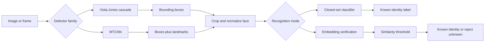
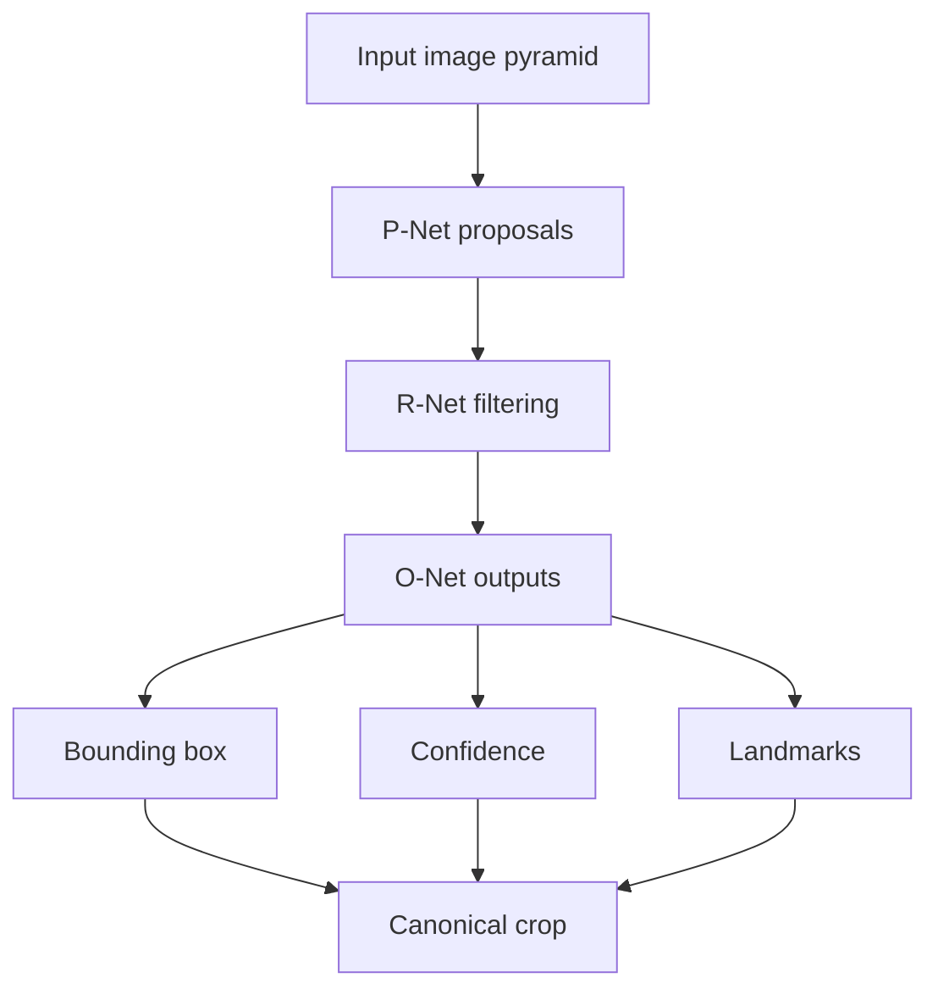
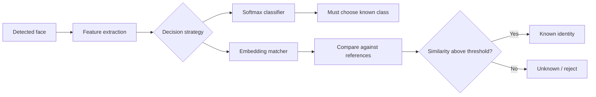

# Chapter 11 - Face Detection and Recognition
## Reading Scope
This is a direct-read synthesis of Chapter 11 from the user-provided local PDF *Applied Machine Learning and AI for Engineers*.
The note focuses on the smallest high-value architecture slice inside the chapter:
- face-detection choice as a production contract;
- crop/alignment behavior before recognition;
- face-specific versus generic transfer learning;
- closed-set versus open-set identity handling;
- identity-governance deltas for Agent Studio.
The note stores original synthesis only. It does not store copied chapter text, long code listings, or figure dumps.

## Why This Slice Matters
The parent applied-ML note already covers transfer learning, object detection, OCR, moderation, and general vision governance. What remained under-modeled was the identity-sensitive branch where a route moves from "what is in the image" to "who is this person?"

This chapter closes that gap by separating:
- face detection from face recognition rather than treating them as one model;
- low-cost classical detection from CNN-based detection with landmarks;
- generic ImageNet transfer learning from face-domain pretraining;
- closed-set classification from open-set verification and unknown rejection.

That matters for Agent Studio whenever a route could unlock devices, authorize access, verify operators, tag people, gate content access, or attach identity claims to artifacts.

## Face Pipelines Are Multi-Stage Systems
A useful face system does not begin with recognition. It first needs a detector that can find candidate faces, then a cropping or alignment step that turns those detections into normalized inputs for the recognizer.

The durable lesson is that detector quality and preprocessing discipline directly affect recognition quality. Identity errors are often pipeline errors, not only classifier errors.

## End-to-End Face Pipeline

## Viola-Jones: Cheap Detection Through Cascades
The chapter begins with the classic Viola-Jones detector. The core idea is to slide windows across the image, compute Haar-like contrast features, and classify each window as face versus non-face.

Why it still matters:
- it is CPU-friendly and historically fast;
- it rejects most negatives early through a cascade;
- it remains a useful mental model for high-recall-then-filter pipelines.

Operationally, the cascade is the key design pattern. Early stages are cheap and aggressively eliminate obvious negatives. Later stages are more selective and expensive.

### `minNeighbors` Is A Real Policy Knob
The OpenCV implementation exposes a `minNeighbors` parameter. In practice this is not decorative tuning; it controls how many overlapping detections are required before the detector reports a face.

Release implication:
- higher `minNeighbors` lowers false positives but can miss real faces;
- lower `minNeighbors` surfaces more candidate faces but increases junk detections;
- the setting belongs in route configuration and validation, not hidden helper code.

## MTCNN: Detection Plus Alignment Hints
The deep-learning alternative in the chapter is MTCNN, a three-stage cascade of neural networks:
- P-Net proposes candidate regions;
- R-Net filters and refines those candidates;
- O-Net produces final detections and facial landmarks.

The main systems win is not only better accuracy. MTCNN also returns landmarks, which makes downstream cropping and alignment easier.

### MTCNN Failure Surface
The chapter's examples show a realistic caveat: MTCNN can still detect non-human face-like patterns such as reflections or statues.

Practical controls:
- apply a confidence threshold;
- ignore faces below a minimum size when tiny detections are not useful;
- review false positives from mirrors, posters, sculptures, and patterned backgrounds.

This is an identity-specific version of detector governance: better accuracy does not remove the need for threshold policy and failure-slice review.

## Cropping And Normalization Are Part Of The Contract
One of the highest-value implementation details in the chapter is the `extract_faces` style utility that:
- corrects EXIF orientation;
- runs the detector;
- filters by confidence;
- extracts square crops for each face.

That step is easy to dismiss as glue code, but it is actually part of the recognition contract. A recognition model trained on centered square crops will behave differently if inference crops include too much background, inconsistent scale, or rotated faces.

## Recognition Is Not Just Another Image Classifier
The recognition half of the chapter makes a clear progression:
1. training a CNN from scratch is possible but limited with small data;
2. generic transfer learning with ResNet50 improves results;
3. face-specific pretraining improves results much more.

This is the chapter's central recognition lesson: domain-matched pretrained features matter more than broad architecture branding.

## Generic Versus Face-Specific Transfer Learning
ResNet50 with ImageNet weights helps because the backbone already knows edges, textures, shapes, and compositional image structure. But those features were not optimized to distinguish identity.

VGGFace-style weights change the operating point because the bottleneck layers were trained on large face corpora. That means the features are better aligned to:
- identity-preserving variations across lighting and pose;
- subtle distinctions between similar faces;
- the recognition task rather than generic object categorization.

The production lesson is straightforward: for identity work, pretraining-domain match is stronger evidence than "used a famous backbone."

## Small Data Can Work If The Backbone Is Strong
The chapter's small training example matters because it shows a realistic pattern for narrow identity sets:
- freeze a strong pretrained backbone;
- attach a small classifier head;
- keep the head capacity bounded to reduce overfitting;
- expect acceptable closed-set recognition for a tiny roster, not universal identity recognition.

This is useful for internal demos or small known-identity workflows, but it should not be mistaken for robust open-world performance.

## Closed-Set Classification Is The Main Production Risk
A standard softmax recognizer is a closed-set classifier: it must assign every detected face to one of the classes it was trained on.

That is the chapter's most important warning. If a stranger appears, the model can still return a confident known-person label. The failure is structural, not merely bad luck.

## Open-Set Handling Paths
The chapter points to three routes for handling unknown faces better:
- OpenMax-style unknown-class modeling;
- entropic open-set loss to flatten uncertainty on unknowns;
- embedding verification with ArcFace plus cosine-similarity thresholds.

The durable production framing is that identity routes need an explicit unknown-rejection policy. Confidence thresholding alone can help, but it is weaker than designing the route around embeddings and similarity checks.

## ArcFace And Embedding-Based Verification
ArcFace is valuable because it reframes recognition around face embeddings rather than only multiclass labels.

Why that matters operationally:
- verification becomes a similarity decision rather than a forced class assignment;
- new identities can be added by storing new reference embeddings rather than retraining a classifier;
- open-set rejection becomes a calibrated threshold problem rather than an accidental side effect of softmax confidence.

This makes embedding-based face verification the safer default when the identity roster changes over time or when unknown-person rejection is mandatory.

## Recognition Metrics Need Governance Semantics
For identity-sensitive routes, overall accuracy is not enough. The chapter implies several governance-critical questions:
- what is the false accept rate for unauthorized people;
- what is the false reject rate for legitimate people;
- how sensitive is performance to crop quality, pose, and lighting;
- what threshold or similarity margin determines acceptance;
- what fallback exists when the model is unsure.

These are access-control and human-impact questions, not only ML questions.

## Agent Studio Identity-Governance Delta
Compared with Chapter 10 classification routes and Chapter 12 object-detection routes, identity systems require extra release evidence:
- detector family and threshold policy;
- crop/alignment policy and preprocessing consistency;
- recognition mode: closed-set classification versus embedding verification;
- unknown-person rejection rule;
- allowed-use and blocked-use policy for biometric or identity-sensitive tasks;
- auditability for every identity-bearing decision.

## Main Caveats
- Faster detection does not imply trustworthy identity decisions.
- Better detector accuracy does not eliminate threshold tuning or false-positive review.
- Small identity datasets can look excellent in demos while failing on unknown people.
- Softmax confidence is not proof that the identity is known.
- Face-specific pretraining improves recognition quality but does not solve privacy or misuse risk.
- Landmarks and alignment help recognition, but they also widen the preprocessing contract that must stay stable.

## Applied-ML Release-Gate Delta
A face-recognition route should prove more than "the model is accurate":
- face detection threshold and minimum-size behavior are validated on real route imagery;
- the crop/alignment pipeline is versioned with the recognizer;
- the recognition path declares closed-set or open-set behavior explicitly;
- unknown-face rejection exists and is tested;
- access-control, privacy, and misuse boundaries are documented;
- fallback is defined when confidence, similarity, or input quality is insufficient.

## Datastore Implications
Strengthen these objects in the Agent Studio ledger:
- `face_detection_result_record`: detector family, threshold, box, landmarks, minimum-size policy, and artifact reference.
- `face_crop_alignment_record`: orientation correction, crop geometry, alignment landmarks, resize policy, and preprocessing hash.
- `face_embedding_record`: embedding model, dimension, normalization policy, source crop, and reference identity scope.
- `identity_verification_result_record`: similarity metric, threshold, matched reference, reject reason, and reviewer override.
- `biometric_access_policy_record`: allowed use, blocked use, consent requirement, audit policy, and escalation owner.
- `identity_route_release_gate`: detector evidence, crop/alignment reproducibility, recognizer mode, unknown rejection, governance approval, fallback, and rollback.

## Minimum Practical Checklist
- Validate detector thresholds on mirrors, posters, statues, and crowded photos.
- Version the face-crop pipeline together with the recognizer.
- Prefer face-domain pretrained encoders over generic image backbones for identity tasks.
- Do not deploy a closed-set classifier without an explicit unknown-face mitigation plan.
- Calibrate similarity or confidence thresholds on realistic in-domain data.
- Gate identity-sensitive use separately from ordinary visual QA, OCR, or object detection.

## Mental Model Image
![[../assets/ch11-face-pipeline-open-set-mental-model.svg]]

## Bottom Line
Chapter 11's durable lesson is that face recognition is a governed multi-stage route, not a single model call.

The real boundary includes detector choice, landmarks, crop normalization, domain-matched pretraining, closed-set versus open-set identity logic, and explicit unknown-person rejection. For Agent Studio, the highest-value takeaway is not how to label a known face in a demo; it is how to prevent identity-sensitive routes from making confident claims when the pipeline, threshold policy, or governance boundary cannot justify them.
