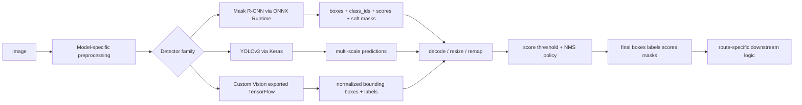
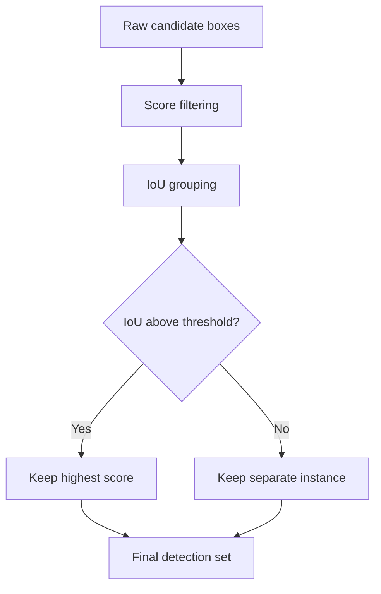
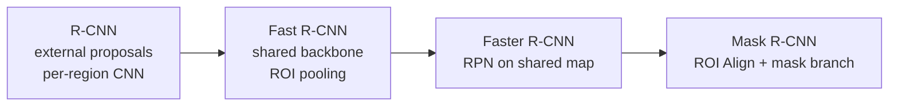

# Chapter 12 - Object Detection

## Reading Scope
This is a direct-read synthesis of Chapter 12 from the user-provided local PDF *Applied Machine Learning and AI for Engineers*.
The chapter is now promoted to `canon_ready` because the note no longer stops at detector-family intuition. It makes the runtime contract explicit:
- detector outputs are structured route inputs, not decorative model artifacts;
- postprocessing is part of the model behavior surface;
- export/runtime parity can change what the route actually sees;
- managed detector services reduce modeling burden but not governance burden.

## Why This Slice Matters
Image classification says *what* is present. Object detection must also prove:
- how many instances exist;
- where each instance is located;
- which label belongs to each region;
- whether overlapping boxes are duplicates or distinct objects;
- whether the runtime can decode, filter, and ship those regions consistently.

That matters for Agent Studio whenever downstream behavior depends on:
- box-aware OCR or layout extraction;
- region-conditioned editing or cropping;
- counting, inventory, or moderation logic;
- spatial grounding before retrieval or generation;
- deployment on edge or managed inference surfaces with different postprocessing semantics.

## Detection Output Is A Product Contract
A usable detector route does not end at raw model tensors. It ends at a typed object set:
- bounding boxes;
- class labels;
- confidence scores;
- optional masks;
- decoding, threshold, and suppression rules that explain how those outputs were chosen.

## Non-Maximum Suppression Is Part Of The Contract
The chapter treats NMS as the step that turns noisy overlapping candidates into a usable final set.
Core behavior:
- rank or filter candidate boxes by confidence;
- compute IoU overlap groups;
- keep the strongest candidate in a competing group;
- suppress lower-scoring overlaps.

High-value implementation details:
- the chapter's framing uses the familiar **0.5 IoU** operating point as a starting threshold;
- NMS behavior changes crowded-scene recall, duplicate-box frequency, and same-class adjacency handling;
- confidence and IoU thresholds must be evaluated together, not tuned in isolation;
- backend differences matter: official `torchvision.ops.nms` docs warn that exact winner selection can differ between CPU and GPU when scores tie.

Release implication: NMS is both a quality knob and a reproducibility/debugging knob.

## The R-CNN Line: Precision Through Structured Refinement
### R-CNN
The original R-CNN pipeline is explicitly a three-stage hybrid stack:
1. generate up to roughly 2,000 candidate regions;
2. run CNN feature extraction on each region;
3. classify regions with downstream classifiers such as SVMs.

Why it mattered:
- it made deep features competitive for detection.

Why it was painful to deploy:
- repeated CNN computation across overlapping proposals;
- proposal generation lived outside the learned model graph;
- runtime packaging was awkward because proposal logic, features, and classification were not one clean serving contract.

### Fast R-CNN
Fast R-CNN is the first major runtime simplification:
- run the backbone once over the full image;
- project proposals onto the shared feature map;
- use ROI pooling to normalize variable-sized regions;
- split the head into **classification plus bounding-box regression**.

The key gain is not merely a new pooling layer. It is **shared convolutional reuse**.
A useful intuition from the book: ROI pooling can reduce an 8×16 feature region to a fixed 4×4 representation by partitioning the region into bins and pooling within each bin.

### Faster R-CNN
Faster R-CNN replaces external proposal generation with a learned region proposal network.
Important mechanics:
- a shallow CNN slides over the shared feature map;
- each position evaluates multiple anchor boxes;
- anchors receive objectness decisions based on IoU against ground truth;
- proposals feed the detector for classification and coordinate refinement.

This is the decisive deployability shift in the R-CNN line: proposal generation becomes trainable, feature-sharing, and GPU-friendly rather than a separate heuristic stage.

### Mask R-CNN
Mask R-CNN adds a parallel mask branch and upgrades ROI handling to ROI Align.
That matters because masks care about spatial precision in a way bounding boxes alone do not.
Official corroboration sharpens the implementation meaning:
- ROI Align behavior depends on alignment and sampling choices;
- mask quality is sensitive to how region features are sampled, not only to adding a mask head.

## YOLO: The One-Stage Route
The book uses YOLO to represent the opposite architecture choice: unified high-throughput detection.
Core mechanics:
- inference treats detection as direct prediction from the full image;
- localization and classification happen in one route instead of a proposal-first cascade;
- predictions are produced at multiple scales;
- postprocessing still depends on score filtering and NMS.

For the YOLOv3 example path in the chapter:
- input is resized to **416×416**;
- pixels are scaled by **`/255`**;
- prediction happens at three scales corresponding to different object sizes;
- decoded boxes must be mapped back with the **original image width and height**;
- the raw model can emit thousands of candidates before filtering.

A practical lesson from the chapter's example: postprocessing defaults can hide real objects. Lowering the score threshold can recover missed detections, which means some apparent recall failures are threshold-policy failures rather than representation failures.

## Runtime Contracts In The Chapter
### Mask R-CNN Through ONNX Runtime
The chapter's ONNX example makes runtime ownership concrete.
The helper path is not just “load ONNX and run predict.” It also requires:
- resizing images;
- forcing width and height to multiples of 32;
- converting RGB input to **BGR** for the example pipeline;
- normalization before inference;
- output decoding after inference;
- resizing masks back into source-image coordinates.

The output contract is effectively a 4-array bundle:
- boxes;
- integer class IDs;
- confidence scores;
- per-instance soft masks.

The masks are low-resolution soft masks that must be remapped to the original image, which means the user-visible spatial result depends on postprocessing discipline, not only on model weights.

### YOLOv3 Through Keras
The YOLO path illustrates a different serving shape:
- resize and scale the image;
- run the model once;
- decode predictions across scales;
- rescale boxes back into source-image coordinates;
- apply thresholds and NMS.

Operational lesson: “single-stage” does not mean “no decoding burden.” A simple route still needs explicit ownership of scaling, candidate decoding, suppression, and threshold policy.

### Exported Custom Vision TensorFlow Contract
The managed-service path matters because many teams want custom classes without owning detector training from scratch.
The book's export path shows that the local inference contract still matters after managed training:
- exportability depends on choosing the right project/domain options at creation time;
- local bundles include model files plus label/config support files;
- bounding boxes are expressed in normalized coordinates and must be scaled back to source dimensions;
- local wrappers still impose channel-order and preprocessing expectations.

Managed training lowers modeling friction, but not the need to reason about artifact format, runtime compatibility, and downstream decoding.

## Metrics And What Counts As Correct
Detector correctness is inherently multi-dimensional:
- class is right or wrong;
- box is right or wrong;
- duplicates were suppressed well or badly;
- small objects were retained or dropped;
- masks are spatially useful or not.

Relevant release metrics include:
- precision;
- recall;
- mAP;
- threshold-sensitive crowded-scene behavior;
- optional mask fidelity where segmentation matters.

This is the biggest release-gate delta from pure classification: a high-confidence label is not sufficient if localization is wrong, duplicates persist, or thresholds erase business-relevant instances.

## Custom Object Detection With Azure Custom Vision
The chapter's most applied route is Azure Custom Vision.
Its real architectural lesson is not “managed AI is easier,” but rather:
- dataset and annotation quality still dominate outcome quality;
- project/domain choices constrain exportability up front;
- evaluation still depends on threshold and overlap policy;
- vendor lifecycle risk remains part of the deployment contract.

Important operational details carried from the chapter plus official docs:
- use object-detection project settings that preserve the intended export path;
- every object instance should be tagged because unlabeled content becomes implicit negative evidence;
- overlapping boxes are expected in occlusion-heavy scenes;
- evaluation exposes both probability and overlap thresholds;
- managed deployment and exported deployment have different operational constraints.

## Failure Modes The Chapter Surfaces
- Thresholds look good on sparse sample images but collapse crowded same-class scenes.
- Export succeeds, but preprocessing or box-format assumptions drift between training and serving.
- Teams review raw tensors or demo overlays instead of the final postprocessed contract.
- A detector is selected for speed without checking whether localization precision is the actual business bottleneck.
- A managed detector project is created without export-compatible settings and later cannot satisfy local-runtime requirements.
- Product teams borrow classification-style metrics and miss localization or suppression failures.

## Applied-ML Release-Gate Delta
Compared with Chapter 10 vision classification, a detector release must additionally prove:
- class correctness;
- box correctness;
- decode-path correctness;
- NMS and score-threshold behavior;
- crowded-scene and same-class adjacency behavior;
- small-object performance;
- optional mask fidelity where relevant;
- preprocessing and coordinate-format parity across export/runtime targets;
- fallback or rollback if runtime packaging changes visible detector behavior.

## Minimum Practical Checklist
- Tune score and IoU thresholds on route-real imagery, not demo images only.
- Test same-class adjacent objects to catch over-suppression.
- Verify coordinate formats when moving between PyTorch, ONNX, and managed exports.
- Evaluate the postprocessed output contract, not only raw model outputs.
- Measure latency on the real serving surface.
- For managed detectors, decide hosted versus exported deployment before the product contract hardens.
- Preserve threshold, preprocessing, decode, and NMS settings as versioned route evidence.

## Bottom Line
Chapter 12's durable lesson is that object detection is not just a bigger image classifier.
It is a **region-producing runtime contract** whose business behavior depends on detector family, shared-feature reuse, proposal strategy, threshold policy, NMS semantics, output decoding, export/runtime compatibility, and annotation governance.

That makes object detection highly relevant to Agent Studio: downstream routes often act on *where* something is, not merely *what* it is, so the release gate has to justify the spatial claim as carefully as the class label.