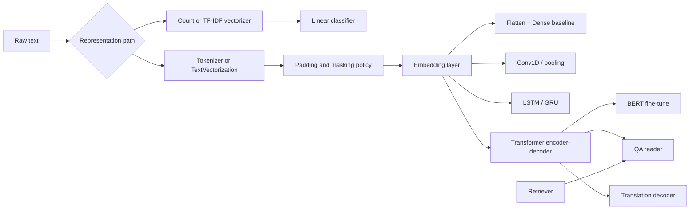

# Chapter 13 - Natural Language Processing
## Reading Scope
This note replaces the older thin summary with a direct-read synthesis of the local Chapter 13 extract.
The chapter's highest-value production slice is the **classical-to-deep NLP transition**:
- text -> token IDs -> padded sequences -> embeddings;
- scratch text classifiers versus pretrained representations;
- order-insensitive baselines versus CNN/RNN/transformer sequence models;
- retriever-reader QA and translation as route decompositions rather than monolithic "NLP features."
It stores original synthesis only, not copied prose or long code dumps.

## Why This Chapter Matters
Chapter 4 already covered bounded classical text classification with sparse features.
Chapter 13 is the follow-through that explains when sparse lexical pipelines stop being enough.
The durable lesson is that NLP route quality is determined first by the **representation contract** and only second by the classifier head.
A route that preserves only unordered word counts cannot recover sequence meaning later.
A route that versions tokenizer, padding, masking, embedding family, encoder class, and sequence length can evolve from simple classifiers to modern pretrained models without losing auditability.
For Agent Studio, this chapter is valuable because it connects everyday text routes to the same design surfaces that matter in RAG, QA, translation, and LLM adaptation.

## The Core Architecture Shift
The chapter's central progression is straightforward:
1. classical NLP turns text into sparse counts or TF-IDF weights;
2. deep NLP turns text into ordered token IDs;
3. an embedding layer converts IDs into dense vectors;
4. a downstream encoder or reducer determines how much order and context the route can actually use.
This is not merely an implementation preference.
It changes what the model is able to express:
- sparse bag-of-words is cheap, interpretable, and good with small data;
- learned embeddings add semantic proximity;
- sequence-aware encoders preserve local or long-range order;
- pretrained transformer encoders reuse language understanding instead of rebuilding it from scratch.

## Tokenization Is Deployable State
The deep-learning text pipeline starts by converting strings into vocabulary-bound token IDs.
The chapter uses Keras `Tokenizer` for this move, and the enduring production lesson is that the tokenizer is not a disposable preprocessing helper.
It is part of the model artifact.
Key points:
- token IDs are only meaningful relative to the fitted vocabulary;
- unseen terms require an OOV policy;
- normalization choices change the effective evidence surface;
- inference breaks if train-time and serve-time tokenization diverge.
The modern Keras/TensorFlow delta is that `TextVectorization` can own more of this pipeline directly, which improves train/serve parity and makes tokenization policy easier to package with the model.

## Padding And Sequence Length Are Route Contracts
Unlike bag-of-words features, sequence models need a shape-controlled input tensor.
That is why the chapter uses `pad_sequences`.
This looks like plumbing, but it defines two important production decisions at once:
- **how much context the route is allowed to see**;
- **how much memory/latency the route is allowed to consume**.
Important implications:
- truncation is an information-loss policy, not a cosmetic setting;
- padding side can affect positional meaning in sequence-aware models;
- masking support determines whether padded tokens silently corrupt downstream computation.
For Agent Studio, sequence length should be treated as a release-gated configuration alongside prompt window, retrieval depth, and latency budget.

## Embeddings Are The First Semantic Upgrade
The embedding layer is the chapter's decisive break from classical feature engineering.
Instead of assigning one sparse coordinate per token, it learns a dense vector for each token ID.
That matters because semantically related words can now occupy nearby regions of vector space.
The route no longer relies only on literal token overlap.
Operationally, three embedding choices matter:
- vocabulary size (`input_dim`);
- embedding width (`output_dim`);
- sequence length / mask behavior.
Embedding width raises capacity but also increases parameter count and training cost.
The chapter's broader lesson is that representation power should be earned by task need, not added by default.

## Learned Versus Pretrained Embeddings
The chapter is careful not to claim that pretrained embeddings always win.
Its real message is more useful:
- with small data, pretrained embeddings often provide a better starting point;
- with enough in-domain data, task-specific embeddings can outperform generic ones;
- domain fit matters more than the abstract label "pretrained."
That logic maps cleanly to modern LLM system design:
- use off-the-shelf representation when the task is common and labeled data is limited;
- adapt or fine-tune when vocabulary, tone, ontology, or answer behavior is domain-specific;
- treat representation reuse as an economics decision, not just a modeling decision.
A modern extension from the corroboration pass is that subword-aware or transformer-era tokenization often handles OOV and morphology better than static word-level pipelines.

## Baseline Neural Text Classifier
The chapter's simplest neural baseline is:
`Embedding -> Flatten -> Dense -> output`
This is a useful first model because it is easy to build and often strong enough for bounded tasks such as spam and sentiment classification.
But it has an important limitation: after the embedding step, `Flatten` mostly preserves token presence more than sequence structure.
So it behaves like a denser, more flexible cousin of bag-of-words, not a full sequence reasoner.
That is why this route is best understood as a **cheap neural baseline** rather than a general NLP default.

## Spam And Sentiment: Data Hygiene Still Dominates
The spam and IMDB examples make a practical point that remains true in modern pipelines.
A deep text model still depends heavily on:
- deduplication;
- label cleanliness;
- train/validation split discipline;
- vocabulary cap;
- sequence-length choice;
- threshold policy over the output score.
The chapter also notes that stop-word removal is not automatically beneficial.
That matters because it pushes against the common habit of cargo-cult preprocessing.
For Agent Studio, the lesson is simple: if a route is bounded and the labels are clean, disciplined preprocessing and evaluation often matter more than jumping immediately to a larger encoder family.

## TextVectorization Improves Train/Serve Parity
One of the chapter's best practical upgrades is moving from an external tokenizer workflow to `TextVectorization`.
This matters because preprocessing can then live inside the model or its tightly-coupled serving boundary.
Benefits:
- fewer external artifacts to keep synchronized;
- a clearer raw-text input contract;
- easier export of vocabulary and sequence-shaping behavior;
- lower risk of inference skew.
The important caveat is that `TextVectorization` must be fitted with `adapt()`, and modern Keras export paths are more natural with SavedModel-style workflows than with older H5 assumptions.
That is exactly the sort of packaging detail that turns an educational notebook into a durable production route.

## When Order Starts To Matter
The chapter's transition away from simple embedding+dense models is motivated correctly: many text tasks depend on token order, local phrase patterns, or context-dependent meaning.
A classifier that sees the same tokens but not their arrangement can misread:
- negation;
- role reversal;
- phrase boundaries;
- nearby modifier effects.
This is the right reason to escalate model class.
Not because "deep learning is better," but because the cheaper representation is discarding information the task actually needs.

## N-Grams As The Cheapest Order Signal
Before jumping to sequence models, the chapter uses n-grams to recover some adjacency information.
This is still a useful engineering tactic.
Bigram features often buy meaningful gains while keeping the route simple, auditable, and fast.
Their limitation is equally important: they only recover short local order and do not model broader context.
So n-grams are best viewed as an intermediate move when:
- latency is tight;
- interpretability still matters;
- full sequence models would be operational overkill.

## Conv1D Text CNNs: Local Pattern Extractors
The Conv1D pipeline is the chapter's first real sequence-aware architecture.
Its key strength is that it can learn short phrase motifs rather than isolated tokens.
That makes it a good fit when local combinations matter more than long discourse structure.
The useful production interpretation is:
- Conv1D is a middle ground between bag-of-words simplicity and recurrent/transformer complexity;
- pooling creates position-tolerant summary features;
- the route is often lighter than a recurrent model while capturing more structure than a flat dense baseline.
The chapter is also disciplined enough to note that Conv1D is not automatically better on every dataset.
That caveat should survive into any production note.

## Recurrent Models: Sequential Context With Cost
RNNs, LSTMs, and GRUs are introduced as explicit sequence models whose hidden state carries prior context forward.
This makes them more suitable than flat baselines when the meaning of later tokens depends on earlier ones.
The chapter also names their main practical weaknesses:
- training is more compute-intensive;
- long-range dependencies are harder;
- added complexity does not guarantee a validation gain large enough to justify the cost.
That is the important deployment lesson.
Sequence awareness is valuable only when the task earns it.
A recurrent route should not be promoted just because it feels more sophisticated than a dense baseline.

## Attention And Transformers
The transformer section is the chapter's most durable systems contribution.
Its core idea is that token meaning should be allowed to change with context.
Attention lets the model weight relationships among tokens rather than relying on one static embedding per word.
The chapter highlights the practical advantages that still define modern NLP:
- parallelizable training relative to recurrent loops;
- stronger long-range context handling;
- multiple attention heads learning different token relations;
- positional encodings restoring order information that attention alone does not provide.
This is the correct bridge from older deep NLP to LLM-era design.
The route's power is not just more parameters.
It is context-sensitive representation under a clearer sequence contract.

## BERT And The Buy-Versus-Build Shift
The BERT material makes the chapter's biggest economic argument.
Pretraining is expensive, but reusing a pretrained encoder makes high-quality downstream classification and QA accessible without rebuilding language understanding from scratch.
This changes the engineering center of gravity:
- less effort goes into designing raw sequence models from zero;
- more effort goes into model selection, tokenization compatibility, evaluation, and task-specific fine-tuning.
The fine-tuning example with DistilBERT sharpens that point:
- low learning rates matter;
- dynamic padding matters for memory efficiency;
- a few accuracy points may cost materially more runtime and training complexity.
For Agent Studio, this is the same decision pattern seen everywhere else: extra model capability must justify extra operational burden.

## Retriever-Reader QA Is The Direct RAG Precursor
The QA section is especially valuable because it does not treat question answering as one opaque model call.
Instead it separates the problem into:
- a **retriever** that surfaces candidate documents;
- a **reader** that extracts an answer span from those candidates.
That decomposition is an obvious ancestor of modern RAG systems.
The chapter also exposes the output contract that matters operationally:
- answer text;
- confidence score;
- start and end span indices.
This is far more actionable than a plain free-form answer.
It supports thresholding, no-answer fallback, span highlighting, and downstream audit.
The broader design rule is that answer generation should stay coupled to evidence selection and confidence policy, not be released as raw model prose by default.

## Translation And Sequence Generation
The translation section pushes the chapter beyond classification.
Its practical value is showing that sequence generation requires a different contract from single-label prediction.
A translation route must manage:
- source tokenizer and target tokenizer;
- start/end token policy;
- shifted decoder inputs during training;
- autoregressive token-by-token inference at serve time;
- a sequence metric such as BLEU instead of raw token accuracy.
This matters because it teaches the right evaluation reflex.
Once the route is generating sequences rather than class labels, token-level accuracy is too weak a proxy for user-perceived quality.
That same metric mismatch shows up in summarization, rewriting, tool-argument generation, and other LLM behaviors.

## Pretrained Pipelines As The Default For Commodity Tasks
The chapter's repeated recommendation to reuse Hugging Face pipelines for sentiment, emotion, QA, and translation is more than a convenience tip.
It is an architecture rule:
- use pretrained task routes first when the task is common;
- only train from scratch or fine-tune when the baseline route fails on your actual distribution;
- measure the delta before accepting the added training, deployment, and monitoring complexity.
This is the NLP analogue of transfer learning in vision.
The highest-value design move is often not building a bigger model, but selecting a stronger prior and validating it properly.

## Failure Modes
- Tokenizer or vocabulary state changes without a coordinated model/version change.
- Sequence length or truncation policy silently removes the evidence needed for rare long-context cases.
- Padding is added but masks are not propagated to sequence-aware layers.
- A flat embedding+dense baseline is treated as if it models order-sensitive reasoning.
- A pretrained encoder is adopted without checking tokenization compatibility, label ontology, or latency budget.
- QA confidence is ignored and a reader answer is published without evidence-coverage or no-answer policy.
- Translation or generative routes are evaluated with token accuracy rather than sequence-level quality metrics.
- Teams fine-tune because the workflow exists, not because the quality delta justifies the cost.

## Agent Studio Release-Gate Delta
This chapter upgrades text routes from "some NLP model" into a governed contract.
Before a deep-NLP or pretrained-text route affects product behavior, the release gate should record:
- tokenizer or vectorization artifact and vocabulary version;
- OOV policy, normalization policy, and sequence-length cap;
- padding and masking semantics;
- embedding family or pretrained encoder choice;
- encoder class (dense baseline, Conv1D, recurrent, transformer, reader, seq2seq);
- task metric matched to the route surface;
- threshold / abstain / no-answer policy;
- latency and memory behavior under target sequence lengths;
- fallback when retrieval misses, token budget truncates, or model confidence collapses.
The practical rule is concise: **ship a text route only when representation, context budget, evaluation metric, and fallback policy are versioned together.**

## Minimum Practical Checklist
- Start bounded tasks with the simplest route that preserves the information the task actually needs.
- Treat tokenizer/vectorizer state as deployable model state.
- Version sequence length, truncation side, padding side, and masking behavior.
- Prefer model-owned preprocessing when it reduces train/serve skew.
- Use pretrained pipelines for commodity NLP tasks before considering custom training.
- Escalate from dense baseline -> Conv1D/RNN -> transformer only when the task surface earns the extra complexity.
- Keep retriever-reader decomposition explicit for evidence-backed QA.
- Match metrics to route shape: classification metrics for labels, sequence metrics for generation, span/no-answer metrics for extractive QA.

## Bottom Line
Chapter 13's durable lesson is that modern NLP routes are really **representation-and-context contracts**.
Tokenization, padding, masking, embeddings, encoder family, and pretrained reuse determine what the route can understand, how much it costs, and how safely it can be evaluated.
For Agent Studio, the chapter matters because it connects classical text pipelines to transformer-era QA, translation, and retrieval-backed reasoning without pretending that every text task needs the largest possible model.
The right route is the one whose representation power matches the task, whose preprocessing is reproducible, and whose failure policy is explicit enough to survive production use.
