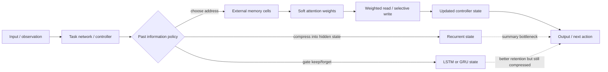

# Deep Learning Chapter 10 - Explicit Memory and Attention as Differentiable Addressing

## Reading Status

Direct local-PDF read of the highest-value follow-through slice inside Chapter 10's explicit-memory section: `pdftotext` lines 844-974 from the existing Chapter 10 extraction. This note narrows the broader sequence-memory note to the architectural pivot from gated recurrence toward addressable memory and attention-style access. It stores compact original synthesis only.

## Core Lesson

The durable shift is not merely that the model gets "more memory." The shift is that memory stops being something information survives inside and becomes something the system can deliberately place, revisit, and update. Recurrent hidden state relies on preservation through time. Explicit memory relies on addressing.

That change matters because it replaces compression pressure with access control. Once the model can choose where to read and write, long-horizon behavior no longer depends only on whether one evolving hidden state happened to keep the right fact alive.

## Why Recurrent State Hits A Ceiling

The existing Chapter 10 note already covers vanishing gradients, exploding gradients, gating, and multi-timescale state. This narrower slice explains why those fixes still leave a ceiling:

- gated recurrence improves retention, but most information is still funneled through a compact state trajectory;
- seq2seq-style encoding proves transduction works, but fixed summaries become bottlenecks when tasks need sparse or late recall;
- long-horizon reasoning often needs exact fact reuse, not only a persistent gist.

The engineering takeaway is that better recurrence reduces failure probability, but explicit memory changes the contract entirely.

## Explicit Memory Changes The Storage Contract

The chapter distinguishes implicit and explicit knowledge. Neural networks are good at implicit pattern storage, but weak at rapidly writing and precisely reusing specific facts. Explicit memory addresses that weakness by separating:

- a task network that decides what to do next;
- a memory substrate that stores facts;
- read and write mechanisms that choose where interaction happens.

This is the important systems analogy:

| Mechanism | What is preserved | Failure mode |
|---|---|---|
| Plain recurrent state | Whatever survives repeated transitions | Long-range facts decay or are overwritten |
| Gated recurrent state | Better controlled retention and forgetting | Still compresses many facts into a narrow state path |
| Explicit memory | Facts placed into addressable slots | Bad addressing, bad write policy, or poor retrieval focus |

## Attention Is Better Understood As Address Selection

The chapter's strongest follow-through claim is that the address-selection mechanism used for explicit memory is structurally identical to attention. That makes attention more than a decoder convenience. It is a differentiable policy for selective access.

Three linked ideas matter:

1. **Exact addresses are hard to optimize.** Discrete slot choice creates difficult learning problems.
2. **Soft attention is the relaxation.** The model reads from many cells with weighted coefficients instead of one hard slot.
3. **The weighted read keeps gradients alive.** Because the coefficients remain differentiable, gradient descent can improve access policy instead of treating lookup as a black box.

This is why attention belongs in the same lineage as explicit memory rather than being treated as a separate decorative trick.

## From Seq2Seq Bottleneck To Attention

The corroborating seq2seq papers sharpen the chapter's implicit story:

- early encoder-decoder models showed sequence transduction is viable;
- the fixed-length source vector became the architectural bottleneck;
- attention solved the bottleneck by letting the decoder revisit relevant source positions;
- Transformers then kept the selective-access mechanism and removed recurrence.

The main design rule is therefore:

> if the task depends on selective reuse of specific earlier evidence, the system should prefer an access mechanism over stronger compression.

## Why Vector-Valued Memory Matters

The chapter explains why memory cells grow beyond scalar storage:

- access becomes expensive, so each successful access should return richer structure;
- vector-valued cells enable content-based lookup rather than location-only lookup;
- partial matches become possible, which is the mechanism behind associative recall.

This distinction maps cleanly to production systems:

- location-based access resembles known-key slot retrieval;
- content-based access resembles semantic lookup or retrieval from approximate cues;
- richer memory objects make partial-match recall useful instead of brittle.

## Soft Addressing Versus Hard Addressing

The chapter is explicit that soft differentiable access is easier to train than hard discrete decisions. That creates a deployment-relevant distinction:

- **soft addressing** gives smoother optimization and graded contribution from multiple locations;
- **hard addressing** offers cleaner discrete semantics but needs more specialized optimization and harsher failure handling.

For system design, this means not every memory-bearing route should be governed the same way. A differentiable attention path, a retrieval-ranked source path, and a hard-write workflow memory each need different observability and rollback expectations.

## Memory-As-Reasoning, Not Just Memory-As-Storage

The chapter frames explicit memory as support for reasoning in steps rather than one-shot intuitive responses. That matters because the controller can:

- store a fact when it first becomes relevant;
- inspect memory again later from a different state;
- update what matters without re-encoding everything into one hidden summary;
- reason over retrieved fragments rather than over one compressed latent state.

This is the bridge from classical recurrent models to modern retrieval, agent memory, and tool-backed reasoning workflows.

## Memory-Addressing Diagram

## Agent Studio Design Rules

1. **Declare the memory mechanism, not just the context length.** A route should say whether it relies on latent state, gated state, attention over supplied context, retrieval, or writable memory.
2. **Separate storage from access.** It is not enough to say information is "available." The route should specify how later steps locate it.
3. **Treat compression boundaries as risk surfaces.** Any design that forces many facts into one summary needs explicit loss testing.
4. **Prefer addressable memory when correctness depends on exact fact reuse.** Hidden-state persistence is weaker evidence than explicit lookup.
5. **Audit read and write policy separately.** Retrieval quality and write quality fail differently.
6. **Use associative recall tests.** Partial-cue recovery is where content-based memory proves its value.
7. **Do not equate attention with explanation.** Attention can show access focus, but it still needs grounding, retrieval, and evaluation policy.

## Datastore Implications

Add or strengthen:

- `memory_access_mode`: `latent_state | gated_state | cross_attention | external_memory | retrieval_memory | hybrid`
- `sequence_compression_boundary`: where evidence is forced into a compact latent summary
- `memory_addressing_policy`: `content_based | location_based | hybrid | soft | hard`
- `memory_write_policy`: write trigger, overwrite rule, reset rule, and retention horizon
- `read_write_observability_record`: what access decisions are logged and replayable
- `partial_cue_recall_eval`: whether incomplete cues can recover the needed stored object
- `compression_loss_eval`: failures caused by forcing long evidence through one summary
- `attention_memory_release_gate`: evidence that the chosen access mechanism matches the route's dependency horizon, observability needs, and fallback path

## Attention-Memory Release Gate

Before promoting a route that depends on selective long-horizon recall, require proof that:

- the route declares whether it relies on hidden state, attention over supplied context, retrieval, or writable memory;
- compression boundaries are explicit and tested for loss under long or distractor-heavy inputs;
- read policy and write policy are separately auditable;
- partial-cue recall and out-of-order recall are tested where content-based memory is claimed;
- the fallback path is clear when selective access fails or memory quality drops;
- deployment traces preserve enough access metadata to debug memory errors rather than only final outputs.

Minimum fields: `gate_id`, `route_id`, `candidate_release_id`, `memory_access_mode`, `sequence_compression_boundary_ref`, `memory_addressing_policy_ref`, `memory_write_policy_ref`, `read_write_observability_ref`, `partial_cue_recall_eval_ref`, `compression_loss_eval_ref`, `fallback_ref`, `rollback_target_ref`, `decision`, and `reviewed_at`.

## Relation To Current Canon

This note closes the narrow remaining Deep Learning follow-through gap on explicit external memory and attention-versus-recurrence tradeoffs. The broader Chapter 10 note still carries the long-dependency, gating, and explicit-memory overview. This focused slice explains why attention should be treated as differentiable addressing and why modern long-context systems should prefer explicit access mechanisms over stronger hidden-state compression when exact fact reuse matters.