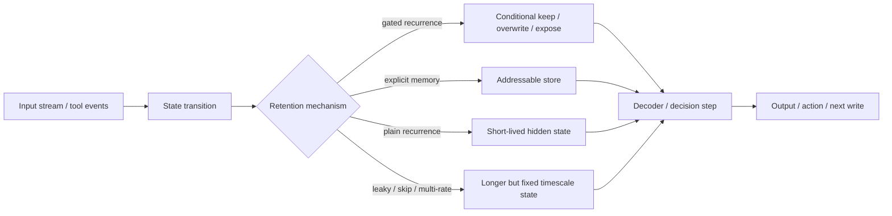

# Deep Learning Chapter 10 - Sequence Modeling Long-Dependency Controls

## Reading Status

Direct local-PDF read of the highest-value remaining Chapter 10 slice for sequence behavior and memory design: printed pages 401-420, covering long-term dependency failure modes, echo state networks, multi-timescale strategies, LSTM/GRU-style gated recurrence, optimization for long dependencies, and explicit external memory. This note stores compact original synthesis only.

## Core Lesson

Sequence quality is not just about modeling local order. The real engineering problem is whether information can survive long enough, be overwritten deliberately, and be surfaced at the right time without destabilizing optimization. Plain recurrent state is often too fragile for this job. The durable fixes are architectural: gating, multi-timescale paths, clipping, and eventually explicit memory or attention-like retrieval.

Agent Studio equivalent: long context, multistep agent state, memory stores, and tool-driven reasoning should be treated as governed sequence systems. If the route cannot explain how it retains, forgets, or recalls information across long horizons, it does not have a memory contract.

## Why Long Dependencies Fail

The chapter sharpens a key point from the broader Deep Learning anchor note: long-term dependency failures are not mysterious. Repeated Jacobian products make remote interactions exponentially weaker than near-term ones in most regimes, while rare exploding gradients can destroy optimization when the system lands on steep cliffs.

Practical consequences:

- short-horizon behavior can look healthy while long-horizon recall is broken;
- stable training loss does not prove useful memory retention;
- optimization controls alone are insufficient if the architecture keeps forcing information through brittle recurrent state.

## The Memory Problem Is Structural

| Failure surface | What goes wrong | Why it matters for routes |
|---|---|---|
| Vanishing gradients | Old evidence stops influencing current updates | Long-running tasks forget earlier constraints or facts |
| Exploding gradients | Rare steps dominate the trajectory | One bad batch, critique step, or update can destabilize behavior |
| Fixed hidden-state bottleneck | Too much information must fit into one compressed state | Summaries replace recoverable evidence with lossy latent guesses |
| Single timescale recurrence | Same mechanism handles both local and long-range effects | Route behaves well on short prompts but fails across extended workflows |

## Three Families Of Partial Fixes Before Full Gating

### 1. Echo State Networks

Echo state networks keep a fixed recurrent reservoir and train only a simpler readout. This dodges the hardest optimization problem by refusing to learn the recurrent transition directly.

Durable lesson: sometimes the smartest fix is not a stronger optimizer but a reduced training surface. Agent systems should apply the same instinct when a learned controller is unstable: freeze more, learn less, and keep the writable part narrow.

### 2. Multi-timescale Paths

The chapter describes skip connections through time, leaky units, and group-specific update rates. These all try to reduce the number of fragile hops that a useful signal must survive.

Operational interpretation:

- skip paths preserve rare but important evidence across longer chains;
- leaky state preserves slow trends without forcing total overwrite every step;
- multi-rate subsystems separate fast reaction from slow memory.

### 3. Clipping And Gradient-Shaping

Gradient clipping is a safety control, not a cure. It reduces catastrophic explosions but does not solve the underlying representational bottleneck. Likewise, penalties that encourage stable gradient flow can help, but the chapter treats architecture choice as the more durable lever.

## Why Gated RNNs Win

Gated recurrence works because it makes retention and overwrite conditional rather than fixed. The system can learn when to copy, when to replace, and when to expose stored state.

### LSTM

The LSTM's cell state is the chapter's main durable mechanism:

- a self-loop provides a path for information to persist;
- forget and input gates decide whether memory is preserved or overwritten;
- an output gate controls what part of memory becomes visible downstream.

This turns memory from an accidental side effect into a governed interface.

### GRU And Related Variants

GRUs compress some of the LSTM roles into simpler gates. The chapter's durable point is not that one variant universally wins, but that **forgetting control** is the critical ingredient. Architecture comparisons matter less than whether the route has an explicit retention mechanism at all.

## Encoder-Decoder Bottlenecks And The Bridge To Attention

The chapter's sequence discussion naturally leads to encoder-decoder systems: an input sequence is compressed into a representation that the decoder must rely on later. The corroborating papers show why this matters:

- early seq2seq systems proved end-to-end sequence transduction was viable;
- the fixed-length encoding became a bottleneck for longer or more information-dense inputs;
- attention emerged as the remedy because it lets the decoder revisit specific source positions instead of depending on one compressed summary.

This is directly relevant to RAG, agent memory, and long-context orchestration: retrieval and attention-like access are architectural responses to state bottlenecks, not optional embellishments.

## Explicit Memory Changes The Contract

The chapter closes by moving beyond hidden state toward memory-augmented models such as memory networks and Neural Turing Machines. The critical design shift is that memory becomes addressable rather than implicit.

That changes the engineering contract:

- the system can store facts without requiring weight updates;
- reads and writes become inspectable design decisions;
- forgetting, reset, and retrieval strategy can be tested explicitly;
- long-horizon behavior no longer depends entirely on latent state survival.

## Sequence-Control Diagram

## Agent Studio Design Rules

1. **Declare the dependency horizon.** Every route should state whether it only needs local context, medium-range state, or explicit long-horizon memory support.
2. **Separate retention from exposure.** A route must specify not only what is stored, but when stored information is allowed to influence downstream decisions.
3. **Treat forgetting as a first-class policy.** Reset, overwrite, and garbage-collection logic belong in the design, not as accidental byproducts.
4. **Do not confuse clipping with memory competence.** Stability controls help optimization; they do not prove long-range recall.
5. **Escalate architecture before escalating optimizer complexity.** When long-horizon behavior is failing, consider gating, retrieval, or explicit memory before exotic training tricks.
6. **Test long-horizon and interruption recovery separately.** Short-prompt accuracy is not enough for memory-bearing systems.

## Datastore Implications

Add or strengthen:

- `dependency_horizon_record`: short/medium/long horizon, expected recall distance, and failure mode if exceeded.
- `state_mechanism_record`: plain recurrence, leaky state, gated state, retrieval-backed memory, or external memory.
- `forget_policy_record`: overwrite rule, reset trigger, stale-state cleanup, and reviewer approval path.
- `memory_addressing_record`: latent-only, location-based, content-based, or hybrid addressing.
- `sequence_eval_record`: short-horizon score, long-horizon score, interruption recovery, and stale-state regression slices.
- `sequence_memory_release_gate`: evidence that the chosen memory mechanism matches dependency horizon, remains stable under long traces, and has a defined fallback when state quality degrades.

## Sequence-Memory Release Gate

Before promoting a route that depends on long context, recurrent state, explicit memory, or multi-step agent loops, require proof that:

- the dependency horizon is declared and matches the product task;
- the retention mechanism is explicit rather than inferred from good luck on short examples;
- overwrite, reset, and stale-state policies are tested;
- long-horizon evaluation is separated from ordinary task accuracy;
- clipping, initialization, or optimizer safeguards are recorded where iterative state updates are learned or adapted;
- the route has a simpler fallback for cases where memory confidence drops.

Minimum fields: `gate_id`, `route_id`, `candidate_release_id`, `dependency_horizon_record_ref`, `state_mechanism_record_ref`, `forget_policy_record_ref`, `memory_addressing_record_ref`, `sequence_eval_record_ref`, `stability_control_refs`, `fallback_ref`, `rollback_target_ref`, `decision`, and `reviewed_at`.

## Relation To Current Canon

This chapter note deepens the parent Deep Learning note's sequence-to-sequence, long-term dependency, and gradient-clipping discussion into a release-ready contract for memory-bearing systems. It also provides a bridge from older recurrent-memory ideas to later attention, retrieval, and external-memory patterns that already appear elsewhere in the vault.
