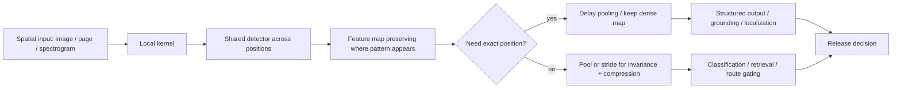

# Deep Learning Chapter 9 - Convolutional Networks Core Mechanics

## Reading Status

Direct local-PDF read of the highest-value reusable Chapter 9 slice: printed pages 331-357, covering the convolution operator, sparse interactions, parameter sharing, translation equivariance, pooling, architectural priors, multi-channel/strided/padded convolution, and locally connected or tiled variants. This note stores compact original synthesis only.

## Core Lesson

Convolutional networks win when the task really has local structure that repeats across space. Their advantage is not just speed. It comes from a deliberate architectural contract: look locally, reuse the same detector across positions, and optionally summarize nearby responses when exact location matters less than presence.

Agent Studio equivalent: for images, page layouts, spectrograms, and other spatially organized inputs, architecture choice should encode locality and invariance assumptions explicitly rather than pretending every task is a flat token sequence.

## What Convolution Actually Buys

The chapter sharpens four durable reasons convolution differs from a dense layer:

1. **Sparse interactions:** each output depends on a small neighborhood rather than the whole input.
2. **Parameter sharing:** one kernel is reused across many locations.
3. **Translation equivariance:** when the pattern moves, the response map moves with it.
4. **Variable-size support:** convolution can process spatial inputs without forcing an early flattening step.

These are not cosmetic implementation details. They are the source of the statistical, memory, and compute advantages of CNNs.

## Sparse Connectivity And Receptive Fields

A convolution layer limits direct connectivity, but deeper stacks still build wide effective context.

| Mechanism | Benefit | Failure if misunderstood |
|---|---|---|
| Local kernel | Cheap feature detection over edges, corners, textures, parts | Dense alternatives waste parameters on unnecessary global interactions |
| Deeper receptive field | Later layers combine simple local features into larger concepts | Teams may think "local" means CNNs cannot model larger objects |
| Stride / pooling | Broader context and smaller tensors | Over-aggressive downsampling destroys fine localization |

The chapter's durable point is that **global understanding is built from local repeated operators**, not granted for free at the first layer.

## Parameter Sharing Is The Real Compression Contract

Parameter sharing means a filter that detects a vertical edge can be reused anywhere a vertical edge might appear.

That gives three practical wins:

- far fewer parameters to store and fit;
- better sample efficiency because evidence from many positions trains the same detector;
- a cleaner inductive bias when the same local motif can recur across the input.

This is why CNNs are a good default for images, document regions, and spectrogram patches, but not for every spatial task. If top and bottom regions should learn different detectors, full sharing may be the wrong assumption.

## Equivariance Versus Invariance

The chapter separates two often-confused properties:

- **Convolution is equivariant to translation:** move the pattern, and the feature map response moves accordingly.
- **Pooling adds approximate invariance:** small shifts may stop changing the downstream summary.

That distinction matters operationally:

- classification often benefits from invariance;
- localization, segmentation, and grounding need equivariance preserved longer;
- systems that pool too early lose spatial evidence they later need.

## Pooling Is A Strong Prior, Not A Free Win

Pooling replaces a neighborhood with a summary statistic such as max or average.

Its durable effects are:

- reduced sensitivity to small local shifts;
- smaller activations for later layers;
- cheaper compute and less statistical burden downstream;
- fixed-size summaries for variable-size inputs.

But the book is explicit that pooling can underfit when exact position matters. If the route must decide *where* something is rather than merely *whether* it exists, blanket pooling is the wrong contract.

## Architectural Prior View

The chapter frames convolution and pooling as an **infinitely strong prior**:

- convolution hard-codes local interactions plus shared weights;
- pooling hard-codes tolerance to small translation.

This is a powerful design lens. CNNs perform well not because they are universally expressive, but because they bake in assumptions that are often true for natural images and related spatial data.

When those assumptions are wrong, the same prior causes underfitting. Exact geometry, long-range relations, or location-specific meaning can all require weaker sharing or less aggressive pooling.

## Variants That Matter In Practice

### Multi-channel convolution

Real inputs are not scalar grids. RGB images, intermediate feature stacks, and spectrogram feature banks all require kernels that mix channels as well as space. This is the bridge from simple edge detectors to learned hierarchical representation stacks.

### Stride

Stride is downsampling built into the convolution itself. It reduces compute and grows effective receptive field, but at the cost of spatial resolution.

### Zero padding

Padding is not just tensor bookkeeping. It controls whether deeper stacks remain spatially expressive. Without padding, repeated convolution shrinks the map quickly and limits depth.

### Locally connected or unshared layers

These keep local connectivity but remove global weight sharing. They are useful when local structure matters, but the same detector should not be reused everywhere.

### Tiled convolution and restricted channel connectivity

These compromise between dense flexibility and full sharing. They reduce memory and compute while keeping more heterogeneity than a standard shared kernel.

## Structured-Output Bridge

The chapter note's focused slice stops before the full structured-output section, but the included examples already imply an important bridge: once spatial structure is preserved through the stack, convolution can support not only classification but also dense prediction and location-aware outputs.

That is why the official cross-check pulls in fully convolutional and dilated-convolution references. The book's core mechanics are the foundation for segmentation, detection backbones, heatmaps, and page-region prediction.

## Convolutional-Prior Diagram

## Agent Studio Design Rules

1. **Match the prior to the modality.** Use CNN-style locality assumptions only when neighboring structure is semantically meaningful.
2. **Separate presence tasks from localization tasks.** Pooling is appropriate for "is it there?" routes, but risky for "where is it?" routes.
3. **Record downsampling ownership.** Stride, pooling, and resizing jointly decide whether later stages still have enough spatial evidence.
4. **Treat padding as an architectural decision.** It changes edge behavior, depth feasibility, and border representation quality.
5. **Do not confuse efficiency with sufficiency.** Shared local filters are efficient, but they can underfit if position-specific or long-range relations matter.
6. **Escalate to structured-output backbones deliberately.** Detection, segmentation, OCR layout grounding, and multimodal perception should preserve spatial maps longer than pure classification routes.

## Datastore Implications

Add or strengthen:

- `spatial_topology_record`: modality, grid structure, neighborhood semantics, and whether locality assumptions are justified.
- `feature_invariance_policy`: which transformations should be equivariant, approximately invariant, or explicitly preserved.
- `downsampling_record`: stride, pooling, resize chain, feature-map resolutions, and localization risk.
- `channel_connectivity_record`: full, grouped, depthwise, restricted, or unshared connectivity policy.
- `structured_output_readiness_record`: whether the route preserves enough spatial detail for boxes, masks, regions, or token-to-region grounding.
- `convnet_prior_release_gate`: evidence that locality, sharing, and invariance assumptions fit the production task rather than merely making training cheaper.

## Convnet-Prior Release Gate

Before promoting a vision, audio-visual, OCR, or document-layout route that depends on convolutional representations, require proof that:

- the input really has reusable local topology;
- the chosen downsampling schedule does not erase task-critical detail;
- pooling or stride choices match the task's invariance needs;
- border behavior and padding assumptions are known;
- any switch to grouped, depthwise, tiled, or unshared connectivity is motivated by compute, heterogeneity, or localization needs;
- dense-output tasks keep sufficient spatial granularity until the prediction head.

Minimum fields: `gate_id`, `route_id`, `candidate_release_id`, `spatial_topology_record_ref`, `feature_invariance_policy_ref`, `downsampling_record_ref`, `channel_connectivity_record_ref`, `structured_output_readiness_record_ref`, `latency_memory_benchmark_refs`, `fallback_ref`, `rollback_target_ref`, `decision`, and `reviewed_at`.

## Relation To Current Canon

This chapter note complements the broader Deep Learning anchor note by turning CNN theory into a reusable release contract for spatially structured routes. It also sharpens why later detection, segmentation, and multimodal perception notes should preserve or discard spatial detail intentionally rather than by default.