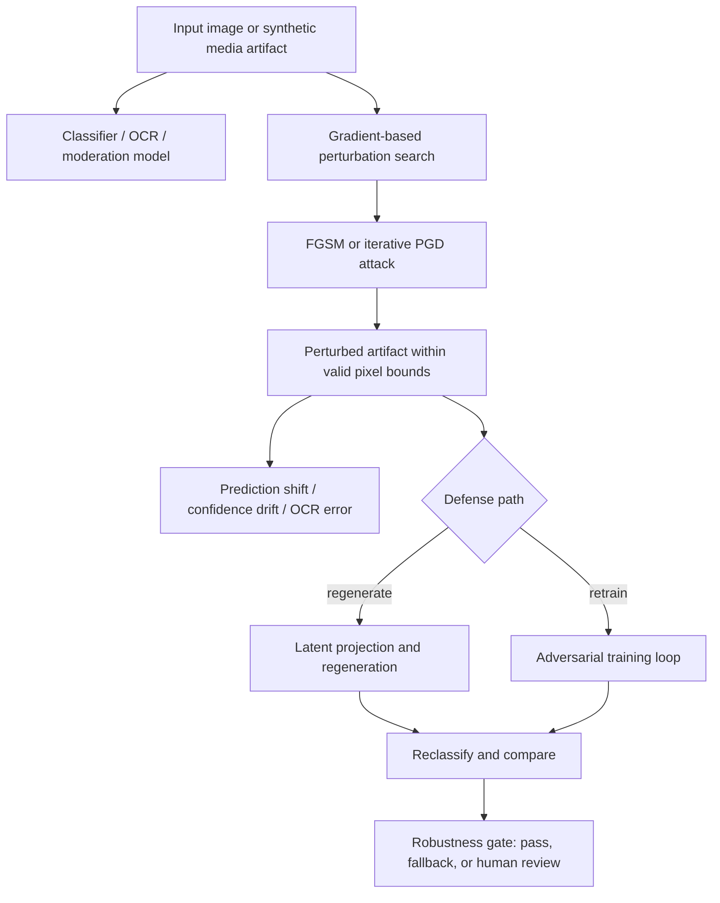

# Chapter 10 - Adversarial Examples, Transferability, and Robustness Gates

![[../assets/ch10-adversarial-examples-robustness-gate.svg]]

## Why this slice matters

This chapter is the missing focused follow-through for the GANs book's adversarial-media implications. The parent note already establishes generator/discriminator controls, latent controls, mode-collapse checks, and synthetic-media lineage. Chapter 10 adds the distinct but adjacent systems lesson: a visually plausible image can still be easy to manipulate into a classifier failure, and the same optimization machinery used to train models can be redirected against them.

For Agent Studio, this matters anywhere a visual route depends on classifier confidence or embedding similarity to approve, block, route, tag, moderate, or publish content.

## Core mechanism

Adversarial examples treat the input as the optimization target. Instead of updating weights to reduce loss, an attacker updates pixels to increase the model's loss or force a target prediction while trying to keep the perturbation small enough to remain plausible or operationally valid.

The chapter's structural point is stronger than any single attack recipe:

- robustness failures are a property of the model-plus-preprocessing pipeline, not just a weird edge case;
- small perturbations can cause large semantic prediction changes;
- benchmark accuracy does not imply deployment robustness;
- confidence is not the same thing as reliability.

## Manifold and sparsity framing

The chapter repeatedly returns to the idea that real images occupy a tiny useful manifold inside a much larger input space. Classifiers learn useful boundaries on the training distribution, but outside that manifold the decision surface can behave in brittle ways.

Operational takeaway:

- routes need tests for near-manifold and off-manifold perturbations;
- clean validation accuracy is insufficient evidence for release;
- preprocessing assumptions are part of the threat surface.

## Attack families the chapter makes concrete

### FGSM-style one-step attacks

The chapter uses gradient-sign logic to show that a single carefully chosen step can create a misclassification while remaining hard to detect perceptually.

Implications:

- one-step attacks are cheap enough to belong in ordinary eval suites;
- model confidence after a one-step perturbation is already a useful screening signal;
- routes that fail this screen should not be promoted without stronger mitigations.

### Iterative / PGD-style attacks

The chapter's projected-gradient discussion adds a more realistic robustness baseline: take multiple optimization steps and project the result back into the feasible image space so the artifact still respects expected pixel bounds.

Implications:

- robustness claims should declare attack budget, steps, step size, and restart policy;
- release gates should assume iterative attacks are stronger evidence than one-shot attacks;
- a route that survives only FGSM-style probes is not robust enough for safety-sensitive approval.

### Noise and preprocessing fragility

The chapter's Gaussian-noise examples show that some architectures already behave poorly on simple noise, and that adversarially optimized noise can make that failure obvious.

Implications:

- robustness checks should include benign noise, resizes, crops, and compression shifts in addition to adversarial perturbations;
- preprocessing details such as clipping, normalization, and resize policy belong in route metadata because they change both attack and defense behavior.

## Transferability is the deployment risk

A critical deployment lesson is transferability: an adversarial example crafted for one model can often fool another model as well. That means multi-model agreement is useful but not sufficient.

For Agent Studio:

- backup classifiers do not eliminate risk by themselves;
- OCR, moderation, logo detection, and visual QA can fail together if they share similar representation weaknesses;
- cross-model agreement should be treated as one signal, not proof of robustness.

## Relation back to GANs

The chapter does not say adversarial examples and GANs are identical. It shows that they are structurally related two-player optimization patterns:

- GANs optimize a generator against a discriminator-like critic for realism;
- adversarial-example attacks optimize the input against a classifier for failure induction.

That distinction matters. Stable GAN training does not automatically provide downstream robustness. A route that uses a GAN-family generator still needs independent adversarial robustness review for the classifiers, OCR systems, and moderation models used around it.

## Defense direction the chapter supports

The book's defense direction is not a universal cure. It points toward two practical ideas:

- adversarial training, where attack cases are folded back into training;
- manifold-style regeneration, where an input is projected into a latent representation and regenerated before classification.

Operationally, both are partial defenses:

- adversarial training improves resistance only relative to the attacks it actually trains against;
- latent regeneration can suppress some perturbations but can also erase details or introduce ambiguity;
- defenses must still be evaluated under adaptive attacks rather than trusted by design.

## Agent Studio release-gate implications

Promote a visual classifier-mediated route only when the gate proves:

- the route declares its threat model, attack family coverage, and perturbation budget;
- robustness checks cover at least one-step and iterative first-order attacks for the relevant modality;
- benign-transform stability is measured separately from adversarial robustness;
- confidence degradation, disagreement, and fallback behavior are recorded for failure slices;
- OCR/text integrity checks exist when visual outputs contain text or labels;
- human-review escalation exists for identity-sensitive, medical, legal, policy-sensitive, or publish-facing routes.

## Mermaid map

## Datastore and schema additions

Add or sharpen these fields around visual-route evals and release gates:

- `adversarial_attack_coverage` — attack families, budgets, steps, restart policy, and pass/fail summary.
- `cross_model_transfer_risk` — whether crafted failures transfer across backup evaluators.
- `perturbation_consistency_score` — prediction stability under bounded perturbations and benign transforms.
- `preprocessing_fragility_notes` — normalization, clipping, resize, channel-order, or quantization assumptions that materially affect robustness.
- `manifold_defense_status` — whether regeneration or adversarial training defenses are present, tested, and caveated.
- `high_risk_visual_gate_requires_human_review` — policy flag for routes where robustness evidence is insufficient for autonomous approval.

## Compact takeaways

- Treat robustness as a first-class route property, not a post-hoc security extra.
- Do not use confidence alone as a release signal for visual routes.
- Stable GAN generation does not imply robust downstream classification.
- Add perturbation-aware evals before relying on image models for publishing, moderation, or factual visual claims.
