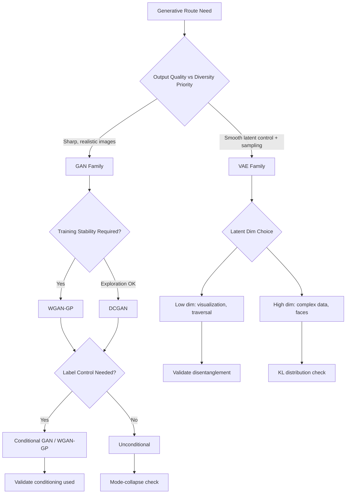

# VAE Mechanics, GAN Training Dynamics, and Latent-Space Traversal

## Mechanisms

### Standard Autoencoder: Encoder-Decoder Compression

An autoencoder maps high-dimensional input through a bottleneck (latent space) and back. The encoder compresses to an embedding vector **z**; the decoder reconstructs from **z**. Training minimizes reconstruction loss (RMSE or binary cross-entropy) between input and output.

Key properties:
- The latent space is **deterministic**: each image maps to exactly one point.
- The decoder can generate novel images by decoding arbitrary points in latent space.
- Reconstruction is lossy: fine details (logos, textures) are lost at low latent dimensionality.

### Standard Autoencoder Failure Modes as a Generative Model

Three problems make standard autoencoders unreliable generators:

1. **Undefined sampling distribution**: Nothing constrains where points lie. There is no well-defined distribution from which to sample. Uniform sampling over a bounding box biases toward larger clusters (e.g., generating more bags than ankle boots).
2. **Non-centering**: The latent space is not necessarily centered at the origin. Points may cluster far from (0,0).
3. **Latent discontinuity**: Nearby points in latent space may decode to very different outputs. There is no continuity guarantee. In high-dimensional latent spaces, this creates vast "dead zones" that decode to garbage.

### VAE Encoder: Stochastic Mapping with Reparameterization

The VAE modifies the encoder to map each input to a **multivariate normal distribution** parameterized by `z_mean` and `z_log_var`, rather than a single deterministic point. Sampling uses the **reparameterization trick**:

```
z = z_mean + exp(0.5 * z_log_var) * epsilon
epsilon ~ N(0, I)
```

This keeps randomness contained in `epsilon`, making the partial derivative of the output with respect to inputs deterministic — essential for backpropagation through the sampling layer.

### VAE Loss Function: Reconstruction + KL Divergence

The total loss combines two terms:

1. **Reconstruction loss** (RMSE or binary cross-entropy): drives accurate decoding.
2. **KL divergence**: penalizes the encoded distribution for deviating from a standard normal N(0, I). Closed form: `kl_loss = -0.5 * sum(1 + z_log_var - z_mean^2 - exp(z_log_var))`.

The KL term serves two purposes:
- Provides a **well-defined sampling distribution** (standard normal).
- **Regularizes latent space continuity**: since the encoder is stochastic, the decoder must ensure nearby points decode similarly, preventing dead zones.

**β-VAE weighting**: The reconstruction and KL terms need balancing. Over-weighting reconstruction degrades back to the plain autoencoder (discontinuous latent space). Over-weighting KL produces poor reconstructions. The β factor is a critical tuning parameter (e.g., β=500 for Fashion-MNIST, β=2000 for CelebA faces).

### VAE Latent-Space Traversal and Arithmetic

Higher-dimensional latent spaces (e.g., 200 dims for CelebA faces) enable:

- **Feature manipulation**: Find the "smile vector" by averaging z_mean for Smiling images minus average for non-Smiling. Add `alpha * feature_vector` to an encoding to adjust that attribute.
- **Face morphing**: Traverse a linear interpolation `z_new = z_A * (1-alpha) + z_B * alpha` between two encoded faces.

Key assumption: features are approximately disentangled along individual latent dimensions. This is not guaranteed — it depends on architecture, β, and dataset — and must be verified before relying on it for production attribute control.

### GAN: Adversarial Training Dynamics

A GAN comprises two networks trained in alternation:

- **Generator** (G): maps random noise to synthetic data that should be indistinguishable from real data.
- **Discriminator** (D): classifies inputs as real or fake.

Training alternates: D learns to detect G's fakes; G learns to fool D. The equilibrium (Nash equilibrium) is reached when G produces data indistinguishable from real, and D outputs 0.5 for all inputs.

### DCGAN Architecture Constraints

The Deep Convolutional GAN paper established key architecture guidelines that remain relevant:

- Use strided convolutions (no pooling layers) in D; transposed convolutions in G.
- Batch normalization in both G and D (except G's output and D's input).
- Remove fully connected layers for deeper architectures.
- ReLU in G (except output: tanh); LeakyReLU in D.
- Scale pixel values to [-1, 1] for tanh output.

### GAN Training Instability and Failure Modes

1. **Mode collapse**: G produces limited variety — repeatedly generating the same few outputs. D cannot penalize this if those outputs consistently fool it.
2. **Training oscillation**: G and D alternate dominance without converging. Loss curves bounce rather than stabilize.
3. **Vanishing gradients**: If D becomes too strong too quickly, G receives near-zero gradient signal and stops improving.
4. **Sensitivity to hyperparameters**: Learning rates, architecture, and even random seed significantly affect convergence.

### WGAN-GP: Wasserstein Distance and Gradient Penalty

The Wasserstein GAN (WGAN) replaces the JS-divergence-based discriminator with a **critic** that approximates the Earth Mover's (Wasserstein-1) distance. Benefits:

- The critic's loss correlates with sample quality, enabling meaningful monitoring.
- Gradients are more stable even when distributions are far apart.

The WGAN-GP adds a **gradient penalty** term that enforces the Lipschitz constraint (1-Lipschitz continuity) softly rather than through weight clipping. This further stabilizes training and is now the recommended baseline for most GAN applications.

### Conditional GANs (CGAN)

A CGAN conditions both G and D on label information. G receives the label alongside noise; D receives the label alongside the image. This enables **label-controlled generation**: generate a specific class by providing the desired label at inference time. The conditioning architecture must be designed so the model actually uses the label (not ignoring it).

## Tradeoffs

| Choice | Benefit | Risk |
|---|---|---|
| VAE (vs autoencoder) | Continuous, samplable latent space | Blurrier outputs from KL regularization |
| High β (VAE) | Smooth latent space, good sampling | Poor reconstruction quality |
| Low β (VAE) | Sharp reconstruction | Dead zones, discontinuous sampling |
| GAN (vs VAE) | Sharper, more realistic outputs | Training instability, mode collapse |
| WGAN-GP (vs DCGAN) | Stable training, meaningful loss | More compute per step (gradient penalty) |
| CGAN (vs unconditional GAN) | Label-controlled generation | Conditioning may be ignored; needs validation |
| Latent-space arithmetic | Attribute editing without retraining | Disentanglement not guaranteed |

## Failure Modes

1. **VAE posterior collapse**: KL term dominates; the encoder ignores input and outputs near-standard-normal regardless of content. Output becomes blurry and uninformative.
2. **GAN mode collapse**: Generator produces limited diversity; discriminator cannot correct this because those modes fool it.
3. **GAN training divergence**: Loss curves never stabilize; generated samples remain noisy.
4. **Latent-space traversal discontinuity**: VAE arithmetic assumes features are disentangled, but they may not be. Adding a "smile vector" could also change gender or hair.
5. **Conditioning ignored**: A CGAN learns to generate plausible images but ignores the conditioning label, producing random classes regardless of input.
6. **Critic saturation (WGAN without GP)**: Weight clipping produces saturated weights; gradient signal degrades.

## Release-Gate Implications

For a generative model route using VAE or GAN families to pass the `generative_model_route_release_gate`:

- Model family (VAE/GAN/WGAN-GP/CGAN), architecture, latent dimensionality, and conditioning policy are recorded.
- For VAE routes: β factor, KL convergence evidence, latent-space distribution checks (each dimension should approximate N(0,1)), and sample-quality evaluation.
- For GAN routes: training stability evidence (loss curves, mode-coverage evaluation), and a mode-collapse check.
- Latent-space traversal routes must document disentanglement validation before attribute control is used in production.
- Conditional generation routes must validate that the model actually uses the conditioning input (not ignoring it).
- Originality checks (nearest-training-neighbor) are attached when the route outputs public-facing media.
- Rights review covers training dataset provenance and any identity/likeness implications.

## Mermaid: VAE-GAN Decision Flow for Generative Routes



## Agent Studio Design Rules (Chapter-Level Additions)

1. Record VAE β-factor and latent-space distribution diagnostics as first-class route metadata.
2. For GAN routes, require mode-coverage evaluation and training stability evidence before promotion.
3. Prefer WGAN-GP or similar stabilized training for production GAN routes; avoid DCGAN for critical paths without mode-collapse mitigation.
4. Validate that CGAN conditioning is actually used before deploying label-controlled generation.
5. Treat latent-space arithmetic as a **conditional, not guaranteed** control surface: verify disentanglement per-feature before relying on it for attribute editing in production.
6. Always pair generative output with originality checks when the output faces public publishing.
