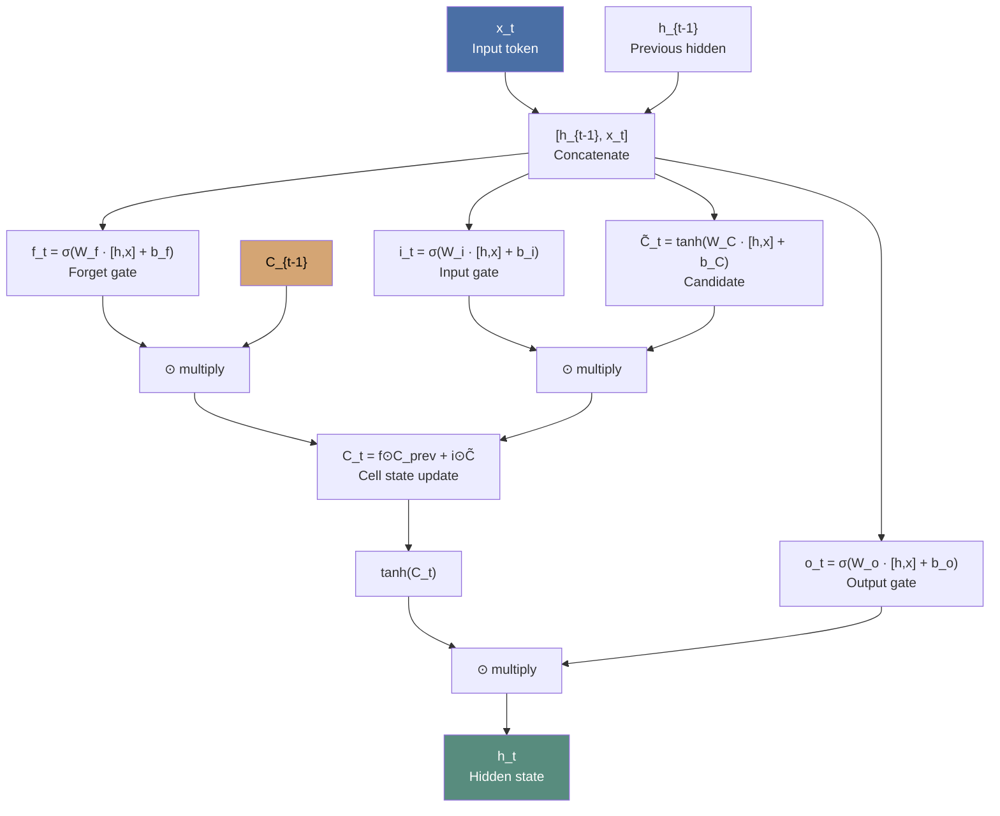

# Chapter 5: Autoregressive Models — Text Generation with LSTMs and PixelCNN

## Why Autoregressive Models

Autoregressive models treat generation as a sequential process: each output token conditions on all previous tokens. Unlike VAEs (latent variable → decoder) or GANs (noise → generator), autoregressive models directly model the data-generating distribution:

```math
P(x) = ∏ P(x_t | x_1, ..., x_{t-1})
```

No latent variable — the sequence IS the latent structure. This makes them exact-density models (in principle) but bounds generation speed to sequential decoding.

## LSTM Architecture: Six-Step Update

The LSTM cell introduces a **cell state** C_t (internal belief state) separate from the **hidden state** h_t (output). At each timestep, given h_{t-1} and x_t:

1. **Forget gate**: f_t = σ(W_f · [h_{t-1}, x_t] + b_f) — determines how much of C_{t-1} to retain (0 = forget, 1 = keep)
2. **Input gate**: i_t = σ(W_i · [h_{t-1}, x_t] + b_i) — determines how much new info to add
3. **Candidate**: C̃_t = tanh(W_C · [h_{t-1}, x_t] + b_C) — the new information to consider keeping
4. **Cell state update**: C_t = f_t ⊙ C_{t-1} + i_t ⊙ C̃_t — forget old + add new
5. **Output gate**: o_t = σ(W_o · [h_{t-1}, x_t] + b_o) — determines how much of C_t to output
6. **Hidden state**: h_t = o_t ⊙ tanh(C_t) — filtered working memory



### Key distinction: cell state vs hidden state

- **C_t**: Long-term memory carrier — flows through with only gated add/forget. Solves the vanishing gradient problem (gradients flow through the C_t highway with minimal modification).
- **h_t**: Working memory — the cell's current output, filtered from C_t via the output gate.
- One **cell** per LSTM layer (all timesteps share weights); the **number of units** is the hidden vector length.

## Embedding Layer

Before the LSTM, integer tokens are mapped to continuous vectors via an **embedding layer**:

- Input: `[batch_size, seq_length]` integer tokens
- Embedding: `vocab_size × embedding_size` lookup table (trainable)
- Output: `[batch_size, seq_length, embedding_size]` continuous vectors

The embedding is trainable via backpropagation — the model learns distributed word representations optimised for its generation task.

## Text Generation Pipeline

### Tokenization choices

| Token type | Pros | Cons |
|---|---|---|
| **Word** | Meaningful units, interpretable | Large vocabulary, unknown words, no novel word formation |
| **Character** | Small vocabulary, can form novel words | Longer sequences, harder to learn long-range dependencies |

GDL uses word-level tokenization (lowercase, 10,000-word vocabulary, punctuation tokenized as separate tokens via regex padding).

### Training setup

- Shift each sequence by 1 token to create (input, target) pairs
- Loss: `SparseCategoricalCrossentropy` (integer labels, no one-hot)
- Model: `Embedding(10000, 100) → LSTM(128, return_sequences=True) → Dense(10000, softmax)`
- Parameters: 2.4M total (1M embedding + 117K LSTM + 1.3M dense)

### Temperature sampling

```math
p_i = softmax(logits_i / T)
```

- **T → 0**: Deterministic (always highest-probability token) — safe, repetitive
- **T = 1.0**: Standard sampling — matches model's learned distribution
- **T > 1.5**: Near-uniform — creative but likely incoherent

The GDL model generates text by feeding predicted tokens back into the input (autoregressive loop) until a stop token (0) or max length is reached.

## RNN Extensions

### Stacked LSTMs

Multiple LSTM layers create hierarchical feature extraction: lower layers capture local syntax (word-level patterns), higher layers capture global semantics. The first LSTM must use `return_sequences=True` to pass a full sequence of hidden states to the next LSTM layer.

### GRU (Gated Recurrent Unit)

Simplified LSTM with:
- **Update gate**: Combines forget + input gates — decides how much past to keep
- **Reset gate**: Decides how much of the past to forget when computing the new candidate
- No separate cell state — fewer parameters, trains faster, comparable performance on many tasks

## System-Design Implications

1. **Sequential decoding bottleneck**: Autoregressive generation cannot parallelize across timesteps. Decode latency scales linearly with output length — critical for production serving decisions (batching, speculative decoding, KV caching).
2. **Temperature as policy**: Temperature is not just a sampling knob — it changes the effective data distribution for downstream components (reward functions, evaluation metrics). A deterministic (T→0) generator vs a stochastic (T=1.0) generator will produce categorically different outputs from the same model.
3. **Stop-policy matters**: The stop token (0 in GDL) determines generation termination. Different stop-string/stop-token policies in production (eos token, max length, stop strings) create different effective output distributions even with the same model weights.
4. **Cell state ≠ hidden state**: In RL systems, using the LSTM hidden state as a "representation" conflates working memory with long-term memory. System builders must specify which state carrier is being used for downstream signal collection.

## Cross-Reference

- Deep Learning Book Ch10: Sequence modeling — long-term dependency failure modes, gated recurrence architecture. DL Ch10 at `02-books/deep-learning-book/chapters/10-sequence-modeling-long-dependency-controls.md`
- Transformer (GDL Ch9): Covered separately as a non-recurrent autoregressive architecture
- Temperature sampling: Also covered in LLM inference optimization notes at `02-books/ai-engineering/chapters/9-inference-optimization.md`
- PixelCNN: Covered in detail in GDL Chapter 5 (not extracted separately — see book for CNN-based autoregressive image generation)
