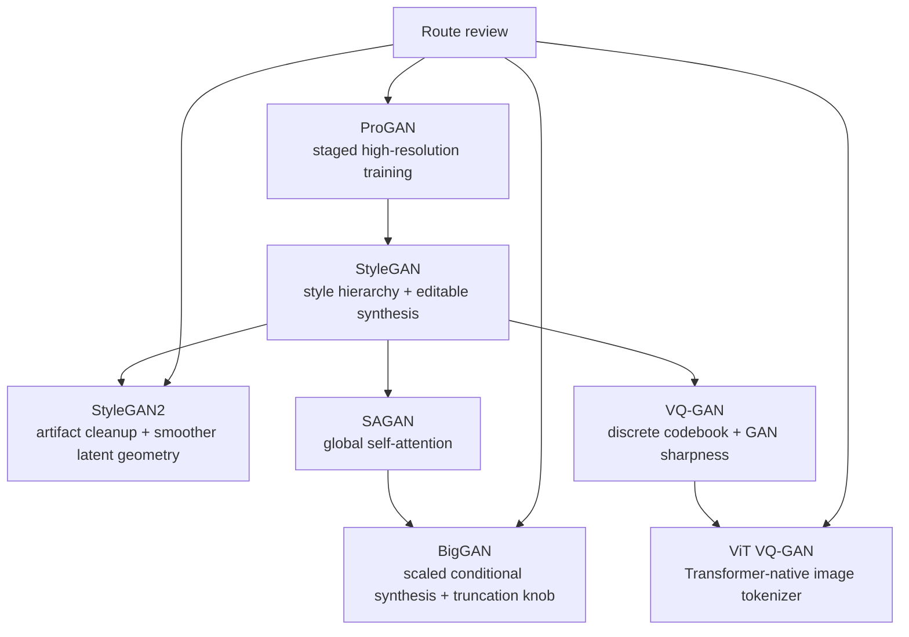

# Chapter 10: Advanced GANs

## Why this chapter matters

This chapter is the book's bridge from basic adversarial generation to production-relevant media architectures. Its core move is not “more GAN variants”; it is a shift from simple generator-vs-discriminator training toward three stronger operational contracts:

1. **multi-scale training discipline** for high-resolution images,
2. **style-separated control surfaces** for editable generation,
3. **tokenized image representations** that can plug into Transformer-era multimodal systems.

For Agent Studio, that means GAN routes should be reviewed not only for realism, but also for artifact behavior, latent controllability, cross-region coherence, and whether the route is still pixel-native or already token-native.

## Architecture progression

### 1. ProGAN: staged resolution as a stability policy

ProGAN makes high-resolution GAN training tractable by starting small and growing both generator and discriminator over time.

- begin at low resolution, then expand 4×4 -> 8×8 -> 16×16 -> ... -> 1024×1024;
- use a **transition phase** with alpha blending between old and new blocks;
- follow with a **stabilization phase** after the new blocks fully take over;
- keep all layers trainable rather than freezing earlier blocks.

The supporting controls matter just as much as the growth schedule:

- **minibatch standard deviation** exposes low-diversity fake batches to the discriminator;
- **equalized learning rate** reduces optimizer sensitivity to layer scale;
- **pixelwise normalization** keeps generator activations numerically bounded without BatchNorm.

Operational meaning: staged-resolution training is a route policy for stability, not a cosmetic architecture choice.

### 2. StyleGAN: separate semantic style from synthesis

StyleGAN introduces a clean split between latent transformation and image rendering.

- the **mapping network** transforms raw latent `z` into intermediate latent `w`;
- the **synthesis network** renders the image from a learned constant while receiving style signals at multiple scales;
- **AdaIN** injects per-layer style through normalized feature statistics;
- **style mixing** prevents neighboring layers from colluding on one brittle representation;
- **injected noise** controls stochastic micro-detail such as texture and hair.

The coarse-to-fine interpretation is the important design lesson:

- early layers govern pose, layout, and global identity;
- later layers govern texture, local detail, and stochastic variation.

Operational meaning: a latent interface can be intentionally decomposed into coarse control, fine control, and stochastic detail rather than treated as one opaque vector.

### 3. StyleGAN2: preserve control while removing generator artifacts

StyleGAN2 keeps the style-based view but changes where style is applied.

- style moves from AdaIN on activations to **weight modulation and demodulation** on convolution kernels;
- demodulation keeps feature statistics stable and removes the characteristic StyleGAN artifact patterns;
- **path length regularization** smooths the latent-to-image geometry so equal latent moves produce more uniform perceptual changes;
- the architecture drops explicit progressive growing and trains end-to-end with skip/residual structure.

The chapter's practical lesson is that a controllable generator still fails release review if its control surface creates architecture-specific visual artifacts.

### 4. SAGAN: add long-range coordination

Self-Attention GAN shows where convolution alone is weak.

- distant regions in an image can depend on each other semantically;
- self-attention lets content interact across the whole feature map;
- global object coherence improves when the model can propagate signals beyond local receptive fields.

Operational meaning: routes that need coherent object structure, repeated motifs, or scene-wide consistency need more than local texture realism.

### 5. BigGAN: scale class-conditioned GANs and expose inference-time tradeoffs

BigGAN extends the SAGAN line with larger scale and stronger conditioning behavior.

- much larger batch sizes and channel counts;
- latent information injected into multiple generator layers;
- shared embedding and orthogonal regularization;
- **truncation trick** at generation time to trade diversity for fidelity.

The truncation trick is product-relevant because it turns sampling policy into an explicit runtime knob:

- lower truncation -> cleaner, more believable outputs,
- but also lower variety and mode coverage.

Operational meaning: conditional image routes should record whether diversity is being sacrificed for benchmark-friendly sample quality.

### 6. VQ-GAN: connect adversarial sharpness to discrete image tokens

VQ-GAN is the chapter's most important bridge to modern multimodal systems.

- an encoder maps an image to a grid of latent vectors;
- each vector is quantized to the nearest entry in a learned **codebook**;
- a decoder reconstructs from those discrete codes;
- a discriminator plus perceptual loss prevents the blurry reconstructions typical of plain autoencoding;
- a Transformer can then model the code sequence instead of raw pixels.

This is the key shift from continuous-pixel generation toward **tokenized media generation**.

Operational meaning: the image route is no longer only a generator; it is also a tokenizer, codebook, sequence model, and decoder pipeline.

### 7. ViT VQ-GAN: move the tokenizer itself toward Transformers

ViT VQ-GAN replaces the convolution-heavy encoder/decoder with Transformer-based image processing.

- images are split into patches with positional structure;
- a ViT-like encoder produces latent patch features;
- quantization still turns them into discrete visual tokens;
- a Transformer-based decoder reconstructs the image;
- a second-stage autoregressive model still learns token sequences.

Operational meaning: if the media stack will share infrastructure with text- and sequence-oriented systems, patch/token-native architectures become more aligned with the rest of the platform than classic conv-only GANs.

## High-value comparisons

| Comparison | What changes | Release-gate implication |
|---|---|---|
| ProGAN -> StyleGAN | stability curriculum -> controllable style hierarchy | track both training schedule and latent edit surface |
| StyleGAN -> StyleGAN2 | activation-space style injection -> weight-space modulation/demodulation | artifact review is a first-class gate, not a cosmetic concern |
| StyleGAN line -> SAGAN/BigGAN | local synthesis focus -> global coherence and scaled conditioning | add scene-wide consistency and conditioning tests |
| Classic GANs -> VQ-GAN/ViT VQ-GAN | direct pixels -> discrete visual tokens | route must record tokenizer/codebook/decoder lineage |

## Agent Studio implications

### Image-generation routes

A strong GAN-style image route should preserve:

- generator family and version;
- conditioning surface and latent interface;
- artifact checks tied to architecture family;
- interpolation/editability evidence;
- diversity-vs-fidelity sampling policy;
- rights/provenance and human-review gates.

### Video and animation-adjacent routes

This chapter does not present a video GAN, but it still sharpens the video review bar.

- StyleGAN2 implies the need for **smooth latent geometry** rather than flickery latent jumps;
- SAGAN implies explicit **cross-region coherence** checks;
- BigGAN-style sampling controls warn against choosing the sharpest frames at the expense of temporal diversity or stability.

### Multimodal and token-native routes

VQ-GAN and ViT VQ-GAN matter most when the route will share machinery with text or multimodal systems.

- tokenized image codes can be modeled by autoregressive Transformers;
- the tokenizer/codebook becomes part of the product contract;
- decoding quality and codebook collapse become operational concerns;
- image generation starts to resemble sequence generation with a visual vocabulary.

## Advanced GAN release gate

Promote an advanced-GAN or tokenized-image route only when the gate proves:

- the route declares whether it is ProGAN/StyleGAN/StyleGAN2/SAGAN/BigGAN/VQ-GAN-family and why that family is chosen;
- training policy records progressive-growing stages or fixed-resolution justification;
- style/conditioning controls record latent interface, style-mixing policy, noise injection policy, and editable dimensions where relevant;
- artifact review covers StyleGAN-family distortions, texture hallucinations, and geometry drift;
- scene-level coherence tests exist for attention-augmented routes;
- diversity/fidelity tradeoffs record truncation or equivalent inference-time knobs;
- tokenized-image routes preserve encoder, codebook, decoder, tokenizer granularity, and Transformer-prior lineage;
- rights, provenance, human review, fallback, and rollback are defined for public-facing generated media.

## Bottom line

Chapter 10 shows the path from adversarial image realism to controllable and eventually tokenized media generation. The durable lesson is that a serious media route should expose **training-scale policy, style/edit surface, artifact controls, coherence controls, and tokenizer/decoder lineage** rather than hiding everything behind “generate image.”
