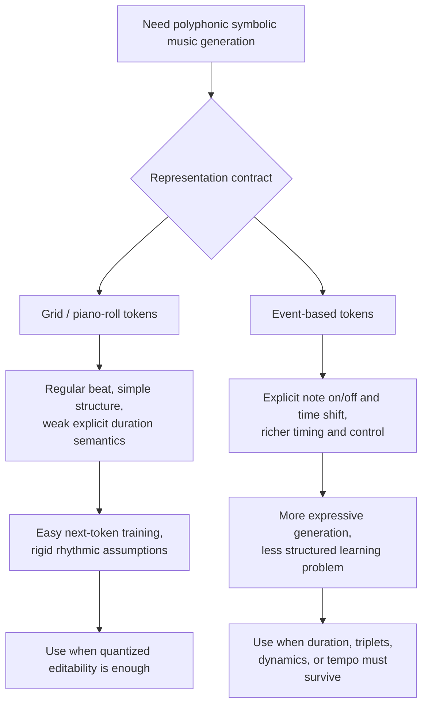

# Chapter 11: Music Tokenization And Symbolic Route Controls

## Why this slice matters

This chapter slice closes the last still-useful Generative Deep Learning gap for the current vault: **how a music-generation route's representation choice changes controllability, rhythmic fidelity, and model fit**. The durable lesson is not a generic survey of music models. It is the much narrower rule that **representation is part of the product contract**.

If Agent Studio only needs broad audio generation, the existing audio canon already covers waveform, spectrogram, codec-token, and evaluation surfaces. This note matters when the route specifically needs **symbolic composition, editable multi-part music, or bar/voice-aware control**.

## The core design fork

For polyphonic music, the hard problem is turning simultaneous voices into a sequence a model can learn without losing timing or editability. The section introduces two tokenization families:

1. **grid tokenization**
2. **event-based tokenization**

The model choice comes later. The first route decision is the representation.

## Grid tokenization

Grid tokenization treats music like a piano roll:
- the vertical axis is pitch,
- the horizontal axis is time,
- a filled cell means a note is active at that timestep.

For multi-voice music, all voices are drawn onto the same temporal grid and then serialized as a single token sequence. In the Bach-chorale example, the stream advances through the voices at each timestep before moving to the next step.

### What grid tokenization gets right

- It gives the model a **regular, highly structured sequence**.
- It maps neatly onto next-token prediction with a Transformer.
- It works well when the musical surface is already **quantized to a stable beat grid**.
- It makes bar-level or voice-level decoding comparatively straightforward.

### What grid tokenization throws away

The hidden cost is that the encoding tracks note presence, not explicit note duration.

That creates three important route consequences:
- one long note can look too similar to repeated short notes of the same pitch;
- irregular rhythmic structures become awkward unless the time grid gets much finer;
- extra musical controls such as dynamics or tempo do not naturally fit the same 2D structure.

The chapter uses **triplets** as the concrete failure case. A four-steps-per-beat grid is easy to learn, but it cannot naturally express triplet timing. Making the grid finer repairs fidelity at the cost of many more tokens, which cuts context efficiency.

## Event-based tokenization

Event-based tokenization represents music as instructions rather than occupancy:
- `NOTE_ON<pitch>`
- `NOTE_OFF<pitch>`
- `TIME_SHIFT<step>`

This turns symbolic music into a compositional event stream.

### What event-based tokenization gets right

- It makes **duration explicit** through note-on / note-off structure.
- It can represent **irregular timing** without forcing a single fixed grid.
- It extends naturally to **tempo and dynamics tokens**.
- It preserves a much richer edit surface for downstream route tooling.

### What event-based tokenization costs

- The representation is less regular, so the learning problem is less structurally constrained.
- Token streams become semantically richer but also harder to model consistently.
- Decoding validity matters more: the route has to guard against malformed note-off timing or impossible event orderings.

## Route-level comparison

| Question | Grid tokenization | Event-based tokenization |
|---|---|---|
| Beat structure | best when strongly quantized | works for quantized and irregular timing |
| Duration fidelity | implicit, weaker | explicit, stronger |
| Triplets / irregular subdivisions | awkward unless grid is refined | natural with time-shift events |
| Dynamics / tempo extensibility | awkward | natural token-family extension |
| Modeling simplicity | higher | lower |
| Editability | coarse but clean | richer and more precise |

## Architecture implications

The chapter also implies that not every music route should use the same model family.

- **Grid tokenization** keeps the door open to Transformer-style next-token modeling or even image-like treatment of the piano roll when the route is visually structured.
- **Event-based tokenization** is the stronger choice when the route needs an explicit compositional trace that can survive editing, repair, or constraint injection.
- If a route needs high-fidelity raw audio rather than symbolic composition, existing canon around codec-token, diffusion, and audio decoding still applies; this slice does not replace that audio runtime surface.

## Agent Studio implications

For symbolic or controllable music routes, preserve these first-class fields before model selection is treated as settled:

- `music_representation_type`: `grid | event | piano_roll_image | neural_codec_tokens`
- `time_quantization_policy`
- `duration_encoding_policy`
- `polyphony_strategy`
- `control_token_families`
- `decode_validity_constraints`
- `editability_surface`
- `rhythmic_irregularity_support`

This is the practical bridge from the chapter into product design: **the tokenizer defines what the user can control, what the evaluator can validate, and what the model can faithfully preserve**.

## Release-gate deltas

Promote a symbolic music route only when review shows:
- the representation choice is explicit and justified;
- duration semantics are preserved in a way the task actually needs;
- irregular timing requirements are tested rather than assumed;
- decoding validity checks exist for malformed event streams or invalid voice reconstruction;
- rights/originality review is attached before external publishing;
- evaluation distinguishes structure, rhythm, control adherence, and audio realization quality.

## Bottom line

This chapter slice closes the remaining Generative Deep Learning follow-through because it identifies the missing design fork that broader audio notes do not make concrete enough: **for symbolic music generation, representation choice comes before model choice**. Grid tokenization buys simplicity and regularity. Event-based tokenization buys duration fidelity, richer control, and better support for expressive timing.
