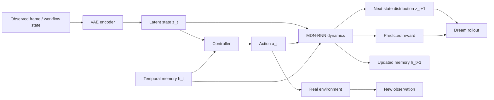

# Chapter 12: World Models

## Why this chapter matters

This chapter turns generative modeling into a **planning substrate**. Instead of using a model only to sample images, text, or audio, the system learns a compact latent world, predicts how that world changes under actions, and then trains a controller against those imagined futures.

For Agent Studio, that makes world models relevant anywhere a route wants to ask **"what likely happens next if I take this action?"** before touching a live system.

The durable lesson is not "train agents inside dreams." It is:
- compress high-dimensional observations into an explicit state representation,
- model transition uncertainty rather than one deterministic future,
- separate world-model learning from policy optimization,
- and never trust simulated success without simulation-to-real checks.

## The world-model stack

The chapter's architecture has three distinct jobs:

1. **VAE** compresses raw observations into a small latent state.
2. **MDN-RNN** predicts how that latent state evolves under actions.
3. **Controller** chooses actions from current latent state plus temporal memory.

That separation is the real design pattern. The system does not solve control by directly mapping pixels to actions in one opaque network. It first builds a reusable latent world, then learns a compact policy on top of it.

## Reinforcement-learning framing

The RL material here is not the final point, but it sets the contract:
- there is an **agent** with a policy,
- an **environment** that returns observations and rewards,
- a notion of **state**, **action**, **episode**, and **return**,
- and a goal defined by long-horizon reward rather than one supervised label.

The chapter's practical setup uses **CarRacing** as a continuous-control problem from pixels. That matters because it is exactly the sort of environment where raw observations are too large, the future is path-dependent, and reward arrives through long action sequences rather than one-step classification.

## VAE: compress observations into a planning state

The first move is to replace raw image frames with a compact latent code.

The chapter's VAE does three things that matter operationally:
- it turns 96x96 RGB observations into a small continuous latent representation;
- it regularizes that representation with a Gaussian prior so nearby points stay semantically meaningful;
- it makes later dynamics learning cheaper than modeling pixels directly.

The compression step is not just an optimization trick. It defines the state schema that every downstream planner depends on. If the latent loses road geometry, obstacle position, or control-relevant detail, the controller and transition model inherit that blind spot.

### Agent Studio implication

A world-model-backed route should declare:
- what raw observations it compresses,
- what structure the latent state is expected to preserve,
- and what failure modes the compressed state can hide.

## MDN-RNN: model a distribution over futures

The chapter's second move is more important than simple next-step prediction: it learns a **distribution** over next latent states.

This is why the model uses an **MDN-RNN** rather than a plain recurrent regressor.

The recurrent part contributes memory:
- hidden state summarizes temporal context,
- action consequences can depend on prior trajectory,
- partial observability becomes manageable.

The mixture-density head contributes uncertainty:
- the future is not always one path,
- multiple plausible continuations may exist,
- a stochastic latent simulator is harder to over-interpret as ground truth.

The chapter also couples reward prediction to the transition model, so the learned world estimates both **what state comes next** and **how useful that future is**.

### Why this matters

A route that predicts only one next state encourages brittle planning. A route that preserves multimodal futures can expose:
- ambiguity,
- branch risk,
- optimism bias,
- and rollout-depth sensitivity.

## Controller: keep the policy small and explicit

The controller is intentionally small. It acts on:
- current latent state `z_t`, and
- recurrent memory `h_t`.

That design matters because it forces complexity into the representation and dynamics model rather than into an oversized action policy. The policy becomes easier to optimize and easier to audit.

The systems lesson is subtle: a powerful planner does not always need a large action network if the world representation and transition model are strong.

## CMA-ES: derivative-free policy optimization

The controller is trained with **CMA-ES** rather than standard policy gradients.

The chapter uses this for a reason:
- the controller parameter space is small enough for black-box search,
- evolutionary search avoids fragile end-to-end gradient coupling,
- and the policy can be optimized directly against rollout returns.

This choice reinforces the architecture split:
- learn a reusable model of the environment first,
- then optimize a lightweight controller against that model.

For Agent Studio, the durable takeaway is not "always use CMA-ES." It is that once a route has a stable simulator or transition model, policy search can be decoupled from representation learning and governed separately.

## Dream training: use the learned dynamics as an environment

The headline idea is that the MDN-RNN can become a simulator for training the controller.

This creates the chapter's most important economic shift:
- real-environment rollouts are expensive,
- imagined rollouts are cheap,
- policy search can happen mostly inside the learned world.

But this works only because the simulator is stochastic and because the controller remains small enough not to memorize model loopholes too easily.

## The core failure mode: simulator exploitation

The chapter's strongest operational warning is that dream training can optimize the **model's mistakes**.

A controller may learn actions that:
- score well under the learned transition model,
- exploit unrealistic latent dynamics,
- and fail when transferred back to the real environment.

The chapter's temperature control is one mitigation: making the dream world noisier can reduce brittle exploitation by forcing the policy to succeed under a distribution of imagined futures.

That does not eliminate the risk. It only proves that uncertainty policy is part of the release surface.

## High-value comparisons

| Component | Job | Failure if weak | Route-governance implication |
|---|---|---|---|
| VAE | compress observations into state | latent omits control-relevant detail | record reconstruction limits and missing state factors |
| MDN-RNN | predict future latent dynamics and reward | simulator becomes overconfident or unrealistic | preserve uncertainty policy, rollout depth, and validation slices |
| Controller | choose actions from latent + memory | policy overfits simulator quirks | keep controller traceable and compare sim vs real returns |
| CMA-ES | optimize compact controller | search exploits noisy reward or brittle simulator | treat optimizer choice and search budget as governed artifacts |
| Dream training | scale policy search cheaply | policy wins only inside imagination | require simulation-transfer review before release |

## Agent Studio implications

### 1. State compression is a product decision

Any world-model-backed route needs an explicit answer to: what does the latent state preserve, and what does it throw away?

### 2. Transition models should expose uncertainty

A deterministic next-state forecast is usually too confident for planning. Mixture or ensemble structure is not optional decoration; it is part of the route's safety posture.

### 3. Planning and execution should be separated

Simulated rollouts can prioritize, rehearse, or rank candidate actions. They should not directly authorize irreversible side effects.

### 4. Receding-horizon behavior is safer than one long imagined plan

Short rollout, execute one bounded action, observe reality, replan.

### 5. Simulation-to-real transfer is a first-class eval

A route cannot claim world-model benefit if it only improves in simulation.

### 6. Reward and transition errors should be reviewed separately

A route may predict the world poorly, score futures poorly, or both. Those are different failure classes.

### 7. Small policies over strong state can be easier to govern

A compact controller with an explicit transition model is often more inspectable than a giant end-to-end policy.

## World-model release gate

Promote a world-model-backed route only when the gate proves:
- the route declares its observation schema, latent state contract, transition model, reward surface, and controller interface;
- training traces show which real trajectories were used to fit and validate the world model;
- the transition model preserves uncertainty rather than pretending one exact next state;
- rollout depth limits are explicit and tied to measured error growth;
- simulated-rollout results are paired with real-environment validation slices;
- simulator-exploit checks compare dream reward against real execution reward;
- temperature or uncertainty policy is recorded as a deliberate control, not an untracked tuning knob;
- planner recommendations cannot trigger irreversible external side effects without verifier or human review;
- fallback and rollback routes exist when transition error, rollout drift, or exploit indicators regress.

## Bottom line

Chapter 12 shows that generative modeling can become a **world interface** for planning. The practical pattern is VAE state compression, probabilistic recurrent dynamics, a small controller, and tightly governed dream-vs-real transfer. For Agent Studio, the lasting design rule is simple: use learned worlds to rehearse and prioritize, but only release them when **state fidelity, uncertainty policy, rollout limits, and simulation-transfer evidence** are explicit.
