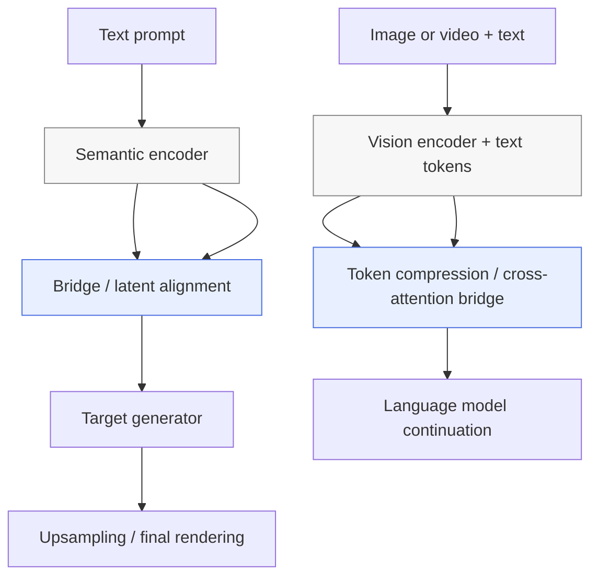

# Chapter 13: Multimodal Models

## Why this chapter matters

This chapter is the book’s clearest statement that modern generative systems are no longer just “text models” or “image models.” The hard part is the **bridge** between modalities: learning a representation that preserves semantic intent while moving from text into image space, or from visual context back into language.

For Agent Studio, that means multimodal routes should be reviewed as **composed systems**:
- an encoder that interprets one modality,
- a bridge that aligns or translates latent meaning,
- a generator or language model that renders the target modality,
- and release gates around alignment, editability, provenance, and failure modes.

## The core bridge pattern

Across DALL.E 2, Imagen, Stable Diffusion, and Flamingo, the recurring design is:

1. **freeze or reuse a strong unimodal/multimodal backbone**,
2. **insert a compact alignment layer or latent bridge**,
3. **decode in the target modality with a scalable generator**,
4. **keep expensive high-resolution work late in the pipeline**.

The chapter’s most durable lesson is that multimodal quality depends less on a single monolithic model and more on whether the bridge preserves the right information for the downstream decoder.

## DALL.E 2: split the problem into semantic alignment and image generation

DALL.E 2 is the chapter’s main architectural case study. Its structure is intentionally split into three parts:
- **text encoder**,
- **prior**,
- **decoder**.

### CLIP as the first half of the bridge

DALL.E 2 reuses **CLIP** rather than training the text encoder from scratch.

CLIP is not generative. It is a contrastive model trained on large-scale text-image pairs to make matching text and image embeddings close and mismatched pairs far apart. Its key value here is that it creates a **shared conceptual space** where text and images can be compared by similarity.

Operationally, CLIP contributes three important ideas:
- language becomes the universal labeling surface for vision tasks;
- zero-shot generalization comes from matching embeddings rather than retraining classifiers;
- the frozen encoder can be reused as a dependable semantic interface in larger multimodal systems.

### Prior: the actual cross-modal translator

The prior converts a **CLIP text embedding** into a **CLIP image embedding**.

This is the most important architectural move in DALL.E 2. The system does not jump directly from prompt text to pixels. It first predicts the kind of image embedding that should correspond to the prompt, then lets the decoder render from that target.

The book contrasts two prior designs:
- **autoregressive prior**: sequentially predicts the image embedding with an encoder-decoder Transformer;
- **diffusion prior**: denoises toward the image embedding while conditioning on the text embedding.

The diffusion prior wins because it is both stronger and more efficient. Conceptually, it is the second half of the bridge: it translates semantics from the text side of CLIP space into the image side.

### Decoder: GLIDE-style diffusion rendering

The decoder borrows from **GLIDE**:
- a Transformer text encoder encodes the prompt,
- a U-Net diffusion model denoises toward an image,
- the decoder also conditions on the predicted CLIP image embedding,
- separate upsamplers take the image from low resolution to 1024×1024.

This separation matters. The prior handles **what image should exist semantically**; the decoder handles **how to render it visually**.

### Why the prior matters

The chapter highlights an ablation: when the decoder is deprived of a proper image embedding target, it loses important relational detail. The implication is strong: good text understanding alone is not enough. A multimodal route often needs an explicit intermediate representation that sharpens intent before pixel generation begins.

### DALL.E 2 capabilities and limits

The CLIP image encoder enables **image variations** and supports editing-style workflows because images can also be projected into the same image-embedding space used by the decoder.

The main caveats called out in the chapter are:
- **attribute binding errors**: the model can confuse which property belongs to which object;
- **weak text rendering**: embeddings preserve high-level meaning better than exact spelling.

So DALL.E 2 is powerful, but its strongest interface is semantic composition, not exact symbolic layout.

## Imagen: stronger text encoding, still diffusion-first

Imagen keeps the encoder-plus-diffusion pattern but changes the source of semantics.

- the frozen text encoder is **T5-XXL**, trained on text only;
- the image generator is still a diffusion stack with a U-Net-like decoder;
- the super-resolution stages remain diffusion-based and text-conditioned.

The chapter’s main comparison point is subtle but important:
- **DALL.E 2** uses a multimodal encoder family via CLIP;
- **Imagen** uses a pure language model as the semantic front end.

The book emphasizes that scaling the text encoder mattered more than scaling the decoder. That is a useful systems lesson: upstream semantic quality can dominate downstream rendering quality.

### DrawBench as evaluation infrastructure

Imagen also introduces **DrawBench**, a human-evaluated benchmark built around prompts that stress:
- counting,
- long descriptive prompts,
- quoted text,
- alignment to caption meaning,
- fidelity / photorealism.

The practical takeaway is that multimodal evaluation needs more than “pretty samples.” It needs prompt sets that expose relational, compositional, and instruction-following weaknesses.

### Imagen versus DALL.E 2

Imagen outperforms DALL.E 2 on many benchmark comparisons, but the chapter notes a tradeoff: because Imagen’s encoder is text-only, it does **not** inherit DALL.E 2’s image-variation/editing pathway through a shared image embedding interface.

## Stable Diffusion: move diffusion into latent space

Stable Diffusion changes the cost structure more than the high-level task.

Its key mechanism is **latent diffusion**:
- an autoencoder compresses images into a latent space;
- diffusion runs on that latent representation instead of full pixels;
- the autoencoder later decodes the latent back into a high-resolution image.

This keeps the denoising U-Net much lighter and faster because the model works in a conceptual latent space rather than directly on large images.

The chapter frames this as the main difference from DALL.E 2 and Imagen. The semantic bridge remains text-conditioned diffusion, but the generation substrate is now computationally cheaper.

Also important operationally:
- Stable Diffusion is **open source** in code and weights;
- it can run on local hardware;
- early versions used CLIP conditioning, while later versions used **OpenCLIP**.

This makes Stable Diffusion especially relevant for self-hosted or customizable product routes, where model access and adaptation matter as much as raw benchmark quality.

## Flamingo: reverse the bridge direction into language

Flamingo is the chapter’s other major pattern: instead of text-to-image, it is **visual-language continuation**.

It accepts interleaved text and visual inputs and predicts text continuations. The model is built from three main parts:
- **Vision Encoder**,
- **Perceiver Resampler**,
- **Language Model**.

### Vision Encoder

Flamingo’s visual encoder is a frozen **NFNet**, not a ViT. It converts images, or sampled video frames, into visual features. Video gets temporal encodings before flattening and concatenation.

### Perceiver Resampler

Visual features can be long and variable-length, especially for video. The **Perceiver Resampler** compresses this variable visual stream into a fixed-length latent set suitable for downstream cross-attention. This is the model’s bridge-compression mechanism.

### Language model adaptation

The language model is mostly frozen **Chinchilla**, augmented with trainable **GATED XATTN-DENSE** layers.

The important idea is not “jointly retrain everything.” Instead:
- keep the strong LM mostly intact,
- inject visual information through masked cross-attention,
- gate that new pathway so visual influence can be blended in gradually.

The chunking rule is operationally important: text tokens only cross-attend to the image tokens associated with their local chunk. This keeps grounding structured rather than globally noisy.

### Flamingo capabilities

The chapter presents Flamingo as capable of:
- image understanding,
- video understanding,
- conversational prompting,
- visual dialogue.

Its broader significance is that multimodal systems can behave like **general-purpose prompted agents** rather than single-task generators.

## High-value comparisons

| Comparison | Core difference | Product implication |
|---|---|---|
| DALL.E 2 vs Imagen | CLIP multimodal encoder vs T5 text-only encoder | choose between image-native semantic interface and stronger pure-language front end |
| DALL.E 2 vs Stable Diffusion | pixel-space diffusion stack with explicit prior vs latent diffusion efficiency | choose between richer staged bridge and cheaper self-hostable inference |
| Imagen vs Stable Diffusion | benchmark-leading text-conditioned diffusion vs open latent-diffusion stack | benchmark quality is not the only routing criterion; deployability matters |
| Text-to-image models vs Flamingo | render images vs continue language from visual context | generation routes and grounded multimodal-agent routes should be reviewed separately |

## Agent Studio implications

### 1. Treat multimodal systems as pipelines, not single models

A route record should preserve:
- encoder family and checkpoint,
- bridge/alignment mechanism,
- decoder/generator family,
- upsampler or latent-decoder lineage,
- modality-specific evals.

### 2. Separate semantic failure from rendering failure

This chapter makes it clear that many bad outputs come from different layers:
- prompt misunderstanding or relational confusion at the encoder/bridge stage,
- photorealism or artifact issues at the decoder stage,
- exact text rendering failures from lossy semantic embeddings.

Release review should log which stage failed, not just that “the image was wrong.”

### 3. Open versus closed release posture matters

Stable Diffusion’s open weights change the operational contract:
- local deployment becomes possible,
- customization and finetuning become more feasible,
- provenance, safety tuning, and downstream forks become governance issues.

By contrast, hosted proprietary routes shift control toward API policy and external release cadence.

### 4. Multimodal agents need grounding boundaries

Flamingo shows how to blend vision into a language model without letting every text token attend to every visual token. For Agent Studio, grounded multimodal chat should preserve:
- visual chunk boundaries,
- attachment-to-response lineage,
- explicit cross-attention scope,
- auditability for which media grounded which answer.

## Multimodal release gate

Promote a multimodal route only when the gate proves:
- the route declares its encoder, bridge, decoder, and upsampler/latent-decoder stack;
- semantic alignment tests cover attribute binding, relation handling, counting, and long prompts;
- rendering tests cover fidelity, artifact behavior, and exact-text limitations where relevant;
- image-to-image or variation/edit pathways are explicit if shared embedding spaces are used;
- open-weight routes record checkpoint lineage, finetune status, safety deltas, and provenance controls;
- visual-language routes preserve attachment/chunk grounding and trace which visual context informed generated text;
- benchmark evidence includes both aesthetic quality and instruction-grounded evaluation, not just hero examples.

## Bottom line

Chapter 13 presents multimodal modeling as a **bridge design problem**. DALL.E 2 solves it with CLIP plus a prior and diffusion decoder, Imagen strengthens the language side of the bridge, Stable Diffusion makes the generator far cheaper through latent diffusion, and Flamingo shows how visual grounding can be added to a powerful language model. For Agent Studio, the durable lesson is that multimodal quality depends on preserving **semantic alignment, bridge transparency, grounding boundaries, and release-governed modality transitions**.
