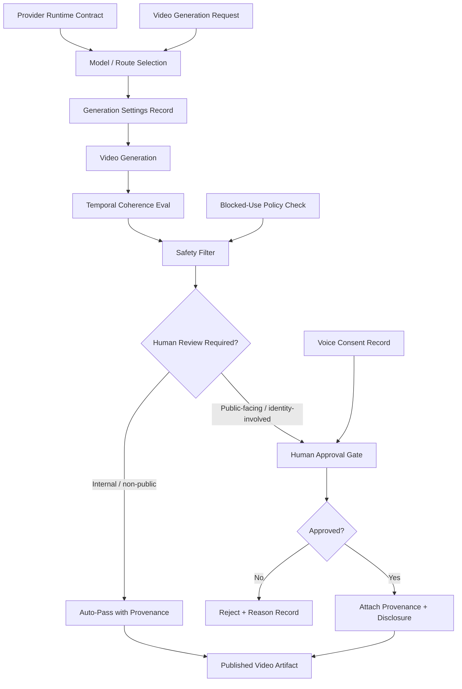

# Video Generation Governance and Rapidly Advancing Areas

This chapter is an early-release survey chapter rather than a standalone governance chapter. The governance synthesis below is therefore assembled from the book's video-generation pages, multimodal frontier pages, and the data/deployment sections that explain why scarce paired data, provider volatility, and artifact lineage matter operationally.

## Mechanisms

### Video Generation as Temporal Image Sequence

Video generation extends image generation by adding temporal coherence requirements. Three main approaches:

1. **Image-prior video generation** (AnimateDiff, Deforum): Leverage a pre-trained image model (e.g., Stable Diffusion) and inject a learned motion prior to steer frame-by-frame generation toward temporal coherence. Deforum adds camera control while embracing frame variation as aesthetic.

2. **Video-to-video transformation** (Gen-1 / RunwayML): Take an existing video and apply style transfer or subject replacement. The source video provides structure; the generative model provides new appearance.

3. **Native text-to-video** (CogVideo, Make-a-Video, Stable Video Diffusion, Sora, Veo, Gen-3, CogVideoX): Generate video from text prompts without requiring a source video. These models must learn both visual appearance and motion dynamics from scratch.

### Data Challenges in Native Video Generation

A key production constraint: **video-text pairing data is scarce and expensive**. Models address this differently:

- **Make-a-Video** (Meta AI): Decouples visual-text understanding (learned from image-text pairs like LAION) from motion understanding (learned from unlabeled video). No explicit video-text pairing needed.
- **Stable Video Diffusion**: Trains a video latent diffusion model paired with a text-to-image model, using scaled-up video datasets.
- **CogVideoX** (Tsinghua): Open-weights family (2B, 5B) producing temporally coherent video competitive with closed-source alternatives.

### Preference Optimization for LLMs and Diffusion Models

RLHF and its successors (DPO, IPO, KTO) shift model behavior toward desired outputs without explicit reward-model instability:

- **RLHF**: SFT → reward model training (from human/AI rankings) → RL fine-tuning against the reward model. Complex pipeline, unstable RL component.
- **DPO / IPO / KTO**: Remove the RL loop entirely. Directly optimize the policy using preference pairs. Simpler, more stable, increasingly preferred in practice.

**DDPO** extends preference optimization to diffusion models: RL fine-tuning of the denoising process to improve image quality. This is an emerging route for aligning image/video generation with quality or safety preferences.

### Long Contexts, MoE, and Efficiency

- **Long context**: FlashAttention reduces memory to linear during inference. RoPE scaling extends pre-trained context windows with minimal fine-tuning (e.g., 2K → 32K tokens). Ring Attention and Infini-Attention target arbitrary-length contexts.
- **Mixture of Experts (MoE)**: Replace feed-forward layers with sparse expert blocks. Only a subset of experts activate per token (e.g., 2 of 8 for Mixtral). Key properties: full parameter count must be loaded (e.g., 47B for Mixtral 8x7B), but only a fraction is activated per token (12B), making MoEs compelling for **high-throughput serving** rather than local inference.
- **Quantization and speculative decoding**: Reduce precision for local inference; use a small draft model to speed up autoregressive generation.

### Computer Vision as Generative AI Infrastructure

The chapter connects traditional CV tasks to generative infrastructure:

- **Classification / detection / segmentation** provide structured grounding for generative editing.
- **Depth estimation** enables 3D-aware generation and editing.
- **Zero-shot CLIP** connects arbitrary text to visual content without task-specific training.
- The question: will large multimodal models subsume task-specific CV, or will fine-tuned specialists keep an edge for latency-critical routes?

### 3D Computer Vision: NeRFs and Gaussian Splatting

Neural radiance fields (NeRFs, 2020) and Gaussian Splatting (2023) represent 3D scenes as continuous functions or Gaussian primitives. Applications: robotics, AR, healthcare, gaming, video production. The ecosystem is research-oriented and rapidly evolving. Production implications: 3D asset generation may need NeRF/Splatting intermediate representations before rendering.

### Multimodal Models: Input/Output Expansion

The chapter maps the multimodal frontier:

- **CLIP** (2021): Shared text-image embedding space enabling zero-shot classification and cross-modal retrieval.
- **BLIP / BLIP-2** (2022-2023): Image captioning and VQA by connecting frozen image encoders to LLMs via a lightweight querying transformer.
- **VLMs / LLaVA** (2023+): Connect a frozen vision encoder to a pre-trained LLM while retaining reasoning abilities. Explosion of open models (tiny to state-of-the-art).
- **Output multimodality** (Chameleon, Unified-IO, GPT-4o): A single model generates multiple output modalities (text + image + audio). Research frontier.

## Video Generation Governance

### Provenance and Disclosure

Video generation routes need **content provenance** records covering:

- Model identity (provider, version, architecture family).
- Input conditions (text prompt, reference video, style image, motion prior).
- Generation settings (seed, guidance scale, frame rate, resolution, duration, motion controls).
- Safety filter results (per-frame and overall).
- Watermark or provenance marker (C2PA, SynthID, or platform-specific).

The content provenance canon note ([[../../01-sources/official-open/content-provenance-synthetic-media-disclosure]]) already defines signed manifests, ingredients, actions, and validation. Video generation should adopt the same provenance pipeline, with per-frame or per-clip granularity.

### Deepfake and Synthetic Media Risk

Video is the highest-risk generative modality for misinformation because:

- Temporal coherence makes synthetic video appear more credible than static synthetic images.
- Voice synchronization (lip-sync, voice cloning) compounds deception.
- Real-time or near-real-time video generation (e.g., Sora) lowers the effort barrier for adversarial use.

Agent Studio rules:

- **Blocked-use policy** for deepfakes, unauthorized likeness, deceptive edits, and synthetic media targeting real individuals.
- **Human approval** before any public-facing synthetic video is published.
- **Disclosure fields** on generated video artifacts: model, generation method, provenance marker, and whether human review approved publication.
- **Voice consent records** when synthetic speech or lip-sync is involved.

### Dataset Rights and Safety

Video generation training datasets raise specific concerns:

- Internet-scraped video datasets may include copyrighted, inappropriate, or illegal content.
- Video-text pairing data is scarce, increasing reliance on synthetic or weakly supervised data.
- Open-licensed alternatives (CommonVoice for speech, CommonCanvas for images) have video-domain gaps.
- Training data safety audits should extend from image-frame-level to temporal-segment-level.

### Provider Video Generation Runtime

The provider-image-video-generation-runtime canon note ([[../../01-sources/official-open/provider-image-video-generation-runtime]]) covers OpenAI Sora, Gemini/Veo, and Vertex AI video generation endpoints. Key contract properties:

- Async operation model (video generation is long-running).
- Parameter snapshots (prompt, resolution, duration, style, seed).
- Output asset retrieval with safety filter results.
- Variant sets and QA promotion gates.

For Agent Studio, any provider video route should follow these same runtime contract patterns, adding provenance markers and disclosure requirements.

### Provider Abstraction as a Governance Control

The chapter's broader deployment lesson matters for video more than almost any other modality: keep the product layer able to evaluate and swap models instead of binding policy, provenance, and publication behavior to one provider's current API. Video providers change supported durations, edit surfaces, watermarking behavior, and safety rules quickly. Treat provider choice as a release-gated dependency with explicit fallback rather than an invisible implementation detail.

## Tradeoffs

| Choice | Benefit | Risk |
|---|---|---|
| Image-prior video (AnimateDiff) | Leverages existing image model quality | Temporal coherence limited |
| Native text-to-video | Full temporal coherence | Expensive training; scarce video-text data |
| RLHF for video generation | Aligns output with quality/safety preferences | Complex pipeline; instability risk |
| DPO for video generation | Simpler, more stable alignment | Requires preference dataset for video |
| MoE serving | High throughput per activated parameter | Must load full parameter set |
| Provider video API (Sora/Veo) | Production-ready, high quality | Dependency, cost, limited control, data boundary |
| Open-weights video (CogVideoX) | Customizable, rights-clear | Lower quality, higher inference cost |

## Failure Modes

1. **Temporal flicker**: Generated video shows inconsistent appearance across frames (objects change color, appear/disappear).
2. **Motion incoherence**: Physical motion violates real-world dynamics (objects pass through each other, gravity ignored).
3. **Prompt misalignment in video**: The first frames match the prompt but later frames drift.
4. **Synthetic video deepfake**: Generated video of real individuals without consent, used for misinformation.
5. **Provenance gap**: Generated video published without provenance markers, making detection of synthetic origin difficult.
6. **Provider lock-in**: Video generation route depends entirely on a single provider (Sora/Veo) without fallback.
7. **Preference over-optimization**: RLHF/DPO applied too aggressively produces bland, uniform video outputs.

## Release-Gate Implications

For a video-generation route to pass the `generative_media_pipeline_release_gate`:

- Generation method is identified (image-prior, video-to-video, native text-to-video) with architecture, model version, and conditioning policy.
- Temporal coherence evaluation covers frame consistency, motion plausibility, and prompt adherence across the full duration.
- Content provenance marker (C2PA manifest, watermark, or disclosure field) is attached to every generated video artifact.
- Human approval is recorded before public-facing video publication.
- Blocked-use policy explicitly covers deepfakes, unauthorized likeness, deceptive edits, and synthetic speech without consent.
- Voice consent records are attached when synthetic speech or lip-sync is involved.
- Provider API routes record provider, endpoint, parameter snapshot, async operation status, safety filter results, and output asset refs.
- Dataset rights review covers video training data provenance, safety audit scope, and any identity/likeness implications.
- Fallback route is defined if provider API, quality, safety, or rights evidence regresses.

## Mermaid: Video Generation Governance Flow

## Agent Studio Design Rules (Chapter-Level Additions)

1. Treat every generated video artifact as a pipeline trace with per-frame or per-clip generation settings, not just a file.
2. Require temporal coherence evaluation (flicker, motion, prompt drift) before promoting any video generation route.
3. Attach C2PA-style provenance manifests or equivalent disclosure fields to all generated video, whether human-reviewed or auto-passed.
4. Block deepfakes, unauthorized likeness, and deceptive synthetic video under the same governance that applies to synthetic audio and images.
5. For provider video APIs (Sora, Veo), model the route as a versioned provider dependency with drift review, latency, data boundary, and fallback records.
6. Record preference optimization method (RLHF, DPO, DDPO) and preference dataset provenance when a video generation route uses alignment techniques.
7. Keep open-weights video models (CogVideoX, Open-Sora) as fallback or local-inference options to reduce provider lock-in risk.
8. Run provenance validation after final export or transcode, because downstream editing and publishing steps can strip credentials or disclosure metadata from an otherwise well-governed generation flow.

## Companion Visual Artifact

![[../assets/ch10-video-generation-governance-multimodal-frontier.svg]]
