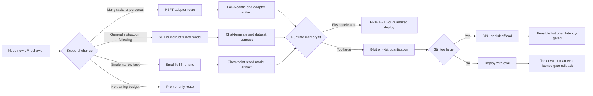

# Chapter 6 - Language Model Fine-Tuning, PEFT, Quantization, and Runtime Gates

## Reading Scope

This is a direct-read synthesis from the lawful local PDF *Hands-On Generative AI with Transformers and Diffusion Models*. This pass narrowed to the highest-value remaining Chapter 6 slice for Agent Studio: **how language-model adaptation choices interact with limited hardware, adapter artifacts, quantization, offload, evaluation, and deployment feasibility**.

The note stores original synthesis only. It does not store copied chapter text, code listings, prompts, figures, or long excerpts.

## Why This Slice Matters

The parent generative-media note already said that small specialist models, local inference, and adaptation artifacts matter. What was still too compact was the **operational contract behind limited-hardware adaptation**:

- when a route should use a smaller specialist model rather than a giant base model;
- when full fine-tuning is justified versus instruction tuning versus PEFT;
- why LoRA artifacts are portable but still base-model-coupled;
- why quantization solves memory pressure but not necessarily latency or quality;
- why offload expands feasibility but can fail production latency targets;
- why chat-template format and evaluation policy are part of the release gate.

This matters because Agent Studio should not treat "fine-tuned model" as one thing. Chapter 6 turns it into a route-design decision across **artifact size, hardware fit, serving topology, evaluation burden, and rollback shape**.

## Adaptation Decision Map

## Route Families

| Route family | What changes | Best fit | Main failure if under-specified |
|---|---|---|---|
| Full fine-tune | many or all model weights | narrow specialist model with stable task and enough data | expensive artifact sprawl, retrain burden, weak rollback |
| SFT / instruct tuning | model weights shaped across instruction-response data | broader conversational or multi-task behavior | poor format adherence, mixed-task interference, evaluation blur |
| PEFT / LoRA | low-rank or adapter parameters on frozen base | many bounded behaviors sharing one base model | base mismatch, adapter drift, merge/load confusion |
| Quantized base + adapter | frozen low-bit base plus trainable adapters | limited-hardware adaptation such as QLoRA | quality/latency assumptions hidden behind "fits now" |
| Prompt-only | no weight update | low-risk experimentation or low-frequency tasks | brittle behavior, weak consistency, hidden prompt-template dependence |

## Model Selection Before Fine-Tuning

Chapter 6 makes an important upstream point: adaptation success starts with **choosing the right base model**.

The chapter treats these as first-class selection surfaces:

- parameter count and memory footprint;
- whether the model is encoder, decoder, or chat-oriented;
- training-data affinity with the task domain;
- context-length fit;
- licensing or gated-access terms;
- benchmark signals as rough filters rather than final proof.

Agent Studio implication: **base-model choice belongs in the release record**. A route should not store only the adapter or fine-tune output; it should store the exact parent model revision, tokenizer, chat template, and access/licensing posture.

## Full Fine-Tuning vs Multi-Task SFT

The chapter uses full fine-tuning to show how a model can be specialized, but it also warns about the cost of doing this repeatedly.

High-value operating lessons:

- one task-specific fine-tune can work well for a bounded task;
- many separate task-specific fine-tunes create artifact sprawl and maintenance burden;
- multi-task SFT can unify several behaviors into one conversational model;
- dataset quality and formatting matter more than raw sample volume;
- the right baseline is not always "bigger model"; often it is "smaller model better matched to the route".

For Agent Studio, this means the route review should ask:

1. Is the task narrow enough for a small specialist model?
2. Is this a one-off capability or one of many behaviors that should share a base?
3. Would retrieval or prompt-only control solve the problem without changing weights?
4. Is the organization prepared to evaluate and maintain another checkpoint-scale artifact?

## PEFT and LoRA as Deployment Shapes

PEFT is the chapter's strongest product-system contribution. The key idea is not only that PEFT trains fewer parameters. The larger point is that it changes the **unit of deployment**.

What Chapter 6 makes concrete:

- the base model stays mostly frozen;
- a small trainable artifact carries the task-specific update;
- LoRA expresses the update as low-rank matrices attached to target modules;
- LoRA hyperparameters such as rank, alpha, dropout, and target modules materially affect behavior;
- adapters are compact enough to support many specialized downstream behaviors without copying the whole base model each time.

This leads to three operational modes Agent Studio should distinguish:

- **attached adapter serving**: base + chosen adapter loaded together;
- **merged adapter serving**: adapter merged into the base for simpler inference semantics;
- **adapter registry behavior**: many compact artifacts loaded against one governed base model.

The failure mode is not subtle: an adapter without exact parent-model lineage is not a trustworthy release artifact.

## Limited-Hardware Training Contract

Chapter 6 repeatedly emphasizes that limited hardware is not just an inconvenience layer. It changes what is feasible.

Important constraints:

- memory demand depends on parameter count, precision, optimizer state, activations, and batch shape;
- gradient checkpointing and related tricks trade compute for memory;
- lower-bit loading can make a model fit, but the training/runtime stack becomes more constrained;
- consumer hardware can support meaningful adaptation only when the route explicitly narrows artifact and runtime expectations.

Agent Studio implication: track **training fit** and **serving fit** separately. A route that can be trained locally is not automatically eligible for production serving on that same hardware profile.

## Quantization and What It Actually Solves

The chapter's quantization discussion is useful because it separates memory fit from model quality claims.

Core operational meaning:

- FP16/BF16 usually reduce memory with manageable inference behavior;
- 8-bit quantization sharply reduces load memory but can change throughput and backend support;
- 4-bit quantization pushes feasibility further but narrows the safe training/deployment envelope;
- outlier-aware methods such as LLM.int8 are designed to preserve quality better than naive low-bit rounding;
- quantization should be treated as a **runtime contract**, not just a storage trick.

For Agent Studio, quantized deployment should record:

- quantization method and bit width;
- backend/runtime used;
- whether only inference is quantized or the training recipe depends on it;
- model compatibility and unsupported feature caveats;
- quality and latency comparison versus a higher-precision baseline.

## Offload Is a Feasibility Path, Not a Performance Claim

The chapter's offload discussion is especially useful for avoiding false confidence.

If a model does not fit in accelerator memory, the stack can spill weights or shards into:

- CPU RAM;
- multiple devices;
- disk-backed paths as a last resort.

This broadens what can technically run, but often at the cost of:

- lower tokens-per-second;
- more variable latency;
- weaker interactive UX;
- tighter failure coupling to host-memory pressure or IO.

Agent Studio should therefore separate three claims:

1. **loads successfully**;
2. **is usable for local experimentation**;
3. **meets production latency and throughput targets**.

Only the third is a release claim.

## QLoRA and the Combined Efficiency Pattern

Chapter 6's combined message is that PEFT and quantization complement each other.

QLoRA-style logic means:

- keep the large base model frozen in low precision;
- train adapters rather than the whole base;
- recover far more capability per unit of hardware than full fine-tuning would allow;
- accept that the training recipe becomes more delicate and usually slower than a simpler small-model route.

This is not a universal default. It is a good fit when:

- the base model is worth preserving;
- the task needs stronger adaptation than prompting alone;
- the hardware budget cannot tolerate full-precision or full-weight training;
- evaluation and deployment governance are strong enough to prevent casual overclaiming.

## Chat Template and Formatting Are Runtime State

One of the chapter's less flashy but more operationally important lessons is that a chat model depends on its **format contract**.

The note should retain these consequences:

- tokenizer and chat-template configuration determine the actual prompt string seen by the model;
- bad role formatting, turn separators, or prompt wrappers can silently degrade performance;
- single-turn success does not prove multi-turn conversational quality;
- adapter/base/template mismatch can look like "model quality issues" when it is actually a format bug.

Agent Studio implication: the release surface needs a versioned **conversation-format record**, not only model weights.

## Evaluation and Release Evidence

Chapter 6 is careful not to let benchmark enthusiasm substitute for route proof.

The durable evaluation lessons are:

- generic leaderboards are candidate filters, not ship criteria;
- base-model evaluation and chat-model evaluation are different tasks;
- task-specific real-world testing matters more than one benchmark number;
- human judgment is still necessary for conversational quality;
- lower memory usage is not itself a success metric.

A bounded release gate for this route class should require:

- baseline comparison against prompt-only and smaller-model alternatives;
- task metrics appropriate to the use case;
- latency and memory evidence for the chosen hardware profile;
- regression checks for formatting and adapter/base compatibility;
- rollback to prior base/adaptor/runtime policy.

## Agent Studio Release-Gate Deltas

1. Distinguish `full_finetune`, `sft_instruct`, `peft_adapter`, and `quantized_adapter` as different artifact classes.
2. Record parent-model identity, tokenizer, chat template, and gating/license posture on every adapter-bearing route.
3. Store training-fit and serving-fit evidence separately.
4. Treat quantization as a runtime policy with explicit quality/latency tradeoffs, not as a hidden optimization flag.
5. Require adapter merge/load policy and base-compatibility proof before promotion.
6. Keep offload-backed routes out of interactive production unless latency evidence says otherwise.
7. Require real task evals and human review for chat behavior rather than relying on benchmark rankings.
8. Preserve rollback targets at the level of base revision, adapter revision, runtime config, and prompt/template policy.

## Datastore Implications

Strengthen these datastore objects:

- `adapter_artifact_record`: base model, target modules, rank, alpha, dropout, merge state, compatible runtime.
- `quantized_runtime_profile`: bit width, method, backend, device map, offload settings, supported features, latency evidence.
- `conversation_format_record`: tokenizer revision, chat template, role markers, stop policy, serialization tests.
- `limited_hardware_training_record`: batch shape, precision mode, checkpointing policy, optimizer state strategy, memory ceiling.
- `model_selection_record`: candidate models considered, license/gated-access status, context length, benchmark notes, rejected alternatives.
- `lm_adaptation_release_gate`: binds base lineage, adapter artifact, quantized runtime, eval evidence, fallback, and rollback.

## Bottom Line

Chapter 6 turns limited-hardware adaptation from a notebook trick into a product contract. The key lesson is not merely that LoRA, quantization, or offload exist. The key lesson is that **artifact class, runtime class, and evaluation class must stay separate**.

When they are separated cleanly, Agent Studio can support:

- small specialist models where they are enough;
- adapter-bearing multi-behavior systems where one base model serves many tasks;
- quantized local or constrained deployments without pretending they are automatically production-ready;
- explicit rollback and compatibility checks when adaptation artifacts evolve.

That is the durable Chapter 6 contribution: adaptation on limited hardware is viable, but only when the route ledger preserves exactly what changed, what hardware assumptions made it possible, and what evidence proves it is safe to keep.
