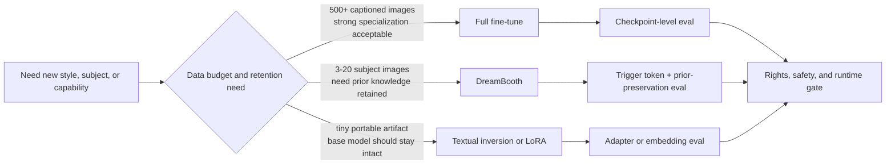

# Chapter 7 - Stable Diffusion Adaptation, DreamBooth, and LoRA Release Gates

## Reading Scope

This is a direct-read chapter synthesis from the user-provided local PDF *Hands-On Generative AI with Transformers and Diffusion Models*. Tonight's pass narrowed to the highest-value Chapter 7 slice for Agent Studio: **how Stable Diffusion is adapted**, what separates **full fine-tuning**, **DreamBooth**, **textual inversion**, and **LoRA**, and which rights/runtime/release checks are required before these routes become product behavior.

The note stores original synthesis only. It does not store copied chapter text, code listings, figures, prompts, or long excerpts.

## Why This Slice Matters

The parent note already said that generated-media routes need adaptation rights, model lineage, and runtime evidence. What it did not yet make concrete enough is **how adaptation choices change the operational contract**:

- **full fine-tuning** changes the whole model and can over-specialize it;
- **DreamBooth** personalizes a subject with a trigger token and prior-preservation logic;
- **textual inversion** learns an embedding rather than a checkpoint-sized model update;
- **LoRA** turns customization into a small attachable artifact whose behavior depends on the exact base model;
- **memory-saving tricks** change feasibility, speed, and reproducibility rather than merely improving convenience.

That distinction matters for Agent Studio because adaptation is not one release surface. It affects rights review, artifact storage, serving topology, rollback, and evaluation scope.

## Adaptation Decision Map

## Mechanism Ladder

| Method | What actually changes | Best fit | Main risk if under-specified |
|---|---|---|---|
| Full fine-tuning | Many or all trainable diffusion weights | domain/style specialization with enough data | catastrophic forgetting, expensive retraining, weak rollback |
| DreamBooth | personalized subject behavior plus token-triggered concept injection | few-shot subject personalization | identity/style misuse, overfit subject memorization |
| Textual inversion | learned text embedding/token | lightweight concept token with tiny artifact | lower quality ceiling, token ambiguity |
| LoRA | low-rank adapter weights on base modules | shareable PEFT adaptation with base-model reuse | wrong base checkpoint, merge/fuse confusion, stack interactions |
| Control-capability tuning | new conditioning or edit capability | inpainting/depth/control surfaces | capability claims exceed training evidence |

## Full Fine-Tuning Contract

The chapter treats full fine-tuning as the default historical baseline: continue training Stable Diffusion on image-caption pairs so the model learns a new domain, style, or concept distribution. The main lesson is not the script path; it is the **specialization tradeoff**.

High-value operating points:

- quality and caption alignment matter more than bulk scraping;
- hundreds of curated examples may be needed for a high-quality full route;
- the model is nudged toward the new distribution, not just taught a harmless plugin;
- evaluation must check both target improvement **and** broad capability retention;
- memory-saving settings make training possible on smaller hardware, but they do not remove the need for validation against the intended serving stack.

For Agent Studio, a full diffusion fine-tune is closer to a new model release than a prompt tweak.

## Dataset and Rights Rules

The chapter is explicit that the useful dataset is **image + caption** aligned, filtered, and legally usable. It also warns that artist styles, faces, or protected material can trigger legal and ethical constraints.

Operational implications:

- dataset records need image-source provenance, caption provenance, and rights status;
- web scraping or bulk collection is not automatically lawful product data;
- quality filtering is a first-class training step, not cleanup trivia;
- validation prompts should cover both the desired concept and off-target prompts to expose forgetting or unsafe drift.

## DreamBooth Subject Personalization

DreamBooth is the chapter's clearest few-shot personalization path. Instead of broad domain retuning, it binds a subject or concept to a **unique trigger token** and may use **prior preservation** so the base model does not collapse its broader class knowledge.

The important product meaning:

- few images can be enough for a strong personalized route;
- subject-specific success does not prove class-level generality;
- token choice, class concept, and prior-preservation setup are part of the reproducibility contract;
- faces, pets, branded objects, and artist-like styles each carry different rights and safety posture.

DreamBooth should therefore be treated as a governed personalization workflow, not just a shortcut to attractive examples.

## Textual Inversion vs LoRA

Textual inversion and LoRA solve different problems even when both look "lightweight":

- **textual inversion** stores a learned embedding/token and is easiest to distribute, but it usually gives weaker control and lower fidelity than stronger adaptation methods;
- **LoRA** leaves the base model mostly intact and stores compact low-rank deltas, which is better for attachable specialist behavior and rollback;
- **LoRA inference** depends on loading the correct base checkpoint and knowing whether adapters were fused, merged, or stacked.

For Agent Studio, this means artifact type must be explicit. An embedding token, a LoRA adapter, and a full checkpoint are not interchangeable deployment units.

## Memory and Training Feasibility

The chapter's practical training advice lines up with current Diffusers guidance: fp16, gradient checkpointing, gradient accumulation, and memory-aware optimizers can make adaptation feasible on narrower hardware budgets.

But the design rule is sharper than "use less VRAM":

- training feasibility depends on resolution, batch policy, optimizer choice, and which modules are trainable;
- training-time fit is different from inference-time fit;
- memory-saving tricks can change speed, numerical behavior, and checkpoint cadence;
- local adaptation claims should always attach the exact serving/fallback target.

## Capability Tuning Beyond Style Transfer

The chapter briefly extends adaptation beyond style or subject learning into **inpainting** and **new conditioning inputs**. This matters because adaptation can add a new route class, not merely improve a preexisting one.

Agent Studio should treat that as a stronger bar:

- capability tuning needs route-specific evals, not only pretty samples;
- conditioning surfaces must be recorded explicitly;
- product claims must separate "specialized style model" from "new edit/control capability".

## Release-Gate Implications

Add or strengthen these records:

- `media_adaptation_record`: adaptation type (`full_finetune`, `dreambooth`, `textual_inversion`, `lora`), base model lineage, trainable modules, trigger token if any, and merge/fuse mode.
- `adaptation_training_dataset_record`: image sources, captions, rights/consent status, filtering policy, class/instance split, and collection method notes.
- `adaptation_runtime_profile`: training precision, memory-saving controls, optimizer regime, resolution, batch behavior, and target inference profile.
- `adaptation_validation_pack`: validation prompts, concept-retention prompts, forgetting probes, safety probes, and human-review samples.
- `adapter_artifact_record`: embedding file vs LoRA weights vs full checkpoint, parent checkpoint, hash, load path, and rollback target.
- `personalization_rights_record`: subject identity, consent/license scope, blocked uses, expiry, and publication policy.

## Stable Diffusion Adaptation Release Gate

Promote an adapted diffusion route only when the gate proves:

1. **adaptation mode is explicit**: full fine-tune, DreamBooth, textual inversion, LoRA, or capability-specific conditioning update;
2. **base model lineage is fixed**: checkpoint family, license, intended use, gated-access terms, and exact parent model are recorded;
3. **training data is governable**: image sources, captions, rights/consent, filtering policy, and any class/instance split are attached;
4. **artifact type is reproducible**: full checkpoint vs embedding vs LoRA adapter, plus merge/fuse/load behavior and hashes;
5. **retention and overfit checks exist**: held-out prompts show target gains without unacceptable forgetting or collapse;
6. **subject/style governance is explicit**: artist style, person likeness, pet identity, voice/brand adjacency, and blocked publication cases are reviewed;
7. **runtime fit is proven**: precision, memory-saving controls, serving hardware, latency tier, and fallback route are attached;
8. **rollback stays possible**: revert path to the untouched base model or prior adapter stack is defined.

## Mental Model Asset

See `../assets/ch07-stable-diffusion-adaptation-release-gate.svg` for a compact visual of the dataset -> adaptation method -> artifact type -> validation -> publish gate flow.
