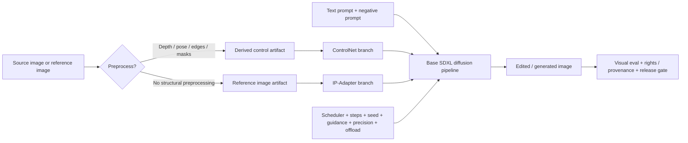

# Chapter 8 - Controllable Image Editing With ControlNet And IP-Adapter

## Reading Scope

This is a direct-read chapter synthesis from the user-provided local PDF *Hands-On Generative AI with Transformers and Diffusion Models*. Tonight's pass narrowed to the highest-value subsystem slice inside Chapter 8: gated edit-model setup, ControlNet conditioning, IP-Adapter image prompting, style-transfer scaling, and multi-control composition for SDXL-class pipelines.

The note stores original synthesis only. It does not store copied chapter text, code listings, figures, prompts, or long excerpts.

## Why This Slice Matters

The parent note already captured that generated media routes need prompts, seeds, model cards, schedulers, adapters, rights checks, and release gates. What it did not yet make concrete enough is **how controllable image-editing routes are actually assembled**.

This chapter slice closes that gap by turning controllable diffusion into a route contract:

- **ControlNet** adds typed structural evidence such as depth, pose, edges, line art, or segmentation.
- **IP-Adapter** adds reference-image guidance for variation, style transfer, identity hints, or composition cues.
- **scheduler and runtime settings** still matter because some edit models are trained against a specific denoising regime and some serving profiles only fit with offload or lower precision.
- **multi-control composition** means a route can no longer be described as prompt + model + image; it is a stack of conditioning artifacts with explicit order and strengths.

That combination is exactly the kind of detail an Agent Studio release gate needs before a media-editing workflow can be treated as reproducible, debuggable, and safe.

## Control Stack Map

## Control Taxonomy

| Component | Primary job | Main artifact it introduces | Failure mode if under-specified |
|---|---|---|---|
| Base diffusion model | General image prior and denoising backbone | base-model identity and model card | output behavior drifts across model swaps |
| Scheduler | Defines denoising trajectory | scheduler class and config | silent quality change or incompatibility |
| ControlNet | Structural conditioning | derived control image plus control type | layout/pose/depth intent is not reproducible |
| IP-Adapter | Reference-image conditioning | reference image plus adapter weights/scale | style/subject transfer is not auditable |
| Precision / offload policy | Makes route fit available hardware | dtype, device map, CPU offload policy | latency/quality regressions are unexplained |

## Gated Edit Models And Scheduler Compatibility

The chapter's CosXL edit setup is a useful warning that not every diffusion editing route is a drop-in pipeline. Some models are:

- gated behind explicit Hugging Face acceptance flows;
- tied to a specific auth or token path before download;
- trained against a particular scheduler, so using a default scheduler can quietly degrade results.

For Agent Studio that means the scheduler belongs in the route contract, not hidden inside convenience code. The route record should capture:

- gated-access or license acceptance status;
- exact model identifier and weight source;
- scheduler class and any non-default scheduler parameters;
- inference-step range that was actually validated.

This also sharpens a governance distinction: a route can be technically runnable while still not being promotion-ready because gated terms, model-card restrictions, or scheduler-specific behavior have not been recorded.

## ControlNet As Structural Conditioning

The chapter presents ControlNet as a **trainable control branch layered over the original diffusion model** rather than direct destructive fine-tuning of the base model. The operational consequence is important: the base model remains the general image prior, while the ControlNet branch injects a typed structural constraint.

The chapter's practical condition families include:

- canny edges;
- human pose / OpenPose;
- depth maps;
- scribbles;
- segmentation;
- line art.

These are not interchangeable. A depth map constrains coarse geometry, a pose map constrains body layout, and canny edges constrain contour structure. Agent Studio should therefore store `control_type` as an explicit field and bind it to the preprocessor that generated the control artifact.

### ControlNet pipeline contract

The chapter's SDXL example makes the serving contract clear:

- load a ControlNet model separately from the base SDXL model;
- attach it through a ControlNet-capable pipeline class;
- preprocess the source image into the expected condition format;
- set `controlnet_conditioning_scale` to decide how strongly the structure constrains the output;
- set inference steps and precision explicitly.

That yields a more faithful trace model:

1. original source image;
2. preprocessor model and version;
3. derived control artifact;
4. ControlNet weights;
5. base model;
6. scheduler;
7. conditioning strength, steps, seed, precision, and device policy.

Without those records, reproducibility is weak even when the final image is saved.

## Preprocessors Are Part Of The Route, Not Prep Noise

The chapter's depth example uses an auxiliary preprocessor before diffusion. That is a strong systems-design signal: a control route is not just "image in, image out." It often includes an **upstream learned transformation** that generates the artifact the diffusion model will obey.

For Agent Studio this means a change in preprocessor can be a real route change even if the diffusion model stays fixed. The release surface should include:

- preprocessor model identifier;
- resize/crop policy before preprocessing;
- derived artifact dimensions;
- any normalization or conversion choice;
- evidence that the control artifact still matches the intended constraint.

If the preprocessor drifts, downstream edits can drift while every later setting appears unchanged.

## Runtime And Memory Constraints

The chapter's SDXL examples repeatedly pair the route with `float16`-style loading and optional CPU offload. That is the right design lesson for the vault: controllable diffusion is often serving-bound before it is algorithm-bound.

Important route consequences:

- ControlNet increases memory pressure because extra conditioning must remain active during denoising.
- IP-Adapter adds more components and attention work, which further increases runtime complexity.
- CPU offload can make an otherwise impossible route fit on smaller hardware, but it changes latency enough that SLA-sensitive routes need a different serving profile.
- resolution is a hidden multiplier; 1024×1024 edits are a materially different runtime class from small preview images.

A valid runtime trace should therefore capture at least:

- precision (`fp16`, `bf16`, or higher precision path);
- device and offload strategy;
- resolution and batch count;
- scheduler and step count;
- whether the route is preview-grade, interactive, or offline batch rendering.

## IP-Adapter As Reference-Image Conditioning

The chapter positions IP-Adapter as the complementary control family to ControlNet. Instead of providing typed structural maps, IP-Adapter lets the route condition on a reference image while still keeping the base text-prompt channel intact.

The architectural point that matters is that IP-Adapter introduces:

- an image-feature extraction path;
- decoupled cross-attention modules attached to the pretrained diffusion backbone;
- a scale parameter that decides how strongly the reference image influences generation.

That means IP-Adapter should not be modeled as a generic prompt attachment. It is a separate conditioning subsystem with its own weights, scale, and provenance requirements.

### Product interpretation of the main IP-Adapter modes

| Mode | Main control intention | What should be evaluated |
|---|---|---|
| Image variation | preserve broad visual semantics while changing realization | drift from source, over-copying, lost salient elements |
| Style transfer | transfer texture/composition/style without claiming exact identity preservation | unwanted subject leakage, style over-dominance, text-prompt under-following |
| Subject/reference conditioning | keep a subject or composition cue active | likeness/privacy issues, spurious identity promises |
| Mixed text + image prompting | combine a textual task with visual steering | conflict between text objective and image objective |

The chapter's image-variation example matters because it shows a route can use an empty text prompt while the image reference acts as the main conditioning signal. That means the route schema should not assume text is always the primary controller.

## Style Transfer And Structured Adapter Scaling

One of the most valuable details in this slice is that the chapter does not stop at a single scalar adapter strength. The style-transfer example uses **structured scaling aimed at specific SDXL blocks** rather than just a uniform global scale.

That is a meaningful systems insight:

- adapter intensity can be structured rather than scalar;
- different attachment points can emphasize different control semantics;
- the route may need to distinguish style transfer from broader subject or layout steering even when the same adapter family is used.

For Agent Studio, that implies a richer adapter trace:

- adapter identifier and weights;
- scalar or map-style scale configuration;
- intended mode: variation, style transfer, reference guidance, or mixed control;
- evidence that the selected scale shape does not silently override text or structural constraints.

## Composition: ControlNet Plus IP-Adapter

The chapter closes by composing structural and reference-image control in a single pipeline. That is the highest-value route implication from tonight's pass.

A modern image-editing route should be treated as a **conditioning stack** rather than a monolithic model call. The stack can include:

- text prompt and negative prompt;
- source image or masked region;
- derived structural control image;
- reference image;
- ControlNet scale;
- IP-Adapter scale or block map;
- scheduler, step count, seed, precision, and offload policy.

This composition model is exactly where route traces, approvals, and evals need to become more granular. A final asset can look reasonable while hiding the fact that one control source overpowered another or that the route only works under a narrow hand-tuned scale combination.

## Evaluation And Governance Implications

This chapter slice sharpens visual/media governance in five ways.

### 1. Reference and control artifacts need separate provenance

A structural depth map derived from a user image is not the same thing as a style reference image or a subject image. The vault should store them separately because they carry different privacy, consent, and copyright implications.

### 2. Identity and style claims need evidence

Reference-image conditioning can suggest identity or style preservation, but the chapter's own variation example shows outputs can still drift. Product claims should therefore be bounded by eval evidence rather than informal similarity.

### 3. Scheduler choice can be compliance-relevant

If a gated edit model was validated with a specific scheduler, the production route must show that the deployed scheduler matches the validated configuration.

### 4. Runtime feasibility is part of route safety

If a route only fits by using aggressive offload or low precision, that needs to be visible before an interactive workflow or reviewer SLA depends on it.

### 5. Multi-control routes need conflict evals

A route should be tested for situations where:

- ControlNet over-constrains and crushes style or creativity;
- IP-Adapter overwhelms the text prompt;
- prompt and reference image disagree;
- structural control and style control conflict;
- safety filters, watermarking, or policy checks alter outputs after generation.

## Agent Studio Design Implications

- Treat ControlNet preprocessors as first-class route components, not invisible preprocessing.
- Separate structural controls from reference-image controls in both UI and trace schema.
- Record scheduler identity and non-default scheduler config in every controllable diffusion route.
- Distinguish scalar adapter scales from structured per-block scale maps.
- Keep control artifacts, reference artifacts, and source images as separate provenance objects.
- Evaluate mixed-control routes for conflict, not only for single-control quality.
- Do not promise style or identity preservation without explicit eval coverage.
- Make runtime fit and latency part of release evidence because the route may only be feasible under offload or low-precision constraints.

## Datastore Objects Strengthened By This Chapter

| Object | Why this chapter strengthens it |
|---|---|
| `media_pipeline_trace` | Needs explicit control-stack ordering, scheduler, precision, and runtime profile. |
| `generation_control_record` | Should distinguish control type, derived control artifact, conditioning scale, and composition order. |
| `media_adaptation_record` | Needs separation between ControlNet/IP-Adapter-style attach-ons and other adaptation types. |
| `model_card_record` | Must carry gated-access and intended-use constraints for base/edit models. |
| `local_runtime_profile` | Should include offload, precision, memory ceiling, and expected latency tier. |
| `generative_media_pipeline_release_gate` | Must bind scheduler compatibility, control/reference provenance, evaluation of mixed-control failure modes, and runtime feasibility. |

## Delta To The Existing Release Gate

The broad `generative_media_pipeline_release_gate` remains correct, but this chapter adds four specific requirements that should now be interpreted as mandatory for controllable image-editing routes:

1. **scheduler compatibility evidence** for gated or scheduler-sensitive edit models;
2. **separate provenance records** for source image, derived control artifact, and reference image;
3. **typed control-stack metadata** including ControlNet/IP-Adapter identifiers and strengths;
4. **mixed-control evaluation slices** proving text, structure, and style objectives do not silently interfere.

## Operational Takeaways

- A controllable diffusion route is a stack of condition sources, not a single prompt call.
- ControlNet governs structure; IP-Adapter governs reference-image influence; the scheduler still governs denoising behavior.
- Preprocessors, scales, and offload policy are not implementation noise; they are reproducibility-critical settings.
- Style-transfer and reference-image routes need stronger rights and likeness review than plain text prompting.
- If a route only works after hand-tuned scale combinations, preserve those combinations as route evidence rather than rediscovering them ad hoc.
