# Chapter 9 - Generating Audio Route Contracts And Evaluation

## Reading Scope

This is a direct-read chapter synthesis from the local *Hands-On Generative AI with Transformers and Diffusion Models* PDF. Tonight's pass narrowed to the highest-value production slice inside Chapter 9: audio representations, ASR architecture boundaries, TTS and voice conditioning, text-to-audio and music generation families, evaluation surfaces, runtime fit, and rights/provenance implications.

The note stores original synthesis only. It does not store copied chapter text, notebook dumps, prompts, code listings, figures, or long excerpts.

## Why This Slice Matters

The parent note already recorded that audio routes need sampling-rate awareness, representation records, latency evidence, and consent for synthetic voices. What it did not yet make concrete enough is that **audio is not one modality contract**.

Chapter 9 sharpens five design boundaries that matter directly for Agent Studio:

1. **ASR, TTS, text-to-audio, music generation, and voice conversion are different route families**, not a single “audio model” surface.
2. **Representation choice is operational state**: raw waveforms, log-mel features, spectrograms, and neural-codec tokens imply different preprocessing, evaluation, runtime, and editability constraints.
3. **Speech routes and generative audio routes have different evaluation logic**: WER/CER and transcript usefulness are not substitutes for prompt adherence, temporal coherence, originality checks, or listener review.
4. **Voice identity is a governance boundary**: speaker embeddings, cloning, and conversion need rights, consent, and blocked-use policy beyond generic TTS quality checks.
5. **Local/open audio generation is a serving problem**: sample rate, duration, representation length, precision, and memory shape determine whether a route belongs in realtime, batch, or review-only lanes.

That combination fills a real vault gap: the speech canon is already strong, but multimodal audio generation and audio-specific evaluation were still too compressed.

## Audio Route Map

```mermaid
flowchart TD
    A[Audio route] --> B[Representation contract]
    A --> C[Task family]
    A --> D[Evaluation surface]
    A --> E[Governance + release gate]

    B --> B1[Raw waveform]
    B --> B2[Log-mel / spectrogram]
    B --> B3[Latent speech units]
    B --> B4[Neural codec / audio tokens]

    C --> C1[ASR / transcription]
    C --> C2[TTS / speech synthesis]
    C --> C3[Text-to-audio / sound effects]
    C --> C4[Music generation]
    C --> C5[Voice conversion / cloning]

    D --> D1[WER / CER / transcript action errors]
    D --> D2[MOS / AB preference / pronunciation]
    D --> D3[Prompt fit / temporal coherence / artifact review]
    D --> D4[Originality / nearest-neighbor / disclosure]

    E --> E1[Voice rights + consent]
    E --> E2[Runtime fit + fallback]
    E --> E3[Watermark / provenance / publication policy]
```

## Representation Is Part Of The Product Contract

The chapter moves across several audio representations, and Agent Studio should preserve that distinction explicitly:

| Representation | Typical route families | What must be recorded |
|---|---|---|
| Raw waveform | ASR frontend, audio enhancement, direct waveform models | sample rate, channel count, duration, compression, capture device, normalization |
| Log-mel / spectrogram | Whisper-style ASR, spectrogram-based TTS, diffusion over audio images | feature extractor config, window/stride, resampling, spectrogram transform |
| Latent speech units | intermediate speech pipelines, compact speech representations | encoder family, codebook or latent-space identity, reconstruction caveats |
| Neural codec / discrete audio tokens | MusicGen/AudioGen-style generation, multi-stage audio LMs | codec model, token rate/temporal resolution, duration policy, decode stage |

The important rule is that representation is not hidden preprocessing. It changes:

- how a route scales with duration;
- which controls or adapters are possible;
- whether editing is localized or sequence-wide;
- what kinds of artifacts show up;
- which evaluation metrics make sense.

## ASR Route Boundaries

Chapter 9 is useful even when the deeper speech theory already lives in [[../../../02-books/speech-language-processing/chapters/16-asr-and-tts]]. It adds concrete open-model examples that make route-family differences operational rather than abstract.

### ASR family split

- **Wav2Vec2/HuBERT/XLS-R-style paths**: waveform-first, CTC-friendly, sensitive to frontend/sample-rate assumptions, attractive for efficient transcription and multilingual adaptation when the workload slice fits.
- **Whisper-style paths**: encoder-decoder, log-mel input, stronger long-form/multilingual practicality in many open workflows, but autoregressive decoding creates its own latency and hallucination controls.
- **SpeechT5 ASR**: useful reminder that some speech stacks sit inside broader unified speech families rather than one task-specific architecture.

### Agent Studio implications

- ASR routes should store **representation path** as well as model family.
- Long-form transcription and realtime partial transcription should remain separate workload classes.
- Transcript quality should be tracked not only by WER/CER, but also by downstream consequences: slot/action errors, subtitle timing failures, reviewer correction burden, and quote/claim extraction breakage.
- Timestamped transcript spans are grounding evidence, not cosmetic metadata, when transcripts later drive summaries, memory, subtitles, or source-backed claims.

This chapter does **not** replace the SLP speech note. It mainly contributes practical open-model route distinctions and evaluation framing that the broader speech canon can inherit.

## TTS, Voice Conditioning, And Vocoders

The chapter treats TTS as a pipeline rather than a one-shot text-to-waveform trick:

- text normalization or prompting choices determine what is even speakable;
- speaker conditioning changes voice identity, style, and risk posture;
- an acoustic representation still has to be turned into waveform output through a vocoder or equivalent decoder;
- multilingual or cross-speaker synthesis increases both product value and governance burden.

SpeechT5 is especially useful for Agent Studio because it makes two operational points concrete:

1. **speaker conditioning is a first-class artifact** rather than a casual parameter;
2. **vocoder choice and acoustic intermediate format are part of the runtime contract**.

For production routes, keep separate records for:

- text normalization policy;
- speaker embedding or conditioning source;
- vocoder family and output format;
- listener-quality evidence;
- allowed synthetic-voice uses and blocked uses.

## Text-To-Audio, Music Generation, And Audio Diffusion

Chapter 9 broadens the vault beyond speech by covering Bark, MusicGen, AudioGen-style systems, and diffusion-style audio pipelines.

### Distinct route families

- **Bark-like generation** sits between speech and broader audio generation: it can express nonverbal sounds and stylized speech, so it is not identical to plain TTS.
- **MusicGen/AudioGen-style token generators** treat audio as discrete tokens decoded by a compression model. Their main contract is tokenization/codec behavior, temporal resolution, duration control, and prompt-conditioned generation quality.
- **AudioDiffusion/Riffusion-style pipelines** use spectrogram-like intermediate artifacts and diffusion schedulers. Their runtime and artifact profile are closer to image diffusion than to standard TTS.

### Why this matters

Agent Studio should not use one generic “audio output” release rule for all three. The route needs to disclose whether it is:

- generating intelligible speech;
- generating environmental or foley-like sounds;
- generating music or melody-like sequences;
- converting or cloning an existing voice.

That choice changes:

- representation records;
- runtime fit;
- acceptable latency;
- originality review;
- publication and disclosure policy.

## Evaluation Surfaces Differ By Route Family

Chapter 9's clearest system-design contribution is that **audio evaluation is task-shaped**.

| Route family | Core evaluation surface | Failure classes that matter |
|---|---|---|
| ASR | WER/CER, transcript task success, timing/finalization | deletions, hallucinated insertions, entity/name misses, subtitle drift |
| TTS | MOS, AB preference, pronunciation, first-audio latency | unnatural prosody, wrong normalization, clipped audio, voice mismatch |
| Text-to-audio / music | prompt adherence, temporal coherence, artifact/noise review, listener preference | mushy texture, mode collapse, weak prompt binding, duration mismatch |
| Voice conversion / cloning | identity similarity plus rights/consent review | unauthorized likeness, disclosure failure, deceptive use, unstable identity transfer |

### Evaluation rules worth preserving

- Automatic metrics are useful, but not sufficient for public or high-stakes routes.
- Speech intelligibility metrics do not cover music/audio generation quality.
- Human review remains necessary for voice quality, creative usefulness, brand fit, and misuse risk.
- Originality checks matter more for music/audio generation than for plain ASR.

## Runtime And Memory Fit

Audio routes carry duration-heavy tensors, long sequences, and modality-specific preprocessors. This makes runtime fit part of product design, not only optimization:

- sample rate and duration shape memory directly;
- codec-token or spectrogram length controls throughput and latency differently;
- local inference feasibility can differ sharply between ASR, TTS, and music generation even when all are “audio” routes;
- browser/realtime lanes need stricter duration and response limits than batch review or media-production lanes.

Agent Studio should keep audio routes in explicit serving classes:

- **realtime speech**;
- **near-realtime voice output**;
- **batch transcription**;
- **creative audio/music generation**;
- **review-only high-cost synthesis**.

## Rights, Consent, And Provenance

The chapter repeatedly brushes against the hardest production question: synthetic audio can sound like a person, imply a person, or be mistaken for a real recording.

Agent Studio should therefore require:

- explicit consent scope for cloned or conditioned voices;
- blocked-use policy for deceptive or identity-affecting synthetic speech;
- publication/disclosure review for generated speech, music, or audio intended for external audiences;
- provenance or watermark decision when the route is used for outward-facing media;
- originality review when music or sound generation could overfit or imitate protected material too closely.

The broad generative-media release gate remains correct, but Chapter 9 adds one practical governance lesson: **voice identity and creative audio originality need separate evidence, not just generic safety approval**.

## Datastore Additions Strengthened By This Chapter

Add or strengthen these objects:

- `audio_representation_record`: should explicitly distinguish waveform, log-mel/spectrogram, latent-speech-unit, and codec-token paths.
- `music_generation_tokenization_record`: should be used for codec-token or event-like audio generation, not only future music ideas.
- `voice_consent_record`: should cover source voice, consent scope, expiry, publication scope, and blocked uses.
- `vocoder_config_record`: remains the right place for waveform-decoder identity, latency tier, and output-format behavior.
- `nearest_training_neighbor_check`: should be attached to public or high-sensitivity music/audio generation routes when originality matters.
- `audio_generation_eval_result`: new generic eval artifact for non-ASR/TTS audio routes, covering prompt adherence, temporal coherence, artifact/noise review, originality or nearest-neighbor refs, latency tier, and human-review outcome.

## Release-Gate Delta

The parent `generative_media_pipeline_release_gate` should now be interpreted as requiring additional evidence for audio-specific routes:

- speech routes declare whether the route is ASR, TTS, voice conversion, translation, or another speech family;
- non-speech generation routes declare whether output is sound effects, music, ambient audio, or mixed voice-plus-audio content;
- representation path is explicit, including feature extractor or codec/tokenizer where relevant;
- eval surface matches the route family instead of collapsing everything into transcript quality or MOS;
- voice-conditioned routes attach consent, rights, and blocked-use policy;
- creative audio routes attach originality review and publication/disclosure evidence when outputs leave internal review lanes.

## Operational Takeaways

1. Treat audio route families as separate release surfaces, not one “audio model” bucket.
2. Preserve representation choices because they determine runtime, controls, and evaluation.
3. Keep ASR/TTS metrics separate from text-to-audio and music-generation metrics.
4. Require explicit voice-rights evidence before speaker-conditioned or cloned output is promoted.
5. Add originality review for public creative-audio routes.
6. Put audio generation into workload classes just as carefully as text, image, and video generation.
