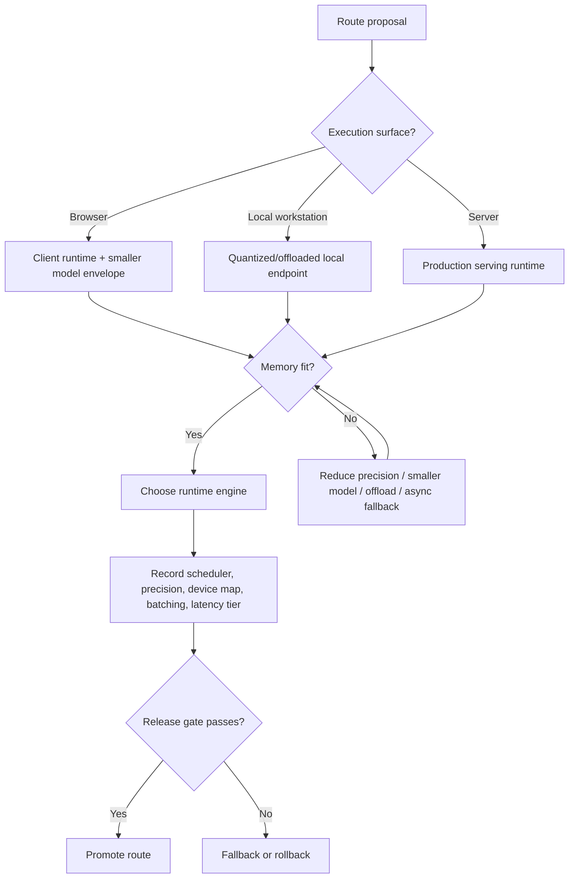

# Appendix A/B — Open-Model Serving, Deployment Surfaces, and Runtime Fit

## Why this appendix pair matters

The remaining high-value gap in the Hands-On Generative AI slice was no longer model mechanics or adaptation. It was deployment follow-through: once a route already knows how to fine-tune, control, or prompt a model, what determines whether that route can run locally, in a browser, on a workstation service, or on a production GPU endpoint?

Appendix A and Appendix B answer that question in a compact but operationally useful way. Appendix A names the serving surfaces and tooling strata. Appendix B names the memory-fit gate that decides whether a serving plan is real or imaginary.

## The smallest slice that changes deployment behavior

The core direct-read span is:

- Appendix A support context: `PDF 789-790`
- Appendix A local inference and deployment tools: `PDF 792-793`
- Appendix B memory requirements and inference fit: `PDF 794-795`

The important move is not “use this one framework.” It is:

1. choose the execution surface;
2. prove memory fit;
3. choose the runtime engine and offload strategy;
4. decide whether the route is interactive, async, or fallback-only.

## The deployment surfaces the appendix actually distinguishes

### 1. Browser/client execution

The appendix treats browser inference as a real deployment option, not a toy. The key value is zero server inference cost, low round-trip latency, and privacy for bounded tasks.

**Operational meaning:** browser execution is only valid when the route can tolerate smaller models, constrained memory, and limited multimodal throughput.

### 2. Local workstation or edge endpoint

The appendix highlights local inference for privacy, customizability, and tight product integration. This is the lane where quantization, CPU/GPU placement, and local-serving wrappers matter most.

**Operational meaning:** local serving is often the first serious open-model deployment surface for internal tools or privacy-sensitive workflows.

### 3. Production server runtime

The appendix separates experimentation from real serving. Once the route leaves the notebook, the question becomes throughput, scale, cloud fit, runtime support, and self-hosted operability.

**Operational meaning:** a production route needs explicit evidence for concurrency, latency, memory ceiling, and failure fallback. “It ran once on my GPU” is not deployment evidence.

## The real deployment decision is surface first, framework second

The appendix names multiple tools, but its deeper lesson is that framework selection follows deployment shape.

- If the route must stay local and private, the important knobs are quantization, device map, and offload.
- If the route must run in-browser, model and precision choices are constrained by the client environment.
- If the route must serve multiple users concurrently, batching behavior, export/runtime compatibility, and observability matter more than notebook ergonomics.

This is especially important for diffusion and multimodal serving. The same model family can be valid in one surface and impossible in another.

## Memory fit is the gate before quality fit

Appendix B makes the first-pass memory rule explicit: model size times precision determines the minimum weight-loading footprint.

That simple rule matters because teams often ask the quality question first:

- Which model looks best?
- Which checkpoint is most impressive?

The appendix forces the better sequence:

- Can the route fit the chosen hardware profile?
- If not, is quantization acceptable?
- If not, can offload rescue the route without breaking latency?
- If not, is the route provider-hosted or async-only instead of locally served?

## Precision is a deployment lever, not only a training detail

The appendix treats precision reduction as one of the main ways to make local inference feasible.

- higher precision preserves more fidelity but consumes more memory;
- lower precision reduces memory and often improves deployability;
- aggressive quantization can degrade output quality or compatibility.

For diffusion/media routes, this should be recorded alongside the route itself. A route contract without precision, engine, and device policy is incomplete.

## Offload expands feasibility but changes the latency class

The appendix makes an important practical point: CPU or disk offload can make a route runnable even when full-GPU fit is impossible.

That does **not** mean the route stays in the same product class.

A route that requires frequent offload may still be suitable for:

- internal operator tools,
- asynchronous asset generation,
- low-concurrency review flows,
- fallback execution when provider endpoints are unavailable.

It may be unsuitable for:

- user-facing realtime generation,
- high-concurrency serving,
- latency-sensitive multimodal loops.

## Diffusion/media implication: hidden multipliers matter

Appendix B is framed around model weights, but the vault should apply the same logic to media-serving multipliers that the appendix only implies:

- image resolution;
- video frame count and temporal window;
- batch size;
- ControlNet or adapter stack count;
- VAE tiling/slicing behavior;
- prompt count per request;
- refiner or second-stage pipeline use.

The route can “fit” at one resolution and fail at another. That should become a serving-profile record, not a rediscovered incident.

## Deployment-tool choice is a route contract boundary

Appendix A names deployment tools as a category, not an interchangeable implementation detail.

For Agent Studio that means the route contract should record:

- runtime family: browser, local process, server, compiled runtime;
- engine: native PyTorch-style stack, ONNX Runtime, TensorRT-class compiled path, or provider endpoint;
- device placement and offload policy;
- batching/concurrency policy;
- expected latency tier;
- fallback if the preferred runtime cannot fit or degrades quality.

## Serving and adaptation are different evidence surfaces

Existing Hands-On notes already cover adaptation and control:

- Chapter 7: adaptation artifacts and DreamBooth/LoRA workflow
- Chapter 8: control surfaces for image editing
- Chapter 10: video-generation governance and multimodal frontier

This appendix pair adds the missing layer between those notes and production use:

- how the route actually runs,
- when it fits,
- what degradation path is acceptable,
- and when a local/open route must yield to a hosted or asynchronous lane.

## Mermaid: route deployment decision flow

## Agent Studio design rules from this slice

1. Treat execution surface as a first-class route choice.
2. Record precision, runtime engine, and device/offload policy on every open-model media route.
3. Keep interactive and asynchronous serving classes separate.
4. Do not treat offload success as proof of realtime viability.
5. Model fit should be tested at the intended resolution, duration, and control-stack complexity.
6. Runtime choice belongs in release review because it changes latency, cost, and failure modes.
7. Serving evidence is distinct from adaptation evidence; both are required.

## Datastore implications

Add or strengthen these records:

- `open_model_serving_profile`: route class, engine, device map, precision, offload mode, memory ceiling, latency tier, concurrency expectations.
- `media_runtime_topology_record`: browser vs local endpoint vs server runtime, plus batch/async/fallback class.
- `scheduler_runtime_record`: scheduler family, step count, guidance behavior, and quality/cost posture.
- `runtime_export_record`: native runtime vs ONNX vs compiled engine, artifact version, and compatibility caveats.
- `media_route_memory_budget`: model weights, precision, resolution, batch, adapter stack, and expected peak memory.

## Release-gate deltas this appendix adds

Promote an open-model media-serving route only when it proves:

- the execution surface is explicitly chosen and justified;
- the model fits the intended hardware profile at the intended workload shape;
- precision/offload changes and their quality consequences are measured;
- runtime engine and export path are recorded;
- batching or async policy matches the product latency class;
- fallback exists if local/open serving becomes too slow, too large, or too unstable.

## Best use in the vault

Use this note when a route proposal needs stronger evidence for:

- diffusion-serving feasibility;
- open-model image or video endpoint design;
- local-media generation versus provider-hosted tradeoffs;
- runtime-engine choice and export strategy;
- memory-fit and offload policy before release.
