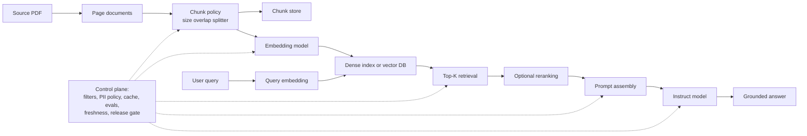

# Appendix C — RAG Pipeline and Retrieval Runtime Gates

## Why this appendix matters

Appendix C is small, but it closes an important remaining gap in the Hands-On Generative AI note set: it turns the book's broad "RAG is useful" claim into a concrete product pipeline with explicit retrieval stages, prompt assembly, and production-hardening decisions.

The appendix uses a minimal implementation rather than a broad architectural survey. That makes it valuable for Agent Studio: the release surface is easy to name precisely.

## Minimal pipeline the appendix actually builds

The book's pipeline is deliberately simple:

1. A user asks a question.
2. The system retrieves the most similar document chunks.
3. The system passes question plus retrieved context to an instruct model.
4. The model generates an answer grounded in the retrieved text.

That sounds obvious, but the appendix makes an operational point that often gets blurred in product code: retrieval is its own subsystem, not a helper function hidden inside generation.

## The appendix's example is chosen to prove freshness, not just convenience

The worked example uses the EU AI Act because the selected small model predates the policy work. The point is not legal QA itself. The point is that RAG is a mechanism for handling information that the generator likely never saw during training, or that may have changed since training.

For Agent Studio this means RAG routes should be justified by one of three conditions:

- the knowledge is post-training or rapidly changing;
- the source must stay auditable and attributable;
- the answer should be constrained by a narrower document set than the model's general prior.

## Loader and document granularity are first-class design choices

The appendix uses `PyPDFLoader`, which yields one document per page before any finer segmentation. In the concrete example, the PDF becomes 108 page-level documents.

That page-level baseline matters because it shows the first granularity boundary:

- the raw source object is a PDF;
- the first retrieval-ready object is a page document;
- the final retrieval unit is a chunk.

Those are not interchangeable. A pipeline that loses track of which stage produced a bad answer becomes very hard to debug.

## Chunking is the first real retrieval gate

The appendix then applies `RecursiveCharacterTextSplitter` with:

- `chunk_size=500`
- `chunk_overlap=100`

The book frames these as practical rather than magical numbers. The real lesson is that chunking is a contract between source structure, embedding limits, and answer completeness.

### Why chunk size matters

If chunks are too small:

- definitions split away from qualifiers;
- local recall may look good while answer completeness gets worse;
- rankings become noisy because many fragments look equally plausible.

If chunks are too large:

- embeddings dilute the key point with surrounding material;
- prompt assembly wastes context budget on irrelevant text;
- downstream reranking becomes more expensive.

### Why overlap matters

Overlap is not a cosmetic setting. It reduces the chance that a sentence boundary, heading boundary, or definition boundary gets cut in a way that destroys semantic continuity.

For Agent Studio, chunk policy belongs in a datastore record and in release review. It should never be an untracked constant buried in one ingestion script.

## The chunk count explosion is itself a systems signal

The appendix's 108 page documents become 854 chunks after splitting.

That multiplier is operationally important:

- indexing cost scales with chunk count;
- embedding latency scales with chunk count;
- storage, rebuild, and invalidation cost scale with chunk count;
- evaluation load scales with chunk count because the candidate set changes.

A single source can therefore look modest at the file layer while being large at the retrieval layer.

## Embedding choice is a retrieval economics decision

The appendix uses the sentence-transformer retriever `BAAI/bge-small-en-v1.5` and shows that each chunk becomes a 384-dimensional vector.

The main lesson is not "use this exact model." The lesson is that first-stage retrieval typically wants a small, fast encoder that is cheap enough to run across the whole corpus and cheap enough to rebuild when the corpus changes.

This appendix therefore complements the vault's broader retrieval canon:

- generator quality is not a substitute for retriever quality;
- embedding dimension, latency, and memory shape system economics;
- retriever upgrades should be evaluated separately from generator upgrades.

## Sentence-transformer pooling changes the retrieval object

The appendix explicitly reminds the reader that a sentence transformer pools token-level representations into one sentence or chunk embedding.

That means the retrieval object is not a token sequence anymore. It is a compressed semantic representation with its own failure modes:

- important fine-grained details may be smoothed out;
- domain-specific terminology may not embed well;
- long chunks can blur multiple concepts into one vector.

The right operational response is not hand-waving about semantic search. It is measurement.

## Retrieval is shown as brute-force dense search on precomputed vectors

The appendix uses cosine similarity between the query embedding and all chunk embeddings, then takes `top_k` results.

This is a useful baseline because it cleanly isolates the retrieval stages:

- encode query;
- compare against stored chunk embeddings;
- rank by similarity;
- select top candidates.

In Agent Studio, that decomposition should remain visible even when the implementation later moves to a vector database, hybrid retrieval, or a reranking stage.

## Prompt assembly is a distinct controlled stage

The appendix concatenates retrieved chunks into a `Context:` block, then appends the `Question:` and routes that prompt into a small instruct model.

That matters because prompt assembly is neither retrieval nor generation. It is a bridging stage with its own tunable decisions:

- how many chunks to include;
- in what order;
- whether to preserve source boundaries;
- whether to add citations or document IDs;
- whether to trim or normalize noisy retrieved text.

If this stage is invisible, it becomes impossible to tell whether a bad answer came from poor retrieval or poor context packaging.

## The generator is intentionally tiny, which sharpens the real lesson

The appendix uses `HuggingFaceTB/SmolLM-135M-Instruct`. That is not presented as a final production choice. It is a demonstration that even a small generator can answer correctly if retrieval provides the right evidence.

For Agent Studio the lesson is:

- answer quality depends on both retriever quality and generator quality;
- a better generator does not rescue a badly retrieved context set;
- a stronger generator can justify a larger context budget, but it still needs the right evidence.

## Production-level RAG hardening in the appendix

The production notes at the end are the highest-value part of the appendix. They surface the knobs that should be treated as release-gated product settings:

### 1. Chunking policy
Chunk size and overlap depend on data structure and model limits. They should be benchmarked, not guessed once and forgotten.

### 2. Smaller embeddings and embedding compression
Embedding quality must be balanced against latency, memory, and rebuild cost.

### 3. Reranking
Fast first-stage retrieval is necessary but not always accurate enough. A slower reranker can improve precision on a smaller candidate set.

### 4. Embedding model evaluation
Retriever choice should be tested empirically on the actual corpus and task, not justified by popularity.

### 5. Extra production components
The appendix explicitly calls out:

- query rewriting;
- PII redaction;
- caching;
- input guardrails.

These are not optional polish. They are the bridge from a demo pipeline to a production retrieval route.

### 6. Vector database transition
Milvus, Waviate, and Qdrant are framed as scale-oriented infrastructure once the corpus or workload grows beyond simple in-memory search.

## Mermaid mental model

## Agent Studio datastore implications

This appendix should harden or add these objects:

- `chunk_policy_record` — loader, splitter type, chunk size, overlap, source revision, chunk count, and rebuild timestamp.
- `embedding_index_profile` — embedding model, vector dimension, normalization policy, batching policy, storage backend, and rebuild cost.
- `retrieval_candidate_set` — query, candidate chunk IDs, similarity scores, and top-K selection rule.
- `rerank_policy_record` — reranker family, candidate-set size, score field, latency budget, and promotion threshold.
- `prompt_assembly_record` — chunk order, truncation policy, citation policy, template version, and context window budget.
- `retrieval_guardrail_policy` — query rewriting, input filtering, metadata filters, and blocked prompt patterns.
- `retrieval_privacy_policy` — PII redaction stage, tenant isolation rule, field exclusion rule, and retention/invalidation behavior.
- `rag_route_eval_result` — retrieval recall/precision metrics, answer-faithfulness checks, latency, cost, and failure-slice notes.

## Retrieval runtime gate

Promote a RAG route only when review can see:

1. the exact source and chunking policy;
2. the embedding model and index backend;
3. the retrieval and optional reranking policy;
4. the prompt assembly template;
5. the privacy/filtering/guardrail policy;
6. the freshness and rebuild policy;
7. retrieval metrics and answer-quality metrics;
8. fallback behavior when retrieval is weak or empty.

## Operational takeaways

- Keep retrieval, prompt assembly, and generation as separately inspectable stages.
- Treat chunking as a product contract, not a preprocessing detail.
- Measure retrievers on the actual corpus before upgrading generators.
- Add reranking only when first-stage retrieval is fast enough to support it.
- Move to vector-database infrastructure when corpus scale, multi-tenancy, or refresh cost justifies it.
- Preserve evidence IDs so bad answers can be traced back to missed retrieval, poor ranking, or poor prompt assembly rather than blamed on the LLM in general.
