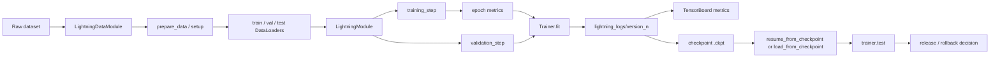

# Chapter 13 - Lightning Training Loop, Checkpoints, And Experiment Structure

## Reading Scope

This is a direct-read synthesis of the highest-value operational slice inside Chapter 13 of the user-provided local PDF *Machine Learning with PyTorch and Scikit-Learn*: the PyTorch-Lightning section that turns handwritten PyTorch training code into a reusable experiment contract.

The note stores original synthesis only. It does not store copied chapter text, code listings, figures, or long excerpts.

## Why This Slice Matters

The parent book note already captured that Agent Studio needs `training_loop_trace`, `model_artifact_record`, and an `implementation_route_release_gate`. What it did not make concrete enough is **how a small-model training route becomes an auditable run instead of a pile of notebook code**.

This chapter slice closes that gap because it ties together:

- per-batch train logic;
- epoch-level metric aggregation;
- explicit data-module boundaries;
- reproducible split creation;
- checkpoint-backed continuation;
- log-directory organization;
- test-time promotion discipline.

That is the minimum structure needed when Agent Studio trains support models such as classifiers, rerankers, cost predictors, visual filters, or lightweight task heads.

## Training Run Map

## The Core Systems Lesson: Separate Model Logic From Run Orchestration

Lightning's key contribution in this slice is not a new model family. It is a separation of concerns:

- the `LightningModule` owns forward pass, loss/metric logic, and optimizer declaration;
- the `LightningDataModule` owns data acquisition, split construction, and loader policy;
- the `Trainer` owns the loop mechanics, device execution, and logging lifecycle.

For Agent Studio, that separation matters because a route should never hide model logic, dataset construction, hardware choice, and logging policy inside one notebook cell or one monolithic script.

## LightningModule As A Run Contract

The chapter's MLP example shows the minimum operational interface that makes a training run inspectable:

- `forward` defines the prediction path;
- `training_step` defines what one minibatch update means;
- `training_epoch_end` converts noisy per-batch observations into a stable epoch-level training metric;
- `validation_step` and `test_step` keep evaluation distinct from optimization;
- `configure_optimizers` binds the optimizer choice to the run definition instead of leaving it implicit.

This is a strong design rule for the vault: support-model routes should preserve a **step contract** and an **epoch contract**, not just a final accuracy number.

## Metric Aggregation Is A Design Choice, Not Cosmetic Logging

The chapter uses `Accuracy()` objects to accumulate train, validation, and test performance. The practical point is subtle but important:

- training metrics are noisy at batch granularity;
- validation metrics are more decision-relevant when logged at evaluation intervals;
- test metrics belong to a final assessment phase, not continuous tuning.

That means a production-minded route should explicitly declare:

- which metrics are batch-level diagnostics;
- which are epoch-level selection signals;
- which are final gate metrics;
- which metrics can trigger early stop, rollback, or human review.

If the run does not distinguish those layers, experiment dashboards become evidence-poor even when they look busy.

## DataModule Boundaries Make Data Preparation Reviewable

The section's `LightningDataModule` is the smallest useful pattern for turning data handling into an auditable subsystem.

The chapter makes three boundaries explicit:

1. `prepare_data()` for one-time acquisition or download work;
2. `setup()` for materializing train/validation/test datasets;
3. `train_dataloader()`, `val_dataloader()`, and `test_dataloader()` for loader policy.

This matters because the data path is often where reproducibility silently fails. Agent Studio should preserve separate records for:

- source dataset identity;
- split construction logic;
- transform chain;
- loader batch policy;
- worker count and device-feeding assumptions.

The official PyTorch data docs strengthen this by clarifying that `DataLoader` combines a dataset with a sampler and that map-style datasets differ operationally from iterable-style datasets. That distinction affects whether index order, shuffling, and multi-worker behavior are deterministic or user-controlled.

## Split Seeds Are Release Evidence

The chapter creates a validation split with `random_split(..., generator=torch.Generator().manual_seed(1))`. That one detail carries a larger system-design rule: **split derivation is part of the artifact lineage**.

A route should not treat validation splits as disposable convenience. It should preserve:

- split seed or explicit split manifest;
- source dataset version;
- any filtering before splitting;
- class-balance or slice-balance assumptions;
- whether the split was reused across experiments.

Without those records, later comparisons can look rigorous while actually comparing different data partitions.

## Trainer Abstraction Removes Boilerplate But Does Not Remove Accountability

The chapter highlights that `Trainer.fit(...)` takes care of intermediate steps such as gradient zeroing, backpropagation, and optimizer stepping. That reduces handwritten loop bugs and speeds up iteration.

However, the abstraction is only safe when the team still understands the raw mechanics underneath:

- gradients accumulate unless they are cleared;
- optimizer state changes across steps and matters for resume behavior;
- train/validation/test mode changes still have semantic consequences;
- trainer defaults are part of the run contract, not invisible magic.

This is where the official Lightning trainer docs are useful: they make the loop orchestration explicit enough that a higher-level trainer can be reviewed as a structured wrapper around standard PyTorch execution rather than as a black box.

## Logging Directories Are Part Of The Experiment Ledger

The chapter's default `lightning_logs/version_0`, `version_1`, and later folders are more than convenience. They establish a primitive but useful experiment ledger:

- one directory per run lineage;
- metrics emitted in a standard place;
- checkpoints tied to a specific run version;
- comparative inspection through TensorBoard.

This is exactly the kind of durable run surface Agent Studio needs. A candidate release should be linked to a specific run directory or equivalent run id, not just to an informal claim that "the model trained well last night."

## TensorBoard Is Not Decoration; It Is Part Of The Decision Loop

The section uses TensorBoard to inspect whether additional epochs are worthwhile. That matters because training governance should not be framed as train-once then trust the final weights. Instead, the route should preserve:

- train versus validation divergence;
- whether more epochs still improve the target metric;
- where loss plateaus or destabilizes;
- whether continued training improves one slice while damaging another.

The general rule is that observability traces are part of the experiment argument, not a post-hoc dashboard attached after the fact.

## Checkpoints Need More Than Weights

The book's Lightning resume path shows the operational value of checkpoint-backed continuation. The official PyTorch save/load tutorial sharpens the broader requirement: a resume-capable checkpoint should preserve not just model weights but also optimizer state, epoch progress, and related training context.

That yields a stronger checkpoint contract for Agent Studio:

- model parameter state;
- optimizer state;
- epoch or step position;
- bound config for batch policy and optimizer choice;
- reference to the run directory that produced the checkpoint.

A checkpoint without surrounding context is useful for ad hoc reuse, but weak for controlled continuation, rollback, or audit.

## Reproducibility Is Bounded, Not Absolute

The official PyTorch reproducibility note is an important correction to overconfident experiment language. Even with seeds fixed, full reproducibility is not guaranteed across releases, commits, devices, or CPU/GPU execution paths.

So the right vault stance is not "seed equals reproducible." It is:

- preserve the seed;
- preserve framework/library versions;
- preserve hardware/backend assumptions;
- record deterministic-mode tradeoffs when used;
- accept that exact replay may still drift across environments.

This is especially important for small support models where debugging speed may justify deterministic settings even when they cost throughput.

## Test Execution Must Stay A Separate Promotion Step

The chapter ends the run with a distinct `trainer.test(...)` invocation after training and optional continuation. That separation is exactly right for release discipline.

A route should not promote a support model because train and validation curves look healthy. Promotion should require:

- explicit final test execution;
- preserved test metrics;
- slice-level review where relevant;
- comparison against the incumbent baseline;
- rollback target if the new artifact regresses later.

## Datastore Objects Strengthened By This Chapter

| Object | Why this chapter strengthens it |
|---|---|
| `training_loop_trace` | Needs explicit batch-step logic, epoch aggregation, optimizer config, hardware path, and logged metric lineage. |
| `model_artifact_record` | Should bind checkpoint identity to run directory, preprocessing path, and final test status rather than storing only a weight file. |
| `preprocessing_fit_record` | Gains stronger linkage to split derivation, transform chain, and DataModule setup policy. |
| `classical_baseline_record` | Supports the decision of whether a trained neural route actually beats a cheaper classical or rules-based baseline. |
| `implementation_route_release_gate` | Must require split lineage, checkpoint provenance, run logs, deterministic-policy notes, final test evidence, and rollback target. |

## Delta To The Existing Release Gate

The parent `implementation_route_release_gate` remains directionally correct, but this chapter makes six requirements more concrete for PyTorch-style support routes:

1. **separate data, model, and trainer contracts** so training code is reviewable by subsystem;
2. **split-seed or split-manifest evidence** for every train/validation/test partition used in promotion;
3. **run-directory lineage** linking metrics and checkpoints to the exact experiment version;
4. **resume-capable checkpoint semantics** including optimizer state and step/epoch continuity;
5. **bounded reproducibility notes** covering seeds, versions, device/backend, and deterministic-policy tradeoffs;
6. **explicit final test invocation** before a candidate artifact is treated as releasable.

## Operational Takeaways

- A support-model training route is a contract over data, loop, metrics, checkpointing, and release evidence.
- `LightningModule` and `LightningDataModule` are useful because they force the run to expose those contracts separately.
- `lightning_logs/version_*` style folders are not clutter; they are part of the experiment ledger.
- Seeds help, but reproducibility also depends on versions, hardware path, and deterministic-mode policy.
- Resume-from-checkpoint is only valuable when the checkpoint is tied to the exact run context and later test evidence.
- A healthy validation curve is not enough for promotion; final test results and baseline comparison still decide release.
