# Chapter 20 - Beyond The IID Assumption

## Reading Scope

This is a direct-read synthesis of the highest-value production slice inside Chapter 20 of the local *Probabilistic Machine Learning: Advanced Topics* PDF: what breaks once train and test are no longer effectively iid, and what a production system should do about it.

The note focuses on:

- distribution-shift taxonomy;
- training-time versus test-time mitigations;
- OOD detection and abstention;
- transfer, domain adaptation, and domain generalization caveats;
- continual-learning and online-adaptation tradeoffs;
- adversarial robustness as a worst-case shift regime.

The note stores original synthesis only. It does not store raw chapter text, derivation dumps, copied figures, or long excerpts.

## Why This Slice Matters

The parent probabilistic-ML note already established that uncertainty, approximation, and shift metadata belong in Agent Studio release evidence. What remained too compressed was the **operating playbook once iid assumptions fail**.

Chapter 20 sharpens six design truths that matter directly for production-grade agent and ML routes:

1. **"Drift" is not one thing.** Covariate shift, label shift, concept shift, manifestation shift, and selection bias do not share the same mitigation.
2. **A drift alert is not yet a diagnosis.** Detection, explanation, and release action are separate steps.
3. **Abstention is a product behavior, not a model embarrassment.** Coverage-risk tradeoffs belong in route policy.
4. **Shift-aware training methods depend on assumptions.** Reweighting, domain adaptation, and label-shift estimation all fail when their structural assumptions break.
5. **Continual learning is a retention-versus-plasticity contract.** The system must decide what to remember, what can be forgotten, and how rollback works.
6. **Adversarial robustness is its own threat-model class.** It should not be conflated with ordinary OOD or natural distribution drift.

That makes this chapter one of the most actionable local-book slices for release gates, monitoring, escalation policy, and route-evaluation design.

## Beyond-IID Route Map

```mermaid
flowchart TD
    A[Non-iid production behavior] --> B[Shift taxonomy]
    A --> C[Detection]
    A --> D[Mitigation]
    A --> E[Decision policy]
    A --> F[Robustness regime]

    B --> B1[Covariate or domain shift]
    B --> B2[Label or prior shift]
    B --> B3[Concept or annotation shift]
    B --> B4[Manifestation shift]
    B --> B5[Selection bias]

    C --> C1[Two-sample tests]
    C --> C2[OOD scoring]
    C --> C3[Coverage or abstention monitoring]
    C --> C4[Environment-wise eval slices]

    D --> D1[Importance weighting]
    D --> D2[Domain adaptation]
    D --> D3[Label-shift estimation]
    D --> D4[Online adaptation]
    D --> D5[Replay or regularization]
    D --> D6[Robust optimization]

    E --> E1[Predict]
    E --> E2[Abstain]
    E --> E3[Escalate to human]
    E --> E4[Rollback or freeze adaptation]

    F --> F1[Natural shift]
    F --> F2[Open-world novelty]
    F --> F3[Worst-case adversarial shift]
```

## Shift Taxonomy Must Stay Explicit

The chapter's first systems contribution is not a new algorithm but a tighter taxonomy.

### Shift classes

| Shift class | What changes | Why it matters in production |
|---|---|---|
| Covariate shift | `p(x)` changes while `p(y|x)` is assumed stable | Often the best case for reweighting or domain adaptation if support overlap exists |
| Domain or acquisition shift | measurement process, modality, sensor, source style, or collection conditions change | Common in multimodal, OCR, speech, retrieval, and user-segment transitions |
| Label or prior shift | `p(y)` changes while `p(x|y)` is assumed stable | Useful for prevalence-shift correction when class conditionals remain recognizable |
| Concept or annotation shift | `p(y|x)` changes | Usually a release blocker because label meaning, rubric, or policy changed |
| Manifestation shift | `p(x|y)` changes | Same concept appears through different surface forms or media realizations |
| Selection bias | observed data is filtered by the collection process | Offline metrics can look stable while product behavior becomes systematically misleading |

### Agent Studio mapping

- **covariate or domain shift**: new prompt styles, new source types, different OCR noise, different accents, longer contexts, different platforms, different user cohorts;
- **label or prior shift**: the mix of tasks changes from note enrichment to publication, moderation, or review-heavy workloads;
- **concept or annotation shift**: the definition of "good answer," "safe artifact," or "acceptable retrieval evidence" changes;
- **manifestation shift**: the same intent or fact arrives through different document structure, language, visual style, or audio characteristics;
- **selection bias**: only reviewed, published, complained-about, or escalated artifacts are visible to the learning loop.

The practical rule is that every robustness claim should name the shift class. "Handles drift" is too vague to be release evidence.

## Training-Time Mitigations Only Work Under Their Assumptions

### Importance weighting for covariate shift

The chapter treats importance weighting as the most direct remedy when source and target differ mainly through the input distribution. The key idea is to reweight source examples by a density ratio so the training objective better matches the target environment.

The operationally useful twist is that density-ratio estimation can be turned into a **source-versus-target classification problem**, which is often easier than modeling full densities explicitly.

Implementation consequence:

- this is a viable design for retrievers, rerankers, support classifiers, and perception components when unlabeled target examples exist;
- but it only makes sense when **target support remains inside the region the source has actually covered**.

If the target workload contains genuinely novel states, importance weighting becomes a false comfort rather than a fix.

### Weighted conformal prediction under shift

The chapter's shift-aware conformal framing matters because it connects uncertainty to a route decision rather than only to a score. If calibration data is reweighted consistently with the shifted target distribution, the prediction set or abstention threshold can adapt more honestly to changed inputs.

For Agent Studio, this is stronger than a raw confidence threshold because it creates a path toward:

- controlled coverage statements;
- route-specific abstention bands;
- changed escalation policy under shifted conditions.

### Domain adaptation and domain-adversarial learning

When source labels exist but target labels do not, the chapter positions domain adaptation as a representation-learning strategy: learn task-useful features that reveal less about the source-versus-target domain boundary.

The implementation-relevant pattern is **domain-adversarial training** with a domain classifier and gradient reversal. This is directly useful for:

- document-embedding shifts across corpora;
- vision routes across acquisition conditions;
- speech or multilingual shifts;
- moderation or classification systems that must span product surfaces.

But the method assumes there exists a shared representation that keeps task signal while discarding nuisance domain information. If the target truly needs domain-specific features, overly aggressive alignment can erase useful signal.

### Label-shift estimation

For label or prior shift, the chapter gives a more structured remedy: estimate the new label prevalence from unlabeled target predictions plus source confusion structure.

This is attractive because it supports class-prevalence correction without full target labels, but it depends on two fragile assumptions:

- the target labels were all seen during training;
- the confusion matrix is stable and informative enough to invert.

In production terms, this is appropriate only when class definitions are unchanged and the model already discriminates them cleanly.

### Distributionally robust optimization

The chapter's robust-optimization framing is important because it makes robustness claims auditable. Instead of optimizing average risk on one distribution, optimize worst-case risk over a declared uncertainty set.

That is exactly the right release-gate posture for high-cost failure surfaces, but only if the uncertainty set is explicit. A vague "robust model" claim is meaningless without saying what family of shifts or perturbations it was optimized against.

## Detection Is Not The Same As Diagnosis

### Two-sample testing

The chapter presents two-sample testing as a monitoring primitive: compare source and target samples and ask whether they plausibly come from the same distribution. That is valuable for batch drift alerts and dashboard health checks.

The limitation is equally important: a statistical difference does **not** tell you whether the cause is:

- real user/environment change;
- pipeline or schema breakage;
- a benign formatting shift;
- or a change that actually harms quality.

For Agent Studio, two-sample tests should open an investigation, not close one.

### Single-sample OOD detection

The chapter surveys several OOD strategies that matter at request time rather than only in aggregate.

#### Outlier exposure and supervised OOD classification

Known in-distribution versus known-OOD examples can train a dedicated boundary detector. This is practical, but only for the family of OOD cases you actually exposed the model to.

#### Confidence-score methods

Maximum softmax probability, entropy, margin, and similar confidence heuristics are cheap and often useful as baselines. The chapter's warning is that they can blur together two different states:

- uncertainty among known labels;
- uncertainty that **none** of the known labels really applies.

That means confidence alone should be treated as an input to policy, not as a complete robustness proof.

#### Density or reconstruction methods

The chapter is especially useful here because it flags a notorious failure mode: generative models can assign surprisingly high likelihood to OOD data. Likelihood may track superficial complexity or representation effects rather than semantic in-distribution-ness.

Release rule: a likelihood-only OOD gate is not credible without targeted benchmark evidence.

## Selective Prediction Makes Abstention Measurable

One of the chapter's strongest production lessons is that selective prediction should be evaluated as a **coverage-versus-risk** curve.

If the system can abstain, then route quality is not just "How accurate is the model?" but also:

- how much of the workload it accepts automatically;
- how accuracy changes as abstention increases;
- whether OOD cases are preferentially rejected;
- how much human-review load the abstention policy creates.

The chapter's Bayesian examples strengthen the existing vault rule that predictive uncertainty and decision policy must remain separate. A model can have similar average accuracy to a competitor yet behave much better when deciding when **not** to act.

For Agent Studio, this maps directly to:

- auto-publish versus hold-for-review;
- auto-route versus ask a human;
- answer now versus retrieve more evidence;
- continue tool execution versus stop and escalate.

## Open-World Recognition Requires A Class-Lifecycle Policy

The chapter treats open-world recognition as more than "OOD with a nicer label." Unknown inputs may represent **new classes the system should eventually learn**, not just artifacts to reject.

That is the right frame for:

- emerging incident categories;
- novel user intents;
- new artifact types;
- new moderation patterns;
- new document or source families.

A robust system therefore needs more than a threshold. It needs a class-lifecycle decision:

- reject as unsupported;
- cluster for review;
- create a new queue label;
- or promote into an explicitly learned class later.

## Learning Across Distributions Needs Honest Baselines

The chapter's transfer/domain-generalization material is especially valuable because it is anti-hype.

### Transfer, few-shot, and prompt-style adaptation

Transfer learning, few-shot adaptation, and prompt-style conditioning all depend on the same underlying truth: the source model must already encode structure that remains useful in the target environment.

That makes them practical for:

- adapting route classifiers to new domains with limited labels;
- adapting multimodal or retrieval embeddings to a narrower workload;
- using fixed pretrained backbones plus lightweight task-specific heads or prompts.

### Domain generalization and IRM caveat

The chapter is careful not to overclaim domain generalization. Training across multiple source environments is appealing, but sophisticated environment-invariance methods do not automatically beat simpler pooled ERM baselines.

This is exactly the sort of caveat the vault should preserve. In production review, "uses IRM" or "uses domain generalization" is not evidence. The evidence is whether the method beat simpler baselines on held-out environments that actually resemble plausible deployment shifts.

## Continual Learning Is A Retention Contract

The continual-learning section makes the right distinction between:

- **domain drift**: task stable, inputs change;
- **concept drift**: label meaning changes;
- **task or class incremental learning**: output space expands over time.

These scenarios require different product decisions.

### Core tradeoff: plasticity versus retention

The chapter's engineering contribution is to make forgetting a measurable deployment property rather than a purely academic concern.

Mitigation families include:

- **regularization-based methods** that preserve old-task knowledge;
- **replay or memory-based methods** that keep examples or approximate past data;
- **architectural growth** that adds capacity for new tasks;
- hybrid approaches that mix Bayesian or regularized updates with explicit memory.

For Agent Studio, this matters anywhere a route learns from reviewer feedback, user corrections, or evolving corpora. The system must declare:

- what old behavior is allowed to drift;
- what historical capability must remain stable;
- what replay or memory budget is acceptable;
- and how an unsafe adaptation is rolled back.

### Online adaptation

The chapter also covers test-time or online adaptation for unlabeled streams. This is powerful, but it is also easy to over-trust. If the proxy objective does not line up with product success, the route can silently adapt in the wrong direction.

That means any online-adaptation path should carry:

- bounded update scope;
- frozen-control comparison;
- rollback trigger;
- drift and regret monitoring.

## Adversarial Robustness Is A Separate Threat Model

The adversarial section is valuable because it prevents a common category error: ordinary dataset shift and worst-case malicious perturbation are not the same release surface.

### Threat-model clarity

White-box and black-box attacks are different. Small bounded `l_p` perturbations are different from semantic, physical, or layout-level attacks. Robustness claims only make sense relative to a declared attack set and evaluation procedure.

### Robust optimization and adversarial training

The chapter's min-max framing aligns well with system-design review:

- define the perturbation set;
- define the inner adversary;
- optimize worst-case performance against that family;
- and evaluate with a credible attack suite.

That is stronger than casual corruption testing, but also more expensive and more assumption-sensitive.

### Relation to general robustness

The chapter's geometric perspective is important for the vault: adversarial examples are not a disconnected curiosity. They are a worst-case view of the same fragility that appears under other forms of shift. High-dimensional systems can have very nearby errors even when average-case behavior looks stable.

## Datastore Objects Strengthened By This Chapter

| Object | Why this chapter strengthens it |
|---|---|
| `distribution_shift_record` | Needs explicit shift class, environment description, source/target distributions, and mitigation plan rather than generic drift labels. |
| `calibration_record` | Must say whether calibration is IID-only, shift-adjusted, or coverage-based through conformal or abstention analysis. |
| `uncertainty_signal` | Should distinguish score confidence, OOD score, abstention threshold, and decision caveats instead of collapsing them into one scalar. |
| `decision_policy` | Needs risk-weighted actions for predict, abstain, retrieve-more, human-review, rollback, or freeze-adaptation modes. |
| `online_update_record` | Must bind update windows, proxy objectives, regret proxies, and rollback triggers when test-time or continual adaptation occurs. |
| `class_ontology_change_record` | Open-world recognition and class-incremental learning require explicit class-lifecycle events, not hidden label expansion. |
| `adversarial_eval_record` | Robustness claims need a threat model, attack family, perturbation budget, evaluation suite, and residual failure slices. |
| `approximation_shift_release_gate` | Should now be read as covering shift taxonomy, abstention behavior, OOD evidence, adaptation bounds, and adversarial threat-model declarations. |

## Release-Gate Delta

This chapter makes the existing `approximation_shift_release_gate` more concrete in eight ways:

1. **shift class must be named** rather than summarized as generic drift;
2. **importance weighting or label-shift correction must declare its assumptions** and support-overlap limits;
3. **OOD detection must distinguish batch-monitoring alerts from per-example routing decisions**;
4. **selective prediction must be evaluated as coverage versus residual risk**, not only accuracy;
5. **domain-generalization and invariant-learning claims must beat simple pooled baselines** on held-out environments;
6. **continual-learning changes must measure forgetting, retention, and rollback conditions**, not only new-task gains;
7. **open-world novelty needs a class-lifecycle policy** instead of threshold-only rejection;
8. **adversarial robustness claims must include a concrete threat model, attack procedure, and residual failure slices**.

## Operational Takeaways

1. Treat distribution shift as a typed diagnosis problem, not a one-word alert.
2. Keep training-time, test-time, and decision-policy interventions separate in route review.
3. Use abstention and human escalation as deliberate product behaviors.
4. Do not trust likelihood-only or confidence-only OOD claims without dedicated evidence.
5. Require held-out environment baselines before accepting domain-generalization or invariance claims.
6. Make continual adaptation reversible and measurable for forgetting as well as improvement.
7. Separate natural drift from adversarial threat models in evaluation and release policy.
8. Block releases when concept shift or annotation shift changes the reference world itself.
