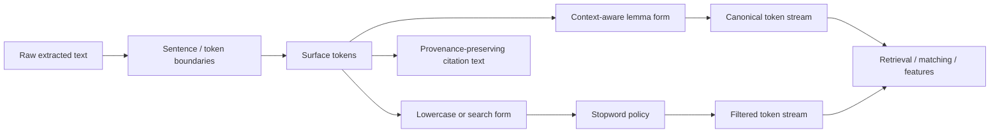

# Python NLP Cookbook Chapter 1 - Normalization, Lemmatization, and Stopwords

## Reading Status

Direct local-PDF read of the highest-value unresolved Chapter 1 slice for ingestion adapters: the lemmatization and stopword recipes from `pdftotext` lines `2088-2463` (printed pages `19-26`). This note stores compact original synthesis only.

## Why This Slice Matters

The parent cookbook note already says normalization needs provenance, but that claim stayed too broad. This slice closes the missing adapter contract for three decisions that quietly reshape every downstream artifact:

- which token form stays closest to the source;
- which canonical form is used for matching and retrieval;
- which words are filtered out entirely before features, embeddings, or retrieval traces are built.

Those choices are not cleanup. They are irreversible evidence transformations.

## Core Lesson

The durable move is not merely “clean the text.” It is:

> keep **surface tokens**, **normalized/search tokens**, and **lemma-derived canonical tokens** as separate representations, then attach stopword policy as an explicit runtime decision rather than a silent preprocessing default.

## Normalization Contract

## Lemmatization Is Better Than Blind String Rewriting

The recipe's strongest implementation idea is that canonicalization should come from a language pipeline, not from ad hoc suffix stripping.

- spaCy returns lemmas on processed tokens rather than on raw strings.
- The canonical token can differ materially from the observed token, as in `is -> be`.
- That makes lemmatization valuable for matching, clustering, lexical retrieval support, and compact feature spaces.

The important boundary is that lemma output is a model/runtime artifact, not an intrinsic ground truth property of a string.

## Context Matters For Canonical Form

The recipe shows an operational caveat that the vault should keep explicit: isolated-token lemmatization can be wrong for ambiguous words.

A token like `leaves` may normalize to the verb lemma `leave` even when the intended meaning is the noun `leaf`. The durable rule is:

- prefer contextual lemmatization over token-by-token lookup when semantics matter;
- preserve the original token text so later review can recover what the source actually said;
- treat lemma output as an adapter feature, not as a replacement for source evidence.

## Stopword Removal Is A Policy, Not A Default

The stopword recipe is useful precisely because it reveals how easy it is to over-normalize.

- The NLTK stopword list is lowercase-oriented, so comparison logic silently depends on prior lowercasing.
- The book explicitly notes that built-in stopword lists may need editing.
- That means stopword removal should be versioned as adapter policy rather than assumed to be universally correct.

For source-grounded systems, words such as negations, modal verbs, product names, versions, legal terms, or code identifiers may look frequent but still carry decision-critical meaning.

## Filtering Changes The Evidence Budget

The recipe's sample shows that stopword filtering can remove more than half of a token stream. That is not a cosmetic change.

It alters:

- sparse retrieval behavior;
- lexical overlap scoring;
- classifier features;
- keyword traces kept for debugging;
- what a human reviewer sees when comparing the normalized artifact against the source.

So the release gate should require proof that aggressive filtering helps the target route rather than merely shrinking the text.

## Mutable Stopword Sets Are A Runtime Surface

The spaCy and NLTK examples together imply that stopwords are not fixed ontology. They are mutable runtime configuration.

That suggests an ingestion adapter should record:

- language;
- tokenizer used before filtering;
- whether matching is case-sensitive or lowercase/casefold based;
- base stopword list provenance;
- domain-specific additions and removals;
- exceptions for negation, modality, code, product names, and citation markers.

Without that record, normalization drift becomes hard to explain after retrieval or eval regressions.

## Frequency-Derived Stopwords Need Review

The cookbook's frequency-derived stopword pattern is operationally valuable because it offers a path for corpus-specific pruning. But it also demonstrates the failure mode: high-frequency tokens can still be semantically central.

A source-heavy corpus may repeatedly mention the same provider, project, or subsystem. Frequency alone is not enough reason to erase those terms.

The right posture is:

1. propose candidate stopwords from corpus statistics;
2. review them against domain semantics;
3. promote only the approved subset into the adapter profile.

## Sentence And Token Boundaries Still Sit Upstream

Even though this slice centers on normalization, it quietly depends on the previous tokenization decisions from Chapter 1.

Stopword matching, lemma quality, and phrase recovery all inherit the upstream boundary contract. If token boundaries shift, the normalization policy changes even when the stopword list stays the same.

That means boundary provenance and normalization provenance belong in the same adapter record family.

## Agent Studio Implications

- Keep `surface_text`, `normalized_text`, `lemma_text`, and `display_text` as distinct artifacts rather than one rewritten text field.
- Extend `normalization_policy_record` with Unicode form, lowercasing/casefolding policy, stopword provenance, and exception lists.
- Record whether lemmatization is contextual pipeline output, lookup fallback, or disabled for the route.
- Preserve token offsets or chunk offsets so reviewers can compare normalized artifacts against source text.
- Gate frequency-derived stopwords behind review because corpus prominence does not imply semantic irrelevance.
- Run route-specific eval slices for negation, modality, product/version names, and legal/policy text before promoting a filtering-heavy adapter.

## Release-Gate Upgrade For Normalization Policy

Promote a normalization-heavy ingestion adapter only when it proves:

- token and sentence boundary policy is pinned;
- Unicode normalization form is explicit;
- lowercase/casefold policy is documented;
- lemma runtime and model prerequisites are versioned;
- stopword list provenance plus domain exceptions are recorded;
- normalized and provenance-preserving artifacts remain separately recoverable;
- regression checks cover negation, modality, identifiers, and named entities;
- fallback behavior is defined when the language pipeline or stopword resources are unavailable.

## Bottom Line

This slice turns broad preprocessing advice into a concrete adapter rule:

> normalize for matching and retrieval, but never collapse away the source-facing token stream; canonical forms, stopword policy, and filtering exceptions must remain explicit, reviewable runtime contracts.
