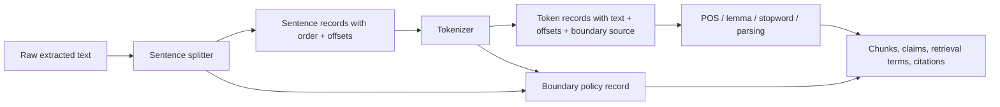

# Python NLP Cookbook Chapter 1 - Sentence/Token Boundary Governance

## Reading Status

Direct local-PDF read of the smallest Chapter 1 slice that closes the unresolved boundary-governance gap: `pdftotext` lines `624-1067` (printed pages `3-12`), covering sentence splitting and word tokenization with NLTK and spaCy.

## Why This Slice Matters

The existing Chapter 1 note already covers normalization, lemmatization, and stopword policy. But those policies all sit **downstream of boundary decisions**.

This slice makes one operational fact unavoidable:

> sentence boundaries and token boundaries are not neutral preprocessing; they are a control surface that changes what later stages can see, count, preserve, or delete.

If boundary policy drifts, then lemma outputs, stopword filtering, phrase recovery, offset mappings, and chunk citation all drift with it.

## Core Lesson

The durable contract is:

1. split text into sentences using an explicit policy;
2. tokenize using an explicit policy;
3. preserve boundary provenance separately from normalized text;
4. do not assume two NLP libraries produce equivalent evidence units.

## Boundary Governance Pipeline

## Sentence Splitting Is A Policy Layer

The cookbook contrasts two sentence splitters:

- **NLTK Punkt**: purpose-built sentence segmentation;
- **spaCy pipeline**: sentence segmentation as part of a broader language-processing pipeline.

The note-worthy governance point is not just performance. It is architectural scope.

- NLTK is narrow and fast because it performs the boundary task directly.
- spaCy is heavier because sentence splitting arrives inside a broader model/pipeline runtime.
- The same text can therefore share sentence outputs while still carrying very different runtime assumptions.

That means `same sentences` does **not** imply `same pipeline contract`.

## Newlines Are Formatting, Not Necessarily Sentence Ends

The sentence recipe explicitly shows that book-extracted text can contain embedded newlines inside a sentence. The tokenizer output preserves sentences correctly even when formatting inserts line breaks.

That is important for PDF and OCR ingestion:

- raw line breaks should not automatically become sentence breaks;
- layout artifacts must remain distinguishable from linguistic boundaries;
- sentence provenance should store whether boundaries came from model inference rather than literal newline splitting.

In other words, extracted text formatting is not trustworthy boundary evidence on its own.

## Punctuation Ambiguity Makes Regex Splitting Unsafe

The cookbook explains why sentence splitting is harder than splitting on periods:

- periods can mark abbreviations, not sentence ends;
- capitalization is not sufficient because proper names also use capitals;
- boundary inference depends on learned or rule-guided context.

The governance implication is simple:

> never treat punctuation-only heuristics as an undocumented production boundary policy.

If a route uses regex or literal punctuation splitting, that choice should be recorded as a degraded or fallback mode.

## Tokenization Changes The Unit Of Evidence

The tokenization recipe shows that a token stream is not just “the words in the text.” It is the library's decision about what counts as a separable unit.

Observed differences in the cookbook slice include:

- punctuation emitted as standalone tokens;
- contractions split into token pieces rather than expanded semantically;
- spaCy preserving newline tokens;
- spaCy splitting dash-linked forms such as `high-power`;
- different handling of decorated text such as `_the_`;
- different treatment of possessive-like fragments.

Once that split happens, every downstream count, filter, and offset depends on it.

## Equivalent Text, Different Token Budgets

The recipe reports different token counts for the same input under NLTK and spaCy. That affects chunk sizing, retrieval weighting, context-window budgeting, and span alignment. A tokenizer swap can therefore create false regressions even when the source text is unchanged.

## Library Choice Should Follow Pipeline Cohesion

The cookbook repeatedly implies a practical rule:

- if you only need sentence splitting or simple word tokenization, NLTK is enough;
- if you are already using spaCy for later processing, stay inside spaCy for boundary work too.

That is not just convenience. It is provenance minimization: a mixed pipeline can leave sentence offsets, token offsets, and later parse/lemma stages referencing different boundary realities.

## Multiword Expressions Are Boundary Overrides

The `MWETokenizer` example is the strongest control-plane signal in the tokenization section. It shows that tokenization is **intentionally mutable**.

A boundary override can join several surface words into one semantic unit.

That matters for domain phrases, product names, legal terms, biomedical entities, retrieval keys, and phrase embeddings. Tokenization policy should allow approved overrides, but those overrides must be versioned because they rewrite the unit of indexing and analysis.

## Boundary Provenance Should Be First-Class Metadata

This slice implies a minimum provenance record for each ingestion route: sentence splitter name/version, tokenizer name/version, language/model package, newline policy, punctuation policy, dash/hyphen policy, MWE overrides, and fallback behavior.

Without this record, later disagreements in counts, spans, or retrieval behavior are hard to explain.

## Recommended Record Shapes

| Record | Required fields |
|---|---|
| `sentence_record` | `doc_id`, `sentence_id`, `text`, `char_start`, `char_end`, `boundary_engine`, `boundary_policy_version` |
| `token_record` | `doc_id`, `sentence_id`, `token_id`, `text`, `char_start`, `char_end`, `whitespace_after`, `tokenizer_engine`, `tokenizer_policy_version` |
| `boundary_policy_record` | `language`, `model_or_ruleset`, `newline_policy`, `punctuation_policy`, `hyphen_policy`, `mwe_overrides`, `fallback_mode` |

These records let later layers compare source text, display text, normalized text, and canonical tokens without collapsing them together.

## Agent Studio Implications

- Keep sentence segmentation and tokenization as explicit adapter stages, not hidden helper functions.
- Persist character offsets before normalization/lemmatization/stopword filtering rewrites the view.
- Store boundary-policy provenance beside normalized artifacts so chunk review can reconstruct how spans were created.
- Run diff checks when swapping NLTK/spaCy or changing language models because token budgets and offsets will move.
- Treat MWE additions as schema-affecting policy changes because they alter the indexing unit.

## Release-Gate Upgrade For Boundary Policy

Promote a boundary adapter only when it proves:

- sentence and token engines are pinned;
- language/model prerequisites are pinned;
- newline handling is documented;
- punctuation and hyphen behavior are documented;
- MWE overrides are versioned;
- token and sentence offsets are retained for audit;
- downstream normalization assumes the same tokenization contract;
- regression tests cover abbreviations, embedded newlines, possessives, punctuation-heavy text, and dashed forms.

## Bottom Line

This Chapter 1 slice closes the missing governance rule left implicit by the existing notes:

> before you normalize, lemmatize, parse, filter, retrieve, or cite, decide what a sentence is and what a token is, then preserve that decision as provenance-bearing runtime policy rather than silent preprocessing.
