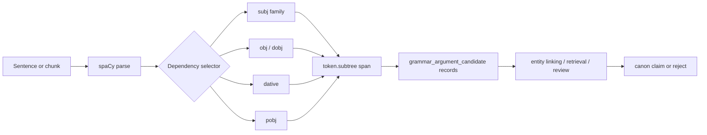

# Python NLP Cookbook Chapter 2 - Dependency Subject/Object Extraction

## Reading Status

Direct local-PDF read of the highest-value Chapter 2 slice for information-extraction adapters: the subject/object/dative/prepositional-object recipes plus the nearby matcher extension material from `pdftotext` lines `3123-3429`. This note stores compact original synthesis only.

## Why This Slice Matters

The parent cookbook note already says grammar helps candidate generation. What was still too implicit was the concrete contract for turning a parsed sentence into auditable argument spans.

That gap matters because ingestion systems often need a cheap first pass for:

- who did what to whom;
- who received or benefited from an action;
- which prepositional attachment carries the operational qualifier;
- which candidates deserve stronger retrieval or human review.

This chapter slice closes that gap without pretending grammar alone solves truth.

## Core Lesson

The durable move is not merely “use a parser.” It is: **treat dependency labels plus token subtrees as a deterministic candidate-extraction layer**.

That layer is valuable because it is:

- transparent;
- reproducible when the parser version is pinned;
- easy to audit against source text;
- cheap enough to run before heavier extraction models.

## End-to-End Candidate Flow

## Dependency Labels Are Extraction Handles

The recipe's strongest implementation idea is to search dependency tags rather than surface position.

- `subj` catches subjects, including active and passive variants.
- `dobj` / object tags catch direct action targets.
- `dative` captures recipients or beneficiaries.
- `pobj` captures objects introduced through prepositions.

This matters because English word order is not a reliable enough extraction rule once modifiers, passives, or attachments appear.

## Subtree Spans Beat Head Tokens

The recipe does not stop at the head token. It returns the token's `subtree`, then converts that subtree into a `Doc` span.

That is a better contract than returning only the head because the full phrase often carries the usable evidence:

- `Jane` versus `the procurement lead Jane`;
- `book` versus `a very interesting book`;
- `dog` versus `the small dog`.

The design rule is simple:

> store both the head token and the recovered span; they support different downstream uses.

## Subject Extraction Is Broad By Design

Looking for dependency tags that contain `subj` instead of hard-coding only one label is a small but important robustness trick.

Why it matters:

- active and passive sentences still expose subject-like roles;
- the extractor becomes less brittle to small label-family differences;
- the note remains about candidate spans, not perfect semantic roles.

The caveat is that grammatical subject is not always the business actor. Passive voice and reporting constructions still need interpretation later.

## Direct Object, Dative, And Prepositional Object Are Different Records

The chapter implicitly teaches a useful schema split:

| Argument family | Typical meaning | Why keep separate |
|---|---|---|
| Subject | actor / experiencer / grammatical topic | Often seeds candidate source entity |
| Direct object | primary target of action | Useful for event payload or acted-on entity |
| Dative | recipient / beneficiary | Useful for entitlement, routing, or transfer semantics |
| Prepositional object | attached qualifier or secondary target | Often carries time, location, medium, or target detail |

Flattening them into one generic “object” field throws away structure the parser already gave you.

## Multiple Prepositional Objects Need One-To-Many Storage

The recipe returns a list for prepositional-object matches. That is an operationally important detail.

A sentence can attach several distinct qualifiers, and downstream systems may need all of them:

- destination;
- instrument;
- time window;
- source location;
- policy context.

So the data model should not assume one sentence yields one object span.

## Candidate Generation, Not Truth Assignment

The book slice is useful precisely because it stays local and deterministic. But that also defines its limit.

Grammar-derived spans do **not** solve:

- entity resolution;
- negation scope;
- modality such as *may*, *should*, or *must*;
- cross-sentence coreference;
- factuality or authority;
- attachment ambiguity in difficult sentences.

So the right operational posture is:

1. extract candidate spans;
2. preserve the parser evidence;
3. send high-impact or low-confidence cases to stronger validation.

## Matcher Extends The Same Philosophy

The later recipe on `Matcher` broadens the lesson from dependency labels to declarative token patterns.

That matters because not every extraction target is a clean subject-object event. Some useful candidates are:

- verb phrases;
- auxiliary + verb sequences;
- adjective states;
- structured lexical patterns.

The cookbook's pattern examples are linear token patterns. spaCy's `DependencyMatcher` is the next step when the rule depends on tree structure rather than adjacent tokens.

## Model And Runtime Boundaries

This chapter slice is only as stable as its parser runtime.

Important boundaries:

- parser output depends on the spaCy model and version;
- different model sizes can shift labels or subtree boundaries;
- deterministic rule logic does not make the parser deterministic across model upgrades;
- noun chunks and dependency-driven spans assume a loaded pipeline that actually includes parsing support.

That means reproducibility requires pinning:

- package version;
- model package;
- language;
- extraction rule version.

## Agent Studio Implications

- Add `grammar_argument_candidate` records with argument family, head token, subtree span, parser label, parser version, and review status.
- Keep `head_text`, `span_text`, and source offsets separate so candidate review and canonicalization can choose coarse or full evidence.
- Record one-to-many prepositional-object outputs instead of collapsing them into one field.
- Require parser/runtime provenance inside `recipe_runtime_profile` before promoting a grammar extractor into a durable ingestion adapter.
- Run dedicated eval cases for passive voice, indirect objects, PP attachment, missing direct objects, and parser-failure fallbacks.
- Route grammar candidates into retrieval/entity-linking review rather than treating them as final claims.

## Release-Gate Upgrade For Grammar Extraction

Promote a dependency-based extraction adapter only when it proves:

- parser and model version are pinned;
- supported dependency labels are documented;
- subtree-span recovery is tested on representative sentences;
- passive, dative, and PP-attachment cases have explicit eval examples;
- candidate records preserve source IDs and chunk boundaries;
- failure behavior is defined when parsing is unavailable or confidence drops.

## Bottom Line

This slice turns “grammar might help extraction” into a concrete adapter contract:

> parse first, select dependency families second, recover subtree spans third, and promote only candidate records that keep parser provenance plus downstream review hooks.
