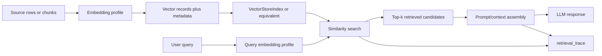

# Python NLP Cookbook Chapter 3 - Embedding Compatibility and RAG Adapter Traces

## Reading Status

Direct local-PDF read of the highest-value Chapter 3 slice for Agent Studio ingestion adapters: the cookbook's BERT/OpenAI embedding recipe plus the nearby retrieval-augmented generation recipe from `pdftotext` lines `4579-4887`. This note stores compact original synthesis only.

## Why This Slice Matters

The parent cookbook note already said embeddings and RAG matter. What was still too implicit was the operational contract:

- when two embedding adapters are semantically different even though both output vectors;
- why remote provider embeddings should be treated as a runtime choice, not a free upgrade;
- what a minimal RAG pipeline must preserve as traceable evidence;
- how to separate embedding quality, retrieval quality, and answer quality.

That gap matters because ingestion and retrieval routes often fail silently when vector spaces, chunk metadata, or retrieval traces are treated as implementation detail instead of product evidence.

## Core Lesson

The durable move is not merely "use embeddings" or "add RAG." It is:

> treat every embedding model as a versioned adapter profile, and treat every retrieval hop as auditable route state.

That means the system must know:

- which embedding profile built the index;
- which profile embedded the query;
- what metadata remained attached to each vectorized record;
- which candidates were retrieved and why;
- which retrieved context actually reached generation.

## End-to-End Adapter Flow

## Local Sentence Embeddings And Provider Embeddings Are Different Route Classes

The cookbook uses two embedding families in quick succession:

- a local `SentenceTransformer` path with `all-MiniLM-L6-v2`;
- a remote provider path using an OpenAI embedding model.

Both output dense vectors, but the route implications are different.

| Adapter class | What the cookbook demonstrates | Operational meaning |
|---|---|---|
| Local sentence-transformer embeddings | Sentence-level encoding through a pinned local model and library runtime | Better control over latency, reproducibility, privacy posture, and offline replay |
| Provider embeddings | Remote API call returning a hosted embedding vector | Introduces credentials, network dependence, cost, quota behavior, provider drift, and runtime observability needs |

So the important design rule is:

> vectors from different embedding profiles are not automatically comparable just because they have the same abstract type.

## Context-Aware Sentence Embeddings Are A Better Retrieval Primitive Than Bag-Of-Words

The BERT-style recipe upgrades the earlier chapter flow from token-frequency features toward context-aware sentence representation.

Why that matters:

- whole sentences can be represented as one semantic unit;
- retrieval and classification can operate on sentence-level meaning instead of sparse token overlap alone;
- chunk, sentence, and query vectors can live in one route family if the profile is pinned.

This makes sentence-transformer adapters a natural bridge from classical NLP preprocessing into modern retrieval systems.

## Compatibility Needs To Be Explicit, Not Assumed

The cookbook's comparison is valuable because it shows that both the Hugging Face and provider routes are easy to call, which creates a hidden risk: teams may swap one embedding source for another without recording the compatibility boundary.

That boundary should include at least:

- model/provider identity;
- tokenizer family;
- vector dimension;
- pooling policy;
- normalization policy;
- intended task surface;
- cost and latency class.

Without those fields, a route can accidentally compare query vectors and corpus vectors that were produced under different semantics.

## The Cookbook's Performance Contrast Is Operationally Useful

The book's simple classifier behaves very differently across the two adapter choices:

- the sentence-transformer path vectorizes roughly 85k rows in seconds and produces materially stronger classification quality;
- the provider-embedding demo is much slower and performs poorly in the cookbook's simple logistic-regression setup.

The lesson is not that provider embeddings are bad. The lesson is that:

1. embedding quality is task-specific;
2. cost/latency can dominate a route decision;
3. a provider embedding should not be promoted without route-local evaluation.

That is exactly the kind of evidence Agent Studio should require before changing retrieval or classification defaults.

## RAG Starts With Record Construction, Not Just Query Time

The RAG recipe is intentionally tiny, but it exposes the correct structural sequence:

1. load source rows;
2. turn rows into `Document` objects;
3. keep descriptive metadata attached to each record;
4. build a vector index;
5. send a natural-language query through the index;
6. use retrieved context to support generation.

The book uses a movie dataset, but the same contract applies to product docs, notes, PDFs, comments, and support logs.

The subtle but durable lesson is that the retrieval route depends as much on **how records were built** as on the final query.

## Metadata-Bearing Vector Records Matter

The recipe attaches title, genres, director, actors, year, duration, rating, and revenue as metadata while embedding only the description text.

That is a strong design pattern for Agent Studio because it separates:

- the text actually embedded;
- the metadata used for filtering, display, or explanation;
- the durable record identity for tracing and replay.

A retrieval system should therefore preserve at least:

- source ID;
- chunk or row ID;
- embedding profile;
- metadata fields available to filters;
- source text boundary used for embedding.

## Retrieval Traces Need Candidate-Level Evidence

The cookbook's tiny example proves that a grammatically plausible answer can still be only partially correct.

That matters because RAG errors rarely come from one place. Failure can come from:

- weak embeddings;
- poor candidate coverage;
- missing metadata constraints;
- weak chunk boundaries;
- bad context packing;
- generation overreach beyond retrieved evidence.

So a `retrieval_trace` should preserve:

- original query text;
- rewritten query, if any;
- query embedding profile;
- searched index or collection;
- retrieved candidates with rank and score;
- accepted versus rejected context;
- final packed context given to the model.

If those records are missing, final-answer debugging becomes guesswork.

## Small Notebook RAG Demos Need Promotion Guards

The chapter's RAG example uses only the first 10 IMDB rows and default library behavior. That is useful for understanding adapter shape, but it should not be confused with production evidence.

A notebook-scale RAG demo does **not** prove:

- retrieval robustness under larger corpora;
- filter behavior across tenants or source classes;
- chunking quality;
- reranking quality;
- citation validity;
- latency/cost fit.

So cookbook-style RAG should enter the vault as a route skeleton, not as deployment proof.

## Agent Studio Implications

- Add an `embedding_profile` contract with provider/model, tokenizer family, dimensions, pooling, normalization, input-text policy, and cost/latency class.
- Require `embedding_profile_compatibility` before mixing indexes, replaying old queries against a new profile, or comparing similarity scores across adapter families.
- Add `vector_record_build` lineage for source IDs, chunk or row boundaries, metadata schema, embedded text field, and build timestamp.
- Expand `retrieval_trace` to include query profile, searched index, ranked candidates, accepted context, rejected context, and final prompt pack.
- Keep embedding evals task-local: classification, retrieval, and answer-grounding should not share one generic quality flag.
- Treat provider embeddings as a governed runtime dependency with budget, quota, privacy, and fallback requirements.

## Release-Gate Upgrade For Embedding And RAG Adapters

Promote an embedding-backed retrieval adapter only when it proves:

- embedding profile and compatibility policy are versioned;
- index-build records preserve source IDs, metadata schema, and chunk boundaries;
- query-time traces retain ranked candidates and final packed context;
- retrieval evals distinguish embedding failure from retrieval failure and generation failure;
- provider-backed paths record cost, latency, quota, and fallback posture;
- notebook-scale demos have been replaced with route-specific corpus and regression evidence.

## Bottom Line

The official and local evidence together sharpen Chapter 3 into one durable rule:

> embeddings are not a generic interchangeable vector surface, and RAG is not complete until the system can replay how records were embedded, retrieved, filtered, packed, and handed to generation.
