# CS224N - Life After DPO: Post-DPO Alignment Landscape

## Coverage Note

This note is synthesized from the official public YouTube auto-generated transcript of CS224N Spring 2024 Lecture 15 (After DPO by Nathan Lambert, Ai2), cross-checked against the existing `cs224r-preference-optimization-rlhf-dpo`, `cs336-data-and-alignment`, and `preference-alignment-systems-canon` vault notes. It does not claim full-watch video coverage; it is transcript-backed synthesis only.

## Core Thesis

DPO (Direct Preference Optimization) was the defining alignment paper of 2023-2024, but the post-DPO landscape reveals that online data generation (PPO-style) is still important for alignment quality. The gap between DPO and PPO is small on average (0-2% on typical benchmarks) but PPO is significantly harder to train and tune. The production alignment reality is that labs like Meta are buying 1.5M+ preference comparisons (far exceeding the ~800K public Chatbot Arena data points), and the open community must find different data strategies. For Agent Studio, the key lesson is that alignment method choice (DPO vs PPO vs online variants) is a route-level decision with separate cost, data, infrastructure, and failure-mode profiles.

## DPO Adoption And History

DPO was released in May 2023 but did not see rapid adoption until September 2023, when the Zephyr model (Hugging Face) combined DPO with the UltraFeedback dataset (synthetically generated text labeled by GPT-4). Two factors enabled adoption:

1. **New data**: UltraFeedback provided a large, diverse preference dataset created using synthetic methods.
2. **Implementation refinement**: DPO required a surprisingly low learning rate and careful hyperparameter tuning to work reliably.

The RLHF model from CarperAI preceded DPO and produced better results than Vicuna, but the code and infrastructure were harder to use, so adoption stalled. DPO's simpler codebase and lower compute requirements drove its dominance.

## PPO vs DPO: Practical Comparison

Lambert's team at Ai2 compared PPO and DPO extensively with Tulu 2 (13B):

- **PPO produces slightly better models on average** across multiple data configurations, but the improvement is modest (0-2%).
- **PPO is significantly harder to train**: it requires generating new responses from the model during training (online data), which is the biggest training bottleneck by far. It also has many more hyperparameters to tune (value function, KL penalty, warmup, regularization, etc.).
- **DPO is simpler and faster**: no online generation, no value function, fewer hyperparameters, more reproducible.
- **Adding more prompts** (e.g., code and reasoning prompts to RLHF) improved specific evaluations but did not shift the aggregate average meaningfully.

### What Makes PPO Special?

The lecturer identifies two key properties of online (PPO-style) alignment:

1. **Freshly generated data from the policy**: PPO generates data from the current model, while DPO uses a fixed offline dataset that may contain generations from many different models (GPT-4, GPT-3.5, LLaMA, etc.). PPO data is self-consistent with the model's current distribution.
2. **Refreshed labels over time**: PPO can relabel preference pairs using an updated reward model as training progresses, while DPO uses fixed labels.

Multiple independent papers in April-May 2024 confirmed that online data is important and that offline DPO degrades in certain settings.

## Online DPO Variants

The community is rapidly developing methods that combine DPO's simplicity with online data's advantages:

- **Self-rewarding language models (Meta)**: The model acts as its own judge between DPO iterations, relabeling its own data using LLM-as-a-judge.
- **Iterative/batched DPO**: Instead of using all data at once, process in batches and update data between batches.
- **Discriminator-guided DPO (D2PO)**: Uses a trained reward model alongside the DPO training objective to provide additional signal.

## Reward Model Evaluation

Lambert's RewardBench evaluation reveals key patterns:

- **Reward models are crucial but poorly evaluated**: There are basic ML questions about scaling laws, safety inclusion, and evaluation methodology that remain unanswered.
- **DPO models can be used as reward models**: DPO's implicit reward can be extracted and used for evaluation.
- **LLM-as-a-judge is a baseline but not the ceiling**: GPT-4 as a judge is not as good as a trained reward model from Cohere on RewardBench, challenging the assumption that the best LLM is the best judge.
- **The "chat hard" category resists saturation**: Trick questions with subtle distractors remain difficult for all models, suggesting that current alignment is still surface-level.
- **Safety vs helpfulness tradeoff**: Many models refuse everything (the "safe bet"), which maximizes safety scores but tanks helpfulness on borderline queries.

### Agent Studio Implications

- Reward model selection is a route-level decision with separate provenance from the policy model.
- Safety and helpfulness should be evaluated on separate axes, not collapsed into a single reward number.
- "Chat hard" style adversarial evaluation should be part of any alignment eval suite.
- DPO-implicit rewards can serve as a lightweight evaluation signal but should not replace trained reward models for production decisions.

## Preference Data Scale And Freshness

A critical production observation: Meta's Llama 2 paper reports buying ~1.5M preference comparisons from annotation providers. Chatbot Arena has collected ~800K comparisons over multiple years. The open community operates at a data scale 10-100x smaller than frontier labs. This means:

- Open models trained on UltraFeedback-style data are using synthetic labels (GPT-4 judgments) rather than human labels.
- Data freshness matters: UltraFeedback is "6 months old" and feels outdated to researchers training models in this fast-moving field.
- New datasets with different capability coverage are needed to advance beyond current baselines.

### Agent Studio Implications

- Preference data provenance (human vs synthetic, annotator vs model, data age) must be recorded as a separate data quality dimension.
- Route-level preference adaptation should not assume that existing open preference datasets cover the target domain or safety requirements.
- Data freshness policies should specify when preference data needs to be refreshed for a route.

## Concept Map

```mermaid
graph TD
    A[Post-DPO Alignment] --> B[DPO - Offline, Simple]
    A --> C[PPO - Online, Complex]
    A --> D[Online DPO Variants]
    B --> E[Fixed Offline Dataset]
    B --> F[Low Compute Cost]
    B --> G[Few Hyperparameters]
    C --> H[Policy-Generated Data]
    C --> I[Value Function Required]
    C --> J[KL Penalty + Many Knobs]
    C --> K[Slightly Better Average Performance]
    D --> L[Self-Rewarding LMs]
    D --> M[Iterative DPO]
    D --> N[D2PO - Reward Model + DPO]
    A --> O[Reward Model Evaluation]
    O --> P[RewardBench]
    O --> Q[Chat Hard - Adversarial]
    O --> R[Safety vs Helpfulness]
    A --> S[Data Scale Problem]
    S --> T[1.5M+ Comparisons at Labs]
    S --> U[800K Chatbot Arena]
    S --> V[Synthetic Labels - GPT-4]
    S --> W[Data Freshness]
```

## Failure Modes

- DPO with stale or low-quality preference data can produce models that are helpful but lack nuance or factuality.
- PPO training is brittle: many hyperparameters, chaotic training dynamics, and the online generation bottleneck makes iteration slow.
- Treating DPO-implicit rewards as production reward models may miss safety edge cases that a trained reward model would catch.
- LLM-as-a-judge is convenient but not as good as a trained reward model for preference evaluation.
- Models that refuse everything score well on safety but are not useful for borderline queries.
- Online DPO variants are still early and lack the maturity of standard DPO or PPO implementations.

## Datastore Requirements

Add or strengthen:

| Object | Purpose |
|---|---|
| `alignment_method_record` | Method type (DPO/PPO/online DPO), hyperparameters, infrastructure requirements, known failure modes |
| `preference_data_provenance` | Human vs synthetic, annotator vs model judge, data age, model versions used for labeling, domain coverage |
| `reward_model_eval_record` | RewardBench scores, chat-hard scores, safety vs helpfulness breakdown, calibration evidence |
| `alignment_iteration_record` | Data version, method version, policy version, reward model version, eval results, regression flags |
| `data_freshness_policy` | When preference data must be refreshed, stale-data detection, refresh triggers for specific routes |
