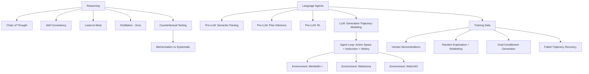

# CS224N - Reasoning And Language Agents

## Coverage Note

This note is synthesized from the official public YouTube auto-generated transcript of CS224N Spring 2024 Lecture 14 (Reasoning and Agents by Shikhar Murty), cross-checked against the existing `cs224n-rag-agents-reasoning` vault note and the agent-route-architecture canon. It does not claim full-watch video coverage; it is transcript-backed synthesis only.

## Core Thesis

The lecture covers two connected applications of language models: reasoning (using facts and logic to arrive at multi-step answers) and agents (using language models to take actions in grounded environments). The critical production insight is that both reasoning and agent behavior are currently fragile: reasoning can appear systematic but often reflects memorization rather than genuine inference, and agent behavior degrades rapidly as environments become more realistic. Agent Studio routes that depend on either capability need robust failure-mode testing.

## Reasoning: Deductive, Inductive, And Abductive

The lecturer distinguishes three forms of reasoning:

1. **Deductive**: From rules and premises to firm conclusions (all mammals have kidneys, whales are mammals, therefore whales have kidneys).
2. **Inductive**: From observations to probable conclusions (creatures with wings are usually birds).
3. **Abductive**: From observations to plausible explanations (car won't start, puddle under engine, probable radiator leak).

For most of the lecture, "reasoning" means informal deductive reasoning involving multiple steps.

## Prompting Methods For Reasoning

### Chain of Thought (CoT)

Provide in-context examples with explicit reasoning steps before the final answer, or simply append "let's think step by step" to the prompt (zero-shot CoT). CoT improves performance on multi-step problems by forcing the model to produce intermediate reasoning before committing to an answer.

### Self-Consistency

Sample multiple reasoning paths (not just greedy decode), collect the resulting answers, and select the majority answer. Self-consistency outperforms simple CoT because it averages over reasoning path variance. Critically, it also outperforms ensembling the same model with different prompts -- it is doing more than just majority voting.

### Least-to-Most Prompting

Decompose a complex problem into sub-questions, answer each sub-question, then combine the sub-answers into the final answer. This approach can generalize from fewer reasoning steps to more: models trained on 2-step decomposition examples can sometimes solve 5+ step problems. However, with sufficient prompt engineering, standard CoT can match least-to-most performance, so the decomposition structure may not be fundamental.

## Reasoning via Distillation

Orca (Microsoft) fine-tunes a smaller 13B LLaMA model on explanations produced by GPT-4. The training data comes from the FLAN v2 instruction collection augmented with system messages that encourage step-by-step explanations. The distilled model captures much of the reasoning behavior at a fraction of the cost. This is relevant to Agent Studio because distillation is a practical way to bring reasoning-like behavior to smaller, cheaper models for budget-constrained routes.

## Testing Whether Models Truly Reason

The lecturer presents compelling evidence that current LLM reasoning may be more memorization than systematic inference:

- **Counterfactual evaluation**: Changing problem settings so they look OOD to the training corpus (e.g., base-9 addition instead of base-10, logic problems with swapped categories like "corgis are reptiles") produces significant accuracy drops, even on simple problems.
- **Analogical reasoning under perturbation**: When string transformation tasks are modified (changing the alphabet, changing the task description), model performance drops significantly while human performance barely changes.
- **Conclusion**: There may be some reasoning and some memorization, but nothing systematic. The model's apparent reasoning is fragile to distributional shift.

### Agent Studio Implications

- Reasoning routes should not be trusted for systematic inference without OOD testing. Eval suites must include counterfactual and perturbed variants.
- A route that relies on CoT or self-consistency should be priced as test-time compute: multiple inference passes per query, each with its own cost and latency budget.
- Distilled reasoning models inherit the reasoning limitations of their teacher plus the compression losses of distillation. They need separate eval.

## Language Agents: From Pre-LLM To Modern Approaches

### Pre-LLM Agent Approaches

1. **Semantic parsing**: Map natural language commands to executable logical forms (like machine translation from English to a query language). Train a model to produce an executable program from instructions.
2. **Plan inference**: Infer an executable plan from instruction-trajectory pairs, train a model to generate plans, and execute plans via a rich execution model. Higher-level decisions are easier to encode in plans than in raw action trajectories.
3. **Reinforcement learning**: Directly learn a policy mapping instructions and observations to actions, optimizing a reward signal.

### Modern LLM Agent Approach

The key insight: treat decision-making as generative trajectory modeling. Factor the probability of a trajectory conditioned on a goal into:

- **Transition dynamics**: What happens when an action is taken in a state (the environment's behavior)
- **Agent policy**: Given the goal and trajectory so far, what action to take next

The agent policy can be modeled as autoregressive sequence generation: condition on the instruction, action/observation history, and predict the next action. This is "Chain of Thought prompting in a loop."

### Simple LLM Agent Loop

1. Specify action space in text (type, click, move mouse, etc.)
2. Provide instruction
3. Provide sequence of past actions and observations
4. Ask the model to predict the next action
5. Execute the action in the environment
6. Append the action and resulting observation to the history
7. Repeat from step 3

## Agent Evaluation Environments

| Environment | Properties | Complexity |
|---|---|---|
| MiniWoB++ | Sandbox, basic browser interactions, short horizon (<3 actions), not real websites | Low |
| WebArena | Sandbox but close approximation of real websites (e-commerce, social media, maps), multi-tab browsing | Medium |
| WebLINX | Real websites (not sandboxed), multi-tab, human-in-the-loop communication actions | High |

Key observation: even zero-shot performance of the best language models on MiniWoB++ (the simplest environment) is still far from perfect.

## Agent Training: From Demonstrations To Self-Generated Data

### The Scalability Problem

In-context learning with few-shot human demonstrations does not scale: there are thousands of possible environments and interactions. Getting humans to provide demonstrations for every new use case is impractical.

### Self-Play Trajectory Generation

The lecturer describes a bootstrapping approach:

1. **Random exploration**: Get an agent to randomly explore the environment, producing trajectories.
2. **Relabeling**: Use a second language model to produce a description of what each trajectory accomplished.
3. **Filtering**: Use a coarse filter to check correspondence between the relabeled instruction and the trajectory.
4. **Goal-conditioned refinement**: Use the inferred goal to generate goal-conditioned trajectories, then filter again.
5. **Recovery**: When a trajectory fails its intended goal, relabel it with what it actually accomplished rather than discarding it.

This is essentially the "ReAct" style of self-improvement applied to agent training data.

### Agent Studio Implications

- Agent training data should record the source: human demonstrations, random exploration, goal-conditioned generation, or relabeled failures.
- Agent environments must be versioned because agent behavior depends on the environment state as much as on the model.
- Trajectory quality evaluation requires a separate model or human review; the environment reward alone may not capture all quality signals.
- Failed trajectories should be relabeled rather than discarded when they accomplish something, but the relabel must be recorded as a distinct provenance layer.

## Concept Map

## Failure Modes

- CoT reasoning text may be unfaithful to the actual model decision process.
- Self-consistency is expensive: N full inference passes per query.
- Reasoning is fragile to distributional shift (counterfactuals, perturbed problems).
- Distilled reasoning models inherit teacher limitations plus compression losses.
- Agent zero-shot performance on even simple environments is far from perfect.
- Self-generated agent training data can overfit to easy environments.
- Relabeled trajectories may have incorrect goal assignments.
- Agent loops can enter unrecoverable states if each observation creates another unconstrained action.

## Datastore Requirements

Add or strengthen:

| Object | Purpose |
|---|---|
| `reasoning_eval_case` | Counterfactual variants, OOD problems, perturbed reasoning tasks, memorization-vs-inference probes |
| `test_time_compute_record` | Number of reasoning paths sampled, self-consistency votes, verifier calls, latency budget, cost budget |
| `agent_trajectory_record` | Environment version, action history, observation history, goal, success/failure, relabeling provenance |
| `agent_training_data_source` | Human demonstration vs random exploration vs goal-conditioned vs relabeled failure |
| `agent_environment_version` | Environment identity, state schema, available actions, observation format, success criteria |
| `agent_eval_suite` | Trajectory validity, tool-call safety, recovery behavior, human-review burden, goal completion rate |
