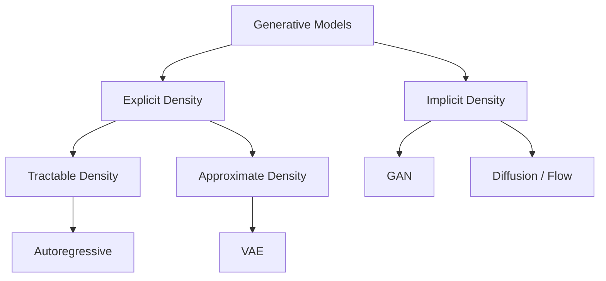
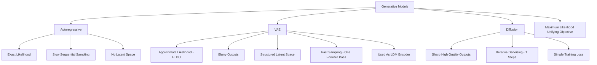

# CS231N - Generative Models 1: Autoregressive, VAE, And Diffusion Foundations

## Coverage Note

This note is synthesized from the official public YouTube auto-generated transcript of CS231N Spring 2025 Lecture 13 (Generative Models 1), cross-checked against the existing `cs231n-public-vision-notes` and `generative-model-taxonomy-and-multimodal-controls` vault notes. It does not claim full-watch video coverage; it is transcript-backed synthesis only.

## Core Thesis

The lecture establishes the full taxonomy of generative model families (explicit vs implicit, tractable vs approximate density) and walks through autoregressive models, variational autoencoders, and the initial foundations of diffusion models. The key production insight is that maximum likelihood training is the unifying objective across explicit density models, and the choice between model families is a tradeoff between density quality, sampling speed, and controllability. For Agent Studio, generative model family selection is a route-level decision with separate failure surfaces.

## Generative vs Discriminative Models

The distinction is what is being predicted, what is conditioned on, and what is normalized over:

- **Discriminative**: Predict label y given data x. Normalize over labels.
- **Generative**: Learn p(x), the data distribution. Normalize over all possible data.
- **Conditional generative**: Model p(x|y), data conditioned on user input.

The normalization constraint of probability distributions means that different kinds of outputs must compete for probability mass. This competition is the fundamental challenge in generative modeling.

## Generative Model Taxonomy

Explicit density models compute some quantity related to p(x) (either exact or approximate). Implicit density models forgo density computation entirely and focus on sampling.

## Autoregressive Models

Autoregressive models break data x into a sequence (e.g., pixel values for images) and model the joint distribution as a product of conditionals: p(x) = product of p(x_i | x_1, ..., x_{i-1}).

### For Images

- Treat subpixel values (0-255) as discrete tokens in a sequence.
- Model using RNN or transformer.
- PixelCNN and related models are the classic approaches.

### Tradeoffs

- **Exact likelihood**: Can compute p(x) exactly, enabling direct comparison and evaluation.
- **Slow sampling**: Must generate one token at a time, sequentially. For images, this means generating pixels one by one, which is very slow.
- **No latent space**: No compressed representation for manipulation, interpolation, or controllable editing.

### Agent Studio Implications

- Autoregressive image models are useful for density estimation (anomaly detection, OOD scoring) but impractical for real-time generation due to sequential sampling cost.
- The sequential generation pattern is the same as LLM text generation, so the same serving infrastructure (KV caching, speculative decoding) can be adapted for autoregressive image models.

## Variational Autoencoders (VAE)

VAEs jointly train an encoder q(z|x) and decoder p(x|z) to maximize the evidence lower bound (ELBO):

ELBO = E_q[log p(x|z)] - KL(q(z|x) || p(z))

### Architecture

- **Encoder**: Maps data x to a distribution over latent codes z (typically Gaussian parameters).
- **Reparameterization trick**: Sample z = mu + sigma * epsilon, where epsilon is unit Gaussian noise. This makes sampling differentiable for backpropagation.
- **Decoder**: Maps latent code z back to a reconstructed data distribution.
- **Prior**: p(z) is typically a unit Gaussian.

### Tradeoffs

- **Approximate likelihood**: Compute a lower bound on p(x), not the exact density.
- **Blurriness**: VAE outputs tend to be blurry because the ELBO objective and Gaussian decoder assumptions favor average-case reconstructions over sharp details.
- **Latent space**: VAEs provide a structured latent space that supports interpolation, sampling, and manipulation.
- **Fast sampling**: One forward pass through the decoder to generate a sample.

### VAE Failures For Production Generation

The blurriness problem is the key limitation: VAE reconstructions lose high-frequency detail, which makes them unsuitable as standalone image generators. However, as components in larger systems (like the autoencoder stage of latent diffusion models), they are invaluable.

### Agent Studio Implications

- VAEs should not be used as standalone generative media routes for quality-sensitive outputs.
- VAE encoder-decoder pairs are the foundation of latent diffusion models; the VAE quality directly bottleneckes the downstream diffusion quality.
- VAE latent spaces provide useful compressed representations for similarity search, clustering, and anomaly detection in media routes.

## Diffusion Model Foundations

The lecture introduces diffusion as a way to gradually add noise to data (forward process) and then learn to reverse that process (denoising). The key advantage over VAEs is that diffusion models can produce sharp, high-quality samples while maintaining a tractable training objective.

### Forward Process (Adding Noise)

Gradually corrupt data by adding Gaussian noise over T timesteps until the data is pure noise. At each step, the data becomes slightly more noisy. The noise schedule determines how quickly information is destroyed.

### Reverse Process (Denoising)

Learn a neural network that, given a noisy image and the noise level, predicts either:
- The noise that was added (epsilon-prediction)
- The original clean data (x0-prediction)
- A velocity vector pointing from noise to data (v-prediction, used in rectified flow)

### Agent Studio Implications

- Diffusion model training has a simple, interpretable loss (MSE between predicted and target), unlike GANs.
- The iterative denoising process at inference is the main cost driver: T forward passes of the model.
- Noise schedule design affects both training convergence and inference quality.

## Concept Map

## Failure Modes

- Autoregressive models are too slow for real-time image generation.
- VAEs produce blurry outputs unsuitable for quality-sensitive media.
- VAE blurriness bottlenecks downstream latent diffusion quality.
- Diffusion models require many inference steps, making them expensive for real-time routes.
- All explicit density models compete for probability mass, which can dilute quality across diverse data distributions.

## Datastore Requirements

Add or strengthen:

| Object | Purpose |
|---|---|
| `generative_model_family_record` | Model family (autoregressive/VAE/diffusion/GAN), objective type, sampling cost profile, known quality tradeoffs |
| `vae_autoencoder_record` | Encoder/decoder versions, latent dimensions, reconstruction quality metrics, sharpness metrics |
| `diffusion_training_config` | Noise schedule, prediction target (epsilon/x0/v), timestep count, training data |
