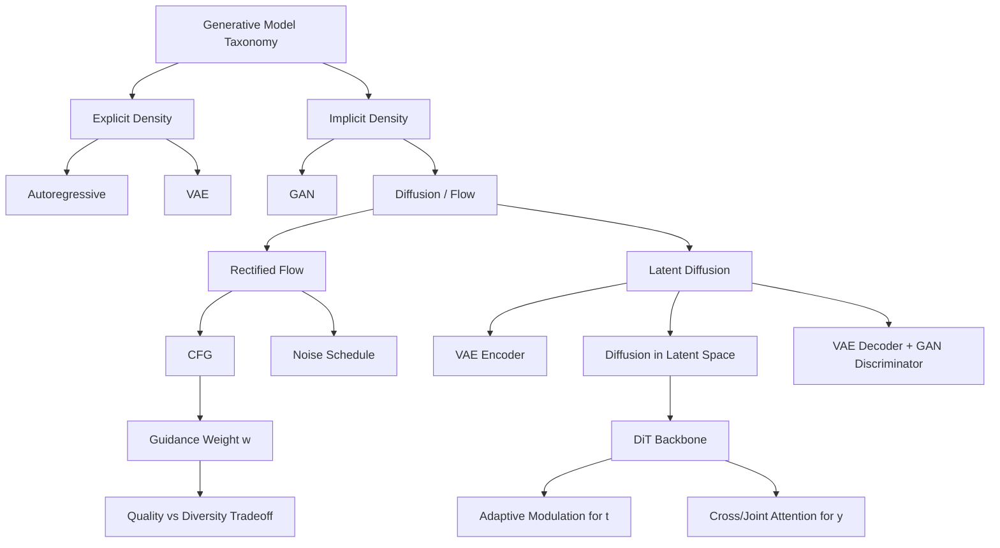

# CS231N - Generative Models 2: GANs, Diffusion, Flow Matching, Latent Diffusion, DiT

## Coverage Note

This note is synthesized from the official public YouTube auto-generated transcript of CS231N Spring 2025 Lecture 14 (Generative Models 2), cross-checked against the 2025 course schedule and the existing `cs231n-public-vision-notes` and `generative-model-taxonomy-and-multimodal-controls` vault notes. It does not claim full-watch video coverage; it is transcript-backed synthesis only.

## Core Thesis

The lecture completes the generative model taxonomy from Lecture 13 by covering implicit density models (GANs) and the modern diffusion/flow-matching family. The critical production insight is that the state-of-the-art generative pipeline is not a single model family; it is a composite system combining VAE, GAN, and diffusion components. Agent Studio media routes must treat generative media as a multi-stage pipeline with separate quality, controllability, and failure-mode surfaces at each stage.

## GAN Architecture And Training Instability

GANs introduced the implicit density approach: instead of computing p(x), learn to sample from the data distribution by training a generator G(z) and a discriminator D(x) in a minimax game. The generator converts a latent z into a data sample; the discriminator classifies real versus generated data. Training is adversarial: the generator tries to fool the discriminator while the discriminator tries to correctly classify.

### Key GAN Failure Modes

- **Training instability**: The discriminator and generator learning dynamics are non-stationary. Unlike fixed-dataset classification, the data distribution the discriminator must separate changes continuously as the generator improves. This creates chaotic loss curves that are nearly impossible to interpret -- "reading tea leaves" per the lecturer.
- **Vanishing gradients**: Early in training, the discriminator can become too strong too fast, giving the generator almost no gradient signal. The common fix is the non-saturating loss (minimize -log D(G(z)) instead of maximize log(1 - D(G(z)))). This is critical in practice.
- **Mode collapse**: The generator can converge to producing only a few modes of the data distribution, losing diversity. Hundreds of papers and years of effort failed to produce a reliable fix.
- **No interpretable loss**: Unlike likelihood-based models, GAN training curves do not reliably indicate model quality. This was a major practical pain point that took "half a decade of GAN madness."

### GAN Historical Arc

- DCGAN (Alec Radford) was the first GAN to produce non-trivial results using a 5-layer CNN. Radford subsequently moved to GPT-1 and GPT-2, illustrating the migration of generative modeling talent from images to text.
- StyleGAN (NVIDIA) introduced a style-based generator with adaptive instance normalization for high-quality face generation, but GANs have largely been superseded by diffusion models for production image generation.

### Agent Studio Implications

- GAN-style adversarial training is not recommended as a primary generative media route because of training instability and lack of interpretable loss signals.
- GAN components (discriminators) remain useful as quality critics or realism filters within larger generative pipelines.
- A media route that uses a GAN discriminator for quality gating must record discriminator version, training data, and known failure modes separately from the generation model.

## Diffusion Models And Rectified Flow

Diffusion models and flow matching represent the current dominant paradigm for generative image modeling. The lecturer presents rectified flow as a clean, accessible entry point.

### Core Problem

All generative models address the same core problem: how to associate samples z from a known prior distribution with samples x from the data distribution. VAEs try to predict z then x. GANs learn a feed-forward mapping through distributional matching. Diffusion/flow models solve this by learning to traverse a path from noise to data via iterative denoising.

### Rectified Flow Training

Rectified flow simplifies diffusion training to an extremely clean formulation:

1. Sample x from data, z from unit Gaussian
2. Sample t uniformly from [0, 1]
3. Compute x_t = (1 - t)x + tz (linear interpolation between data and noise)
4. Compute target v = z - x (the vector from data to noise)
5. Train neural network f_theta(x_t, t) to predict v via MSE loss

The training loop is trivially simple and produces a smooth, interpretable loss curve. This alone is a major practical advantage over GANs.

### Rectified Flow Inference

Inference requires iterative denoising:

1. Sample x from pure noise
2. For t from 1 down to 0 in fixed steps (typically 50):
   - Predict v_t from the model given current x_t and noise level t
   - Take a step along v_t to get a less-noisy sample
3. The final x_0 is the generated sample

This iterative process is more expensive than GAN inference (one forward pass) but gives much higher quality and controllability.

### Agent Studio Implications

- Diffusion/flow model inference is fundamentally a multi-step process. Media generation routes must budget for T inference passes, not one.
- The noise level schedule, step count, and step size are inference hyperparameters that trade off quality against latency and cost.
- Generated media routes should record: model version, T steps, noise schedule, CFG weight, conditioning signal, seed when available, and output hash.

## Classifier-Free Guidance (CFG)

CFG is the most important practical technique for controlling conditional diffusion models. The key insight: during training, randomly drop the conditioning signal (set y to null) with 50% probability. This forces the model to learn both conditional and unconditional velocity vectors. At inference, compute:

v_cfg = (1 + w) * v_y - w * v_null

Where w is the guidance scale. Higher w pushes the model to follow the conditioning signal more strongly. Setting w = 0 recovers unconditional generation; w = 1 recovers standard conditional generation; w > 1 overemphasizes the condition.

### CFG Tradeoffs

- **Quality vs. diversity**: Higher guidance produces outputs that more closely match the prompt but with reduced sample diversity.
- **Cost**: CFG doubles inference cost because the model must be evaluated twice per step (conditional and unconditional).
- **Over-saturation**: Very high guidance can produce artifacts, oversaturated colors, and unrealistic outputs.

### Agent Studio Implications

- CFG weight is a critical inference control that should be exposed as a route parameter, not hardcoded.
- Media generation routes should record CFG weight as part of the generation record.
- Quality evaluation should include CFG-weight sweep tests to find the right balance between prompt adherence and output quality.

## Noise Schedule Design

Uniform t sampling puts equal emphasis on all noise levels, but the problem difficulty varies: full noise and full data are easy (predict the mean), while mid-range noise levels are much harder (multiple x-z pairs can produce the same x_t). Practice uses:

- **Logit-normal sampling**: Gaussian-like distribution with more weight in the middle and less at the extremes, matching problem difficulty.
- **Shifted noise schedules**: Asymmetric schedules that shift toward higher or lower noise depending on data resolution. High-resolution images with strong inter-pixel correlations need different noise levels than low-resolution images.

### Agent Studio Implications

- Noise schedule should be a model-level configuration, not a route-level parameter.
- Routes generating at different resolutions may need different noise schedules; this should be validated, not assumed.

## Latent Diffusion Models (LDM)

Raw pixel-space diffusion is expensive and does not scale well to high-resolution images. Latent diffusion models solve this with a multi-stage pipeline:

1. **Stage 1 (Autoencoder)**: Train a VAE encoder-decoder pair. The encoder downsamples spatially (e.g., 8x) and expands channels (e.g., 3 to 16). The decoder reconstructs images from latents.
2. **Stage 2 (Diffusion in latent space)**: Train a diffusion model on the latent representation, not the raw pixels. The encoder is frozen during diffusion training.
3. **Stage 3 (Inference)**: Sample a latent from noise, denoise using the diffusion model, decode the clean latent into an image using the VAE decoder.

### Why VAE Alone Is Not Enough

VAEs produce blurry reconstructions. If the encoder-decoder bottleneck is blurry, the downstream diffusion model cannot produce sharp outputs regardless of how well it denoises the latent. The solution is to add a GAN discriminator after the decoder during VAE training, creating a hybrid VAE+GAN autoencoder that produces sharp reconstructions.

### The Modern Pipeline Is A Composite

The state-of-the-art generative modeling pipeline combines all three families:

- **VAE**: Encoder-decoder for dimensionality reduction and latent space structure
- **GAN**: Discriminator for sharp reconstruction quality in the autoencoder
- **Diffusion**: Iterative denoising model in the learned latent space

### Agent Studio Implications

- Media generation is not a single model call; it is a multi-stage pipeline. Each stage has separate failure modes, version dependencies, and quality surfaces.
- A route-change proposal for generative media must specify which component is changing (encoder, decoder, diffusion backbone, conditioning, guidance, noise schedule) and what quality regression tests to run.
- The datastore should track: autoencoder version, diffusion model version, CFG weight, noise schedule, step count, conditioning signal, and the component provenance of each generated artifact.

## Diffusion Transformers (DiT)

Modern diffusion backbones have moved from U-Nets to standard transformer architectures. DiT blocks are vanilla transformer blocks with minimal special sauce. The key architectural question is how to inject conditioning information (noise level t and text/image prompt y):

- **Adaptive scale/shift**: Predict per-block scale and shift parameters from the conditioning signal, modulating intermediate activations. This is the standard way to inject t.
- **Cross-attention or joint attention**: Jam the conditioning signal into the transformer sequence and let attention handle the mixing. Used for text conditioning.
- **Combined approach**: Modern DiTs typically inject t via adaptive modulation and y via cross-attention or joint attention.

### Agent Studio Implications

- DiT architecture means diffusion models share infrastructure with LLMs (transformer blocks, attention, sequence modeling). This enables shared serving infrastructure and unified memory management.
- The conditioning injection method determines what kinds of prompts the model can accept. A route should verify that the conditioning interface matches the expected prompt format.

## Concept Map

## Failure Modes

- GAN training collapses without warning; loss curves are uninformative.
- Diffusion models produce blurry or low-quality outputs if the autoencoder reconstruction is poor.
- CFG at very high guidance weights produces oversaturated, artifact-heavy outputs.
- Uniform noise scheduling under-trains mid-range noise levels where the denoising problem is hardest.
- Latent diffusion quality is bottlenecked by the VAE decoder; sharp latents cannot fix a blurry decoder.
- Conditional diffusion models may ignore or weakly follow the conditioning signal without CFG.

## Datastore Requirements

Add or strengthen:

| Object | Purpose |
|---|---|
| `generative_pipeline_config` | Autoencoder version, diffusion model version, backbone type, conditioning interface, noise schedule, CFG weight, step count |
| `generation_record` | Model versions, prompt/conditioning, CFG weight, T steps, noise schedule, seed if available, output hash, approval status |
| `generative_quality_eval` | Prompt adherence, FID, CLIP score, diversity, artifact presence, CFG weight sweep results |
| `autoencoder_version_record` | VAE encoder/decoder versions, training data, GAN discriminator version, reconstruction quality metrics |
| `diffusion_serving_config` | Step budget, latency target, cost per generation, batch sizing for iterative denoising |
