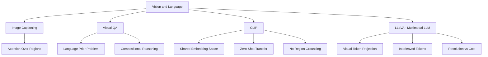

# CS231N - Vision and Language: Multimodal Grounding

## Coverage Note

This note is synthesized from the official public YouTube auto-generated transcript of CS231N Spring 2025 Lecture 16 (Vision and Language), cross-checked against the existing `cs231n-vision-language-grounding` vault note and the `visual-multimodal-qa-canon`. It does not claim full-watch video coverage; it is transcript-backed synthesis only.

## Core Thesis

The lecture connects vision and language through the lens of grounding: connecting visual representations to linguistic semantics. The progression from image captioning through VQA to modern multimodal LLMs (CLIP, LLaVA, GPT-4V) shows that multimodal understanding requires not just cross-modal alignment but also explicit grounding of language in visual evidence. For Agent Studio, multimodal routes need to preserve the linkage between text claims and visual evidence regions.

## Image Captioning

The earliest vision-language task: generate a natural language description of an image. The standard architecture uses a CNN encoder to extract visual features and an RNN/transformer decoder to generate text conditioned on those features.

### Key Issues

- **Object vs scene bias**: Captions often describe objects without capturing spatial relations, actions, or scene context.
- **Evaluation challenge**: BLEU, ROUGE, CIDEr, and SPICE measure different aspects of caption quality and can disagree.
- **Attention helps**: Global image features compress too much; attention over spatial regions lets the decoder focus on different parts of the image for different words.

## Visual Question Answering (VQA)

VQA requires answering natural language questions about images. This is harder than captioning because questions can target any aspect of the image (counting, spatial relations, reasoning, OCR).

### Key Challenges

- **Language priors**: Models learn to answer based on question patterns rather than image content (e.g., answering "2" for "how many..." questions regardless of the image).
- **Compositional reasoning**: Questions may require multiple reasoning steps (e.g., "What color is the object to the left of the red ball?").
- **Grounding evaluation**: Correct answers without visual evidence are not truly grounded.

## CLIP: Contrastive Language-Image Pre-training

CLIP learns a shared embedding space for images and text by training on 400M image-text pairs with a contrastive loss. The key properties:

- **Zero-shot classification**: Given an image and a set of text descriptions, CLIP can classify without fine-tuning by finding the text with highest cosine similarity to the image embedding.
- **Transferability**: CLIP features transfer well to downstream tasks without task-specific training.
- **Limitations**: CLIP embeds each modality into a single vector, losing fine-grained region-level correspondence.

### Agent Studio Implications

- CLIP embeddings are useful for media retrieval, similarity search, and zero-shot classification in routes.
- CLIP's global embedding loses spatial grounding; routes that need region-level evidence should not rely on CLIP alone.
- CLIP text-image similarity should be used as a coarse filter, not as a final quality gate.

## LLaVA: Large Language-and-Vision Assistant

LLaVA extends the LLM paradigm to multimodal inputs by:

1. Projecting visual features from a vision encoder (CLIP ViT) into the LLM's embedding space using a projection layer.
2. Interleaving projected visual tokens with text tokens in the LLM input.
3. Fine-tuning the projection layer and optionally the LLM on multimodal instruction data.

### Architecture Pattern

The LLaVA pattern (project visual features into LLM embedding space) is now the standard approach for multimodal LLMs. Variants include:

- **Early fusion**: Project visual features before the LLM; let the LLM process them as regular tokens.
- **Cross-attention**: Add separate cross-attention layers for visual tokens.
- **Resolution handling**: Higher-resolution images need more visual tokens, increasing compute cost.

### Agent Studio Implications

- Multimodal LLM routes must budget for the additional visual token cost: more tokens means higher inference latency and cost.
- The projection layer quality directly affects how well the LLM can "see" the image. Projection layer version should be tracked alongside LLM version.
- Visual token count should be a route parameter that can be tuned for quality vs cost tradeoffs.

## Concept Map

## Failure Modes

- Captioning models miss spatial relations and scene context.
- VQA models exploit language priors rather than grounding in visual evidence.
- CLIP global embeddings lose fine-grained region correspondence.
- Multimodal LLMs incur higher inference cost due to visual tokens.
- Projection layer quality can bottleneck multimodal understanding.
- High-resolution images increase visual token count, creating cost-quality tension.

## Datastore Requirements

Add or strengthen:

| Object | Purpose |
|---|---|
| `multimodal_route_config` | Vision encoder version, projection layer version, visual token count, resolution policy, cost budget |
| `visual_grounding_record` | Text claim, referenced image region (bounding box or attention map), evidence confidence, grounding eval result |
| `multimodal_eval_case` | Caption quality, VQA accuracy, grounding correctness, compositional reasoning, language-prior resistance |
